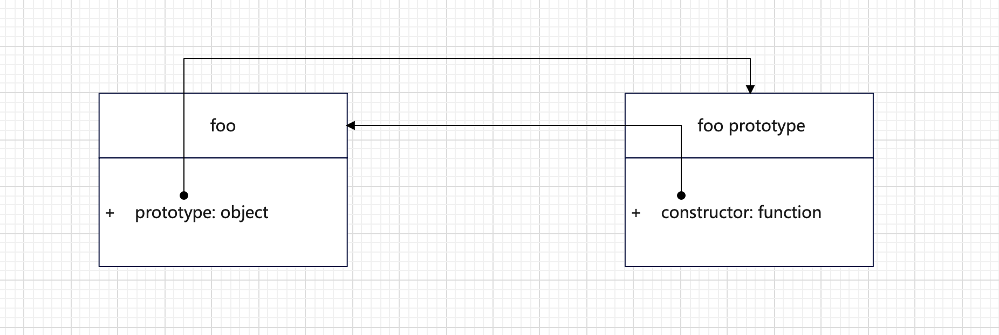
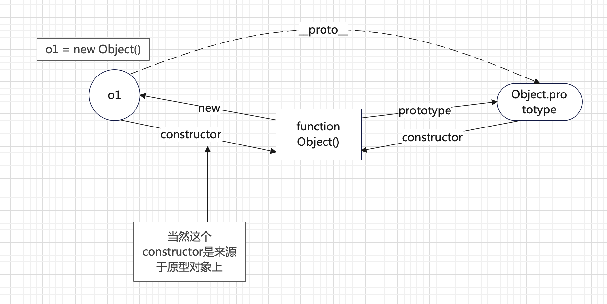

JavaScript中原型和闭包是较难理解的部分，这篇文档来仔细探究一下这两块内容，文章主要参考[王福朋](https://github.com/wangfupeng1988)的《[深入理解javascript原型和闭包系列](https://www.cnblogs.com/wangfupeng1988/p/4001284.html)》，经过自己的理解形成。

## 1. 函数和对象

Javascript中有句话，“一切都是对象”，但这句话不绝对，未包装的值类型就不是对象，比如单纯的 `number` 、`string` 、`boolean`，但是它们都有对应的包装函数，还有 `undefined`、`null`也是值类型。

所以正确来说，**一切（引用类型）都是对象，对象是属性的集合。**

下面来看另外一个概念，**对象都是通过函数创建的**，类似下面的写法，其实是一种语法糖：

```js
const obj = { a: 10, b: 20}
```

上面的代码只是一种快捷方式，本质还是通过函数来创建的：

```js
var obj = new Object();
obj.a = 10;
obj.b = 20;
```

这里得到了一个可怕的结论，**对象是函数创建的**，而函数是引用类型，也就是函数也是一种对象，总结起来，对象是对象创建的？我创造了我？

不着急，接着来看。

## 2.prototype原型

函数都拥有一个默认的`prototype`属性，这个属性是一个对象，也就是函数的原型对象，创建函数时就存在，这个对象就是函数的原型。

```js
function foo() {}
console.log(foo.prototype) // Object
```



从上图可以看出，一个函数，默认拥有 `prototype` 原型属性，这个对象默认包含 `constructor` 方法，指向 `foo` 函数，所有对象都包含 `constructor` 指向构造函数，除此之外不同的原型属性对象，还包含各种各样的其它属性或者方法，比如 `Object`的原型属性对象里面还包含 `hasOwnProperty`等方法。

除此之外，还可以自己给这个原型属性增加一些属性和方法：

```js
function foo() {}
foo.prototype.name = 'easylee'
foo.prototype.fn = function () {
  console.log(this.name)
}
console.log(foo.prototype) // {name: 'easylee',fn: f()}
```

## 3.`__proto__` 隐式原型

每个对象都有一个 `__proto__` 隐式原型，指向创建这个对象的函数的原型属性对象，即 `foo.__proto__ === Foo.prototype`：

```js
function Foo() {}
Foo.prototype.name = 'easylee'
Foo.prototype.fn = function () {
  console.log(this.name)
}
const foo = new Foo()
console.log(foo.__proto__ === Foo.prototype) // true
```

除此之外，直接创建一个对象也是这样的：

```js
const obj = {}
console.log(obj.__proto__ === Object.prototype) // true
```

通过图形来看看它们的关系：



> 这里总结一下，每个对象都有 `__proto__` 隐式原型，指向创建这个对象的函数的原型对象属性，即每个函数都有 `prototype` 原型对象属性，这个原型对象属性中又存在一个 `constructor` 构造函数指向这个函数。

下面来看另外一个问题，既然所有对象都有 `__proto__`，那么显然原型对象作为一个对象，也有 `__proto__` 属性，指向上一层的原型对象，这样一直往上，到了 `Object.prototype.__proto__` 指向就是 `null`，表示最上层，null也是对象，就不能往上了。

> `typeof null` 得到的结果是 `object`


接着来看，除了原型对象，函数也是一个对象，那么也应该存在 `__proto__`，函数是 `new Function()`创建的，那么函数的 `__proto__` 很明显指向 `Function.prototype`，即 `Object.__proto__ === Function.prototype`，来看看图形表示：


这个图有个有意思的点，我们来分析一下：

1. 普通函数 Foo 的原型对象是 Foo.prototype，Object函数的原型对象是 Object.prototype，这个没问题；
2. 他们都是函数，所以它们的 `__proto__` 指向 `Function.prototype`，这个同样没问题，因为根据上面的内容，我们知道，函数都是 `new Function()` 创建的；
3. 接着看，里面的 `Function` 本身也是一个函数，它的 `__proto__` 也指向 `Function.prototype`，很明显和其它函数不一样，其它函数都是指向它的原型对象，但它是指向了自己的 `prototype` 原型对象；
4. 也就是 `Function` 的 `__proto__` 指向了自己，我的上层是我自己，其实就是循环引用，也就代表着 `Function` 这个函数是自身创建的。

> 总结一下，函数和对象(函数也是对象)都是 `Function` 创建的，包括 `Function` 函数本身也是，注意，虽然 `Function` 是自己创建的，但是它的原型对象的上层 `Function.prototype.__proto__` 仍然是 `Object.prototype`，一直往上直到到达 `null`。

## 4. instanceof

了解 `instanceof` 之前，先看看 `typeof` 操作符，用于判断值类型，用于判断`string/number/boolean`，同时当判断引用类型时，都是 `function`，而 `null`返回的是 `object`：

```js
console.log(typeof 123) // number
console.log(typeof '123') // string
console.log(typeof true) // boolean
console.log(typeof null) // object
console.log(typeof Array) // function
console.log(typeof Function) // function
console.log(typeof Object) // function
```

而 `instanceof` 用于判断引用类型，也就是对象的类型。

```js
function Foo() {}
const f1 = new Foo()
console.log(f1 instanceof Foo) // true
console.log(f1 instanceof Object) // true
```

从上面的代码可以看到，f1 既属于 Foo，又属于 Object，那么判断是否属于的规则是什么呢？

我们可以根据下面这个图来看：


判断规则如下：

举例：`A instanceof B`

1. A的 `__proto__` 一直往上，遇到的所有prototype原型对象；
2. B这边，只要某个函数的原型对象是属性，等于A原型链遇到的原型对象，那么这个A就属于B；
3. 比如上图，A原型链上有 `Foo.prototype`、`Object.prototype`、`null`，Foo的原型对象是 `Foo.prototype` 、Object的原型对象是 `Object.prototype` ，所以Foo、Object都是A的上层，都为true。

接着来看看上面的循环引用那个部分的归属问题：

```js
console.log(Object instanceof Function) // true
console.log(Function instanceof Object) // true
console.log(Function instanceof Function) // true
console.log(Object instanceof Object) // true
```

乍一看，上面的内容听让人费解，其实结合下面的图来看，就容易理解了：


上面的代码结合图来看，是完全符合我们上面总结的规则的。

接下来我们来看看这个代码：

```js
function Foo() {}
console.log(Foo instanceof Foo) // false
```

说明了一个问题，只有 `Function instanceof Function`和 `Object instanceof Object` 这两个特例是符合的，其它的函数都不能属于自己，原因很简单，其它的函数的 `__proto__` 往上层之后，上层不会包含自己，所以为false。

> 可以得出 `instanceof` 除了两个特例，本身还是用于检测类似父子这样的关系的，普通函数肯定不属于自己。
>
> 同时，可以看出，对于普通函数来说，instanceof表示的就是一种继承关系，或者原型链的结构。

## 5.再谈原型和继承

如果了解过后端的相关编程语言，那么对继承肯定不陌生，子结构可以从父结构中继承父结构的属性和方法，直接使用，避免子结构重新实现一遍。

从上面的内容，可以看出，JavaScript中使用原型这个结构来实现的原型，一些方法和属性可以直接通过创建这个对象的函数原型对象中获取，同时可以直接在原型对象上定义属性和方法，基于这个函数的所有对象就都用于这些属性和方法实现了。

这里暂且不论原型和其它语言的优劣，我们单独来看看原型的一些特点：

1. 原型对象的属性可以随时修改：编写代码过程中，可以随意的给原型上添加方法和函数，在其它语言中，只能去修改父类才能实现；
2. 子类对象可以直接修改继承来的属性和方法，当然这在其它语言中也有，叫做重写。
