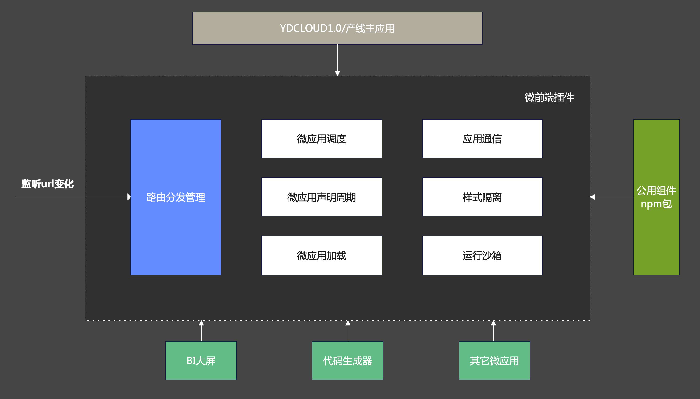

## 一、背景

在升级YDCLOUD1.0到2.0系统前端调研过程中，发现目前存在的严峻问题在于，1.0系统在各产品线使用过程中，源码都进行过大幅度的修改，无法进行增量升级，给2.0系统升级带来了极大的困难。

同时各产品线系统均是独立开发和维护，而我们的业务开发情况是：

- 不同产品线的**基本业务逻辑一致**，UI差异不大。
- 不同产品线的**领域业务逻辑不一致**，但仍可能复用到其它产品线。

在这种特殊的业务场景下，就会出现有关开发效率的抉择问题。希望能复用的部分只开发一次，而不是多次。

YDCLOUD1.0存在的问题：

## 二、解决方案

### 1. 需求点和收益

在选择解决方案前，先确定需求点及期望收益，如下表所示：

|     需求点     | 收益与要求                                                   |
| :------------: | :----------------------------------------------------------- |
|  **拆分解耦**  | （1）按产品领域拆分成不同的仓库进行维护，不同产品线的开发者更加独立，不同产品线之间互不影响。 （2）物理层面拆分，加速寻址，新增功能修改Bug更加迅速。 （3）逻辑层面拆分，杜绝引用混乱，不会出现A产品线引用B产品线组件的情况。 |
|  **加速体验**  | （1）开发环境急速启动，提高开发体验。 （2）产品线按需打包，急速部署上线。 |
|  **侵入性低**  | 微前端方案改动原有代码的侵入性降到最小，无需大规模改造，减少甚至消除回归测试的成本。 |
| **技术栈无关** | (1) 1.0使用vue2相关技术栈、2.0可以使用任意技术栈 (2) 技术栈无关，满足目前较新开源项目组件Vue3和React项目以及对应开发者的需求。 |

### 2. 微前端方案

经过以上的需求分析，总结了以下几种方案以及它们各自主要的特点：

- **NPM式**：子应用以NPM包的形式发布源码；打包构建发布还是由基座工程管理，打包时集成。
- **iframe式**：子应用可以使用不同技术栈；子应用之间完全独立，无任何依赖；基座工程和子应用需要建立通信机制；无单页应用体验；路由地址管理困难。
- **通用中心路由基座式**：子应用可以使用不同技术栈；子应用之间完全独立，无任何依赖；统一由基座工程进行管理，按照DOM节点的注册、挂载、卸载来完成。

通过对各个方案特点进行分析，我们将重点关注项进行了对比，如下表所示：

| 方案                   | 技术栈是否能统一 | 单独打包 | 单独部署 | 打包部署速度 | 单页应用体验 | 子应用切换速度 | 工程间通信难度 | 现有工程侵入性 | 学习成本 |
| :--------------------- | :--------------- | :------- | :------- | :----------- | :----------- | :------------- | :------------- | :------------- | :------- |
| **NPM式**              | 是（不强制）     | 否       | 否       | 慢           | 是           | 快             | 正常           | 高             | 高       |
| **iframe式**           | 是（不强制）     | 是       | 是       | 正常         | 否           | 慢             | 高             | 高             | 低       |
| **通用中心路由基座式** | 是（不强制）     | 是       | 是       | 正常         | 是           | 慢             | 高             | 高             | 高       |

经过上面的调研对比之后，确定采用了通用中心路由基座式的开发方案，并命名为：**YDCLOUD通用中心路由基座式微前端**。这种方案的优点包括以下几个方面：

- 可以使用任意技术栈进行应用开发。
- 子应用之间开发互相独立，互不影响。
- 子应用可单独打包、单独部署上线。
- 子应用有能力复用基座工程的公共组件。
- 保持单页应用的体验，子应用之间切换不刷新。
- 改造成本低，对现有工程侵入度较低，产品线迁移成本也较低。
- 开发子应用和原有开发模式基本没有不同，开发人员学习成本较低。

### 微前端基础架构图

### 微前端项目实践

通过上面的选型分析，确定了通用中心路由基座式微前端方案，下面是采用`Vite + Vue3 + Typescript + Wujie + Element-Plus`为主要技术栈形成的架构图：

可以看到，整个方案非常简单明确，即按照主应用、子应用进行了划分。整个系统可分为两个部分：

- 基座应用：用于管理子应用的路由切换、注册子应用的路由和全局Store层、提供全局库和复用层。
- 子应用：用于开发子产品线业务代码，一个子应用对应一个子产品线。

基座应用和子应用联系起来的桥梁则是**子应用的入口文件地址和路由地址的映射信息**。这些映射信息可以让基座应用准确地发现子应用资源的路径从而进行加载。

拆分使得子应用能够按照产品线进行划分，独立维护。在解决复用层的同时保证了子应用大小可控，即子应用只有单个产品线的代码。而单个产品线的复杂度并不高，也降低了工程维护的复杂度。

采用微前端拆分的方案，使得业务不仅**在纵向上保有了复用的能力**，更重要的是**拥有了横向扩展的能力**，无论产品线如何膨胀，都可以更轻松地应对。
