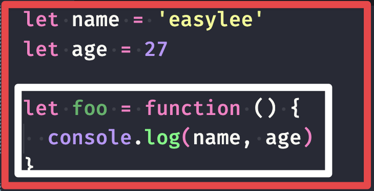
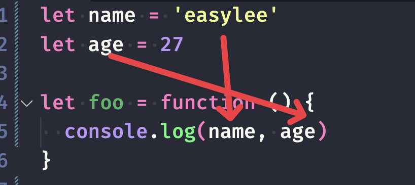

## what's closure

### closure's scope

closure contain function body and outside function body, compose closure's scope.

In and outside function body compose closure.

### why we need closure?

if JavaScript don't has closure, we can't get the outside of function body's variable, in many other language, need to transmit these variable As parameters then inside function body can use these variables

### what's closure

The inside function is called closure.

in a broad sense，when create a function is creating a closure.

In the narrow(strict) sense, inside function body uses the outside's variable, then can called closure.