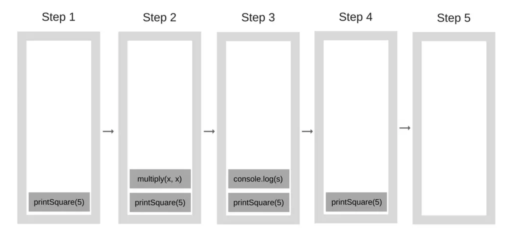
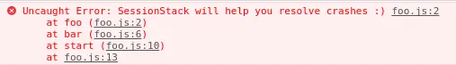
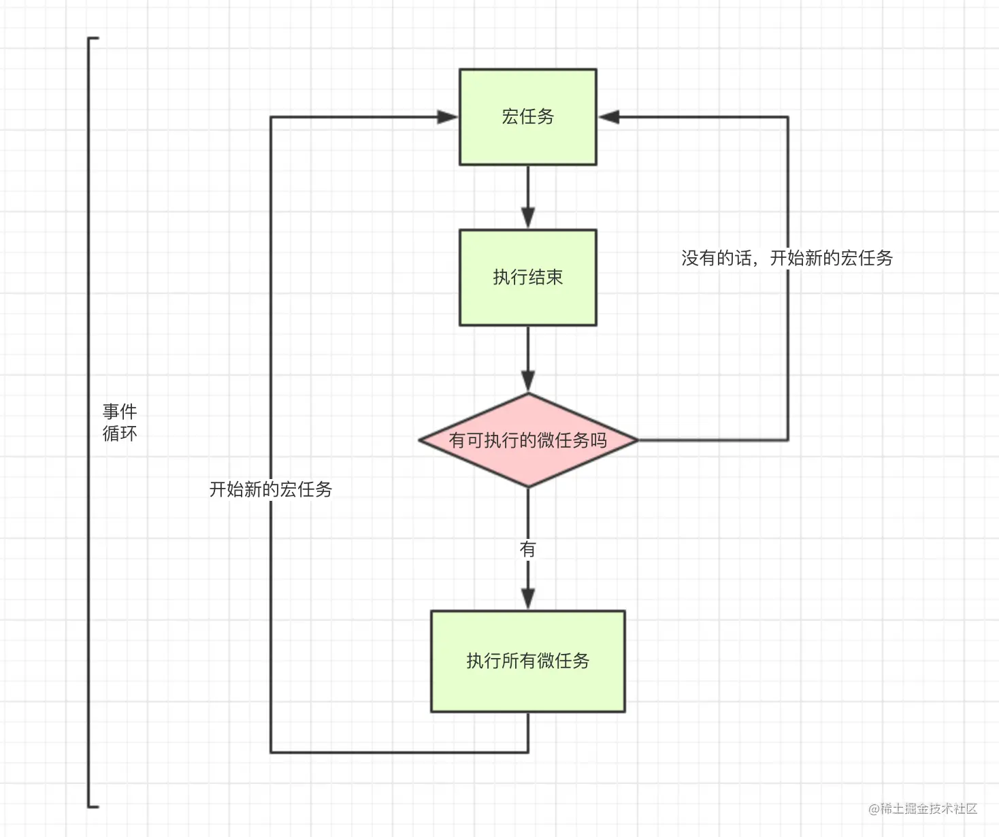

## 堆栈

在JavaScript中，内存堆是内存分配的地方，调用栈是代码执行的地方。



调用栈的理解非常简单，当遇见一个一个方法推入调用栈中，执行一个方法弹出栈，每一个方法成为一个调用帧。

当使用浏览器执行代码错误时，可以清晰的看到堆栈信息：



上图表示从 `start` 方法开始，里面调用了 `bar` 方法，里面调用了 `foo` 方法，在 `foo` 中出现了错误。

## 事件循环

理解了堆栈之后，接着来看一下与之相关的事件循环。

首先需要明确的是JavaScript是单线程语言，所有代码都执行在一个线程中，这通常会导致一个问题，当一个方法耗时过长，整个页面随之卡住，所以为了避免这种情况发生，JavaScript中存在事件循环的机制(并非JavaScript创造)，来循环执行事件，堵塞的事件通过循环在后期再来判断是否执行完成，比如读取接口，后期再来看接口是否请求完成，请求完成之后再执行对应的回调函数（接口请求是浏览器提供的能力，不占用单线程）。

事件循环也就是将任务分为同步任务和异步任务，任务按照顺序进行执行：


事件循环中一个重要概念是宏任务和微任务，宏任务也就是线程中首先一轮执行的函数，微任务也就是宏任务里面的任务，类似进程和线程的关系，宏任务是进程，微任务是线程，下面来看一下三者之间的关系：



可以看到事件循环，其实循环的就是宏任务和微任务，当宏任务中有微任务时，执行里面的微任务。

下面来看一下在JavaScript中具体哪些函数是宏任务，哪些是微任务：

- macro-task(宏任务)：包括整体代码script，setTimeout，setInterval
- micro-task(微任务)：Promise，process.nextTick(node代码, 类似vue中this.$nextTick)

具体来看一下执行流程：

1. 整体script作为第一个宏任务进入主线程；
2. 遇到`setTimeout` 、 `setInterval`，其**回调函数**被分发到宏任务事件队列中；
3. 遇到`process.nextTick()`，其回调函数被分发到微任务事件队列中；
4. 遇到`Promise`，`new Promise`函数体内容直接执行。`then`等回调部分被分发到微任务事件队列中；
5. 微任务在宏任务执行后开始执行，比如微任务属于第一个宏任务，那么第一个宏任务执行完，就执行第一个宏任务里面的微任务，也就是说 `script` 里面要是包含微任务，那么是先于 `setTimeout` 等第二轮执行的宏任务的；
6. 第一轮执行完成后，开始第二轮，也就是`setTimeout` 、 `setInterval` 回调函数里面的内容，属于第二轮宏任务，如果里面包含微任务，那么紧接着回调函数里面内容执行完之后开始执行；
7. 如果微任务里面还包含微任务，那么是紧接着外层的微任务开始执行的。

> 注意在node有一些不同，存在下面的优先级顺序：process.nextTick() > Promise.then() > setTimeout > setImmediate

下面来看一个具体的例子：

```js
console.log('1');

setTimeout(function() {
    console.log('2');
    process.nextTick(function() {
        console.log('3');
    })
    new Promise(function(resolve) {
        console.log('4');
        resolve();
    }).then(function() {
        console.log('5')
    })
})
process.nextTick(function() {
    console.log('6');
})
new Promise(function(resolve) {
    console.log('7');
    resolve();
}).then(function() {
    console.log('8')
})

setTimeout(function() {
    console.log('9');
    process.nextTick(function() {
        console.log('10');
    })
    new Promise(function(resolve) {
        console.log('11');
        resolve();
    }).then(function() {
        console.log('12')
    })
})
```

第一轮事件循环流程分析如下：

- 整体script作为第一个宏任务进入主线程，遇到`console.log`，输出1。
- 遇到`setTimeout`，其回调函数被分发到宏任务Event Queue中。我们暂且记为`setTimeout1`。
- 遇到`process.nextTick()`，其回调函数被分发到微任务Event Queue中。我们记为`process1`。
- 遇到`Promise`，`new Promise`直接执行，输出7。`then`被分发到微任务Event Queue中。我们记为`then1`。
- 又遇到了`setTimeout`，其回调函数被分发到宏任务Event Queue中，我们记为`setTimeout2`。

| 宏任务Event Queue | 微任务Event Queue |
| ----------------- | ----------------- |
| setTimeout1       | process1          |
| setTimeout2       | then1             |

- 上表是第一轮事件循环宏任务结束时各Event Queue的情况，此时已经输出了1和7。
- 我们发现了`process1`和`then1`两个微任务。
- 执行`process1`,输出6。
- 执行`then1`，输出8。

好了，第一轮事件循环正式结束，这一轮的结果是输出1，7，6，8。那么第二轮时间循环从`setTimeout1`宏任务开始：

- 首先输出2。接下来遇到了`process.nextTick()`，同样将其分发到微任务Event Queue中，记为`process2`。`new Promise`立即执行输出4，`then`也分发到微任务Event Queue中，记为`then2`。

| 宏任务Event Queue | 微任务Event Queue |
| ----------------- | ----------------- |
| setTimeout2       | process2          |
|                   | then2             |

- 第二轮事件循环宏任务结束，我们发现有`process2`和`then2`两个微任务可以执行。
- 输出3。
- 输出5。
- 第二轮事件循环结束，第二轮输出2，4，3，5。
- 第三轮事件循环开始，此时只剩setTimeout2了，执行。
- 直接输出9。
- 将`process.nextTick()`分发到微任务Event Queue中。记为`process3`。
- 直接执行`new Promise`，输出11。
- 将`then`分发到微任务Event Queue中，记为`then3`。

| 宏任务Event Queue | 微任务Event Queue |
| ----------------- | ----------------- |
|                   | process3          |
|                   | then3             |

- 第三轮事件循环宏任务执行结束，执行两个微任务`process3`和`then3`。
- 输出10。
- 输出12。
- 第三轮事件循环结束，第三轮输出9，11，10，12。

整段代码，共进行了三次事件循环，完整的输出为1，7，6，8，2，4，3，5，9，11，10，12。 (请注意，node环境下的事件监听依赖libuv与前端环境不完全相同，输出顺序可能会有误差)。

## 执行上下文

最后来看一下执行上下文，简而言之，执行上下文是评估和执行 JavaScript 代码的环境的抽象概念。每当 Javascript 代码在运行的时候，它都是在执行上下文中运行。

JavaScript 中有三种执行上下文类型：

- **全局执行上下文** — 这是默认或者说基础的上下文，任何不在函数内部的代码都在全局上下文中。它会执行两件事：创建一个全局的 window 对象（浏览器的情况下），并且设置 `this` 的值等于这个全局对象。一个程序中只会有一个全局执行上下文。
- **函数执行上下文** — 每当一个函数被调用时, 都会为该函数创建一个新的上下文。每个函数都有它自己的执行上下文，不过是在函数被调用时创建的。函数上下文可以有任意多个。每当一个新的执行上下文被创建，它会按定义的顺序（将在后文讨论）执行一系列步骤。
- **Eval 函数执行上下文** — 执行在 `eval` 函数内部的代码也会有它属于自己的执行上下文，但由于 JavaScript 开发者并不经常使用 `eval`，所以在这里不会讨论。

总结一下，执行上下文大体分为全局和函数执行上下文，也就是执行环境，函数可以读取外部函数的变量，通常也称为闭包，通过这个原理，相比静态语言，可以更灵活的获取外部的参数。

执行上下文的不同，直接导致 `this` 值内容的不同。

同时**一个执行上下文将会创建一个上面的执行栈**，而不是所有的执行上下文的所有方法共用一个执行栈。