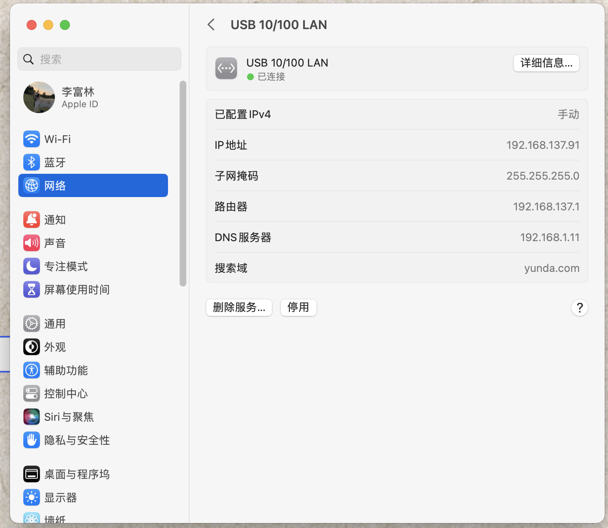
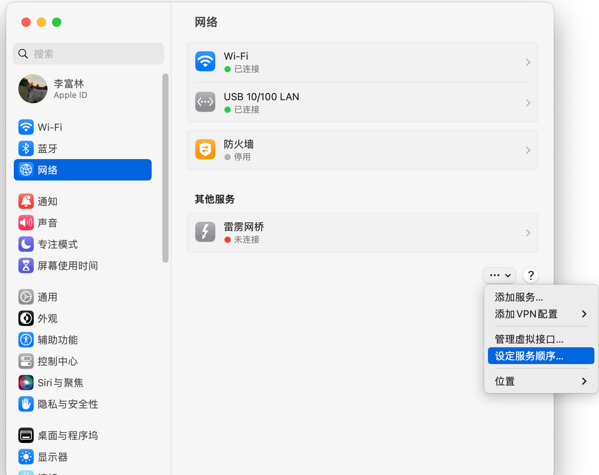

## ip不正确处理

出现这种情况，首先可以删除lan服务，然后新建一个，还是不行，可以关闭来源的电脑的共享服务，然后重新共享一次，刷新ip，通常是由于ip冲突导致的

**关键点在于，被路由电脑要重新共享一次网络，也就是重新分配ip，否则ip是不对的**

或者尝试将ip地址dns等固定为下面的(当前公司环境)，注意DNS和搜索域



## mac双网，同时连接内外网

在公司环境中，代码环境通常使用内网，同时需要访问外网查询资料时，通常的解决方案是同时连接内外网。

通常有两种形式：

1. 内网使用网线，外网使用wifi，如果是这种形式直接连接就行，连接完成将外网wifi的服务顺序移动到最前，默认是有线有线



2. 内外网都是路由器，没有有线，这种比较麻烦，无法直接解决，mac肯定不支持同时连接两个路由器，那就乱了套了，通常可以选择购买mac版无线网卡(比如tenda u12)增加无线网卡，或者购买路由器，将其中一个网络桥接到路由器，然后再通过有线连接到mac，最后还有一个方法是，通过一台windows笔记本，然后将windows和mac使用网线连接，需要注意windows需要开启允许其他连接设备使用windows的网络。

连接之后，多数情况下可以直接使用双网，但有时候不行，比如链接的内网路由器网段是192这种本地网段，和本机的本地网段重复，就会冲突，当然如果内网路由器网段是10.1.xx.xx这样的就不会冲突，无论是否冲突，都可以通过设置路由表映射的方式来定义：

```shell
sudo route add 10.1.7.58 192.168.137.1
```

上面明明的含义是，添加路由，访问`10.1.7.58`时，使用路由`192.168.137.1`，后面这个路由地址就是内网路由器的路由地址，前面通常是内网接口的地址，当然也可以设置一个网段，比如 `10.1.7.xx`和 `10.1.xx.xx`等，简单来说就是访问某些地址时使用地址的路由器地址，当然这些地址都需要是本机可以访问到的地址。

删除路由

```shell
sudo route delete 10.1.7.58 192.168.137.1
```

查看所有路由记录

```shell
netstat -r
```

## 最新方法

首先将备用笔记本连接上公司外网，同时在控制面板网络设置中，共享网络，然后通过网线将这个网络和mac电脑连接，连接之后，mac需要设置：

1. 设置服务顺序为第一
2. 将DNS的ip设置为192.168.1.11，搜索域设置为yunda.com，默认的是错误的，可以直接连接yunda-work网络可以查看这个正确的DNS和搜索域

然后在使用wifi连接内网tms-5g即可