# 数据结构基础

在计算机科学中，数据结构是一种数据组织、管理和存储的格式,它可以帮助我们实现对数据高效的访问和修改。更准确地说,数据结构是数据值的集合，可以体现数据值之间的关系，以及可以对数据进行应用的函数或操作。

通俗地说，我们需要去学习在计算机中如何去更好地管理我们的数据，才能让我们对我们的数据控制更加灵活！

## 线性表

线性表是最基本的一种数据结构，它是表示一组相同类型数据的有限序列，你可以把它与数组进行参考，但是它并不是数组，线性表是一种表结构，它能够支持数据的插入、删除、更新、查询等，同时数组可以随意存放在数组中任意位置，而线性表只能依次有序排列，不能出现空隙，因此，我们需要进一步的设计。

### 顺序表

将数据依次存储在连续的整块物理空间中，这种存储结构称为`顺序存储结构`，而以这种方式实现的线性表，我们称为`顺序表`。

同样的，表中的每一个个体都被称为`元素`，元素左边的元素（上一个元素），称为`前驱`，同理，右边的元素（后一个元素）称为`后驱`。


我们设计线性表的目标就是为了去更好地管理我们的数据，也就是说，我们可以基于数组，来进行封装，实现增删改查！既然要存储一组数据，那么很容易联想到我们之前学过的数组，数组就能够容纳一组同类型的数据。

目标：以数组为底层，编写以下抽象类的具体实现

```java
/**
 * 线性表抽象类
 * @param <E> 存储的元素(Element)类型
 */
public abstract class AbstractList<E> {
    /**
     * 获取表的长度
     * @return 顺序表的长度
     */
    public abstract int size();

    /**
     * 添加一个元素
     * @param e 元素
     * @param index 要添加的位置(索引)
     */
    public abstract void add(E e, int index);

    /**
     * 移除指定位置的元素
     * @param index 位置
     * @return 移除的元素
     */
    public abstract E remove(int index);

    /**
     * 获取指定位置的元素
     * @param index 位置
     * @return 元素
     */
    public abstract E get(int index);
}
```

### 链表

数据分散的存储在物理空间中，通过一根线保存着它们之间的逻辑关系，这种存储结构称为`链式存储结构`

实际上，就是每一个结点存放一个元素和一个指向下一个结点的引用（C语言里面是指针，Java中就是对象的引用，代表下一个结点对象）

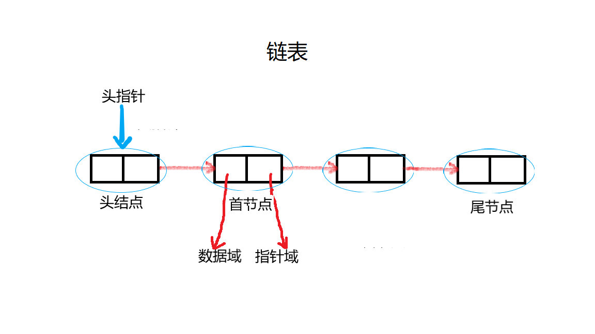

利用这种思想，我们再来尝试实现上面的抽象类，从实际的代码中感受！

比较：顺序表和链表的优异？

顺序表优缺点：

* 访问速度快，随机访问性能高
* 插入和删除的效率低下，极端情况下需要变更整个表
* 不易扩充，需要复制并重新创建数组

链表优缺点：

* 插入和删除效率高，只需要改变连接点的指向即可
* 动态扩充容量，无需担心容量问题
* 访问元素需要依次寻找，随机访问元素效率低下

链表只能指向后面，能不能指向前面呢？双向链表！

### 栈

栈遵循先入后出原则，只能在线性表的一端添加和删除元素。我们可以把栈看做一个杯子，杯子只有一个口进出，最低处的元素只能等到上面的元素离开杯子后，才能离开。

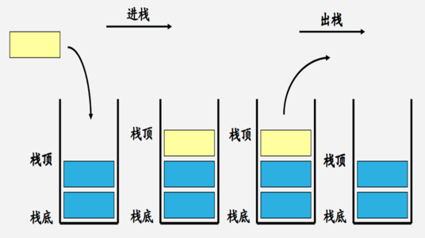

向栈中插入一个元素时，称为`入栈（压栈）`，移除栈顶元素称为`出栈`，我们需要尝试实现以下抽象类型：

```java
/**
 * 抽象类型栈，待实现
 * @param <E> 元素类型
 */
public abstract class AbstractStack<E> {

    /**
     * 出栈操作
     * @return 栈顶元素
     */
    public abstract E pop();

    /**
     * 入栈操作
     * @param e 元素
     */
    public abstract void push(E e);
}
```

其实，我们的JVM在处理方法调用时，也是一个栈操作：

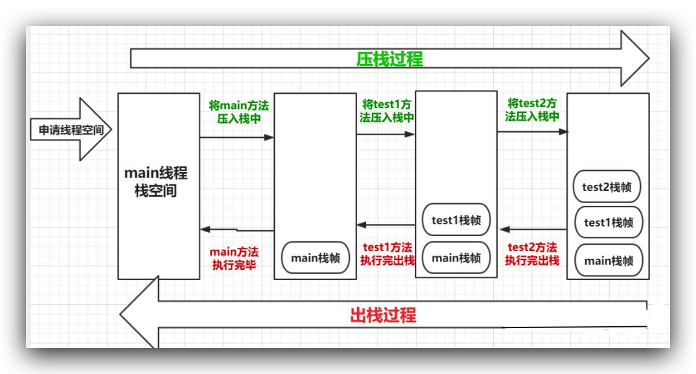

所以说，如果玩不好递归，就会像这样：

```java
public class Main {
    public static void main(String[] args) {
        go();
    }

    private static void go(){
        go();
    }
}

Exception in thread "main" java.lang.StackOverflowError
	at com.test.Main.go(Main.java:13)
	at com.test.Main.go(Main.java:13)
	at com.test.Main.go(Main.java:13)
	at com.test.Main.go(Main.java:13)
	at com.test.Main.go(Main.java:13)
	at com.test.Main.go(Main.java:13)
	at com.test.Main.go(Main.java:13)
	at com.test.Main.go(Main.java:13)
  ...
```

栈的深度是有限制的，如果达到限制，将会出现`StackOverflowError`错误（注意是错误！说明是JVM出现了问题）

### 队列

队列同样也是受限制的线性表，不过队列就像我们排队一样，只能从队尾开始排，从队首出。

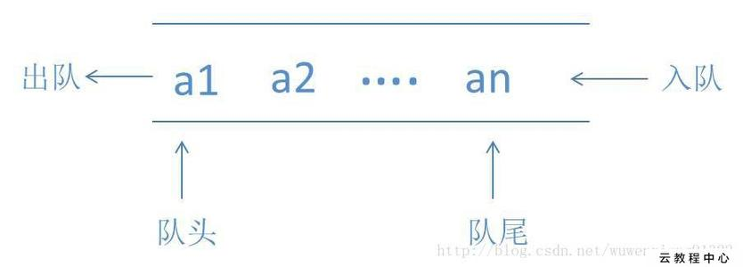

所以我们要实现以下内容：

```java
/**
 *
 * @param <E>
 */
public abstract class AbstractQueue<E> {

    /**
     * 进队操作
     * @param e 元素
     */
    public abstract void offer(E e);

    /**
     * 出队操作
     * @return 元素
     */
    public abstract E poll();
}

```

## 树

我们前面已经学习过链表了，我们知道链表是单个结点之间相连，也就是一种一对一的关系，而树则是一个结点连接多个结点，也就是一对多的关系。

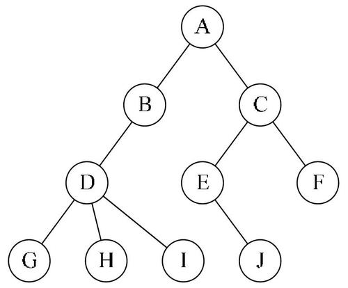

一个结点可以有N个子结点，就像上图一样，看起来就像是一棵树。而位于最顶端的结点（没有父结点）我们称为`根结点`，而结点拥有的子节点数量称为`度`，每向下一级称为一个`层次`，树中出现的最大层次称为树的`深度(高度)`。

### 二叉树

二叉树是一种特殊的树，每个结点最多有两颗子树，所以二叉树中不存在度大于2的结点，位于两边的子结点称为左右子树（注意，左右子树是明确区分的，是左就是左，是右就是右）

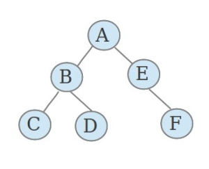

数学性质：

* 在二叉树的第i层上最多有2^(i-1) 个节点。
* 二叉树中如果深度为k，那么最多有2^k-1个节点。

设计一个二叉树结点类：

```java
public class TreeNode<E> {
    public E e;   //当前结点数据
    public TreeNode<E> left;   //左子树
    public TreeNode<E> right;   //右子树
}
```

#### 二叉树的遍历

顺序表的遍历其实就是依次有序去访问表中每一个元素，而像二叉树这样的复杂结构，我们有四种遍历方式，他们是：前序遍历、中序遍历、后序遍历以及层序遍历，本版块我们主要讨论前三种遍历方式：

* **前序遍历**：从二叉树的根结点出发，到达结点时就直接输出结点数据，按照先向左在向右的方向访问。ABCDEF
* **中序遍历**：从二叉树的根结点出发，优先输出左子树的节点的数据，再输出当前节点本身，最后才是右子树。CBDAEF
* **后序遍历**：从二叉树的根结点出发，优先遍历其左子树，再遍历右子树，最后在输出当前节点本身。CDBFEA

#### 满二叉树和完全二叉树

满二叉树和完全二叉树其实就是特殊情况下的二叉树，满二叉树左右的所有叶子节点都在同一层，也就是说，完全把每一个层级都给加满了结点。完全二叉树与满二叉树不同的地方在于，它的最下层叶子节点可以不满，但是最下层的叶子节点必须靠左排布。

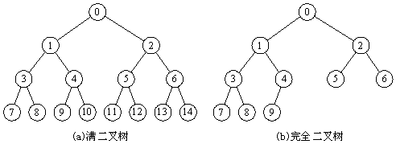

其实满二叉树和完全二叉树就是有一定规律的二叉树，很容易理解。

### B+树和B-树？


## 快速查找

我们之前提到的这些数据结构，很好地帮我们管理了数据，但是，如果需要查找某一个元素是否存在于数据结构中，如何才能更加高效的去完成呢？

### 哈希表

通过前面的学习，我们发现，顺序表虽然查询效率高，但是插入删除有严重表更新的问题，而链表虽然弥补了更新问题，但是查询效率实在是太低了，能否有一种折中方案？哈希表！

不知大家在之前的学习中是否发现，我们的Object类中，定义了一个叫做`hashcode()`的方法？而这个方法呢，就是为了更好地支持哈希表的实现。`hashcode()`默认得到的是对象的内存地址，也就是说，每个对象的hashCode都不一样。

哈希表，其实本质上就是一个存放链表的数组，那么它是如何去存储数据的呢？我们先来看看长啥样：

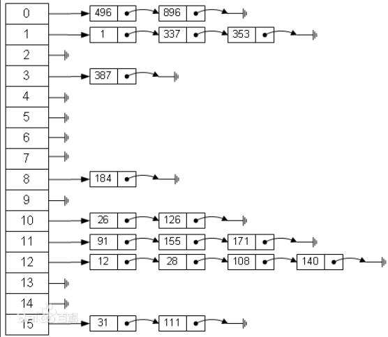

数组中每一个元素都是一个头结点，用于保存数据，那我们怎么确定数据应该放在哪一个位置呢？通过hash算法，我们能够瞬间得到元素应该放置的位置。

```java
//假设hash表长度为16，hash算法为：
private int hash(int hashcode){
  return hashcode % 16;
}
```

设想这样一个问题，如果计算出来的hash值和之前已经存在的元素相同了呢？这种情况我们称为`hash碰撞`，这也是为什么要将每一个表元素设置为一个链表的头结点的原因，一旦发现重复，我们可以往后继续添加节点。

当然，以上的hash表结构只是一种设计方案，在面对大额数据时，是不够用的，在JDK1.8中，集合类使用的是数组+二叉树的形式解决的（这里的二叉树是经过加强的二叉树，不是前面讲得简单二叉树，我们下一节就会开始讲）

### 二叉排序树

我们前面学习的二叉树效率是不够的，我们需要的是一种效率更高的二叉树，因此，基于二叉树的改进，提出了二叉查找树，可以看到结构像下面这样：

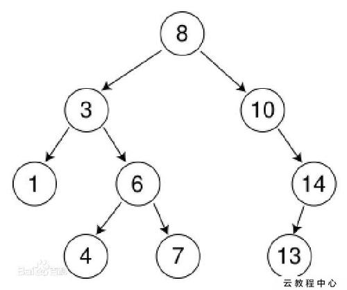

不难发现，每个节点的左子树，一定小于当前节点的值，每个节点的右子树，一定大于当前节点的值，这样的二叉树称为`二叉排序树`。利用二分搜索的思想，我们就可以快速查找某个节点！

### 平衡二叉树

在了解了二叉查找树之后，我们发现，如果根节点为10，现在加入到结点的值从9开始，依次减小到1，那么这个表就会很奇怪，就像下面这样：


显然，当所有的结点都排列到一边，这种情况下，查找效率会直接退化为最原始的二叉树！因此我们需要维持二叉树的平衡，才能维持原有的查找效率。

现在我们对二叉排序树加以约束，要求每个结点的左右两个子树的高度差的绝对值不超过1，这样的二叉树称为`平衡二叉树`，同时要求每个结点的左右子树都是平衡二叉树，这样，就不会因为一边的疯狂增加导致失衡。我们来看看以下几种情况：


左左失衡

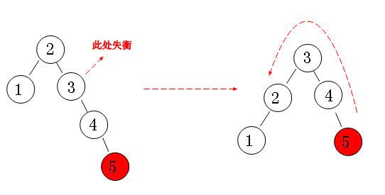

右右失衡


左右失衡

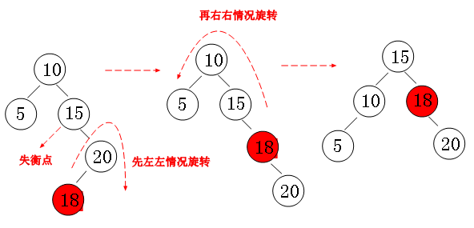

右左失衡

通过以上四种情况的处理，最终得到维护平衡二叉树的算法。

### 红黑树

红黑树也是二叉排序树的一种改进，同平衡二叉树一样，红黑树也是一种维护平衡的二叉排序树，但是没有平衡二叉树那样严格（平衡二叉树每次插入新结点时，可能会出现大量的旋转，而红黑树保证不超过三次），红黑树降低了对于旋转的要求，因此效率有一定的提升同时实现起来也更加简单。但是红黑树的效率却高于平衡二叉树，红黑树也是JDK1.8中使用的数据结构！

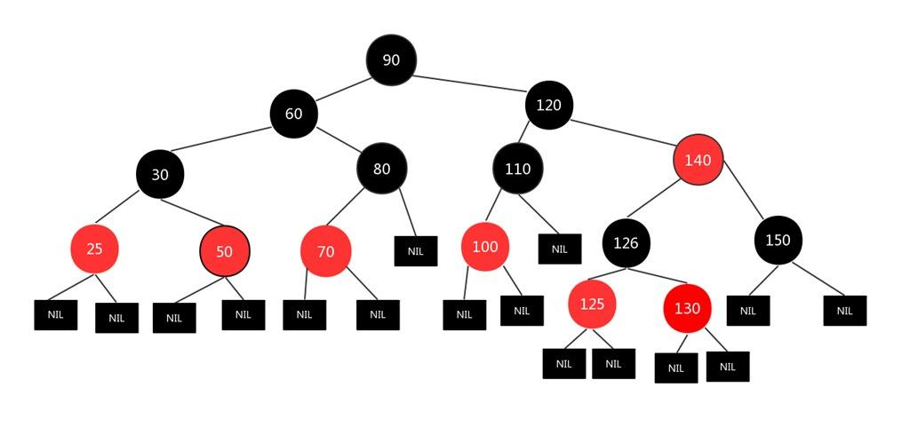

红黑树的特性:
（1）每个节点或者是黑色，或者是红色。
（2）根节点是黑色。
（3）每个叶子节点的两边也需要表示（虽然没有，但是null也需要表示出来）是黑色。
（4）如果一个节点是红色的，则它的子节点必须是黑色的。
（5）从一个节点到该节点的子孙节点的所有路径上包含相同数目的黑节点。

我们来看看一个节点，是如何插入到红黑树中的：

基本的 插入规则和平衡二叉树一样，但是在插入后：

1. 将新插入的节点标记为红色
2. 如果 X 是根结点(root)，则标记为黑色
3. 如果 X 的 parent 不是黑色，同时 X 也不是 root:

- 3.1 如果 X 的 uncle (叔叔) 是红色

- - 3.1.1 将 parent 和 uncle 标记为黑色
  - 3.1.2 将 grand parent (祖父) 标记为红色
  - 3.1.3 让 X 节点的颜色与 X 祖父的颜色相同，然后重复步骤 2、3

- 3.2 如果 X 的 uncle (叔叔) 是黑色，我们要分四种情况处理

- - 3.2.1 左左 (P 是 G 的左孩子，并且 X 是 P 的左孩子)
  - 3.2.2 左右 (P 是 G 的左孩子，并且 X 是 P 的右孩子)
  - 3.2.3 右右 (P 是 G 的右孩子，并且 X 是 P 的右孩子)
  - 3.2.4 右左 (P 是 G 的右孩子，并且 X 是 P 的左孩子)
  - 其实这种情况下处理就和我们的平衡二叉树一样了