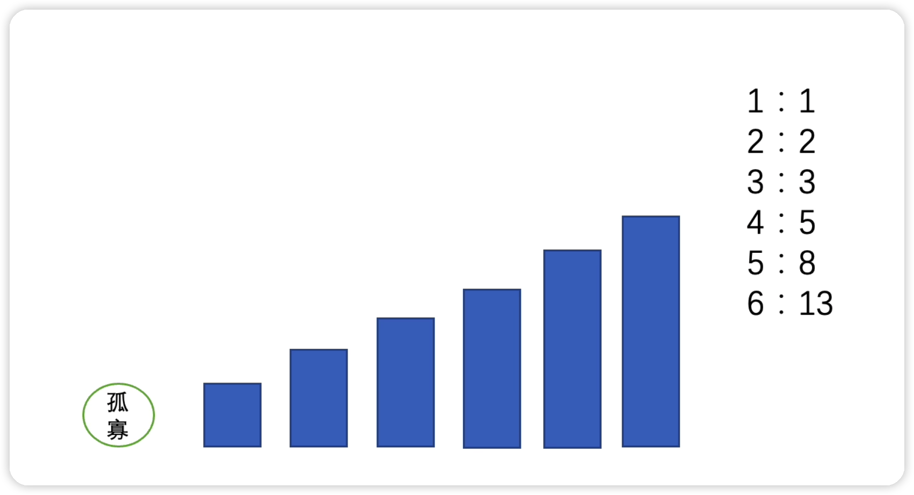
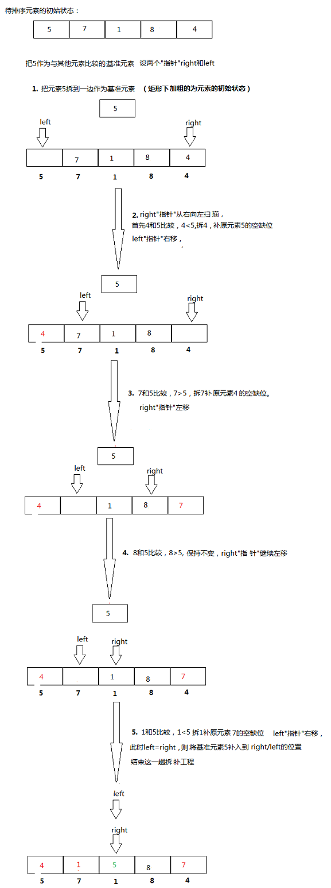
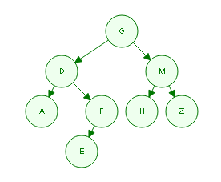

# 面向过程基础算法题

使用面向过程就可以解决的基础算法题


## 打印九九乘法表

简单：将九九乘法表打印到控制台

```java
public static void main(String[] args) {
    // 打印九九乘法表
    // 打印9排
    for (int i = 1; i <= 9; i++) {
        // 每排的数量根据i的值来决定
        for (int j = 1; j <= i; j++) {
            System.out.print(i + "*" + j + "=" + i * j + "\t");
        }
        System.out.println();
    }
}
```


## 求1000以内的水仙花数

中等：打印1000以内所有满足水仙花的数，“水仙花数”是指一个三位数其各位数字的立方和等于该数本身，例如153是“水仙花数”，因为：153 = 1^3 + 5^3 + 3^3

```java
public static void main(String[] args) {
    // 求1000以内的水仙花数
    for (int i = 100; i < 1000; i++) {
        int a = i / 100;    // 取出百位数
        // 取出十位数 百位数首先除以10，得到百位数和十位数组成的两位数，再取模10，得到这两位数的后一位也就是十位数
        int b = i / 10 % 10;
        int c = i % 10;   // 取出个位数,取模就是把前面的位全部干掉，只剩下最后一位
        if (i == a * a * a + b * b * b + c * c * c) {
            System.out.println(i);
        }
    }
}
```


## 青蛙跳台阶问题-斐波那切数列

困难：一共有n个台阶，一只青蛙每次只能跳一阶或是两阶，那么一共有多少种跳到顶端的方案？例如n=2，那么一共有两种方案，一次性跳两阶或是每次跳一阶。

动态规划：其实，就是利用，上次得到的结果，给下一次作参考，下一次就能利用上次的结果快速得到结果，依次类推



### 思路分析

以四阶为例，先跳一阶，以第二阶梯为起点，然后后面还有三个阶梯，三个阶梯我们前面算出来了是有3种，然后重新开始，一开始跳两阶，后面还有两个，也就是两种，那么四阶梯就是3+2=5阶

核心思想是每一阶阶数为上两阶之和，因为可以去除一次性跳的1阶或者去除跳的2阶，自然为上一阶和上两阶的和

### 使用数组

```java
public static void main(String[] args) {
    int n = 10;
    int arr[] = new int[n];
    arr[0] = 1; // 第1阶 为1种台阶
    arr[1] = 2; // 第2阶 为2种台阶
    // 从第3阶开始
    for (int i = 2; i < n; i++) {
        arr[i] = arr[i - 1] + arr[i - 2];   // 第i阶为前两阶的和
        System.out.println("第" + (i + 1) + "阶台阶有" + arr[i] + "种走法");
    }
}
```

### 使用递归

```java
public class Test {
    public static void main(String[] args) {
        int n = 10;
        System.out.println(fn(n));
    }
    public static int fn(int n) {
        // 首先写出递归最终结束的条件
        if (n == 1) {
            return 1;
        } else if (n == 2) {
            return 2;
        }
        // 每次n阶的走法种数 都是前面n-1阶的走法种数加上前面n-2阶的走法种数
        return fn(n - 1) + fn(n - 2);
    }
}
```


# 排序算法

## 三大基本排序算法

### 冒泡排序

冒泡排序就是冒泡，以从小到大排序为例，每一轮排序就找出未排序序列中最大值放在最后

```java
public class Test {
    public static void main(String[] args) {
        int[] arr = {1, 20, 4, 222, 5, 33, 7, 99, 9, 102};
        // 冒泡length - 1轮，因为每次两个数字比较，所以最多比较length - 1次
        for (int i = 0; i < arr.length - 1; i++) {
            // 在每轮中，比较length - i次
            for (int j = 0; j < arr.length - 1 - i; j++) {
                if (arr[j] > arr[j + 1]) {
                    // 交换大小不同的两个数
                    int temp = arr[j];
                    arr[j] = arr[j + 1];
                    arr[j + 1] = temp;
                }
            }
        }
        System.out.println("冒泡后排序:" + Arrays.toString(arr));
    }
}
```

### 插入排序

将数字插入原来已经排好序的数组，当然默认这个数组只有一个数，然后不断插入

```java
public class Test {
    public static void main(String[] args) {
        int[] arr = {1, 20, 4, 222, 5, 33, 7, 99, 9, 102};
        // 先把第一个元素踢出去，作为已经排好序的元素，所以从1开始，少排一轮
        for (int i = 1; i < arr.length; i++) {
            // 从第i个元素开始，每次拿出一个后面没排序的元素，和前面已经排好序的元素进行比较，排i轮
            for (int j = i; j > 0; j--) {
                // 如果前面的元素比后面的元素大，则交换位置
                if (arr[j] < arr[j - 1]) {
                    int temp = arr[j];
                    arr[j] = arr[j - 1];
                    arr[j - 1] = temp;
                }
            }
        }

        System.out.println("插入排序后:" + Arrays.toString(arr));
    }
}
```

### 选择排序

选择排序其实就是每次都选择当前数组中最小的数排到最前面，就是从小到大排序

```java
public class Test {
    public static void main(String[] args) {
        int[] arr = {1, 20, 4, 222, 5, 33, 7, 99, 9, 102};
        // 两个数比较，少排一轮
        for (int i = 0; i < arr.length - 1; i++) {
            int min = i;
            // 找到每轮最小值，每轮只循环未排序的部分
            for (int j = i + 1; j < arr.length; j++) {
                if (arr[j] < arr[min]) {
                    min = j;
                }
            }
            // 交换，小的排在前面
            int temp = arr[i];
            arr[i] = arr[min];
            arr[min] = temp;
        }

        System.out.println("选择排序后:" + Arrays.toString(arr));
    }
}
```

## 进阶排序算法

### 快速排序

快速排序其实是一种排序执行效率很高的排序算法，它利用分治法来对待排序序列进行分治排序，它的思想主要是通过一趟排序将待排记录分隔成独立的两部分，其中的一部分比关键字小，后面一部分比关键字大，然后再对这前后的两部分分别采用这种方式进行排序，通过递归的运算最终达到整个序列有序。

快速排序就像它的名字一样，快速！在极端情况下，会退化成冒泡排序！

#### 原理图



#### 代码实现

```java
public class Test {
    public static void main(String[] args) {
        int[] arr = {13, 42, 32, 422, 35, 232, 363, 244, 5544, 995};
        quickSort(arr, 0, arr.length - 1);
        System.out.println(Arrays.toString(arr));
    }
    // 快速排序
    public static void quickSort(int[] arr, int start, int end) {
        // 如果开始和结束相等了，结束递归
        if (start >= end) return;
        // 定义基准值，默认是开始值，这里不直接使用start和end是因为后面还要使用start和end
        int k = arr[start], left = start, right = end;
        // 循环，直到所有元素都和基准值排好左右两边，外边是控制所有元素的，里面是控制一个元素和基准值
        // 这个里面的两个while是用于每一次将一个右边比基准值小的元素放到左边，
        // 和每一次将一个左边比基准值大的元素放到右边
        while (left < right) {
            // 从右边开始找比基准值小的准备移到左边，没有找到就right指针--向左移动，当然最多不能移动到left指针的位置
            while(left < right && arr[right] >= k) right--;
            // 找到了，就把它放到left指针的位置
            arr[left] = arr[right];
            // 然后跳转到从左边开始找比基准值大的，没有找到就left指针++向右移动，当然最多不能移动到right指针的位置
            while(left < right && arr[left] <= k) left++;
            // 找到了，就把它放到right指针的位置
            arr[right] = arr[left];
        }
        // 最后left和right相等了，把基准值放到这里，这里用arr[left]或者arr[right]都可以，因为left和right相等了
        arr[right] = k;
        // 对基准值左边的数组进行快速排序
        quickSort(arr, start, right - 1);
        // 对基准值右边的数组进行快速排序
        quickSort(arr, left + 1, end);
    }
}
```


# 查找算法

## 二分查找

现在有一个有序数组（从小到大，数组长度 0 < n < 1000000）如何快速寻找我们想要的数在哪个位置，如果存在请返回下标，不存在返回`-1`即可，要求必须为有序的数组

```java
public class Test {
    public static void main(String[] args) {
        int[] arr = {1, 2, 3, 4, 5, 22, 33, 44, 55, 99};
        System.out.println(commonBinarySearch(arr, 22));
    }

    public static int commonBinarySearch(int[] arr, int key) {
        int low = 0;
        int high = arr.length - 1;
        int middle = 0;            //定义middle

        if (key < arr[low] || key > arr[high] || low > high) {
            return -1;
        }

        while (low <= high) {
            // middle取low + high + 1更加准确，因为比如13的中间值是7，不加1会是6，当然偶数的时候，还是会是6，不影响
            middle = (low + high + 1) / 2;
            if (arr[middle] > key) {
                //比关键字大则关键字在左区域
                high = middle - 1;
            } else if (arr[middle] < key) {
                //比关键字小则关键字在右区域
                low = middle + 1;
            } else {
                return middle;
            }
        }

        return -1;        //最后仍然没有找到，则返回-1
    }
}
```

# 集合类算法

来源青空的霞光

## 反转链表

1 <- 3 <- 5 <- 7 <- 9  转换为 1 <- 3 <- 5 <- 7 <- 9

现在有一个单链表，尝试将其所有节点倒序排列

```java
public class Main {
    public static void main(String[] args) {
        Node head = new Node(1);
        head.next = new Node(3);
        head.next.next = new Node(5);
        head.next.next.next = new Node(7);
        head.next.next.next.next = new Node(9);

        head = reverse(head);

        while (head != null){
            System.out.println(head.value+" ");
            head = head.next;
        }
    }

    public static class Node {
        public int value;
        public Node next;

        public Node(int data) {
            this.value = data;
        }
    }

    public static Node reverse(Node head) {
        //在这里实现
    }
}
```

## 重建二叉树

现在知道二叉树的前序: GDAFEMHZ，以及中序: ADEFGHMZ，请根据已知信息还原这颗二叉树。



## 实现计算器

实现一个计算器，要求输入一个计算公式（含加减乘除运算符，没有负数但是有小数），得到结果，比如输入：1+4*3/1.321，得到结果为：2.2

## 字符串匹配（KMP算法）

现在给定一个主字符串和一个子字符串，请判断主字符串是否包含子字符串，例如主字符串：ABCABCDHI，子字符串：ABCD，因此主字符串包含此子字符串；主字符串：ABCABCUISA，子字符串：ABCD，则不包含。


# 算法进阶

## 0/1背包问题