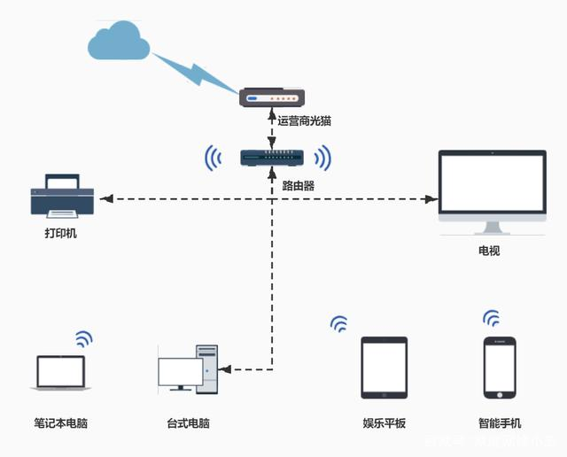
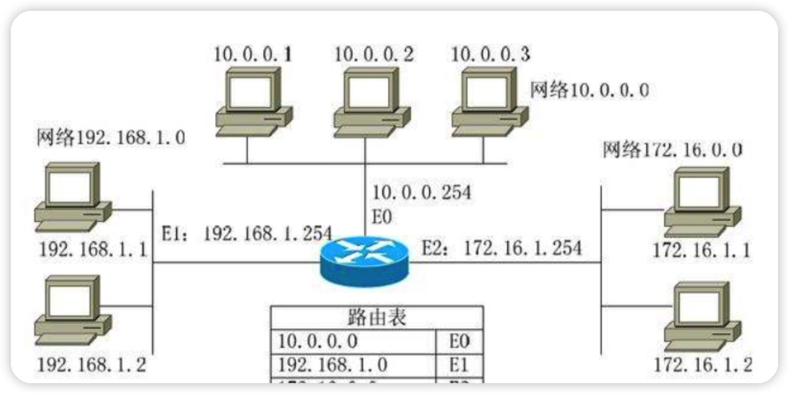
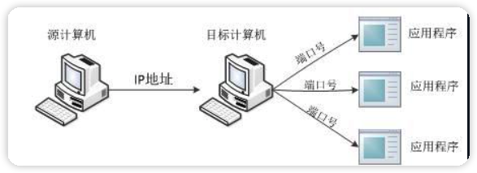
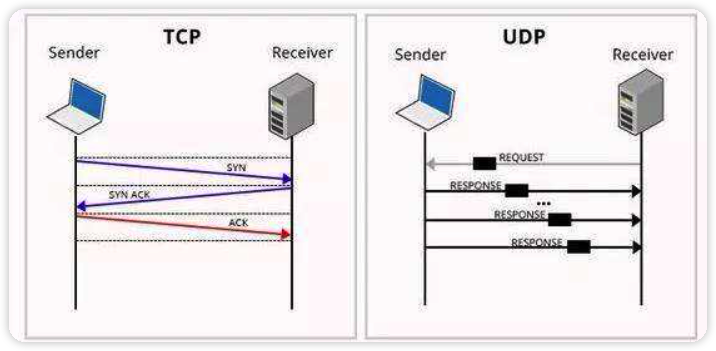
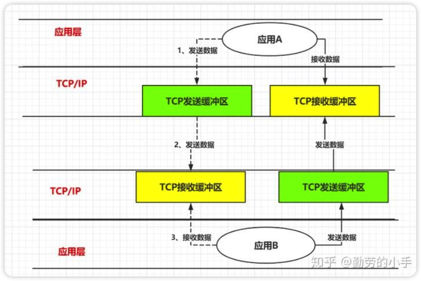
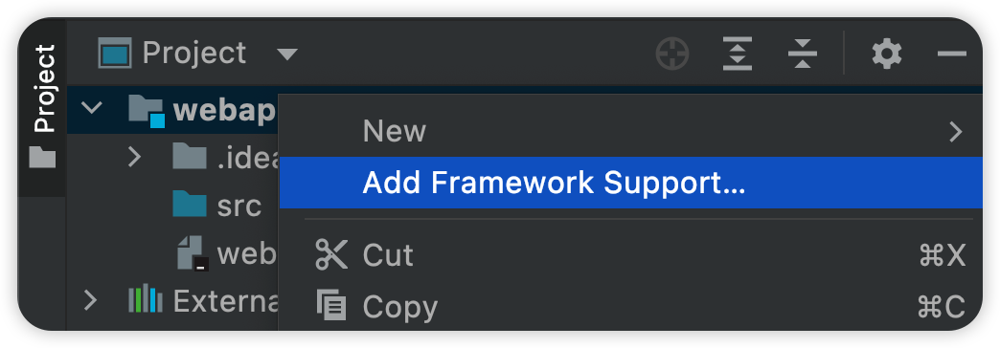
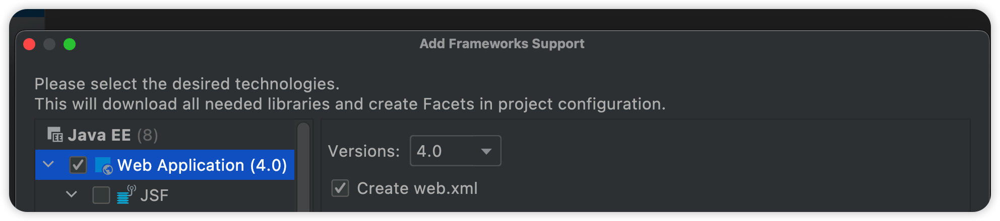
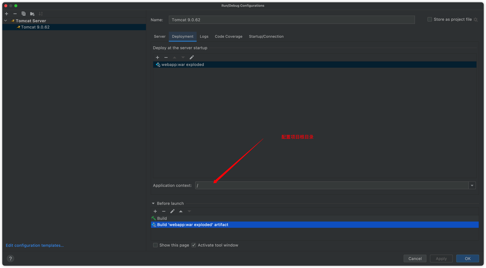

# 网络基础

在JavaSE阶段，我们学习了I/O流，既然I/O流如此强大，那么能否跨越不同的主机进行I/O操作呢？这就要提到Java的网络编程了。

**注意：**本章会涉及到`计算机网络`相关内容（只会讲解大致内容，不会完整的讲解计算机网络知识）

## 计算机网络基础

利用通信线路和通信设备，将地理位置不同的、功能独立的多台计算机互连起来，以功能完善的网络软件来实现资源共享和信息传递，就构成了计算机网络系统。



比如我们家里的路由器，通过将我们的设备（手机、平板、电脑、电视剧）连接到路由器，来实现对互联网的访问。实际上，我们的路由器连接在互联网上，而我们的设备又连接了路由器，这样我们的设备就可以通过路由器访问到互联网了。通过网络，我们可以直接访问互联网上的另一台主机，比如我们要把QQ的消息发送给我们的朋友，或是通过远程桌面管理来操作另一台电脑，也可以是连接本地网络上的打印机。

既然我们可以通过网络访问其他计算机，那么如何区别不同的计算机呢？通过IP地址，我们就可以区分不同的计算机了：



每一台电脑在同一个网络上都有一个自己的IP地址，用于区别于其他的电脑，我们可以通过对方主机的IP地址对其进行访问。那么我手机连接的移动流量，能访问到连接家里路由器的电脑吗？（不能，因为他们不属于同一个网络）

而我们的电脑上可能运行着大量的程序，每一个程序可能都需要通过网络来访问其他计算机，那这时该如何区分呢？我们可以通过端口号来区分：



因此，我们一般看到的是这样的：`192.168.0.11:8080`，通过`IP:端口`的形式来访问目标主机上的一个应用程序服务。注意端口号只能是0-65535之间的值！

IP地址分为IPv4和IPv6，IPv4类似于`192.168.0.11`，我们上面提到的例子都是使用的IPv4，它一共有四组数字，每组数字占8个bit位，IPv4地址`0.0.0.0`表示为2进制就是：00000000.00000000.00000000.00000000，共32个bit，最大为`255.255.255.255`，实际上，IPv4能够表示的所有地址，早就已经被用完了。IPv6能够保存128个bit位，因此它也可以表示更多的IP地址，一个IPv6地址看起来像这样：`1030::C9B4:FF12:48AA:1A2B`，目前也正在向IPv6的阶段过度。

TCP和UDP是两种不同的传输层协议：

* TCP：当一台计算机想要与另一台计算机通讯时，两台计算机之间的通信需要畅通且可靠（会进行三次握手，断开也会进行四次挥手），这样才能保证正确收发数据，因此TCP更适合一些可靠的数据传输场景。
* UDP：它是一种无连接协议，数据想发就发，而且不会建立可靠传输，也就是说传输过程中有可能会导致部分数据丢失，但是它比TCP传输更加简单高效，适合视频直播之类的。



***

## 了解Socket技术

通过Socket技术（它是计算机之间进行**通信**的**一种约定**或一种方式），我们就可以实现两台计算机之间的通信，Socket也被翻译为`套接字`，是操作系统底层提供的一项通信技术，它支持TCP和UDP。而Java就对socket底层支持进行了一套完整的封装，我们可以通过Java来实现Socket通信。

要实现Socket通信，我们必须创建一个数据发送者和一个数据接收者，也就是客户端和服务端，我们需要提前启动服务端，来等待客户端的连接，而客户端只需要随时启动去连接服务端即可！

```java
//服务端
public static void main(String[] args) {
    try(ServerSocket server = new ServerSocket(8080)){    //将服务端创建在端口8080上
        System.out.println("正在等待客户端连接...");
        Socket socket = server.accept();  //当没有客户端连接时，线程会阻塞，直到有客户端连接为止
        System.out.println("客户端已连接，IP地址为："+socket.getInetAddress().getHostAddress());
    }catch (IOException e){
        e.printStackTrace();
    }
}
```

```java
//客户端
public static void main(String[] args) {
    try (Socket socket = new Socket("localhost", 8080)){
        System.out.println("已连接到服务端！");
    }catch (IOException e){
        System.out.println("服务端连接失败！");
        e.printStackTrace();
    }
}
```

实际上它就是一个TCP连接的建立过程

一旦TCP连接建立，服务端和客户端之间就可以相互发送数据，直到客户端主动关闭连接。当然，服务端不仅仅只可以让一个客户端进行连接，我们可以尝试让服务端一直运行来不断接受客户端的连接：

```java
public static void main(String[] args) {
    try(ServerSocket server = new ServerSocket(8080)){    //将服务端创建在端口8080上
        System.out.println("正在等待客户端连接...");
        while (true){   //无限循环等待客户端连接
            Socket socket = server.accept();
            System.out.println("客户端已连接，IP地址为："+socket.getInetAddress().getHostAddress());
        }
    }catch (IOException e){
        e.printStackTrace();
    }
}
```

现在我们就可以多次去连接此服务端了。

## 使用Socket进行数据传输

通过Socket对象，我们就可以获取到对应的I/O流进行网络数据传输：

```java
public static void main(String[] args) {
        try (Socket socket = new Socket("localhost", 8080);
             Scanner scanner = new Scanner(System.in)){
            System.out.println("已连接到服务端！");
            OutputStream stream = socket.getOutputStream();
            OutputStreamWriter writer = new OutputStreamWriter(stream);  //通过转换流来帮助我们快速写入内容
            System.out.println("请输入要发送给服务端的内容：");
            String text = scanner.nextLine();
            writer.write(text+'\n');   //因为对方是readLine()这里加个换行符
            writer.flush();
            System.out.println("数据已发送："+text);
        }catch (IOException e){
            System.out.println("服务端连接失败！");
            e.printStackTrace();
        }finally {
            System.out.println("客户端断开连接！");
        }
    }
}
```

```java
public static void main(String[] args) {
    try(ServerSocket server = new ServerSocket(8080)){    //将服务端创建在端口8080上
        System.out.println("正在等待客户端连接...");
        Socket socket = server.accept();
        System.out.println("客户端已连接，IP地址为："+socket.getInetAddress().getHostAddress());
        BufferedReader reader = new BufferedReader(new InputStreamReader(socket.getInputStream()));  //通过
        System.out.print("接收到客户端数据：");
        System.out.println(reader.readLine());
      	socket.close();   //和服务端TCP连接完成之后，记得关闭socket
    }catch (IOException e){
        e.printStackTrace();
    }
}
```

同理，既然服务端可以读取客户端的内容，客户端也可以在发送后等待服务端给予响应：

```java
public static void main(String[] args) {
    try (Socket socket = new Socket("localhost", 8080);
         Scanner scanner = new Scanner(System.in)){
        System.out.println("已连接到服务端！");
        OutputStream stream = socket.getOutputStream();
        OutputStreamWriter writer = new OutputStreamWriter(stream);  //通过转换流来帮助我们快速写入内容
        System.out.println("请输入要发送给服务端的内容：");
        String text = scanner.nextLine();
        writer.write(text+'\n');   //因为对方是readLine()这里加个换行符
        writer.flush();
        System.out.println("数据已发送："+text);
        BufferedReader reader = new BufferedReader(new InputStreamReader(socket.getInputStream()));
        System.out.println("收到服务器返回："+reader.readLine());
    }catch (IOException e){
        System.out.println("服务端连接失败！");
        e.printStackTrace();
    }finally {
        System.out.println("客户端断开连接！");
    }
}
```

```java
public static void main(String[] args) {
    try(ServerSocket server = new ServerSocket(8080)){    //将服务端创建在端口8080上
        System.out.println("正在等待客户端连接...");
        Socket socket = server.accept();
        System.out.println("客户端已连接，IP地址为："+socket.getInetAddress().getHostAddress());
        BufferedReader reader = new BufferedReader(new InputStreamReader(socket.getInputStream()));  //通过
        System.out.print("接收到客户端数据：");
        System.out.println(reader.readLine());
        OutputStreamWriter writer = new OutputStreamWriter(socket.getOutputStream());
        writer.write("已收到！");
        writer.flush();
    }catch (IOException e){
        e.printStackTrace();
    }
}
```

我们可以手动关闭单向的流：

```java
socket.shutdownOutput();  //关闭输出方向的流
socket.shutdownInput();  //关闭输入方向的流
```

如果我们不希望服务端等待太长的时间，我们可以通过调用`setSoTimeout()`方法来设定IO超时时间：

```java
socket.setSoTimeout(3000);
```

当超过设定时间都依然没有收到客户端或是服务端的数据时，会抛出异常：

```java
java.net.SocketTimeoutException: Read timed out
	at java.net.SocketInputStream.socketRead0(Native Method)
	at java.net.SocketInputStream.socketRead(SocketInputStream.java:116)
	at java.net.SocketInputStream.read(SocketInputStream.java:171)
	at java.net.SocketInputStream.read(SocketInputStream.java:141)
	at sun.nio.cs.StreamDecoder.readBytes(StreamDecoder.java:284)
	at sun.nio.cs.StreamDecoder.implRead(StreamDecoder.java:326)
	at sun.nio.cs.StreamDecoder.read(StreamDecoder.java:178)
	at java.io.InputStreamReader.read(InputStreamReader.java:184)
	at java.io.BufferedReader.fill(BufferedReader.java:161)
	at java.io.BufferedReader.readLine(BufferedReader.java:324)
	at java.io.BufferedReader.readLine(BufferedReader.java:389)
	at com.test.Main.main(Main.java:41)
```

我们之前使用的都是通过构造方法直接连接服务端，那么是否可以等到我们想要的时候再去连接呢？

```java
try (Socket socket = new Socket(); //调用无参构造不会自动连接
     Scanner scanner = new Scanner(System.in)){ 
    socket.connect(new InetSocketAddress("localhost", 8080), 1000);  //手动调用connect方法进行连接
```

如果连接的双方发生意外而通知不到对方，导致一方还持有连接，这样就会占用资源，因此我们可以使用`setKeepAlive()`方法来防止此类情况发生：

```java
socket.setKeepAlive(true);
```

当客户端连接后，如果设置了keeplive为 true，当对方没有发送任何数据过来，超过一个时间(看系统内核参数配置)，那么我们这边会发送一个ack探测包发到对方，探测双方的TCP/IP连接是否有效。

TCP在传输过程中，实际上会有一个缓冲区用于数据的发送和接收：



此缓冲区大小为：8192，我们可以手动调整其大小来优化传输效率：

```java
socket.setReceiveBufferSize(25565);   //TCP接收缓冲区
socket.setSendBufferSize(25565);    //TCP发送缓冲区
```

## 使用Socket传输文件

既然Socket为我们提供了IO流便于数据传输，那么我们就可以轻松地实现文件传输了。

## 使用浏览器访问Socket服务器

在了解了如何使用Socket传输文件后，我们来看看，浏览器是如何向服务器发起请求的：

```java
public static void main(String[] args) {
        try(ServerSocket server = new ServerSocket(8080)){    //将服务端创建在端口8080上
            System.out.println("正在等待客户端连接...");
            Socket socket = server.accept();
            System.out.println("客户端已连接，IP地址为："+socket.getInetAddress().getHostAddress());
            InputStream in = socket.getInputStream();  //通过
            System.out.println("接收到客户端数据：");
            while (true){
                int i = in.read();
                if(i == -1) break;
                System.out.print((char) i);
            }
        }catch (Exception e){
            e.printStackTrace();
        }
    }
```

我们现在打开浏览器，输入http://localhost:8080或是http://127.0.0.1:8080/，来连接我们本地开放的服务器。

我们发现浏览器是无法打开这个链接的，但是我们服务端却收到了不少的信息：

```properties
GET / HTTP/1.1
Host: 127.0.0.1:8080
Connection: keep-alive
Cache-Control: max-age=0
sec-ch-ua: "Chromium";v="94", "Google Chrome";v="94", ";Not A Brand";v="99"
sec-ch-ua-mobile: ?0
sec-ch-ua-platform: "macOS"
Upgrade-Insecure-Requests: 1
User-Agent: Mozilla/5.0 (Macintosh; Intel Mac OS X 10_15_7) AppleWebKit/537.36 (KHTML, like Gecko) Chrome/94.0.4606.81 Safari/537.36
Accept: text/html,application/xhtml+xml,application/xml;q=0.9,image/avif,image/webp,image/apng,*/*;q=0.8,application/signed-exchange;v=b3;q=0.9
Sec-Fetch-Site: none
Sec-Fetch-Mode: navigate
Sec-Fetch-User: ?1
Sec-Fetch-Dest: document
Accept-Encoding: gzip, deflate, br
Accept-Language: zh-CN,zh;q=0.9,und;q=0.8,en;q=0.7
```

实际上这些内容都是Http协议规定的请求头内容。HTTP是一种应用层协议，全称为超文本传输协议，它本质也是基于TCP协议进行数据传输，因此我们的服务端能够读取HTTP请求。但是Http协议并不会保持长连接，在得到我们响应的数据后会立即关闭TCP连接。

既然使用的是Http连接，如果我们的服务器要支持响应HTTP请求，那么就需要按照HTTP协议的规则，返回一个规范的响应文本，首先是响应头，它至少要包含一个响应码：

```properties
HTTP/1.1 200 Accpeted
```

然后就是响应内容（注意一定要换行再写），我们尝试来编写一下支持HTTP协议的响应内容：

```java
public static void main(String[] args) {
    try(ServerSocket server = new ServerSocket(8080)){    //将服务端创建在端口8080上
        System.out.println("正在等待客户端连接...");
        Socket socket = server.accept();
        System.out.println("客户端已连接，IP地址为："+socket.getInetAddress().getHostAddress());
        BufferedReader reader = new BufferedReader(new InputStreamReader(socket.getInputStream()));  //通过
        System.out.println("接收到客户端数据：");
        while (reader.ready()) System.out.println(reader.readLine());   //ready是判断当前流中是否还有可读内容
        OutputStreamWriter writer = new OutputStreamWriter(socket.getOutputStream());
        writer.write("HTTP/1.1 200 Accepted\r\n");   //200是响应码，Http协议规定200为接受请求，400为错误的请求，404为找不到此资源（不止这些，还有很多）
        writer.write("\r\n");   //在请求头写完之后还要进行一次换行，然后写入我们的响应实体（会在浏览器上展示的内容）
        writer.write("lbwnb!");
        writer.flush();
    }catch (Exception e){
        e.printStackTrace();
    }
}
```

我们可以打开浏览器的开发者模式（这里推荐使用Chrome/Edge浏览器，按下F12即可打开），我们来观察一下浏览器的实际请求过程。

# Http

## 什么是HTTP

HTTP（超文本传输协议）是一个简单的请求-响应协议，它通常运行在TCP之上。

- 文本：html，字符串，~
-  超文本：图片，音乐，视频，定位，地图……. 
- 使用80端口

Https：安全的 

- 使用443端口


## 两个时代

- http1.0 HTTP/1.0：客户端可以与web服务器连接后，只能获得一个web资源，断开连接 
- http2.0：HTTP/1.1：客户端可以与web服务器连接后，可以获得多个web资源。


## Http请求

### 请求方式

请求行中的请求方式：GET

请求方式：Get，Post，HEAD,DELETE,PUT,TRACT…

- get：请求能够携带的参数比较少，大小有限制，会在浏览器的URL地址栏显示数据内容，不安全，但高效 

- post：请求能够携带的参数没有限制，大小没有限制，不会在浏览器的URL地址栏显示数据内容，安全，但不高效。


### 消息头

```xml
Accept：告诉浏览器，它所支持的数据类型
Accept-Encoding：支持哪种编码格式 GBK UTF-8 GB2312 ISO8859-1
Accept-Language：告诉浏览器，它的语言环境
Cache-Control：缓存控制 Connection：告诉浏览器，请求完成是断开还是保持连接
HOST：主机....
```


### Http响应

`响应头`

```xml
Cache-Control:private  缓存控制
Connection:Keep-Alive 连接
Content-Encoding:gzip 编码
Content-Type:text/html 类型
```


`响应体`

```xml
Accept：告诉浏览器，它所支持的数据类型 
Accept-Encoding：支持哪种编码格式 GBK 
Accept-Language：告诉浏览器，它的语言环境 
Cache-Control：缓存控制 
Connection：告诉浏览器，请求完成是断开还是保持连接 
HOST：主机..../. 
Refresh：告诉客户端，多久刷新一次； 
Location：让网页重新定位；
```


`响应状态码`

- 200：请求响应成功 200

- 3xx：请求重定向
  - 重定向：你重新到我给你新位置去； 

- 4xx：找不到资源 404 资源不存在； 
- 5xx：服务器代码错误 500 
  - 502:网关错误


# 创建新web项目

## 创建步骤

### 新建项目

- 创建一个java项目

- 项目上右键添加web相关框架支持





- 添加maven支持：同添加web相关框架支持

- tomcat服务器配置


注意上面的两个热更新需要配置deployment之后才会出现	


# servlet

Servlet就是sun公司开发动态web的一门技术

Sun在这些API中提供一个接口叫做：Servlet，如果你想开发一个Servlet程序，只需要完成两个小 步骤：

编写一个类，实现Servlet接口把开发好的Java类部署到web服务器中。

把实现了Servlet接口的Java程序叫做，Servlet


## 简单servlet示例

### 安装依赖

pom.xml配置依赖，可以在父项目全局配置

servlet-api和jsp-api

```xml
<dependencies>
    <!--Servlet依赖-->
    <dependency>
        <groupId>javax.servlet</groupId>
        <artifactId>javax.servlet-api</artifactId>
        <version>3.1.0</version>
    </dependency>
    <!--JSP依赖-->
    <dependency>
        <groupId>javax.servlet.jsp</groupId>
        <artifactId>javax.servlet.jsp-api</artifactId>
        <version>2.3.3</version>
    </dependency>
</dependencies>
```


### 配置路由映射

web.xml

```xml
<!--先定义servlet名称对应class，然后定义路由对应名称-->
<servlet>
    <servlet-name>hello</servlet-name>
    <servlet-class>HelloServlet</servlet-class>
</servlet>
<servlet-mapping>
    <servlet-name>hello</servlet-name>
    <url-pattern>/hello</url-pattern>
</servlet-mapping>
```


### 创建示例servlet程序

继承httpservlet

```java
import javax.servlet.ServletException;
import javax.servlet.http.HttpServlet;
import javax.servlet.http.HttpServletRequest;
import javax.servlet.http.HttpServletResponse;
import java.io.IOException;

/**
 * @author easylee
 * @createTime 2022/4/26 21:27
 * @updateTime 2022/4/26 21:27
 * @Version 1.0.0
 */
public class HelloServlet extends HttpServlet {
    @Override
    protected void doGet(HttpServletRequest req, HttpServletResponse resp) throws ServletException, IOException {
        resp.getWriter().write("Hello Servlet");
    }

    @Override
    protected void doPost(HttpServletRequest req, HttpServletResponse resp) throws ServletException, IOException {
        doGet(req, resp);
    }
}
```


## mapping路由

- 一个Servlet可以指定多个映射路径

  ```xml
  <servlet-mapping>
    <servlet-name>hello</servlet-name>
    <url-pattern>/hello</url-pattern>
  </servlet-mapping>
  <servlet-mapping>
    <servlet-name>hello</servlet-name>
    <url-pattern>/hello2</url-pattern>
  </servlet-mapping>
  <servlet-mapping>
    <servlet-name>hello</servlet-name>
    <url-pattern>/hello3</url-pattern>
  </servlet-mapping>
  <servlet-mapping>
    <servlet-name>hello</servlet-name>
    <url-pattern>/hello4</url-pattern>
  </servlet-mapping>
  <servlet-mapping>
    <servlet-name>hello</servlet-name>
    <url-pattern>/hello5</url-pattern>
  </servlet-mapping>
  ```

  

- 一个Servlet可以指定通用映射路径

  ```xml
  <servlet-mapping> 
    <servlet-name>hello</servlet-name> 
    <url-pattern>/hello/*</url-pattern> 
  </servlet-mapping>
  ```

- 指定后缀或者前缀

  ```xml
  <servlet-mapping> 
    <servlet-name>hello</servlet-name> 
    <url-pattern>*.qinjiang</url-pattern> 
  </servlet-mapping>
  ```

- 优先级：固定优先级最高，找不到才会走*默认的路由


## ServletContext

Servlet上下文对象，用于在不同servlet中共享数据


`共享数据`

```java
public class HelloServlet extends HttpServlet {
    @Override
    protected void doGet(HttpServletRequest req, HttpServletResponse resp) throws ServletException, IOException {
        // this.getServletContext() Servlet上下文
        ServletContext context = this.getServletContext();

        String username = "easylee"; //数据
        context.setAttribute("username",username);
    }
}
```

```java
public class HelloServlet2 extends HttpServlet {
    @Override
    protected void doGet(HttpServletRequest req, HttpServletResponse resp) throws ServletException, IOException {
        ServletContext servletContext = this.getServletContext();
        String name = (String) servletContext.getAttribute("username");

        // utf-8编码
        resp.setContentType("text/html;charset=utf-8");
        resp.getWriter().write("Hello " + name);
    }
}
```


`请求转发`

本页面url地址不变，但是显示其它页面的内容，同时将req和resp转发到新页面

```java
public class HelloServlet extends HttpServlet {
    @Override
    protected void doGet(HttpServletRequest req, HttpServletResponse resp) throws ServletException, IOException {
        ServletContext context = this.getServletContext();
        // 调用getRequestDispatcher显示/页面，调用forward实现请求转发到/
        context.getRequestDispatcher("/").forward(req,resp);
    }
}
```


`读取资源文件`

Properties

- 在java目录下新建properties 

- 在resources目录下新建properties

```java
public class HelloServlet extends HttpServlet {
    @Override
    protected void doGet(HttpServletRequest req, HttpServletResponse resp) throws ServletException, IOException {
        // 资源文件和java文件都是存放在父项目的out目录下，都是从WEB-INF/classes开始的
        InputStream is = this.getServletContext().getResourceAsStream("WEB-INF/classes/test.properties");
        Properties prop = new Properties();
        prop.load(is);
        String user = prop.getProperty("username");
        String pwd = prop.getProperty("password");
        resp.getWriter().print(user + ":" + pwd);
    }
}
```


## HttpServletResponse

服务器响应客户端对象


### 常用方法

`发送数据方法`

```java
ServletOutputStream getOutputStream() throws IOException; 
PrintWriter getWriter() throws IOException;
```


`发送响应头`

```java
// 响应字符串
void setCharacterEncoding(String var1);

// HTTP消息实体的传输长度
void setContentLength(int var1);

// HTTP消息实体的传输长度 长消息
void setContentLengthLong(long var1);

// 传输数据类型
void setContentType(String var1);

// 设置响应头信息
void setDateHeader(String var1, long var2);

// 添加响应头信息
void addDateHeader(String var1, long var2);

// 设置头
void setHeader(String var1, String var2);

// 添加头
void addHeader(String var1, String var2);

// 设置int头
void setIntHeader(String var1, int var2);

// 添加int头
void addIntHeader(String var1, int var2);
```


`响应的状态码`

```java
int SC_NO_CONTENT = 204;
int SC_RESET_CONTENT = 205;
int SC_PARTIAL_CONTENT = 206;
int SC_MULTIPLE_CHOICES = 300;
int SC_MOVED_PERMANENTLY = 301;
int SC_MOVED_TEMPORARILY = 302;
int SC_FOUND = 302;
int SC_SEE_OTHER = 303;
int SC_NOT_MODIFIED = 304;
int SC_USE_PROXY = 305;
int SC_TEMPORARY_REDIRECT = 307;
int SC_BAD_REQUEST = 400;
int SC_UNAUTHORIZED = 401;
int SC_PAYMENT_REQUIRED = 402;
int SC_FORBIDDEN = 403;
int SC_NOT_FOUND = 404;
int SC_METHOD_NOT_ALLOWED = 405;
int SC_NOT_ACCEPTABLE = 406;
int SC_PROXY_AUTHENTICATION_REQUIRED = 407;
int SC_REQUEST_TIMEOUT = 408;
int SC_CONFLICT = 409;
int SC_GONE = 410;
int SC_LENGTH_REQUIRED = 411;
int SC_PRECONDITION_FAILED = 412;
int SC_REQUEST_ENTITY_TOO_LARGE = 413;
int SC_REQUEST_URI_TOO_LONG = 414;
int SC_UNSUPPORTED_MEDIA_TYPE = 415;
int SC_REQUESTED_RANGE_NOT_SATISFIABLE = 416;
int SC_EXPECTATION_FAILED = 417;
int SC_INTERNAL_SERVER_ERROR = 500;
int SC_NOT_IMPLEMENTED = 501;
int SC_BAD_GATEWAY = 502;
int SC_SERVICE_UNAVAILABLE = 503;
int SC_GATEWAY_TIMEOUT = 504;
int SC_HTTP_VERSION_NOT_SUPPORTED = 505;
```


### 下载文件

```java
import javax.servlet.ServletException;
import javax.servlet.http.HttpServlet;
import javax.servlet.http.HttpServletRequest;
import javax.servlet.http.HttpServletResponse;
import java.io.FileInputStream;
import java.io.IOException;
import java.io.OutputStream;
import java.net.URLEncoder;

public class HelloServlet extends HttpServlet {
    @Override
    protected void doGet(HttpServletRequest req, HttpServletResponse resp) throws ServletException, IOException {
        // 1. 要获取下载文件的路径，这个路径必须是服务器的实际路径
        String realPath = "/Users/easylee/Documents/pj/javapj/webapp/demo01/src/main/resources/1.png";

        // 2.下载的文件名
        String fileName = realPath.substring(realPath.lastIndexOf("/") + 1);

        // 3. 设置浏览器支持(Content-Disposition)下载,中文文件名URLEncoder.encode编码，否则有可能乱码
        resp.setHeader("Content-Disposition", "attachment;filename=" + URLEncoder.encode(fileName, "UTF-8"));

        // 4. 获取下载文件的输入流
        FileInputStream in = new FileInputStream(realPath);

        // 5.设置缓冲区
        int len = 0;
        byte[] buffer = new byte[1024];

        // 6.获取outputstream输出流对象
        OutputStream out = resp.getOutputStream();

        // 7. 循环将输入流中的内容读取出来，并写到输出流中，buffer读一个字节，就少一个字节
        while ((len = in.read(buffer)) != -1) {
            out.write(buffer, 0, len);
        }

        // 8.关闭输入输出流
        in.close();
        out.close();
    }
}
```


### 实现重定向

```java
resp.sendRedirect("/")；
```


`面试题：请你聊聊重定向和转发的区别？`

相同点 

- 页面都会实现跳转 

不同点 

- 请求转发的时候，url不会产生变化 

- 重定向时候，url地址栏会发生变化


## HttpServletRequest

HttpServletRequest代表客户端的请求，用户通过Http协议访问服务器，HTTP请求中的所有信息会被封 装到HttpServletRequest，通过这个HttpServletRequest的方法，获得客户端的所有信息

```java
public class HelloServlet extends HttpServlet {
    @Override
    protected void doGet(HttpServletRequest req, HttpServletResponse resp) throws ServletException, IOException {
        // 设置请求和响应的字符编码
        req.setCharacterEncoding("utf-8");
        resp.setCharacterEncoding("utf-8");

        // 获取请求传输的参数
        String username = req.getParameter("username");
        String password = req.getParameter("password");
        // 数组参数
        String[] hobbys = req.getParameterValues("hobbys");

        System.out.println("=============================");


        //后台接收中文乱码问题
         System.out.println(username);
         System.out.println(password);
         System.out.println(Arrays.toString(hobbys));

        System.out.println("=============================");

        //通过请求转发，forward转发对应的参数
        req.getRequestDispatcher("/").forward(req,resp);
    }
}
```


# Cookie、Session

## 会话

`会话`

用户打开一个浏览器，点击了很多超链接，访问多个web资源，关闭浏览器，这个过程可以称之 为会话； 

`有状态会话`

一个同学来过教室，下次再来教室，我们会知道这个同学，曾经来过，称之为有状态会话

1. 服务端给客户端一个信件，客户端下次访问服务端带上信件就可以了，客户端cookie中存入这个sessionid会话id，下次传输到服务器

2. 服务器登记你来过了，下次你来的时候我来匹配你； seesion

### 

### 保存会话的两种技术

`cookie`

客户端技术（响应，请求）

`session`

服务器技术，利用这个技术，可以保存用户的会话信息？ 我们可以把信息或者数据放在Session 中！


## Cookie

### 使用途径

1. 从请求中拿到cookie信息
2. 服务器响应给客户端cookie

```java
public class HelloServlet extends HttpServlet {
    @Override
    protected void doGet(HttpServletRequest req, HttpServletResponse resp) throws ServletException, IOException {
        Cookie[] cookies = req.getCookies(); //获得Cookie
        for (Cookie cookie : cookies) {
            // 显示客户端请求的Cookie
            System.out.println(cookie.getName() + ":" + cookie.getValue());
        }
        // 向客户端设置Cookie
        Cookie cookie = new Cookie("lastLoginTime", System.currentTimeMillis()+""); //新建一个cookie
        cookie.setMaxAge(24*60*60); //设置cookie的有效期
        resp.addCookie(cookie); //响应给客户端一个cookie
    }
}
```


### 使用说明

- cookie一般会保存在本地的 用户目录下 appdata
- 一个Cookie只能保存一个信息
-  一个web站点可以给浏览器发送多个cookie，最多存放20个cookie
-  Cookie大小有限制4kb
-  300个cookie为浏览器上限


### 删除Cookie

- 不设置有效期，关闭浏览器，自动失效

- 设置有效期时间为 0 


### 编码解码

```java
// 设置中文cookie需要编码解码
URLEncoder.encode("秦疆","utf-8") 
URLDecoder.decode(cookie.getValue(),"UTF-8")
```


## Session

### 什么是Session

- 服务器会给每一个用户（浏览器）创建一个Seesion对象

- 一个Seesion独占一个浏览器，只要浏览器没有关闭，这个Session就存在，整个网站内的所有网页都可以访问这个session


### 使用场景

- 保存一个登录用户的信息

- 购物车信息

- 在整个网站中经常会使用的数据，我们将它保存在Session中


### 使用Session

```java
public class HelloServlet extends HttpServlet {
    @Override
    protected void doGet(HttpServletRequest req, HttpServletResponse resp) throws ServletException, IOException {
        //解决乱码问题
        req.setCharacterEncoding("UTF-8");
        resp.setCharacterEncoding("UTF-8");
        resp.setContentType("text/html;charset=utf-8");

        //得到Session
        HttpSession session = req.getSession();
        //给Session中存东西,session是可以存入任何类型的数据，而cookie是只能存入字符串
        session.setAttribute("name", new Person("秦疆", 1));
        //获取Session的ID
        String sessionId = session.getId();

        //判断Session是不是新创建
        if (session.isNew()) {
            resp.getWriter().write("session创建成功,ID:" + sessionId);
        } else {
            resp.getWriter().write("session以及在服务器中存在了,ID:" + sessionId);
        }

        //Session创建的时候做了什么事情，创建时就会创建
//        Cookie cookie = new Cookie("JSESSIONID", sessionId);
//        resp.addCookie(cookie);
      
      // 手动注销session，否则浏览器关闭时才注销
      session.invalidate();
    }
}

class Person {
    private String name;
    private int age;

    public Person(String name, int age) {
        this.name = name;
        this.age = age;
    }

    public String getName() {
        return name;
    }

    public void setName(String name) {
        this.name = name;
    }

    public int getAge() {
        return age;
    }

    public void setAge(int age) {
        this.age = age;
    }

    @Override
    public String toString() {
        return "Person{" +
                "name='" + name + '\'' +
                ", age=" + age +
                '}';
    }
}
```


### 会话自动过期：web.xml配置

```xml
<!--设置Session默认的失效时间--> 
<session-config>
	<!--15分钟后Session自动失效，以分钟为单位-->
	<session-timeout>15</session-timeout> 
</session-config>
```


### Session和cookie的区别

- Cookie是把用户的数据写给用户的浏览器，浏览器保存 （可以保存多个）
-  Session把用户的数据写到用户独占Session中，服务器端保存 （保存重要的信息，减少服务器资 源的浪费）
-  Session对象由服务创建


# JSP

## 什么是JSP

Java Server Pages ： Java服务器端页面，也和Servlet一样，用于动态Web技术！

### 最大的特点

- 写JSP就像在写HTML 
- 区别：
  - HTML只给用户提供静态的数据
  - JSP页面中可以嵌入JAVA代码，为用户提供动态数据


## JSP原理

思路：JSP到底怎么执行的！

`服务器内部工作` 

tomcat中有一个work目录：IDEA中使用Tomcat的会在IDEA的tomcat中生产一个work目录

`jsp文件最终都会转变为java类和编译后的class文件，里面包含了html和java代码`

`JSP 本质上就是一个Servlet`，用户真正拿到的就是经过处理的java文件，也就是servlet文件，所以jsp文件中也可以使用任何Java文件中的对象

```java
<%
  response.getWriter().write("Hello World!");
%>
```


## JSP基础语法

任何语言都有自己的语法，JAVA中有,。 JSP 作为java技术的一种应用，它拥有一些自己扩充的语法（了解，知道即可！），Java所有语法都支持！


### jsp表达式

JSP表达式 作用：用来将程序的输出，输出到客户端，使用=直接输出到页面

```jsp
<%= 变量或者表达式%> 
<%= new java.util.Date()%>
```


### jsp脚本片段

使用<%%>包裹，要输出就是用out.write

```jsp
<%--jsp脚本片段--%> 
<% 
  int sum = 0; 
  for (int i = 1; i <=100 ; i++) { 
    sum+=i; 
  } 
  out.println("<h1>Sum="+sum+"</h1>"); 
	out.write("hello");
%>
```


### JSP声明

```java
<%!
  static { System.out.println("Loading Servlet!"); }
  private int globalVar = 0;
  public void kuang(){ System.out.println("进入了方法Kuang！"); }
%>
```

JSP声明：会被编译到JSP生成Java的类中，也就是声明部分

其他的，就会被生成到_jspService方法中！ 

在JSP，嵌入Java代码即可！


JSP的注释，不会在客户端显示，HTML就会！

```jsp
<%--注释--%>
```


### JSP指令

```jsp
<@--使用@是表示声明的java代码--@>
<%@ page contentType="text/html;charset=UTF-8" language="java" %>

<%--@include会将两个页面合二为一--%>
<%@include file="common/header.jsp"%>
<h1>网页主体</h1>
<%@include file="common/footer.jsp"%>
<hr>
  
<%--jSP标签 jsp:include：拼接页面，本质还是三个--%>
<jsp:include page="/common/header.jsp"/>
<h1>网页主体</h1>
<jsp:include page="/common/footer.jsp"/>
```


## 9大内置对象

- PageContext 存东西 
- Request 存东西 
- Response 
- Session 存东西 
- Application SerlvetContext 存东西 
- config 【SerlvetConfig】 
- out 
- page ，不用了解 
- exception


### 存储全局数据使用规则

- request：客户端向服务器发送请求，产生的数据，用户看完就没用了，比如：新闻，用户看完没用的！ `一个请求完结束的数据`
- session：客户端向服务器发送请求，产生的数据，用户用完一会还有用，比如：购物车； `会话期间数据`
- application：客户端向服务器发送请求，产生的数据，一个用户用完了，其他用户还可能使用，比如： 聊天数据；`服务器不关闭所有用户都存在的数据`


## JSP标签、JSTL标签、EL表达式

### 相关依赖

```xml
<!-- JSTL表达式的依赖 --> 
<dependency>
  <groupId>javax.servlet.jsp.jstl</groupId>
  <artifactId>jstl-api</artifactId>
  <version>1.2</version> 
</dependency> 
<!-- standard标签库 --> 
<dependency>
  <groupId>taglibs</groupId>
  <artifactId>standard</artifactId>
  <version>1.1.2</version> 
</dependency>
```


### EL表达式

${ }

- 获取数据

- 执行运算 
- 获取web开发的常用对象


```jsp
<%@ page contentType="text/html;charset=UTF-8" language="java" %>
<html>
<head>
    <title>Title</title>
</head>
<%
    String message = "hello";
    request.setAttribute("message", message);
%>
<body>
    ${message}
</body>
</html>
```


### JSP标签

```jsp
<jsp:forward page="/hello">
    <jsp:param name="name" value="kuangshen"></jsp:param>
    <jsp:param name="age" value="12"></jsp:param>
</jsp:forward>
```


### JSTL表达式

JSTL标签库的使用就是为了弥补HTML标签的不足；它自定义许多标签，可以供我们使用，标签的功能和 Java代码一样！

主要使用来做判断、循环等操作


`使用步骤`

- 安装依赖包
- 标题声明指定的jstl使用的标签c，什么标签都可以

```jsp
<%@ taglib prefix="c" uri="http://java.sun.com/jsp/jstl/core" %>
```

- 开始使用

```jsp
<%--判断如果提交的用户名是管理员，则登录成功--%>

<c:if test="${param.username=='admin'}" var="isAdmin">
    <c:out value="管理员欢迎您！"/>
</c:if>

<%--自闭合标签--%>
<c:out value="${isAdmin}"/>
```


`三种标签实现功能都差不多，都是jsp中的标签，看心情使用`


# JavaBean

实体类，对应数据库的记录，一般用来和数据库的字段做映射 ORM


## JavaBean特定写法

- 必须要有一个无参构造
- 属性必须私有化
- 必须有对应的get/set方法


### ORM ：对象关系映射

- 表--->类 
- 字段-->属性 
- 行记录---->对象

表people

| id   | name    | age  | address |
| ---- | ------- | ---- | ------- |
| 1    | 秦疆1号 | 3    | 西安    |
| 2    | 秦疆2号 | 18   | 西安    |
| 3    | 秦疆3号 | 100  | 西安    |


实体类

```java
class People{ 
  private int id; 
  private String name; 
  private int id; 
  private String address; 
}

class A{ 
  new People(1,"秦疆1号",3，"西安");
  new People(2,"秦疆2号",3，"西安"); 
  new People(3,"秦疆3号",3，"西安"); 
}
```


# MVC三层架构

Model view Controller 模型、视图、控制器


### Model

- 业务处理 ：业务逻辑（Service） ，要注意具体的业务逻辑也是model层处理的
- 数据持久层：CRUD （Dao）


### View

- 展示数据 
- 提供链接发起Servlet请求 （a，form，img…）


### Controller 

协调几个层的中间层

- Servlet
- 接收用户的请求 ：（req：请求参数、Session信息….）
- 交给业务层处理对应的代码
- 控制视图的跳转


### 串联

登录--->接收用户的登录请求--->处理用户的请求（获取用户登录的参数，username password）---->交给业务层处理登录业务（判断用户名密码是否正确：事务）--->Dao层查询用户名和密码是否正确-->数据库


# Filter

过滤器 ，用来过滤网站的数据


## 开发步骤

1. 导包
2. 编写过滤器


filter编写

```java
import javax.servlet.*;
import java.io.IOException;

/**
 * @author easylee
 * @createTime 2022/4/28 16:10
 * @updateTime 2022/4/28 16:10
 * @Version 1.0.0
 */
public class CharacterEncodingFilter implements Filter {
    //初始化：web服务器启动，就以及初始化了，随时等待过滤对象出现！
    @Override
    public void init(FilterConfig filterConfig) throws ServletException {
        System.out.println("CharacterEncodingFilter初始化");
    }

    //FilterChain : 链
    /*
        1. 过滤中的所有代码，在过滤特定请求的时候都会执行
        2. 必须要让过滤器继续同行 chain.doFilter(request,response),必须执行这个，过滤之后才会直接执行
        请求访问的逻辑，要不然就中断了
    */
    @Override
    public void doFilter(ServletRequest servletRequest, ServletResponse servletResponse, FilterChain filterChain) throws IOException, ServletException {
        servletRequest.setCharacterEncoding("utf-8");
        servletResponse.setCharacterEncoding("utf-8");
        servletResponse.setContentType("text/html;charset=UTF-8");
        System.out.println("CharacterEncodingFilter执行前....");
        filterChain.doFilter(servletRequest,servletResponse); //让我们的请求继续走，如果不 写，程序到这里就被拦截停止！
        System.out.println("CharacterEncodingFilter执行后....");
    }

    //销毁：web服务器关闭的时候，过滤会销毁
    @Override
    public void destroy() {
        System.out.println("CharacterEncodingFilter销毁");
    }
}
```


web.xml配置路由

```xml
<!--filter配置和路由都是一样的-->
<filter>
    <filter-name>CharacterEncodingFilter</filter-name>
    <filter-class>CharacterEncodingFilter</filter-class>
</filter>
<filter-mapping>
    <filter-name>CharacterEncodingFilter</filter-name>
    <!--只要是 /servlet的任何请求，会经过这个过滤器-->
    <url-pattern>/servlet/*</url-pattern>
    <!--<url-pattern>/*</url-pattern>-->
</filter-mapping>
```


# 监听器

监听器的种类特别多，这里以HttpSessionListener监听session为例

监听器类

```java
import javax.servlet.ServletContext;
import javax.servlet.http.HttpSessionEvent;
import javax.servlet.http.HttpSessionListener;

public class OnlineCountListener implements HttpSessionListener {
    //创建session监听： 看你的一举一动
    //一旦创建Session就会触发一次这个事件！
    @Override
    public void sessionCreated(HttpSessionEvent se) {
        ServletContext ctx = se.getSession().getServletContext();
        System.out.println(se.getSession().getId());
        // 在线人数
        Integer onlineCount = (Integer) ctx.getAttribute("OnlineCount");
        if (onlineCount==null){
            onlineCount = new Integer(1);
        }else {
            int count = onlineCount.intValue();
            onlineCount = new Integer(count+1);
        }
        ctx.setAttribute("OnlineCount",onlineCount);
    }

    //销毁session监听
    //一旦销毁Session就会触发一次这个事件！
    @Override
    public void sessionDestroyed(HttpSessionEvent se) {
        ServletContext ctx = se.getSession().getServletContext();
        Integer onlineCount = (Integer) ctx.getAttribute("OnlineCount");
        if (onlineCount==null){
            onlineCount = new Integer(0);
        } else {
            int count = onlineCount.intValue();
            onlineCount = new Integer(count-1);
        }
        ctx.setAttribute("OnlineCount",onlineCount);
    }
}
```


web.xml配置

```xml
<!--注册监听器-->
<listener>
    <listener-class>OnlineCountListener</listener-class>
</listener>
```


jsp调用在线人数

```jsp
<%@ page contentType="text/html;charset=UTF-8" language="java" %>
<%@ taglib prefix="c" uri="http://java.sun.com/jsp/jstl/core" %>
<html>
<head>
    <title>Title</title>
</head>
<body>
当前在线人数：
<%
    int online = (int) application.getAttribute("OnlineCount");
    out.print(online);
%>

</body>
</html>
```

