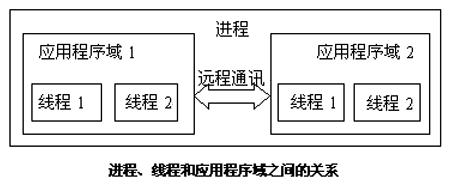
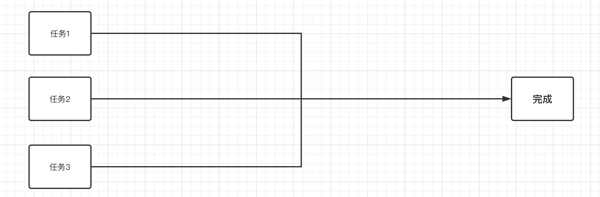
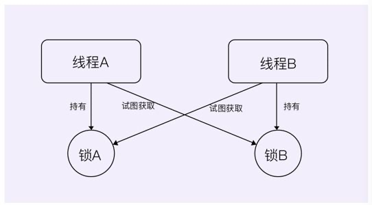
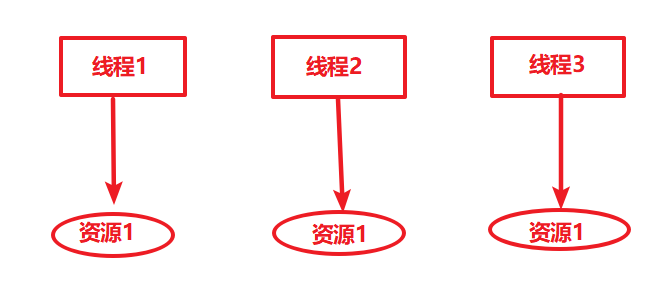

# 原子性

所谓的`原子性操作`即不可中断的操作，比如赋值操作

```java
int i = 5;
```

原子性操作本身是线程安全的
但是 i++ 这个行为，事实上是有3个原子性操作组成的。

- 步骤 1. 把i读取到用户空间
- 步骤 2. i + 1
- 步骤 3. 然后再把i写道内存空间

这三个步骤，每一步都是一个原子操作，但是合在一起，就不是原子操作。就不是线程安全的。
换句话说，一个线程在步骤1 取i的值结束后，还没有来得及进行步骤2，另一个线程也可以取i的值了。
i++ ，i--， i = i+1 这些都是非原子性操作。
`只有int i = 1,这个赋值操作是原子性的`，加减法都不是

### AtomicInteger

JDK6 以后，新增加了一个包java.util.concurrent.atomic，里面有各种原子类，比如AtomicInteger原子性整型数。
而`AtomicInteger`提供了各种自增，自减等方法，这些方法都是原子性的。 换句话说，自增方法 `incrementAndGet`是线程安全的，同一个时间，只有一个线程可以调用这个方法。

```java
package multiplethread;
   
import java.util.concurrent.atomic.AtomicInteger;
   
public class TestThread {
   
    public static void main(String[] args) throws InterruptedException {
        AtomicInteger atomicI = new AtomicInteger();
        int i = atomicI.decrementAndGet();
        int j = atomicI.incrementAndGet();
        int k = atomicI.addAndGet(3);	// k + 3
    }
}
```

### 原子操作测试

```java
package com.easylee.multithreading;

import java.util.concurrent.atomic.AtomicInteger;

/
 * @author easylee
 * @createTime 2022/3/27 07:59
 * @updateTime 2022/3/27 07:59
 * @Version 1.0.0
 */
public class Atomicity {
        // 创建普通int的变量
    private static int value = 0;
    // 创建原子对象
    private static AtomicInteger atomicValue = new AtomicInteger();
    public static void main(String[] args) {
        // 创建100000个线程
        int number = 100000;
        Thread[] ts1 = new Thread[number];
        for (int i = 0; i < number; i++) {
            Thread t = new Thread(()->{
                value++;
            });
            t.start();
            // 将已经启动的线程保存到线程数组中，当然这些线程已经启动过一次
            ts1[i] = t;
        }

        // 现在性能过快，可能值还是100000，但是有时候是999998或999999
        System.out.printf("%d个线程进行value++后，value的值变成:%d%n", number,value);

        Thread[] ts2 = new Thread[number];
        for (int i = 0; i < number; i++) {
            Thread t =new Thread(()->{
                atomicValue.incrementAndGet();
            });
            t.start();
            ts2[i] = t;
        }
        System.out.printf("%d个线程进行atomicValue.incrementAndGet();后，atomicValue的值变成:%d%n", number,atomicValue.intValue());
    }
}
```


# Java多线程

## 进程

在了解多线程之前，让我们回顾一下`操作系统`中提到的进程概念：


进程是程序执行的实体，每一个进程都是一个应用程序（比如我们运行QQ、浏览器、LOL、网易云音乐等软件），都有自己的内存空间，CPU一个核心同时只能处理一件事情，当出现多个进程需要同时运行时，CPU一般通过`时间片轮转调度`算法，来实现多个进程的同时运行。


在早期的计算机中，进程是拥有资源和独立运行的最小单位，也是程序执行的最小单位。但是，如果我希望两个任务(这两个任务执行是同一个程序的)同时进行，就必须运行两个进程，由于每个进程都有一个自己的内存空间，进程之间的通信就变得非常麻烦（比如要共享某些数据）而且执行不同进程会产生上下文切换，非常耗时，那么能否实现在一个进程中就能够执行多个任务呢？



## 线程

后来，线程横空出世，一个进程可以有多个线程，线程是程序执行中一个单一的顺序控制流程，现在线程才是程序执行流的最小单元，各个线程之间共享程序的内存空间（也就是所在进程的内存空间），上下文切换速度也高于进程。

在Java中，我们从开始，一直以来编写的都是单线程应用程序（运行`main()`方法的内容），也就是说只能同时执行一个任务（无论你是调用方法、还是进行计算，始终都是依次进行的，也就是同步的），而如果我们希望同时执行多个任务（两个方法同时在运行或者是两个计算同时在进行，也就是异步的），就需要用到Java多线程框架。实际上一个Java程序启动后，会创建很多线程，不仅仅只运行一个主线程：

```java
public static void main(String[] args) {
    ThreadMXBean bean = ManagementFactory.getThreadMXBean();
    long[] ids = bean.getAllThreadIds();
    ThreadInfo[] infos = bean.getThreadInfo(ids);
    for (ThreadInfo info : infos) {
        System.out.println(info.getThreadName());
    }
}
```

## 并行和并发

我们经常听到并发编程，那么这个并发代表的是什么意思呢？而与之相似的并行又是什么意思？它们之间有什么区别？

比如现在一共有三个工作需要我们去完成。


### 顺序执行

顺序执行其实很好理解，就是我们依次去将这些任务完成了：


实际上就是我们同一时间只能处理一个任务，所以需要前一个任务完成之后，才能继续下一个任务，依次完成所有任务。

### 并发执行

并发执行也是我们同一时间只能处理一个任务，但是我们可以每个任务轮着做（时间片轮转）：


只要我们单次处理分配的时间足够的短，在宏观看来，就是三个任务在同时进行。

而我们Java中的线程，正是这种机制，当我们需要同时处理上百个上千个任务时，很明显CPU的数量是不可能赶得上我们的线程数的，所以说这时就要求我们的程序有良好的并发性能，来应对同一时间大量的任务处理。**所以说，并发其实是时间片轮转执行的。**

### 并行执行

并行执行就突破了同一时间只能处理一个任务的限制，我们同一时间可以做多个任务：



比如我们要进行一些排序操作，就可以用到并行计算，只需要等待所有子任务完成，最后将结果汇总即可。包括分布式计算模型MapReduce，也是采用的并行计算思路。

## 线程的创建和启动

通过创建Thread对象来创建一个新的线程，Thread构造方法中需要传入一个Runnable接口的实现（其实就是编写要在另一个线程执行的内容逻辑）同时Runnable只有一个未实现方法，因此可以直接使用lambda表达式，lambda必须只有一个实现方法才可以使用：

```java
@FunctionalInterface
public interface Runnable {
    /**
     * When an object implementing interface <code>Runnable</code> is used
     * to create a thread, starting the thread causes the object's
     * <code>run</code> method to be called in that separately executing
     * thread.
     * <p>
     * The general contract of the method <code>run</code> is that it may
     * take any action whatsoever.
     *
     * @see     java.lang.Thread#run()
     */
    public abstract void run();
}
```

创建好后，通过调用`start()`方法来运行此线程：

```java
public static void main(String[] args) {
    Thread t = new Thread(() -> {    //直接编写逻辑
        System.out.println("我是另一个线程！");
    });
    t.start();   //调用此方法来开始执行此线程
}
```

可能上面的例子看起来和普通的单线程没两样，那我们先来看看下面这段代码的运行结果：

```java
public static void main(String[] args) {
    Thread t = new Thread(() -> {
        System.out.println("我是线程："+Thread.currentThread().getName());
        System.out.println("我正在计算 0-10000 之间所有数的和...");
        int sum = 0;
        for (int i = 0; i <= 10000; i++) {
            sum += i;
        }
        System.out.println("结果："+sum);
    });
    t.start();
    System.out.println("我是主线程！");
}
```

我们发现，这段代码执行输出结果并不是按照从上往下的顺序了，因为他们分别位于两个线程，他们是同时进行的！如果你还是觉得很疑惑，我们接着来看下面的代码运行结果：

```java
public static void main(String[] args) {
    Thread t1 = new Thread(() -> {
        for (int i = 0; i < 50; i++) {
            System.out.println("我是一号线程："+i);
        }
    });
    Thread t2 = new Thread(() -> {
        for (int i = 0; i < 50; i++) {
            System.out.println("我是二号线程："+i);
        }
    });
    t1.start();
    t2.start();
}
```

我们可以看到打印实际上是在交替进行的，也证明了他们是在同时运行！

> 我们发现还有一个run方法，也能执行线程里面定义的内容，但是run是直接在当前线程执行，并不是创建一个线程执行！


实际上，线程和进程差不多，也会等待获取CPU资源，一旦获取到，就开始按顺序执行我们给定的程序，当需要等待外部IO操作（比如Scanner获取输入的文本），就会暂时处于休眠状态，等待通知，或是调用`sleep()`方法来让当前线程休眠一段时间：

```java
public static void main(String[] args) throws InterruptedException {
    System.out.println("l");
    Thread.sleep(1000);    //休眠时间，以毫秒为单位，1000ms = 1s
    System.out.println("b");
    Thread.sleep(1000);
    System.out.println("w");
    Thread.sleep(1000);
    System.out.println("nb!");
}
```

我们也可以使用`stop()`方法来强行终止此线程：

```java
public static void main(String[] args) throws InterruptedException {
    Thread t = new Thread(() -> {
        Thread me = Thread.currentThread();   //获取当前线程对象
        for (int i = 0; i < 50; i++) {
            System.out.println("打印:"+i);
            if(i == 20) me.stop();  //此方法会直接终止此线程
        }
    });
    t.start();
}
```

虽然`stop()`方法能够终止此线程，但是并不是所推荐的做法，有关线程中断相关问题，我们会在后面继续了解。

**思考**：猜猜以下程序输出结果：

```java
private static int value = 0;

public static void main(String[] args) throws InterruptedException {
    Thread t1 = new Thread(() -> {
        for (int i = 0; i < 10000; i++) value++;
        System.out.println("线程1完成");
    });
    Thread t2 = new Thread(() -> {
        for (int i = 0; i < 10000; i++) value++;
        System.out.println("线程2完成");
    });
    t1.start();
    t2.start();
    Thread.sleep(1000);  //主线程停止1秒，保证两个线程执行完成
    System.out.println(value);
}

// 执行结果
//线程1完成
//线程2完成
//13135
```

我们发现，value最后的值并不是我们理想的结果，有关为什么会出现这种问题，在我们学习到线程锁的时候，再来讨论，这里简单说一下就是这个变量没有加锁，同时被两个线程操作，导致的异常

## 线程的休眠和中断

我们前面提到，一个线程处于运行状态下，线程的下一个状态会出现以下情况：

* 当CPU给予的运行时间结束时，会从运行状态回到就绪（可运行）状态，等待下一次获得CPU资源。
* 当线程进入休眠 / 阻塞(如等待IO请求) / 手动调用`wait()`方法时，会使得线程处于等待状态，当等待状态结束后会回到就绪状态。
* 当线程出现异常或错误 / 被`stop()` 方法强行停止 / 所有代码执行结束时，会使得线程的运行终止。

而这个部分我们着重了解一下线程的休眠和中断，首先我们来了解一下如何使得线程进入休眠状态：

```java
public static void main(String[] args) {
    Thread t = new Thread(() -> {
        try {
            System.out.println("l");
            Thread.sleep(1000);   //sleep方法是Thread的静态方法，它只作用于当前线程（它知道当前线程是哪个）
            System.out.println("b");    //调用sleep后，线程会直接进入到等待状态，直到时间结束
        } catch (InterruptedException e) {
            e.printStackTrace();
        }
    });
    t.start();
}
```

通过调用`sleep()`方法来将当前线程进入休眠，使得线程处于等待状态一段时间。我们发现，此方法显示声明了会抛出一个InterruptedException异常，那么这个异常在什么时候会发生呢？

```java
public static void main(String[] args) {
    Thread t = new Thread(() -> {
        try {
            Thread.sleep(10000);  //休眠10秒
        } catch (InterruptedException e) {
            e.printStackTrace();
        }
    });
    t.start();
    try {
        Thread.sleep(3000);   //休眠3秒，一定比线程t先醒来
        t.interrupt();   //调用t的interrupt方法
    } catch (InterruptedException e) {
        e.printStackTrace();
    }
}
```

我们发现，每一个Thread对象中，都有一个`interrupt()`方法，调用此方法后，会给指定线程添加一个中断标记以告知线程需要立即停止运行或是进行其他操作，由线程来响应此中断并进行相应的处理，我们前面提到的`stop()`方法是强制终止线程，这样的做法虽然简单粗暴，但是很有可能导致资源不能完全释放，而类似这样的发送通知来告知线程需要中断，**让线程自行处理后续，会更加合理一些，也是更加推荐的做法**。我们来看看interrupt的用法：

```java
public static void main(String[] args) {
    Thread t = new Thread(() -> {
        System.out.println("线程开始运行！");
        while (true){   //无限循环
            if(Thread.currentThread().isInterrupted()){   //判断是否存在中断标志
                break;   //响应中断
            }
        }
        System.out.println("线程被中断了！");
    });
    t.start();
    try {
        Thread.sleep(3000);   //休眠3秒，一定比线程t先醒来
        t.interrupt();   //调用t的interrupt方法
    } catch (InterruptedException e) {
        e.printStackTrace();
    }
}
```

通过`isInterrupted()`可以判断线程是否存在中断标志，如果存在，说明外部希望当前线程立即停止，也有可能是给当前线程发送一个其他的信号，如果我们并不是希望收到中断信号就是结束程序，而是通知程序做其他事情，我们可以在收到中断信号后，复位中断标记，然后继续做我们的事情：

```java
public static void main(String[] args) {
    Thread t = new Thread(() -> {
        System.out.println("线程开始运行！");
        while (true){
            if(Thread.currentThread().isInterrupted()){   //判断是否存在中断标志
                System.out.println("发现中断信号，复位，继续运行...");
                Thread.interrupted();  //复位中断标记，注意是interrupted ed方法
            }
        }
    });
    t.start();
    try {
        Thread.sleep(3000);   //休眠3秒，一定比线程t先醒来
        t.interrupt();   //调用t的interrupt方法
    } catch (InterruptedException e) {
        e.printStackTrace();
    }
}
```

复位中断标记后，会立即清除中断标记。那么，如果现在我们想暂停线程呢？我们希望线程暂时停下，比如等待其他线程执行完成后，再继续运行，那这样的操作怎么实现呢？

```java
public static void main(String[] args) {
    Thread t = new Thread(() -> {
        System.out.println("线程开始运行！");
        Thread.currentThread().suspend();   //暂停此线程
        System.out.println("线程继续运行！");
    });
    t.start();
    try {
        Thread.sleep(3000);   //休眠3秒，一定比线程t先醒来
        t.resume();   //恢复此线程
    } catch (InterruptedException e) {
        e.printStackTrace();
    }
}
```

虽然这样很方便地控制了线程的暂停状态，但是这两个方法我们发现实际上也是**不推荐的做法**，它很容易导致死锁！有关为什么被弃用的原因，我们会在线程锁继续探讨。

## 线程的优先级

实际上，Java程序中的每个线程并不是平均分配CPU时间的，为了使得线程资源分配更加合理，Java采用的是抢占式调度方式，优先级越高的线程，优先使用CPU资源！我们希望CPU花费更多的时间去处理更重要的任务，而不太重要的任务，则可以先让出一部分资源。线程的优先级一般分为以下三种：

* MIN_PRIORITY   最低优先级
* MAX_PRIORITY   最高优先级
* NOM_PRIORITY  常规优先级

```java
public static void main(String[] args) {
    Thread t = new Thread(() -> {
        System.out.println("线程开始运行！");
    });
    t.start();
    t.setPriority(Thread.MIN_PRIORITY);  //通过使用setPriority方法来设定优先级
}
```

优先级越高的线程，获得CPU资源的概率会越大，并不是说一定优先级越高的线程越先执行！

## 线程的礼让和加入

我们还可以在当前线程的工作不重要时，将CPU资源让位给其他线程，通过使用`yield()`方法来将当前资源让位给其他同优先级线程：

```java
public static void main(String[] args) {
    Thread t1 = new Thread(() -> {
        System.out.println("线程1开始运行！");
        for (int i = 0; i < 50; i++) {
            if(i % 5 == 0) {
                System.out.println("让位！");
                Thread.yield();
            }
            System.out.println("1打印："+i);
        }
        System.out.println("线程1结束！");
    });
    Thread t2 = new Thread(() -> {
        System.out.println("线程2开始运行！");
        for (int i = 0; i < 50; i++) {
            System.out.println("2打印："+i);
        }
    });
    t1.start();
    t2.start();
}
```

观察结果，我们发现，在让位之后，尽可能多的在执行线程2的内容。

当我们希望一个线程等待另一个线程执行完成后再继续进行，我们可以使用`join()`方法来实现线程的加入：

```java
public static void main(String[] args) {
    Thread t1 = new Thread(() -> {
        System.out.println("线程1开始运行！");
        for (int i = 0; i < 50; i++) {
            System.out.println("1打印："+i);
        }
        System.out.println("线程1结束！");
    });
    Thread t2 = new Thread(() -> {
        System.out.println("线程2开始运行！");
        for (int i = 0; i < 50; i++) {
            System.out.println("2打印："+i);
            if(i == 10){
                try {
                    System.out.println("线程1加入到此线程！");
                    t1.join();    //在i==10时，让线程1加入，先完成线程1的内容，再继续当前内容
                } catch (InterruptedException e) {
                    e.printStackTrace();
                }
            }
        }
    });
    t1.start();
    t2.start();
}
```

我们发现，线程1加入后，线程2等待线程1待执行的内容全部执行完成之后，再继续执行的线程2内容。注意，线程的加入只是等待另一个线程的完成，并不是将另一个线程和当前线程合并！

## 线程锁和线程同步

在开始讲解线程同步之前，我们需要先了解一下多线程情况下Java的内存管理：


线程之间的共享变量存储在主内存（main memory）中，每个线程都有一个私有的工作内存（本地内存），工作内存中存储了该线程共享变量的副本。

高速缓存通过保存内存中数据的副本来提供更加快速的数据访问，但是如果多个处理器的运算任务都涉及同一块内存区域，比如操作同一变量，就可能导致各自的高速缓存数据不一致，在写回主内存时就会发生冲突，这就是引入高速缓存引发的新问题，称之为：缓存一致性。

当我们同时去操作一个共享变量时，如果仅仅是读取还好，但是如果同时写入内容，就会出现问题！

### 悬念破案

我们再来回顾一下之前留给大家的悬念：

```java
private static int value = 0;

public static void main(String[] args) throws InterruptedException {
    Thread t1 = new Thread(() -> {
        for (int i = 0; i < 10000; i++) value++;
        System.out.println("线程1完成");
    });
    Thread t2 = new Thread(() -> {
        for (int i = 0; i < 10000; i++) value++;
        System.out.println("线程2完成");
    });
    t1.start();
    t2.start();
    Thread.sleep(1000);  //主线程停止1秒，保证两个线程执行完成
    System.out.println(value);
}
```

实际上，当两个线程同时读取value的时候，可能会同时拿到同样的值，而进行自增操作之后，也是同样的值，再写回主内存后，本来应该进行2次自增操作，实际上只执行了一次！


那么要去解决这样的问题，我们就必须采取某种同步机制，来限制不同线程对于共享变量的访问！我们希望的是保证共享变量value自增操作的原子性。

### 线程锁

通过synchronized关键字来创造一个线程锁，首先我们来认识一下synchronized代码块，它需要在括号中填入一个内容，必须是一个对象或是一个类，我们在value自增操作外套上同步代码块：

```java
private static int value = 0;

public static void main(String[] args) throws InterruptedException {
    Thread t1 = new Thread(() -> {
        for (int i = 0; i < 10000; i++) {
            synchronized (Main.class){
                value++;
            }
        }
        System.out.println("线程1完成");
    });
    Thread t2 = new Thread(() -> {
        for (int i = 0; i < 10000; i++) {
            synchronized (Main.class){
                value++;
            }
        }
        System.out.println("线程2完成");
    });
    t1.start();
    t2.start();
    Thread.sleep(1000);  //主线程停止1秒，保证两个线程执行完成
    System.out.println(value);
}
```

我们发现，现在得到的结果就是我们想要的内容了，因为在同步代码块执行过程中，拿到了我们传入对象或类的锁（传入的如果是对象，就是对象锁，不同的对象代表不同的对象锁，如果是类，就是类锁，类锁只有一个，实际上类锁也是对象锁，是Class类实例，但是Class类实例同样的类无论怎么获取都是同一个），但是注意两个线程必须使用同一把锁！

当一个线程进入到同步代码块时，会获取到当前的锁，而这时如果其他使用同样的锁的同步代码块也想执行内容，就必须等待当前同步代码块的内容执行完毕，在执行完毕后会自动释放这把锁，而其他的线程才能拿到这把锁并开始执行同步代码块里面的内容。（实际上synchronized是一种悲观锁，随时都认为有其他线程在对数据进行修改，后面有机会我们还会讲到乐观锁，如CAS算法）

那么我们来看看，如果使用的是不同对象的锁，那么还能顺利进行吗？

```java
private static int value = 0;

public static void main(String[] args) throws InterruptedException {
    Main main1 = new Main();
    Main main2 = new Main();
    Thread t1 = new Thread(() -> {
        for (int i = 0; i < 10000; i++) {
            synchronized (main1){
                value++;
            }
        }
        System.out.println("线程1完成");
    });
    Thread t2 = new Thread(() -> {
        for (int i = 0; i < 10000; i++) {
            synchronized (main2){
                value++;
            }
        }
        System.out.println("线程2完成");
    });
    t1.start();
    t2.start();
    Thread.sleep(1000);  //主线程停止1秒，保证两个线程执行完成
    System.out.println(value);
}
```

当对象不同时，获取到的是不同的锁，因此并不能保证自增操作的原子性，最后也得不到我们想要的结果。

synchronized关键字也可以作用于方法上，调用此方法时也会获取锁：

```java
private static int value = 0;

private static synchronized void add(){
    value++;
}

public static void main(String[] args) throws InterruptedException {
    Thread t1 = new Thread(() -> {
        for (int i = 0; i < 10000; i++) add();
        System.out.println("线程1完成");
    });
    Thread t2 = new Thread(() -> {
        for (int i = 0; i < 10000; i++) add();
        System.out.println("线程2完成");
    });
    t1.start();
    t2.start();
    Thread.sleep(1000);  //主线程停止1秒，保证两个线程执行完成
    System.out.println(value);
}
```

我们发现实际上效果是相同的，只不过这个锁不用你去给，如果是静态方法，就是使用的类锁，而如果是普通成员方法，就是使用的对象锁。通过灵活的使用synchronized就能很好地解决我们之前提到的问题了！

### 死锁

其实死锁的概念在`操作系统`中也有提及，它是指两个线程相互持有对方需要的锁，但是又迟迟不释放，导致程序卡住：



我们发现，线程A和线程B都需要对方的锁，但是又被对方牢牢把握，由于线程被无限期地阻塞，因此程序不可能正常终止。我们来看看以下这段代码会得到什么结果：

```java
public static void main(String[] args) throws InterruptedException {
    Object o1 = new Object();
    Object o2 = new Object();
    Thread t1 = new Thread(() -> {
        synchronized (o1){
            try {
                Thread.sleep(1000);
                synchronized (o2){
                    System.out.println("线程1");
                }
            } catch (InterruptedException e) {
                e.printStackTrace();
            }
        }
    });
    Thread t2 = new Thread(() -> {
        synchronized (o2){
            try {
                Thread.sleep(1000);
                synchronized (o1){
                    System.out.println("线程2");
                }
            } catch (InterruptedException e) {
                e.printStackTrace();
            }
        }
    });
    t1.start();
    t2.start();
}
```

那么我们如何去检测死锁呢？我们可以利用jstack命令来检测死锁，首先利用jps找到我们的java进程：

```shell
nagocoler@NagodeMacBook-Pro ~ % jps
51592 Launcher
51690 Jps
14955 
51693 Main
nagocoler@NagodeMacBook-Pro ~ % jstack 51693
...
Java stack information for the threads listed above:
===================================================
"Thread-1":
	at com.test.Main.lambda$main$1(Main.java:46)
	- waiting to lock <0x000000076ad27fc0> (a java.lang.Object)
	- locked <0x000000076ad27fd0> (a java.lang.Object)
	at com.test.Main$$Lambda$2/1867750575.run(Unknown Source)
	at java.lang.Thread.run(Thread.java:748)
"Thread-0":
	at com.test.Main.lambda$main$0(Main.java:34)
	- waiting to lock <0x000000076ad27fd0> (a java.lang.Object)
	- locked <0x000000076ad27fc0> (a java.lang.Object)
	at com.test.Main$$Lambda$1/396873410.run(Unknown Source)
	at java.lang.Thread.run(Thread.java:748)

Found 1 deadlock.
```

jstack自动帮助我们找到了一个死锁，并打印出了相关线程的栈追踪信息。

不推荐使用 `suspend() `去挂起线程的原因，是因为` suspend() `在使线程暂停的同时，并不会去释放任何锁资源。其他线程都无法访问被它占用的锁。直到对应的线程执行` resume() `方法后，被挂起的线程才能继续，从而其它被阻塞在这个锁的线程才可以继续执行。但是，如果` resume() `操作出现在` suspend() `之前执行，那么线程将一直处于挂起状态，同时一直占用锁，这就产生了死锁。

### wait和notify方法

其实我们之前可能就发现了，Object类还有三个方法我们从来没有使用过，分别是`wait()`、`notify()`以及`notifyAll()`，他们其实是需要配合synchronized来使用的，只有在同步代码块中才能使用这些方法，我们来看看他们的作用是什么：

```java
public static void main(String[] args) throws InterruptedException {
    Object o1 = new Object();
    Thread t1 = new Thread(() -> {
        synchronized (o1){
            try {
                System.out.println("开始等待");
                o1.wait();     //进入等待状态并释放锁
                System.out.println("等待结束！");
            } catch (InterruptedException e) {
                e.printStackTrace();
            }
        }
    });
    Thread t2 = new Thread(() -> {
        synchronized (o1){
            System.out.println("开始唤醒！");
            o1.notify();     //唤醒处于等待状态的线程
          	for (int i = 0; i < 50; i++) {
               	System.out.println(i);   
            }
          	//唤醒后依然需要等待这里的锁释放之前等待的线程才能继续
        }
    });
    t1.start();
    Thread.sleep(1000);
    t2.start();
}
```

我们可以发现，对象的`wait()`方法会暂时使得此线程进入等待状态，同时会释放当前代码块持有的锁，这时其他线程可以获取到此对象的锁，当其他线程调用对象的`notify()`方法后，会唤醒刚才变成等待状态的线程（这时并没有立即释放锁）。注意，必须是在持有锁（同步代码块内部）的情况下使用，否则会抛出异常！

notifyAll其实和notify一样，也是用于唤醒，但是前者是唤醒所有调用`wait()`后处于等待的线程，而后者是看运气随机选择一个。

### synchronized 同步对象

synchronized表示独占当前对象，其它线程只能等待

```java
Synchronization_ synchronization_ = new Synchronization_();
// 同步对象,将synchronization_设为同步对象
synchronized (synchronization_) {
	synchronization_.add();	
}
```

将一个方法设置为synchronized，那么这个方法操作的对象自动就是独占的

```java
public synchronized void add() {
    volumn++;
}
```

如果一个类都是线程独占的方法，那么就是同步类

### lock同步对象

与synchronized类似的，lock也能够达到同步的效果

当一个线程占用 synchronized 同步对象，其他线程就不能占用了，直到释放这个同步对象为止

与 `synchronized (someObject)`类似的，`lock()`方法，表示当前线程占用lock对象，一旦占用，其他线程就不能占用了。

与 synchronized 不同的是，一旦synchronized 块结束，就会自动释放对someObject的占用。 lock却必须调用`unlock`方法进行手动释放，为了保证释放的执行，往往会把unlock() 放在finally中进行。

```java
public class TestThread {
    public static void main(String[] args) {
        Cat cat = new Cat();
        new Thread(cat, "小狗").start();
        new Thread(cat, "小猫").start();
    }

}
class Cat implements Runnable {
    public String name = "cat";
    // 必须在需要创建lock锁的对象中，首先有这个成员，必须是对象的成员
    private Lock lock = new ReentrantLock();

    @Override
    public void run() {
        try {
            // lock成员不能在这里声明，否者就不是对象的成员了
            // lock表示独占当前这个对象，其它线程无法占用
            lock.lock();
            for (int i = 0; i < 10; i++) {
                try {
                    Thread.sleep(1000);
                } catch (InterruptedException e) {
                    e.printStackTrace();
                }
                this.name = Thread.currentThread().getName();
                System.out.println(this.name);
            }
        } finally {
            // 不解锁，将一直无法使用
            lock.unlock();
        }
    }
}
```

同时lock还提供了一个trylock方法，在指定时间范围内`试图占用`，占用不到就拉倒

```java
locked = lock.tryLock(1,TimeUnit.SECONDS);
```

### ThreadLocal的使用

既然每个线程都有一个自己的工作内存，那么能否只在自己的工作内存中创建变量仅供线程自己使用呢？



我们可以是ThreadLocal类，来创建工作内存中的变量，它将我们的变量值存储在内部（只能存储一个变量），不同的变量访问到ThreadLocal对象时，都只能获取到自己线程所属的变量。

```java
public static void main(String[] args) throws InterruptedException {
    ThreadLocal<String> local = new ThreadLocal<>();  //注意这是一个泛型类，存储类型为我们要存放的变量类型
    Thread t1 = new Thread(() -> {
        local.set("lbwnb");   //将变量的值给予ThreadLocal
        System.out.println("变量值已设定！");
        System.out.println(local.get());   //尝试获取ThreadLocal中存放的变量
    });
    Thread t2 = new Thread(() -> {
        System.out.println(local.get());   //尝试获取ThreadLocal中存放的变量
    });
    t1.start();
    Thread.sleep(3000);    //间隔三秒
    t2.start();
}
```

上面的例子中，我们开启两个线程分别去访问ThreadLocal对象，我们发现，第一个线程存放的内容，第一个线程可以获取，但是第二个线程无法获取，我们再来看看第一个线程存入后，第二个线程也存放，是否会覆盖第一个线程存放的内容：

```java
public static void main(String[] args) throws InterruptedException {
    ThreadLocal<String> local = new ThreadLocal<>();  //注意这是一个泛型类，存储类型为我们要存放的变量类型
    Thread t1 = new Thread(() -> {
        local.set("lbwnb");   //将变量的值给予ThreadLocal
        System.out.println("线程1变量值已设定！");
        try {
            Thread.sleep(2000);    //间隔2秒
        } catch (InterruptedException e) {
            e.printStackTrace();
        }
        System.out.println("线程1读取变量值：");
        System.out.println(local.get());   //尝试获取ThreadLocal中存放的变量
    });
    Thread t2 = new Thread(() -> {
        local.set("yyds");   //将变量的值给予ThreadLocal
        System.out.println("线程2变量值已设定！");
    });
    t1.start();
    Thread.sleep(1000);    //间隔1秒
    t2.start();
}
```

我们发现，即使线程2重新设定了值，也没有影响到线程1存放的值，所以说，不同线程向ThreadLocal存放数据，只会存放在线程自己的工作空间中，而不会直接存放到主内存中，因此各个线程直接存放的内容互不干扰。

我们发现在线程中创建的子线程，无法获得父线程工作内存中的变量：

```java
public static void main(String[] args) {
    ThreadLocal<String> local = new ThreadLocal<>();
    Thread t = new Thread(() -> {
       local.set("lbwnb");
        new Thread(() -> {
            System.out.println(local.get());
        }).start();
    });
    t.start();
}
```

我们可以使用InheritableThreadLocal来解决：

```java
public static void main(String[] args) {
    ThreadLocal<String> local = new InheritableThreadLocal<>();
    Thread t = new Thread(() -> {
       local.set("lbwnb");
        new Thread(() -> {
            System.out.println(local.get());
        }).start();
    });
    t.start();
}
```

在InheritableThreadLocal存放的内容，会自动向子线程传递。

## 定时器

我们有时候会有这样的需求，我希望定时执行任务，比如3秒后执行，其实我们可以通过使用`Thread.sleep()`来实现：

```java
public static void main(String[] args) {
    new TimerTask(() -> System.out.println("我是定时任务！"), 3000).start();   //创建并启动此定时任务
}

static class TimerTask{
    Runnable task;
    long time;

    public TimerTask(Runnable runnable, long time){
        this.task = runnable;
        this.time = time;
    }

    public void start(){
        new Thread(() -> {
            try {
                Thread.sleep(time);
                task.run();   //休眠后再运行
            } catch (InterruptedException e) {
                e.printStackTrace();
            }
        }).start();
    }
}
```

我们通过自行封装一个TimerTask类，并在启动时，先休眠3秒钟，再执行我们传入的内容。那么现在我们希望，能否循环执行一个任务呢？比如我希望每隔1秒钟执行一次代码，这样该怎么做呢？

```java
public static void main(String[] args) {
    new TimerLoopTask(() -> System.out.println("我是定时任务！"), 3000).start();   //创建并启动此定时任务
}

static class TimerLoopTask{
    Runnable task;
    long loopTime;

    public TimerLoopTask(Runnable runnable, long loopTime){
        this.task = runnable;
        this.loopTime = loopTime;
    }

    public void start(){
        new Thread(() -> {
            try {
                while (true){   //无限循环执行
                    Thread.sleep(loopTime);
                    task.run();   //休眠后再运行
                }
            } catch (InterruptedException e) {
                e.printStackTrace();
            }
        }).start();
    }
}
```

现在我们将单次执行放入到一个无限循环中，这样就能一直执行了，并且按照我们的间隔时间进行。

但是终究是我们自己实现，可能很多方面还没考虑到，Java也为我们提供了一套自己的框架用于处理定时任务：

```java
public static void main(String[] args) {
    Timer timer = new Timer();    //创建定时器对象
    timer.schedule(new TimerTask() {   //注意这个是一个抽象类，不是接口，无法使用lambda表达式简化，只能使用匿名内部类
        @Override
        public void run() {
            System.out.println(Thread.currentThread().getName());    //打印当前线程名称
        }
    }, 1000);    //执行一个延时任务
}
```

我们可以通过创建一个Timer类来让它进行定时任务调度，我们可以通过此对象来创建任意类型的定时任务，包延时任务、循环定时任务等。我们发现，虽然任务执行完成了，但是我们的程序并没有停止，这是因为Timer内存维护了一个任务队列和一个工作线程：

```java
public class Timer {
    /**
     * The timer task queue.  This data structure is shared with the timer
     * thread.  The timer produces tasks, via its various schedule calls,
     * and the timer thread consumes, executing timer tasks as appropriate,
     * and removing them from the queue when they're obsolete.
     */
    private final TaskQueue queue = new TaskQueue();

    /**
     * The timer thread.
     */
    private final TimerThread thread = new TimerThread(queue);
  
		...
}
```

TimerThread继承自Thread，是一个新创建的线程，在构造时自动启动：

```java
public Timer(String name) {
    thread.setName(name);
    thread.start();
}
```

而它的run方法会循环地读取队列中是否还有任务，如果有任务依次执行，没有的话就暂时处于休眠状态：

```java
public void run() {
    try {
        mainLoop();
    } finally {
        // Someone killed this Thread, behave as if Timer cancelled
        synchronized(queue) {
            newTasksMayBeScheduled = false;
            queue.clear();  // Eliminate obsolete references
        }
    }
}

/**
 * The main timer loop.  (See class comment.)
 */
private void mainLoop() {
  try {
       TimerTask task;
       boolean taskFired;
       synchronized(queue) {
         	// Wait for queue to become non-empty
          while (queue.isEmpty() && newTasksMayBeScheduled)   //当队列为空同时没有被关闭时，会调用wait()方法暂时处于等待状态，当有新的任务时，会被唤醒。
                queue.wait();
          if (queue.isEmpty())
             break;    //当被唤醒后都没有任务时，就会结束循环，也就是结束工作线程
                      ...
}
```

`newTasksMayBeScheduled`实际上就是标记当前定时器是否关闭，当它为false时，表示已经不会再有新的任务到来，也就是关闭，我们可以通过调用`cancel()`方法来关闭它的工作线程：

```java
public void cancel() {
    synchronized(queue) {
        thread.newTasksMayBeScheduled = false;
        queue.clear();
        queue.notify();  //唤醒wait使得工作线程结束
    }
}
```

因此，我们可以在使用完成后，调用Timer的`cancel()`方法以正常退出我们的程序：

```java
public static void main(String[] args) {
    Timer timer = new Timer();
    timer.schedule(new TimerTask() {
        @Override
        public void run() {
            System.out.println(Thread.currentThread().getName());
            timer.cancel();  //结束
        }
    }, 1000);
}
```

## 守护线程

不要把守护进程和守护线程相提并论！守护进程在后台运行运行，不需要和用户交互，本质和普通进程类似。而守护线程就不一样了，当其他所有的非守护线程结束之后，守护线程是自动结束，也就是说，Java中所有的线程都执行完毕后，守护线程自动结束，因此守护线程不适合进行IO操作，只适合打打杂：

```java
public static void main(String[] args) throws InterruptedException{
    Thread t = new Thread(() -> {
        while (true){
            try {
                System.out.println("程序正常运行中...");
                Thread.sleep(1000);
            } catch (InterruptedException e) {
                e.printStackTrace();
            }
        }
    });
    t.setDaemon(true);   //设置为守护线程（必须在开始之前，中途是不允许转换的）
    t.start();
    for (int i = 0; i < 5; i++) {
        Thread.sleep(1000);
    }
}
```

在守护线程中产生的新线程也是守护的：

```java
public static void main(String[] args) throws InterruptedException{
    Thread t = new Thread(() -> {
        Thread it = new Thread(() -> {
            while (true){
                try {
                    System.out.println("程序正常运行中...");
                    Thread.sleep(1000);
                } catch (InterruptedException e) {
                    e.printStackTrace();
                }
            }
        });
        it.start();
    });
    t.setDaemon(true);   //设置为守护线程（必须在开始之前，中途是不允许转换的）
    t.start();
    for (int i = 0; i < 5; i++) {
        Thread.sleep(1000);
    }
}
```

## 再谈集合类并行方法

其实我们之前在讲解集合类的根接口时，就发现有这样一个方法：

```java
default Stream<E> parallelStream() {
    return StreamSupport.stream(spliterator(), true);
}
```

并行流，其实就是一个多线程执行的流，它通过默认的ForkJoinPool实现（这里不讲解原理），它可以提高你的多线程任务的速度。

```java
public static void main(String[] args) {
    List<Integer> list = new ArrayList<>(Arrays.asList(1, 4, 5, 2, 9, 3, 6, 0));
    list
            .parallelStream()    //获得并行流
            .forEach(i -> System.out.println(Thread.currentThread().getName()+" -> "+i));
}
```

我们发现，forEach操作的顺序，并不是我们实际List中的顺序，同时每次打印也是不同的线程在执行！我们可以通过调用`forEachOrdered()`方法来使用单线程维持原本的顺序：

```java
public static void main(String[] args) {
    List<Integer> list = new ArrayList<>(Arrays.asList(1, 4, 5, 2, 9, 3, 6, 0));
    list
            .parallelStream()    //获得并行流
            .forEachOrdered(System.out::println);
}
```

我们之前还发现，在Arrays数组工具类中，也包含大量的并行方法：

```java
public static void main(String[] args) {
    int[] arr = new int[]{1, 4, 5, 2, 9, 3, 6, 0};
    Arrays.parallelSort(arr);   //使用多线程进行并行排序，效率更高
    System.out.println(Arrays.toString(arr));
}
```

更多地使用并行方法，可以更加充分地发挥现代计算机多核心的优势，但是同时需要注意多线程产生的异步问题！

```java
public static void main(String[] args) {
    int[] arr = new int[]{1, 4, 5, 2, 9, 3, 6, 0};
    Arrays.parallelSetAll(arr, i -> {
        System.out.println(Thread.currentThread().getName());
        return arr[i];
    });
    System.out.println(Arrays.toString(arr));
}
```

# 线程池

当需要创建大量的线程进行业务时，重复的创建销毁会浪费大量的开销，所以需要线程池来进行线程管理，对线程进行重复使用

### 设计原理

准备一个任务容器

 一次性启动10个 消费者线程

刚开始任务容器是空的，所以线程都`wait`在上面

直到一个外部线程往这个任务容器中扔了一个任务，就会有一个消费者线程被唤醒`notify`

这个消费者线程取出任务，并且执行这个任务，执行完毕后，继续等待下一次任务的到来。

如果短时间内，有较多的任务加入，那么就会有多个线程被唤醒，去执行这些任务。

在整个过程中，都不需要创建新的线程，而是`循环使用这些已经存在的线程`

### 自定义线程池

创建任务

```java
package com.easylee.multithreading;

public class TestThread {
    public static void main(String[] args) {
        // 1.创建线程池
        ThreadPool pool = new ThreadPool();

        // 2.创建了5个任务
        for (int i = 0; i < 5; i++) {
            // 将任务添加到线程池，然后让线程池里的线程分别处理这五个任务
            pool.add(new Runnable() {
                @Override
                public void run() {
                    System.out.println("正在执行任务");
                }
            });

            try {
                Thread.sleep(1000);
            } catch (InterruptedException e) {
                // TODO Auto-generated catch block
                e.printStackTrace();
            }
        }

    }

}
```

线程池设计

```java
package com.easylee.multithreading;

import java.util.LinkedList;

public class ThreadPool {

    // 线程池大小
    int threadPoolSize;

    // 任务容器，这个是存放任务的容器，线程池独立开来的
    LinkedList<Runnable> tasks = new LinkedList<Runnable>();

    // 1.1 创建线程池
    public ThreadPool() {
        threadPoolSize = 10;

        // 启动10个任务消费者线程，创建后就是闲置等待状态
        // 基于锁定tasks的线程，不会让tasks中资源同时被多个线程操作
        synchronized (tasks) {
            for (int i = 0; i < threadPoolSize; i++) {
                // 创建具体的每个线程池中的线程
                new TaskConsumeThread("任务消费者线程 " + i).start();
            }
        }
    }
  
    // 1.2 消费者线程
    class TaskConsumeThread extends Thread {
        public TaskConsumeThread(String name) {
            super(name);
        }

        // 线程池中具体的某个任务
        Runnable task;

        public void run() {
            System.out.println("启动： " + this.getName());
            while (true) {
                synchronized (tasks) {
                    // 没有任务时，将线程任务池全部置为闲置
                    // 如果一直没有任务，将一直保持等待状态，并在此while循环
                    // 10个线程，就表示有10个线程在闲置在此处并循环
                    while (tasks.isEmpty()) {
                        try {
                          // 等待中，释放task对象，后面的代码就不会执行了，包括这个自己这个while，notifyAll之后才会继续执行while
                            tasks.wait();
                        } catch (InterruptedException e) {
                            // TODO Auto-generated catch block
                            e.printStackTrace();
                        }
                    }
                    // 当没有任务时，下面的代码都不会执行

                    // 当添加任务后，上面的代码不执行了，执行下面的代码完成任务
                    // 2.3 获取最后一个任务
                    task = tasks.removeLast();
                }
                System.out.println(this.getName() + " 获取到任务，并执行");
                task.run();
                // 执行完成后又继续返回上面开始等待
            }
        }
    }

    // 2.1 将任务添加到任务容器中，并通知线程池中所有线程唤醒
    public void add(Runnable r) {
        synchronized (tasks) {
            // 添加到任务容器中，但是线程还是等待中
            tasks.add(r);
            // 2.2 唤醒等待的任务消费者线程，让其继续执行后面的代码
            // 这里一唤醒，整个10个线程都被唤醒，继续执行其while
            tasks.notifyAll();
        }
    }

}
```

注意

等待永远是基于对象的线程等待，就是等待在这个对象上的线程，这个线程是在等待这个对象可以使用

当然这个对象不可以使用，那么基于这个对象的线程也就没有作用，闲置，只有这个对象被唤醒，这些线程才被唤醒

### java自带线程池

java提供自带的线程池，而不需要自己去开发一个自定义线程池了。

线程池类ThreadPoolExecutor在包java.util.concurrent下

```java
ThreadPoolExecutor threadPool= new ThreadPoolExecutor(10, 15, 60, TimeUnit.SECONDS, new LinkedBlockingQueue<Runnable>());
```

第一个参数10 表示这个线程池初始化了10个线程在里面工作

第二个参数15 表示如果10个线程不够用了，就会自动增加到最多15个线程

第三个参数60 结合第四个参数TimeUnit.SECONDS，表示经过60秒，多出来的线程还没有接到活儿，就会回收，最后保持池子里就10个
第四个参数TimeUnit.SECONDS 如上
第五个参数 new LinkedBlockingQueue() 用来放任务的集合

execute方法用于添加新的任务，独立于LinkedBlockingQueue集合任务的任务

```java
package multiplethread;

import java.util.concurrent.LinkedBlockingQueue;
import java.util.concurrent.ThreadPoolExecutor;
import java.util.concurrent.TimeUnit;

public class TestThread {
  public static void main(String[] args) throws InterruptedException {
      ThreadPoolExecutor threadPool= new ThreadPoolExecutor(10, 15, 60, TimeUnit.SECONDS, new LinkedBlockingQueue<Runnable>());

      threadPool.execute(new Runnable(){
          @Override
          public void run() {
              // TODO Auto-generated method stub
              System.out.println("任务1");
          }

      });
   
	}
}
```


# 