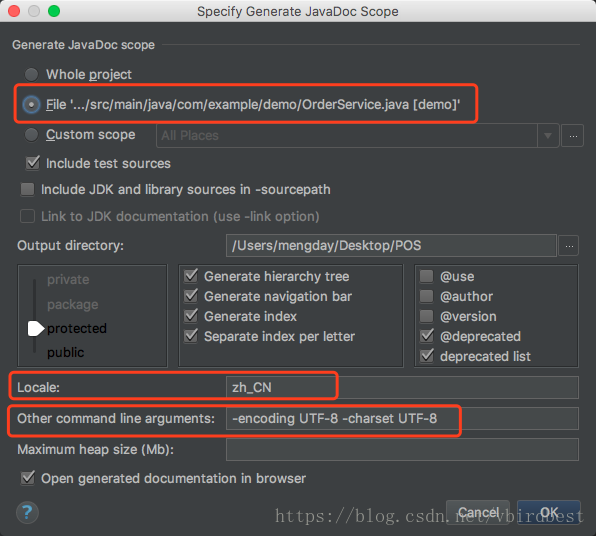
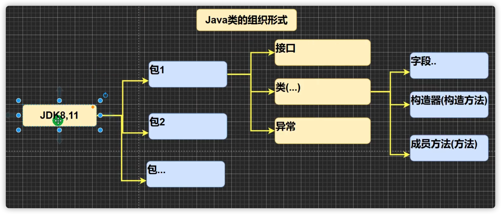
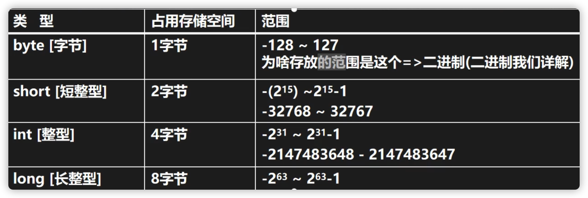
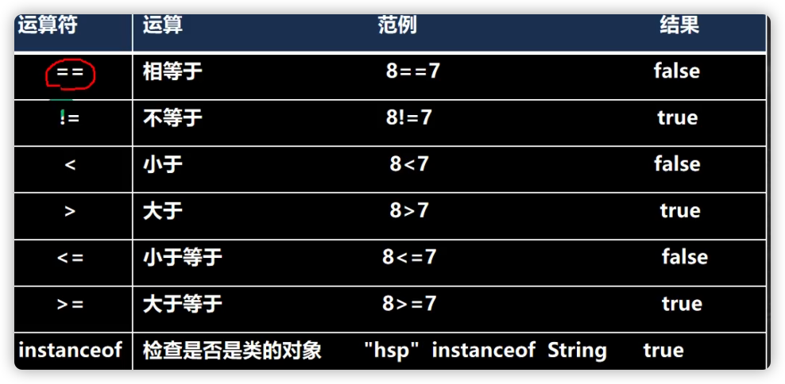
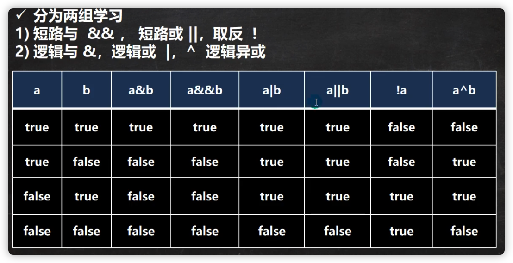
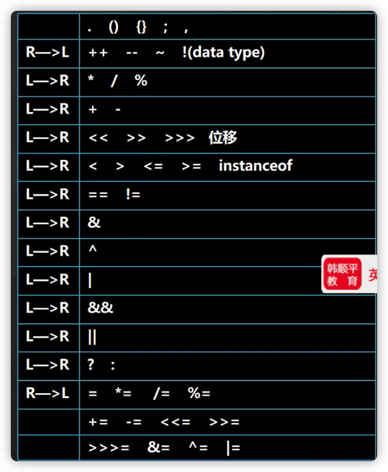
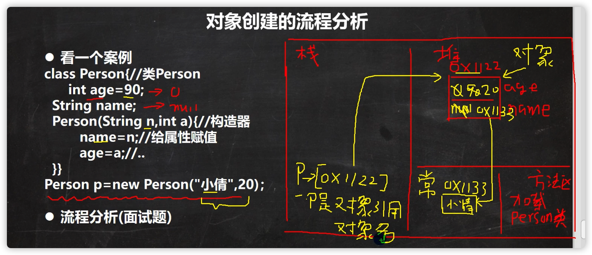
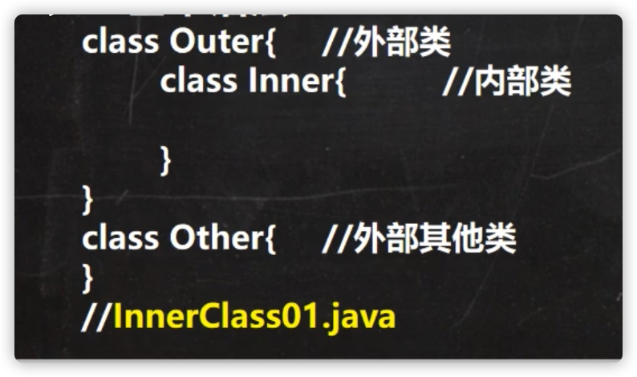

# java概述

## java特点

### Java使用版本

- java8：LTS长期支持版本，更常用
- java11：LTS长期支持版本，推荐使用，目前大多数公司使用
- 其它最新的版本：NON-LTS，里面含有一些更新的功能，但是java官方不长期维护，让特定的使用者自己维护，所以通常还是使用java LTS版本最佳

### Java标准版

- Java SE：标准版，基础版，但提供了完整的核心api
- Java EE：企业版，增加了一系列企业级api，公司常用，但是同样要以Java SE为基础
- Java ME：小型版，手机应用，目前基本使用android替代

### Java重要特点

- 面向对象
- 健壮性：强类型机制、异常处理、垃圾自动收集
- 跨平台：在不同平台安装java的虚拟机，一份代码就可以多个平台运行
- 解释型语言：用虚拟机解释执行

### Java开发工具

推荐前期使用vscode手写，后期使用idea

### Java运行过程

编写Java源代码，使用javac程序编译成.class文件，然后使用jvm虚拟机解释执行

### JDK和JRE

JDK = JRE + Java的开发工具(如java，javac)

JRE = JVM + Java的核心类库(Java SE)

也就是说JDK包含了虚拟机、核心类库和Java的开发工具，一个编译好的.class文件需要JRE才能运行，不能只有JVM没有核心类库

## 下载安装JDK(mac版)

### 卸载原有java

```shell
# 1.输入
sudo rm -fr /Library/Internet\ Plug-Ins/JavaAppletPlugin.plugin

# 2.输入
sudo rm -fr /Library/PreferencesPanes/JavaControlPanel.prefpane

# 3.查找当前版本
ls /Library/Java/JavaVirtualMachines/

# 4.输入
sudo rm -rf /Library/Java/JavaVirtualMachines/jdk-11.0.1.jdk
```

### 安装JDK

下载地址：[Java Downloads | Oracle](https://www.oracle.com/java/technologies/downloads/#java8-mac)

直接安装即可，并且不需要配置环境变量

## 编程学习方法

快速学习新技术或者知识点的方法

- 提出需求：比如工作需要、技术控
- 看是否能使用传统方法解决：能解决不完美，或者解决不了再使用新技术，不要上来就新技术，很多新技术开发起来可能还不如老技术
- 引出新技术：老技术解决不了，新技术有哪些特点，为何能解决，优势在哪里
- 学习新技术或者知识点的基本原理和基本语法，不考虑细节
- 快速入门：写个基本程序，跑起来，如果公司要求新技术时间很多，先跑起来给领导看了再说，可别想着完全学完，时间来不及，只会对你的技术产生怀疑
- 开始完整学习，研究细节

## 基本开发规则

### public类说明

- 一个源文件只允许拥有一个public类，但里面可以拥有其它多个类，都不影响，一个文件有多少个类，就会生成几个.class
- 文件名必须和public类名相同
- main方法可以在文件中非public类里面，甚至每个类都可以有main方法，java哪个类名就执行哪个

### 注释

```java
// 单行注释：用于代码中解释说明

/*
	多行注释: 同样用于在代码中解释说明
*/

/
 * 文档注释：用于注释文档和函数方法
 */
```

### 生成java文档

```shell
javadoc -d 文件夹名 -xx -yy Demo.java
```

-xx -yy是文档注释过程中使用到的标签，比如-author -version

`最好使用idea生成，这些生成代码没有必要研究`

tools->Generate JavaDoc




### 使用细节

- 函数方法一定要用文档注释，在使用javadoc方法生成文档时才能显示到
- 单行注释一般情况下都是在代码的上面注释，只有当代码运行或者需要这句代码执行到之后才会有结果，才写在后面，一般写在上面，避免注释导致代码杂乱无章

### javadoc支持的标签

| @author       | 标识一个类的作者                                       | @author description                                          |
| ------------- | ------------------------------------------------------ | ------------------------------------------------------------ |
| @deprecated   | 指名一个过期的类或成员                                 | @deprecated description                                      |
| {@docRoot}    | 指明当前文档根目录的路径                               | Directory Path                                               |
| @exception    | 标志一个类抛出的异常                                   | @exception exception-name explanation                        |
| {@inheritDoc} | 从直接父类继承的注释                                   | Inherits a comment from the immediate surperclass.           |
| {@link}       | 插入一个到另一个主题的链接                             | {@link name text}                                            |
| {@linkplain}  | 插入一个到另一个主题的链接，但是该链接显示纯文本字体   | Inserts an in-line link to another topic.                    |
| @param        | 说明一个方法的参数                                     | @param parameter-name explanation                            |
| @return       | 说明返回值类型                                         | @return explanation                                          |
| @see          | 指定一个到另一个主题的链接                             | @see anchor                                                  |
| @serial       | 说明一个序列化属性                                     | @serial description                                          |
| @serialData   | 说明通过writeObject( ) 和 writeExternal( )方法写的数据 | @serialData description                                      |
| @serialField  | 说明一个ObjectStreamField组件                          | @serialField name type description                           |
| @since        | 标记当引入一个特定的变化时                             | @since release                                               |
| @throws       | 和 @exception标签一样.                                 | The @throws tag has the same meaning as the @exception tag.  |
| {@value}      | 显示常量的值，该常量必须是static属性。                 | Displays the value of a constant, which must be a static field. |
| @version      | 指定类的版本                                           | @version info                                                |

### java代码规范

- 类、方法注释要用文档注释
- 非javadoc的注释，是为了给维护者看的，注重告诉读者为什么这么写，如何修改，要注意什么问题
- 运算符和=两边要注意各加一个空格
- 使用utf-8编码
- 代码编写{}风格，在行尾或者次行都可以
- 单行注释最好写在代码上面，不要写在后面，很难看，很多官方都是写在上面的

### 标识符的命名规则和规范

- 包名：全部小写aaa.bbb.ccc
- 类名、接口名：单词首字母大写
- 变量名、方法名：首单词小写、后面单词首字母大写
- 常量名：所有字母大写，多单词用_连接


# 变量

## 变量

变量 = 变量名 + 值 + 数据类型

### java类的组织形式



## 数据类型

### 计算机的二进制表示

在计算机中，所有的内容都是二进制形式表示。高电平代表1，低电平代表0。一个位叫一个bit，8个bit称为1字节，16个bit称为一个字，32个bit称为一个双字，64个bit称为一个四字，我们`一般采用字节来描述数据大小`。


在Java中，无论是小数还是整数，他们都要带有符号（和C语言不同，C语言有无符号数）所以，首位就作为我们的符号位，还是以4个bit为例，首位现在作为符号位（1代表负数，0代表正数）：

* 最小：1111 => -(2^2+2^1+2^0) => -7
* 最大：0111 => +(2^2+2^1+2^0) => +7 => 7

现在，我们4bit能够表示的范围变为了-7~+7，这样的表示方式称为`原码`。

### 原码、反码、补码

#### 原码

虽然原码表示简单，但是原码在做加减法的时候，很麻烦！以4bit位为例：

1+(-1) = 0001 + 1001 = 怎么让计算机去计算？（虽然我们知道该去怎么算，但是计算机不知道！）

我们得创造一种更好的表示方式！于是我们引入了反码：

#### 反码

- 正数的反码是其本身
- 负数的反码是在其原码的基础上, `符号位不变，其余各个位取反`

经过上面的定义，我们再来进行加减法：

1+(-1) = 0001 + 1110 = 1111=>再转回原码1000 => -0 （直接相加，这样就简单多了，转回原码的时候一定是符号位不变，因为不管正数还是负数，反码转回原码符号位都是不变的）

思考：1111代表-0，0000代表+0，在我们实数的范围内，0有正负之分吗？

* 0既不是正数也不是负数，那么显然这样的表示依然不够合理！

#### 补码

根据上面的问题，我们引入了最终的解决方案，那就是补码，定义如下：

- 正数的补码就是其本身 （不变！）
- 负数的补码是在其原码的基础上, `符号位不变, 其余各位取反, 最后+1`. (即在反码的基础上+1 )

其实现在就已经能够想通了，-0其实已经被消除了，`主要目的是消除-0`，让0只用+0一个表示方法表示，也就是表示为0！我们再来看上面的运算：

-1 => 1001(原码) 取反=>1110 +1=>1111(补码)

1+(-1) = 0001(补码) + 1111(补码) = (1)0000 => +0 

将两个数字转为补码进行计算，这样无论两个数是什么，即使为+-的一对数相加，总和也不会为-0，只会为+0，当然其它数字更不可能了，因为只有一对正负数相加才会为0嘛，现在无论怎么算，也不会有-0了！

其实是将符号位往上挤了一位，然后因为空间问题把它去除掉了，然后实现了我们消除-0的效果

所以现在，4bit位能够表示的范围是：`-8~+7`

1000 是 -8 不好计算，一般来讲是因为规定-8为1000，正规来讲11000才是-8，但是1000是-8的补码这个是没错的

比如：同样使用补码计算，-1 补码 1111，减去1为-2，补码也减去1位1110，依次减1，最终-8补码为1000

-1 补码 1111

-2 补码 1110

-3 补码 1101

-4 补码 1100

-5 补码 1011

-6 补码 1010

-7 补码 1001

-8 补码 1000

注意只有补码1000才能表示为-8，其它都是-7 到 +7

**Java使用的就是补码**

### java数据类型分类

- 数值型： byte(1)、short(2)、int(4)、long(8)
- 字符型：char(2) 存放单个字符
- 布尔型：boolean(1)，存放true、false
- 引用数据类型：类class、接口interface、数组[]

### 整型




#### 使用细节

- 默认int类型，声明long型后面加l或L
- **整数类型的负数都要多一个**，以4位为例，多了一个补码1000的-8，java使用补码表示
- 同样4位为例，最大只能为7，补码为0111，在+1(补码0001)的话为1000 -8了，或者加更多的数，就溢出了，经常发现这种整数相加超过空间变为负数的溢出就是因为这个

### 浮点类型


#### 使用细节

- 浮点数 = 符号位 + 指数位 + 尾数位，尾数部分可能丢失，造成精度损失，所以小数都是近似值
- 默认为double型，声明float后面加f或F
- double型精度更高

- 浮点数精度问题
- 如果超过64位，那么只有使用BigDecimal

```java
double num = 2.7;
// 计算机在对浮点数时以为8.700000002这样的形式，精度不高
double num1 = 8.1 / 3;  
// 直接赋值那肯定相等了，是在计算的时候出现的误差
double num2 = 2.7;	

if (num == num1) {
  // 不会输出
	System.out.println("相等"); 
}

// 要对浮点数判断一定要注意，一般使用绝对值来判断
// 这里可以根据不同的业务需求，设置不同的精度
if (Math.abs(num - num1) < 0.1) { 
	System.out.println("这次相等了");
}
```

### 字符型

字符类型可以表示单个字符，char占用两个字节空间，可以存放任何字符，包括汉字、符号等各国语言

#### 使用细节

- 字符常量使用单引号
- char在java中本质是一个整数，输出时，才显示对应的编码对应字符
- 所以char类型可以进行运算，本质是对整数进行运算

#### 字符编码详解

- `ASCLL编码`：最初设计计算机美国用的编码，**1个字节**，可以表示128个字符，还没有用完256个空间，因为字母加上符号总共才128
- `Unicode编码`：计算机推广到全球各国之后，需要表示各国的字符，1个字节不够用了，推出了unicode编码，占用2个字节，每个字符`都是2个字节`，不管字母还是汉字，比较浪费空间
- `utf-8编码`：最常用的编码，大小可变的编码，每个字符可以占用1-6个字节，**字母1个字节，汉字3个字节**
- `gbk编码`：专用于表示汉字，当然其它各国都有对应的编码，**字母1个字节，汉字2个字节**，因为2个字节，所以可以表示的汉字比utf-8少，但是绝对已经够用了


### 布尔类型

boolean类型，只允许取值true和false，占用1个字节

## 基本数据类型转换

### 自动类型转换

数据类型转换基本是按照类型占用空间小可以转大，大不能转小设计的


#### 使用细节

- char、byte、short三者不能相互转换，但是可以进行计算，都是转为int进行计算(这是java开发者设计的规则，记住就行了)
- boolean不参与转换
- 自动提升原则：表达式运算结果类型自动提升为操作数中最大的类型

### 强制类型转换

有时候就是想把大的转为小的，就需要使用强制类型转换，要注意有可能会造成溢出，使用(int)这样的形式转换

#### 使用细节

- 强制转换符号只对最近的操作数有效

```java
// 只操作0.2，要全部就用括号括起来
float num1 = (float)0.2 * 2;	
System.out.println(num1);
```

- char类型可以保存int的常量值，但是不能保存int的变量值，需要强转

```java
// 只要数值在char128范围内，就可以保存，100虽然是一个int型，但是这里不是，因为char本身就可以赋值数字，就是数值，不需要强制转换，也不会报错，此时100不是整型值
char c1 = 100;  
int m = 100;   

// 错误，m已经是整型了，必须强转
char c2 = m;    
char c3 = (char)m;
```

- byte和short类型在进行运算是，当做int类型处理

```java
byte num1 = 100;
short num2 = 200;

// 错误，int不能转为short
short num3 = num1 + num2;   
```

### 基本数据类型和String类型的转换

基本语法：后面加一个""就可以转换为String

或者使用不同类型的包装类里面的parseXX方法即可

```java
Integer.parseInt();
Double.parseDouble();
Float.parseFloat();

// "true"字符转为true
Boolean.parseBoolean("true");

// 字符串转为char需要用charAt(0)方法，因为字符串是多个字符，char只能包含一个
s5.charAt(0)
```


# 运算符

## 运算符

### 算数运算符


#### 使用细节

- 取模运算计算规则

```java
// a % b计算公式
a - a / b * b

// 当a或b是小数时
a - (int)a / b * b

```

- 自增自减在前后运算顺序不同

```java
// ++i自加在前，那么就是先加，再做其余操作
// 如赋值操作：操作过程，java系统会生成一个临时变量①i = i + 1②temp = i③i = temp

// i++自加在后,那么就是先做赋值运算，再自加
// 过程：①temp = i②i = i + 1③i = temp

// 那么自加再后有什么意义呢?
// 作用在于如果只是自身自加，没有其它运算或者操作(比如输出)时使用，比如for循环的i++，并没有赋值操作
// 如：单独的自己i++，其实都用++i就行
int i = 1;
i++
```

### 关系运算符



### 逻辑运算符



#### 使用细节

- 短路和逻辑区别：短路是一旦前面的不成立，就不会再去判断第二个值，效率更高，开发中基本都是使用短路，逻辑则是两个都要判断，但是用法是一样的

### 赋值运算符


#### 使用细节

- 复合赋值运算符会进行类型转换

```java
// 不会出错，如果不是复合赋值就会出错，因为2是int
byte i = 1;
i += 2;
System.out.println(i);
```


### 三元运算符

#### 使用细节

- 三元运算符赋值必须是符合类型的

```java
int c = a > b ? a : b;

// 下面这种就不可以，int不能存在byte内，不会自动转换
byte c = a > b ? 1 : 2;
```


## 运算符相关

### 运算符优先级




#### 使用细节

- 只有单目运算符、赋值运算符是先运算右边的内容，其余的都是从左到右运算


### 键盘输入语句

```java
// 导入数据包
import java.util.*;

// 创建Scanner对象
Scanner input = new Scanner(System.in);

// 输入字符串
String name = input.next();

// 输入整型
int age = input.nextInt();

// 输入小数
double score = input.nextDouble();
System.out.println(name + age + score);
```


## 进制和位运算

### 进制

要学会位运算，首先就要对进制有足够的了解


#### 使用细节

- 进制学习：[进制.pdf](assets/3.运算符/进制.pdf) 
- 原码、反码、补码说明

```java
// 1. 数字转化为二进制，首位为符号位，0表示整数，1表示负数
// 正数的原码、反码、补码都一样

// 2. 负数的反码 = 符号位不变，其余位取反
// 负数的补码 = 反码 + 1

// 3. java的数都是有符号的，没有无符号数
```

- `负数表示方法`：`java中负数用补码表示`，负数=正数取反+1，就是反码+1，负数的二进制表示方法，同时负数也是使用补码的形式进行计算的


### 位运算

`按位与`

2&3，2和3按位与操作，就是将二进制按位进行与操作，全为1，结果为1，否则为0


`按位或`

两位有一个为1，结果为1，否则为0


`按位异或`

^2，两位相反为1，否则为0


`按位取反`

~2，1变为0,0变为1


`>>和<<`

1>>2，逻辑右移，将1的二进制像右移2位，并用符号位1补移除的高位(16位最前面的位，保证正数补0还是正数，负数补1还是负数)

```
// ...00000000010 => ...0000000001 前面补个0，最终结果1
// 也就是除以了2
System.out.println(2>>1);	

// 负数操作 java中用补码表示负数
// -1 => ①正数二进制：...00000001 ②：取反...11111110  +1 => ....11111111
// 因为还是.....11111111，所以还是-1，也就是说补码的....11111111在java中就代表-1
System.out.println(-1>>1);	

// -2 => ...00000010 => ...11111101 + 1 =>....11111111 => 还是....11111111还是-1,右移多少位都是-1，可以设数字大一点才有效果
System.out.println(-2>>2);	

// -4
System.out.println(-8>>1);
```


1<<2,逻辑左移，将1的二进制像右移2位，并用符号位0补移除的高位

- 就是乘以2
- 如果数字过大，前面的就溢出了，有可能变成负数


`>>>`

无符号右移，注意没有无符号左移，低位移除，高位补0

```
// 11111111111111111111111111111000
System.out.println(Integer.toBinaryString(-8));
// 1111111111111111111111111111100
System.out.println(Integer.toBinaryString(-8>>>1));
```

- 一般无符号右移都用于二进制，整型就用有符号就好了，无符号计算负数计算结果不是简单的除以2了，是一个很长的补码
- 当然计算正数是有结果的，只不过没意义
- 知道用于二进制就好了，一串很长的补码


# 控制结构

## for循环

在for循环三个条件语句中，每个语句可以设置多个，中间必须是控制条件，返回布尔值


## while和do while区别

一个先判断再执行，一个先执行一次再判断


## switch

一般在参数为固定几个值的时候用switch，否则用if else语句

```java
switch(判断主体){
  case 值1:
    //运行xxx
    break;  //break用于跳出switch语句，不添加会导致程序继续向下运行！
  case 值2:
    //运行xxx
    break;
  case 值3:
    //运行xxx
    break;
}
```

#### 使用细节
- switch效率更高，因为switch采用二分思想进行查找（这也是为什么switch只能判断值相等的原因），能够更快地找到我们想要的结果


## 跳转控制语句

- break：跳出当前循环，不循环了
- continue：跳出本次循环，开始下一次，但还在循环中
- return：跳出所在的方法


# 数组

## 数组

### 初始化

- 动态初始化：int[] arr = new int[数组大小]，推荐使用int[]这种方式，比较清晰，也是java官方用的方式，还可以int arr[]
- 动态初始化：先int[] arr，后面再赋值
- 静态初始化：int[] arr = {1,2,3}


`使用细节`

- 未赋值初始值：int,short,byte,long默认0，float,double默认0.0，char默认\u0000，`boolean false`，String null
- 数组属于引用类型，本质是一个对象
- 数组赋值默认是赋值的地址，因为是引用类型，所以如果赋值给一个新的数组，修改新数组的值，同样会修改原来的数组，因为是操作的同一个地址，`值传递`


### 数组添加

下面介绍的是自己写的方式添加，不是使用什么push之类的方法，java默认的数组是没有这些方法的，arrayList之类才有

```java
int[] arr = {1,2,3}
arr[3] = 4
```


### 数组缩减

```java
int arr = {1,2,3}
int arrNew = ...arr的前两个元素,for循环就搞定了
// arr换了新地址，之前的就销毁了
arr = arrNew
```


### 二维数组

和一维数组没有区别，唯一区别在于声明的时候可以选择性声明空间

```java
int[][] arr = new int[3][]
```


## Arrays使用

Arrays是一个用于操作数组的工具类，它给我们提供了大量的工具方法：

```java
/**
 * This class contains various methods for manipulating arrays (such as
 * sorting and searching). This class also contains a static factory
 * that allows arrays to be viewed as lists. <- 注意，这句话很关键
 *
 * @author Josh Bloch
 * @author Neal Gafter
 * @author John Rose
 * @since  1.2
 */
public class Arrays {
```

由于操作数组并不像集合那样方便，因此JDK提供了Arrays类来增强对数组操作，比如：

```java
public static void main(String[] args) {
    int[] array = {1, 5, 2, 4, 7, 3, 6};
    Arrays.sort(array);   //直接进行排序（底层原理：进行判断，元素少使用插入排序，大量元素使用双轴快速/归并排序）
    System.out.println(array);  //由于int[]是一个对象类型，而数组默认是没有重写toString()方法，因此无法打印到想要的结果
    System.out.println(Arrays.toString(array));  //我们可以使用Arrays.toString()来像集合一样直接打印每一个元素出来
}
```

```java
public static void main(String[] args) {
    int[] array = {1, 5, 2, 4, 7, 3, 6};
    Arrays.sort(array);
    System.out.println("排序后的结果："+Arrays.toString(array));
    System.out.println("目标元素3位置为："+Arrays.binarySearch(array, 3));  //二分搜素，必须是已经排序好的数组！
}
```

```java
public static void main(String[] args) {
    int[] array = {1, 5, 2, 4, 7, 3, 6};
    Arrays
            .stream(array)    //将数组转换为流进行操作
            .sorted()
            .forEach(System.out::println);
}
```

```java
public static void main(String[] args) {
    int[] array = {1, 5, 2, 4, 7, 3, 6};
    int[] array2 = Arrays.copyOf(array, array.length);  //复制一个一模一样的数组
    System.out.println(Arrays.toString(array2));

    System.out.println(Arrays.equals(array, array2));  //比较两个数组是否值相同

    Arrays.fill(array, 0);   //将数组的所有值全部填充为指定值
    System.out.println(Arrays.toString(array));

    Arrays.setAll(array2, i -> array2[i] + 2);  //依次计算每一个元素（注意i是下标位置）
    System.out.println(Arrays.toString(array2));   //这里计算让每个元素值+2
}
```

思考：当二维数组使用`Arrays.equals()`进行比较以及`Arrays.toString()`进行打印时，还会得到我们想要的结果吗？

```java
public static void main(String[] args) {
    Integer[][] array = {{1, 5}, {2, 4}, {7, 3}, {6}};
    Integer[][] array2 = {{1, 5}, {2, 4}, {7, 3}, {6}};
    System.out.println(Arrays.toString(array));    //这样还会得到我们想要的结果吗？
    System.out.println(Arrays.equals(array2, array));    //这样还会得到true吗？

    System.out.println(Arrays.deepToString(array));   //使用deepToString就能到打印多维数组
    System.out.println(Arrays.deepEquals(array2, array));   //使用deepEquals就能比较多维数组
}
```

那么，一开始提到的当做List进行操作呢？我们可以使用`Arrays.asList()`来将数组转换为一个固定长度的List

```java
public static void main(String[] args) {
    Integer[] array = {1, 5, 2, 4, 7, 3, 6};
    List<Integer> list = Arrays.asList(array);   //不支持基本类型数组，必须是对象类型数组
    Arrays.asList("A", "B", "C");  //也可以逐个添加，因为是可变参数

    list.add(1);    //此List实现是长度固定的，是Arrays内部单独实现的一个类型，因此不支持添加操作
    list.remove(0);   //同理，也不支持移除

    list.set(0, 8);   //直接设置指定下标的值就可以
    list.sort(Comparator.reverseOrder());   //也可以执行排序操作
    System.out.println(list);   //也可以像List那样直接打印
}
```

文字游戏：`allows arrays to be viewed as lists`，实际上只是当做List使用，本质还是数组，因此数组的属性依然存在！因此如果要将数组快速转换为实际的List，可以像这样：

```java
public static void main(String[] args) {
    Integer[] array = {1, 5, 2, 4, 7, 3, 6};
    List<Integer> list = new ArrayList<>(Arrays.asList(array));
}
```

通过自行创建一个真正的ArrayList并在构造时将Arrays的List值传递。

# 类与对象

## 创建对象

### 简单示例

```
class Cat() {}
Cat cat = new Cat();
```


### 堆、栈结构

对象的各个成分在堆栈内存中是如何分配的


#### 使用细节

- 堆：存放对象、数组
- 栈：一般存放基本数据类型(局部变量)、成员方法以及成员方法内的变量、对象、数组的引用名
- 方法区：常量池(如字符串)、类加载信息
- 类加载过程：1.先加载类属性和方法信息，只加载一次 2.在堆中分配空间，并进行初始化 3.把地址赋给栈中的对象引用名


### 类加载机制

类并不是在一开始就全部加载好，而是在需要时才会去加载（提升速度）以下情况会加载类：

- 访问类的静态变量，或者为静态变量赋值
- new 创建类的实例（隐式加载）
- 调用类的静态方法
- 子类初始化时
- 调用反射时

所有被标记为静态的内容，会在类刚加载的时候就分配，而不是在对象创建的时候分配，所以说静态内容一定会在第一个对象初始化之前完成加载。


#### 对象创建的流程



- 1.先在方法区加载Person类
- 2.new Person时在堆中创建对应的空间
- 3.将创建的对象空间赋值给栈中的引用名称


### 成员方法

- 对象是引用类型，传递的是地址

```java
public class Demo {
    public static void main(String[] args) {
        B b1 = new B();
        b1.name = "easylee";
        B b2 = b1;
        b2.name = "easylee1";
      	// 输出easylee1，说明对象是引用类型，会修改原来空间内容
        System.out.println(b1.name);
    }
}

class B {
    String name;
}
```

- 特殊案例，将新对象置为null，不会影响原来的对象内容

```java
public class Demo {
    public static void main(String[] args) {
        B b1 = new B();
        b1.name = "easylee";
        B b2 = b1;
        b2 = null;
        // 输出easylee，因为只是把b2置为null，不会影响原来的b1，以及b1的空间内容
        System.out.println(b1.name);
    }
}

class B {
    String name;
}
```


### 可变参数

一类方法功能，参数差不多，加一个参数仅仅是为了加一个值而已，就可以用可变参数，更便捷

```java
class B {
    String name;
    // 使用几个参数都可以，更方便，不用参数不同就重新定义
    public int sum(int... nums) {
        int res = 0;
        // 其实使用就用用for循环把参数循环出来而已
        for(int i = 0;i < nums.length;i++) {
            res += nums[i];
        }
        return res;
    }
}
```


### 构造方法

- 构造器名字要和类名相同
- 可以重载多个
- 构造方法没有返回值，也可以理解为返回的是当前对象的引用
- 每一个类默认自带一个无参构造方法

```java
//反编译结果
package com.test;

public class Test {
    public Test() {    //即使你什么都不编写，也自带一个无参构造方法，只是默认是隐藏的
    }
}
```


### this关键字

- 谁调用该对象，this就指向哪个对象
- 构造器中，用this.xxx指向成员属性
- this()方法：只能在构造器中，调用另外一个重载的构造器，主要作用是不同的构造器实现不同的功能，一个构造器实现基础，都调用它


### 经典案例：汉诺塔

暂时记住也行，也不难，这个问题

```java
public class Demo {
    public static void main(String[] args) {
        HanoiTower hanoiTower = new HanoiTower();
        hanoiTower.move(3, 'A', 'B', 'C');
    }
}

class HanoiTower {
    // a:要移动的柱子 b：暂放的柱子 c：底盘目标柱子
    public void move(int num, char a, char b, char c) {
        /*
         思路：
          1. 如果只有一个圆盘，直接将a上盘移到c柱上
          2. 如果有两个圆盘，需要先将a柱第一个圆盘移到b柱暂放，然后移动底部圆盘到c柱子
          3. 推广：每次将上面的盘整体看为1个盘，移动到b，借助c
          4. 将b柱上面所有移到c柱，借助a柱
         */
        // 只有一个盘了，直接移到底部盘目标柱
        if (num == 1) {
            System.out.println(a + "=>" + c);
        } else {
            // 1.先移动上面的所有盘，到b，借助c
            move(num - 1, a, c, b);
            // 2.把最下面这个盘，移动到c
            System.out.println(a + "=>" + c);
            // 3.再把b柱上的所有盘，移动到c，借助a
            move(num - 1, b, a, c);
        }
    }
}
```


## 包

包其实就是用来区分类位置的东西，也可以用来将我们的类进行分类，类似于C++中的namespace

包其实是文件夹，比如com.test就是一个com文件夹中包含一个test文件夹，再包含我们Test类。

一般包按照个人或是公司域名的规则倒过来写 `顶级域名.一级域名.二级域名` `com.java.xxxx`

如果需要使用其他包里面的类，那么我们需要`import`（类似于C/C++中的include）

```java
import com.test.Student;
```

也可以导入包下的全部（一般导入会由编译器自带帮我们补全，但是一定要记得我们需要导包！）

```java
import com.test.*
```

Java默认为我们导入了以下的包，不需要去声明

```java
import java.lang.*
```

### 静态导入

静态导入可以直接导入某个类的静态方法或者是静态变量，导入后，相当于这个方法或是类在定义在当前类中，可以直接调用该方法。

```java
import static com.test.ui.Student.test;

public class Main {
    public static void main(String[] args) {
        test();
    }
}
```

`静态导入不会进行类的初始化`


## 访问控制

### 包修饰符

包只有public和默认无修饰符，public表示不同包可以访问，默认则不同包不可以访问，不可以访问也就是就算你把这个包导入当前文件，也不能new，也不能继承

### 成员修饰符


当不发产生继承关系时，一个成员是以上修饰符时，当前类、同包类、子类、其它包的类(当然前提是要import进来)，访问这个成员的情况

### 发生继承关系

上表是访问修饰符的所有情况，其中包含了子类，但是子类不完全符合上表，比如父类default时，子类在同包可以访问，不同包不可以访问，按照上表就无法解释清楚，只显示了子类不可访问，所以引出了下面的表和内容说明

因为继承的子类可以在不同的位置，如同一个类文件、同包、其它包中，所以需要按照下面的规则判断

- 子类在同类文件中：当然成员为public、protect、default、private都可以访问
- 子类在同包中：除了private，可以访问
- 不同包中：只有public和protected可以访问，默认和private就不能访问了(不同包中，没有继承关系，protected不能访问，有继承关系就能访问了)

事实上，此处应用的原则是`最大访问原则`，即根据上面成员修饰符表格，最大能访问到的是什么，那么子类的最大访问就是什么

- 比如：成员修饰符public，最大其它包可以访问，那么子类最大在其他包时也可以访问
- protected：最大是子类可以访问，那么只要是子类，都可以访问，那么子类在其它包也可以访问了，反正只要是子类
- default：最大是同包可以访问，那么子类只要同包就可以访问(这就跟上面表格不一致了，上面说子类不可访问，同包可以访问，这么来讲也就是最大是同包可以访问，那么不同包的子类就不可以访问了)=>也就是子类要有条件，在同包内，而protected就没条件，同不同包都可以
- private：最大是当前类，那么只有当前类可以访问了

具体情况如下：


## 封装

封装的目的是为了保证变量的安全性，使用者不必在意具体实现细节，而只是通过外部接口即可访问类的成员，如果不进行封装，类中的实例变量可以直接查看和修改，可能给整个代码带来不好的影响，因此在编写类时一般将成员变量私有化，外部类需要同getter和setter方法来查看和设置变量。

设想：学生小明已经创建成功，正常情况下能随便改他的名字和年龄吗？

```java
public class Student {
    private String name;
    private int age;
  
    public Student(String name, int age) {
        this.name = name;
        this.age = age;
    }

    public int getAge() {
        return age;
    }

    public String getName() {
        return name;
    }
}
```

也就是说，外部现在只能通过调用我定义的方法来获取成员属性，而我们可以在这个方法中进行一些额外的操作，比如小明可以修改名字，但是名字中不能包含"小"这个字。

```java
public void setName(String name) {
    if(name.contains("小")) return;
    this.name = name;
}
```

单独给外部开放设置名称的方法，因为我还需要做一些额外的处理，所以说不能给外部直接操作成员变量的权限！

封装思想其实就是把实现细节给隐藏了，外部只需知道这个方法是什么作用，而无需关心实现。

封装就是通过访问权限控制来实现的。

## 继承

继承属于非常重要的内容，在定义不同类的时候存在一些相同属性，为了方便使用可以将这些共同属性抽象成一个父类，在定义其他子类时可以继承自该父类，减少代码的重复定义，子类可以使用父类中**非私有**的成员。

现在学生分为两种，艺术生和体育生，他们都是学生的分支，但是他们都有自己的方法：

```java
public class SportsStudent extends Student{   //通过extends关键字来继承父类

    public SportsStudent(String name, int age) {
        super(name, age);   //必须先通过super关键字（指代父类），实现父类的构造方法！
    }

    public void exercise(){
        System.out.println("我超勇的！");
    }
}

public class ArtStudent extends Student{

    public ArtStudent(String name, int age) {
        super(name, age);
    }

    public void art(){
        System.out.println("随手画个毕加索！");
    }
}
```

子类具有父类的全部属性，protected可见但外部无法使用（包括`private`属性，不可见，无法使用），同时子类还能有自己的方法。`继承只能继承一个父类，不支持多继承`

每一个子类必须定义一个实现父类构造方法的构造方法，也就是需要在构造方法开始使用`super()`，如果父类使用的是默认构造方法，那么子类不用手动指明。

所有类都默认继承自Object类，除非手动指定类型，但是依然改变不了最顶层的父类是Object类。所有类都包含Object类中的方法，比如：

```java
public static void main(String[] args) {
Object obj = new Object;
System.out.println(obj.hashCode());  //求对象的hashcode，默认是对象的内存地址
System.out.println(obj.equals(obj));  //比较对象是否相同，默认比较的是对象的内存地址，也就是等同于 ==
System.out.println(obj.toString());  //将对象转换为字符串，默认生成对象的类名称+hashcode
}
```


### 使用细节

- 子类必须调用父类的构造器，完成父类的初始化
- 使用super调用，必须放在子类构造器的第一行，和this()一样，因此构造器不能同时存在this()和super()
- super可以调用整个继承链的成员，一直往上有的都可以调用，但调用顺序是按照层级排序的
- 子类只能继承一个父类，单继承
- 子类使用成员是一层一层往上查询的，直接父类没有就继续往直接父类的直接父类查询


## 多态

多种状态，方法重写也是一种多态


### 方法重写

- 重写时，子类的访问权限不能低于父类的访问权限，如父类是public，那么子类的方法不能低于public
- 重写时，子类的返回类型必须和父类返回类型一致，或者是父类返回类型的子类，如父类返回Object，子类返回String


#### 使用细节

- 一个对象的编译类型和运行类型可以不一致
- 编译类型在定义对象时，就确定了，不能改变
- 运行类型是可以变化的
- 编译类型看定义时 = 号的左边，运行类型看 = 号的右边
- 静态方法是不能重写的，因为静态方法在类加载时就写到了内存中。
- 如果在重写方法中想访问父类的成员，可以使用super关键字来访问

如：Animal animal = new Dog()，编译类型就是Animal，而运行类型是Dog

编译类型就是还在编译的时候的类型(执行javac将代码编译成class机器码时)，而运行类型是运行之后，具体虚拟机内存中找到的对象类型(执行java运行机器码时)


### 多态的向上转型

- 父类类型 引用名 = new 子类类型()，将子类向上转型为父类
- 编译类型看父类，运行类型看右边子类类型，也就是说编译或编辑代码时只能调用父类的所有成员，不能调用子类的成员
- 因为子类向上转为了父类，就找不到子类的成员了，无法调用子类方法
- 但是运行的时候是运行的子类的内容
- 请注意：编译器报错，程序执行就通不过，不仅仅是提示的行为，而是实际的错误，所以不要编辑的时候调用子类方法，想着运行的时候可以运行，会直接找不到方法，尽管理论上要执行子类的方法


### 多态的向下转型

- 语法：子类类型 引用名 = (子类类型) 父类引用
- 想要用子类的成员，就把父类引用强转一下就可以了
- 要注意父类引用必须运行类型本身是子类才行


### 多态成员属性

- 多态是不影响成员属性的
- 成员属性没有重写的说法，直接看编译类型，也就是说父类类型的属性

```java
public class D {
    public String name = "Class D";
    public int add() {
        return 1;
    }
}

public class B extends D {
   public String name = "Cass B";
   public int add() {
      return 2;
   }
}

// main()
D d = new B();
// 属性直接看编译类型，也就是左边父类D，Class D
System.out.println(d.name);
// 而方法运行时是看右边运行类型，所以是2
System.out.println(d.add());
```


### instanceOf类型判断操作符

那么我们如果只是得到一个父类`引用对象`，但是不知道它到底是哪一个子类的实现怎么办？我们可以使用instanceof关键字来实现，它能够进行类型判断！

```java
private static void test(Student student){
    if (student instanceof SportsStudent){
        SportsStudent sportsStudent = (SportsStudent) student;
        sportsStudent.sport();
    }else if (student instanceof ArtStudent){
        ArtStudent artStudent = (ArtStudent) student;
        artStudent.art();
    }
}
```

通过进行类型判断，我们就可以明确类的具体实现到底是哪个类！


### 多态的静态绑定和动态绑定

当调用一个子类和父类都拥有的方法时，具体调用子类还是父类，需要对方法进行判断是静态绑定还是动态绑定


#### 静态绑定

当方法是private、static和final修饰的方法以及构造方法时，使用的都是静态绑定，因为这些方法，类加载的时候就确定，不会因为被子类继承后重写发生变化


#### 动态绑定

- 按照从先从子类查找再到父类查找此方法的顺序，动态绑定方法，右边运行类型是子类对象，不论编译类型是子类还是父类，动态绑定都是先找子类再找父类

- 当然如果右边运行类型是父类，那肯定就是父类了

- 也就是说动态绑定是看运行类型的


## Object对象

### equals方法

- 和==的区别，==既可以判断基本类型，即判断基本类型的值是否相等
- 又可以判断引用类型，即判断引用类型地址是否相等，判断是否是一个对象
- 默认只能判断地址是否相等，不能判断值是否相等，但是每个基本类型都会对其进行重写，然后达到值的判断
- 很多时候==是无法判断值是否相等的，因为两个对象用==只会判断地址，但是具体包含的值，无法用==判断，所以需要重写的equals来判断

```java
String h1 = new String("hello");
String h2 = new String("hello");
// false
System.out.println(h1 == h2);
// true
System.out.println(h1.equals(h2));
```


### hashCode

- 同一个对象，hashCode值一样
- 哈希值主要根据地址，但不代表哈希值不完全等价于地址，有时候类型复杂之后可能出现有两个不同对象的哈希值相同


### toString

- 默认返回：全类名 + @ + 哈希值的十六进制
- 直接输出对象，默认调用toString


### finalize

对象回收方法，当对象成为垃圾的时候，自动调用此方法

- 回收时机：当对象没有被任何引用引用时
- 可以重写此方法来销毁一些资源内容

## 类成员

### 定义类成员

使用static定义


### 使用类成员

对象名.类成员

或

类名.类成员


### 使用细节

- 静态变量的访问修饰符和普通成员是一样的

- 可以直接通过类来调用保存，每个对象和类都是调用相同的一个变量，不像成员每个对象不同，为所有对象和类共享

- 类成员存放内存位置：8以前放在方法区，8以后放在堆中，在类信息加载时，会在堆中创建一个类对象然后所有新建的对象按照类对象生成，在这个类对象末尾会加上类成员等信息
- 类方法中不能使用成员方法，只能使用类方法，因为成员方法是实例对象独享的，而不是类共享的
- 类方法中无this参数，当然也不可以使用this()和super()方法，这些都是和实例对象相关的
- 普通成员方法，既可以访问普通成员也可以访问类变量和类方法


## main方法详解

public static void main(String[] args){}


### 使用细节

- java虚拟机，会默认调用此方法，并且要求此方法是public，否则找不到，同时必须是static，要不然还要创建对象不科学
- 参数列表是一个数组：接收方式是java xxx.java 参数1 参数2 参数3
- main中可以访问类成员，但是不能直接访问非静态普通成员


## 代码块

### 普通代码块

代码块在对象创建时执行，也是属于类的内容，但是它在构造方法执行之前执行（和成员变量初始值一样），且每创建一个对象时，只执行一次！（相当于构造之前的准备工作），类似于方法，用{}包装起来，没有方法名，没有返回和参数

```java
public class Student {
    {
        System.out.println("我是代码块");
    }

    Student(){
        System.out.println("我是构造方法");
    }
}
```

### 静态代码块

静态代码块和上面的静态方法和静态变量一样，在类刚加载时就会调用

```java
public class Student {
    static int a;

    static {
        a = 10;
    }
    
    public static void main(String[] args) {
        System.out.println(Student.a);
    }
}
```

### 使用细节

- 代码块是对构造器的补充，一些重复的内容，可以放在这里面
- static代码块：类加载就会调用，只使用类的静态成员不会调用普通代码块
- 普通代码块：创建对象时执行，同时也会执行static代码块
- 类加载时间：①创建对象实例 ②创建子类，父类同时加载 ③使用类的静态成员时


### 创建对象调动顺序

1. 调用静态代码块和静态成员，按照代码定义的先后顺序排列
2. 调用普通代码块和普通成员
3. 调用构造方法：代码块其实就隐含在构造方法中，构造方法默认第一行调用super，然后代码块，然后构造方法体(针对非静态)


### 包含继承时代码块、成员、构造方法调用顺序

1. 父类静态代码块和静态成员
1. 子类静态代码块和静态成员
1. 父类普通代码块和普通成员
1. 父类构造方法
1. 子类普通代码块和普通成员
1. 子类构造方法

总结：静态首先调用，然后调用父类代码块、普通成员和构造，最后子类(子类构造里面首先包含的是super()、super()里面含有父类普通代码块和成员)


## 单例设计模式

只允许创建一个对象的设计的模式，比如核心加载代码，加载核心资源，只允许new一次

分为饿汉式和懒汉式两种


### 饿汉式

```java
// 1.将构造器私有化后，外部就无法创建对象实例了
private Demo() {}
// 2.加载类信息后自动创建实例对象
private static Demo demo = new Demo();
// 3.通过方法获取这个实例
public static Demo getInstance() {
    return demo;
}

// 主类调用
public static void main(String[] args) {
  Demo d1 = Demo.getInstance();
}
```

#### 使用细节

- 饿汉式在类信息加载时就已经创建了实例对象，不需要你调用的时候new，也不能再new
- 只能使用我加载时候实例化的唯一实例对象
- 如果只是想使用一下类的静态方法，那么也会创建对象，会存在浪费资源的情况


### 懒汉式

```java
// 1.将构造器私有化后，外部就无法创建对象实例了
private Demo() {}
// 2.加载类信息时不创建实例对象
private static Demo demo;
// 3.调用getInstance方法时才根据是否创建再创建
public static Demo getInstance() {
    if (demo == null)
        demo = new Demo();
    return demo;
}
```

#### 使用细节

- 懒汉式主要的不同是需要在用户主动调用getInstance时才创建对象，而不是类加载就创建，有的时候只是想使用一下类的静态方法，就不需要创建

- 懒汉式存在`线程安全问题`，再判断demo == null时，如果多个线程同时执行，有可能创建多个demo对象


## final关键字

final可以修饰类、属性、方法、和局部变量，修饰后不可以被继承、重写、属性值被修改(常量)、以及不希望局部变量值发生变更


### 使用细节

- 如果一个类用final修饰了，那么成员就不需要用final修饰了，因为类不能被继承了，成员又怎么可能被重写呢
- final不能修饰构造方法，构造方法都可以被重写
- final和static往往搭配使用，`static final一起使用`，调用这个成员时，类不会加载，这是由底层编译器优化的，效率更高
- 包装类：Integer、Double等都是final类，不允许继承重写


## 抽象类

当父类的某些方法，需要声明，又不知道具体实现的时候，可以声明为抽象方法，然后子类来具体实现

抽象类多用于框架和设计模式


### 使用细节

- 一个类中有abstract抽象方法时，类也必须是abstract抽象类
- 抽象类也可以没有抽象方法，不是必须要有
- abstract只能修饰类和方法，不是修饰属性和其它
- 抽象方法不能有方法主体
- 一个类继承了抽象了，就必须实现抽象类所有方法，除非自己也是一个抽象类，继续让下一级来实现
- 抽象类不能使用private、final和static来修饰，这些都让继承类无法重写和实现了


## 接口

接口就是给出一些没有实现的方法，让实现接口的类来实现


### 使用细节

- 版本差异：7以前，接口方法不允许有方法体，8之后接口类可以有静态方法、默认方法(方法前面加上default修饰符)，表示默认方法可以有默认的方法体，其余接口方法依然不允许有方法体
- 接口不能实例化
- 一个类可以同时实现多个接口
- 接口中的属性，只能使用final，static的形式，必须初始化，访问`接口名.属性名`
- 接口不能继承类，只可以继承别的接口


### 接口和抽象类对比

#### 设计层面

- 抽象类继承的价值在于：解决代码的复用性和可维护性，继承是is - a的关系，即子类是这个父类的一种这种情况
- 接口实现的价值在于：规范各种方法，让类实现这些方法，满足like - a关系，即这个类有这个行为既可以实现它

举例说明：

飞机和鸟都可以飞行，飞机和鸟作为抽象类，可以有战斗机、啄木鸟等子类来继承，解决的是同一种类型类的复用性和模板规范性

而飞行是一种行为、一种方法，所有类只需要去实现这个方法就可以了，接口约束的是飞行这种行为，所有类要飞行就要根据接口的约束，并不限定是鸟，还是战斗机，其它可以有飞这个方法的类都可以去实现它

而抽象类是约束类整体的模板，必须整体基本上是相似的，按照抽象类的模板来继承抽象类

`接口针对的是具体的方法，抽象类针对的是整体相似，整体为模板`


#### 语法层面

- 抽象类可以提供成员方法的实现细节，而接口中只能存在public abstract 方法
- 抽象类中的成员变量可以是各种类型的，而接口中的成员变量只能是public static final类型的
- 接口中不能含有静态代码块以及静态方法，而抽象类可以有静态代码块和静态方法
- 一个类只能继承一个抽象类，而一个类却可以实现多个接口。


## 内部类




### 内部类分类

定义在局部外部类局部位置上(比如方法内)：局部内部类(有类名)、`匿名内部类`(没有类名)

定义在外部类的成员位置上(内部类是一个成员)：成员内部类(没用static修饰)、静态内部类(static修饰)


### 局部内部类(有类名)

```java
public class Outter {
  	// 局部内部类是放在方法中的
    public void say() {
        class Intter {

        }
    }
}
```


#### 使用细节

- 局部内部类是放在成员方法或者代码块里面的
- 所以不能有修饰符，因为不是成员，但是可以使用final，因为局部变量也可以使用final
- 直接访问外部类成员(如果内部类有重名的情况)：Outer.this.xx，Outer.this本质就是外部类实例化话后的具体对象，动态绑定
- 外部类访问局部内部类：无法访问，本质是一个局部变量

```java
public class Outter {
    public void add() {
        // 错误，只能在定义局部内部类的方法作用域内可以调用
        new Intter();
    }
    public void say() {
        class Intter {

        }
        new Intter();
    }
}
```

- 外部其它类不能访问局部内部类，因为本质是一个成员变量的局部变量


### 匿名内部类(重点)

匿名内部类首先需要继承一个父类或者实现一个接口关系才能使用，否则没有名字如何知道是什么类名的类呢

作用是可以自己改写和实现，又不需要去定义这个子类，还可以直接传为参数，很方便

```java
public class Outter {
    public static void main(String[] args) {

    }
    public void say(Outter o1) {
       // 用法1：要想在后面使用肯定还是要赋值给一个类并取名
       Outter O1 = new Outter() {
            public void add() {
                System.out.println("我是Outter类型匿名内部类");
            }
        };
       
       // 用法2：直接作为参数传递
        this.say(new Outter(){
            public void add() {
                System.out.println("我是Outter类型匿名内部类");
            }
        });

    }
}
```


#### 使用细节

- 匿名内部类既是一个内部类，同时也是一个对象，可以直接调用内部类里面的方法

```java
new Outter() {
  public void add() {
 	 System.out.println("直接调用");	
  }
}.add();
```

- 直接访问外部类成员：外部类名.this.xx(同上)
- 外部类访问匿名内部类：无法访问，都没有名字


### 成员内部类(无static)

就是一个类的成员


#### 使用细节

- 外部类访问成员内部类：就是访问成员，因为不是静态，直接new对象，然后访问
- 外部其它类访问成员内部类：还是new外部类，然后new成员内部类，然后有特殊的语法，看起来像是在直接new成员内部类

```java
public class Outter {
    public static void main(String[] args) {
        // 声明语法
        Outer.Inner in = new Outer().new Inner();
        in.add();
      
      // 当然如果这个Inner内部类，在同一个类中，那肯定就直接Inner in = new Inner()就行，毕竟都是一样的成员
    }
}

class Outer {
    // 成员内部类
    class Inner {
        void add() {
            System.out.println(111);
        }
    }
}
```


### 成员静态内部类(static)

使用同上


#### 使用细节

- 静态了，那么就可以同时被类和对象同时调用了


# 枚举

把具体的对象一个一个列举出来，不让用户自己定义的类就成为枚举类，枚举其实就是一组类的数组，是自己定义好的，然后给别人用，不让别人自定义

## 举例说明

假设现在我们想给小明添加一个状态（跑步、学习、睡觉），外部可以实时获取小明的状态：

```java
public class Student {
    private final String name;
    private final int age;
    private String status;
  
  	//...
  
  	public void setStatus(String status) {
        this.status = status;
    }

    public String getStatus() {
        return status;
    }
}
```

但是这样会出现一个问题，如果我们仅仅是存储字符串，似乎外部可以不按照我们规则，传入一些其他的字符串。这显然是不够严谨的！

```java
public class Test {
  public static void main(String[] args) {
    Student t = new Student();
    t.setStatus("跳高"); // 这里用户可以传入任意的字符，不符合要求
  }
}
```

这时候应该使用枚举类

## 自定义枚举类

```java
public enum Status {
    RUNNING, STUDY, SLEEP    //直接写每个状态的名字即可，分号可以不打，但是推荐打上
}
```

表示Status只有这三种状态，用户使用的时候只能使用这个枚举类的这三种固定的属性

使用枚举类

```java
public class Student {
    private final String name;
    private final int age;
    private Status status;
  
 		//...
  
  	public void setStatus(Status status) {   //不再是String，而是我们指定的枚举类型
        this.status = status;
    }

    public Status getStatus() {
        return status;
    }
}

public static void main(String[] args) {
    Student student = new Student("小明", 18);
    student.setStatus(Status.RUNNING);
    System.out.println(student.getStatus());
}
```

## 枚举类原理

其实枚举类型的本质就是一个普通的类，但是它继承自`Enum`类，我们定义的每一个状态其实就是一个`public static final`的Status类型成员变量！

```java
// 反编译这个枚举类 javap Status.class
public final class com.test.Status extends java.lang.Enum<com.test.Status> {
  public static final com.test.Status RUNNING;
  public static final com.test.Status STUDY;
  public static final com.test.Status SLEEP;
  public static com.test.Status[] values();
  public static com.test.Status valueOf(java.lang.String);
  static {};
}
```

既然枚举类型是普通的类，那么我们也可以给枚举类型添加独有的成员方法

```java
public enum Status {
    // 枚举创建时执行构造传入参数，本质是调用下面的构造方法，给这个枚举类的对象name属性赋值
    // 下面的三个枚举事实上都是对象，枚举类的对象都是枚举类的实例
    // 这是枚举类的特殊写法，列在这里而已，然后使用的时候只能用这三个，但是
    // 事实上它们三个和new Status()创建对象没有区别，当然能用new Status()创建对象，构造对象
    // 但是一般传入这个name没啥意义，直接就RUNNING、STUDY、SlEEP就可以达到枚举的效果了
    RUNNING("睡觉"), STUDY("学习"), SLEEP("睡觉");

    private final String name;    //枚举的成员变量

    Status(String name) {    //覆盖原有构造方法（默认private，只能内部使用！）
        this.name = name;
    }

    public String getName() {   //获取封装的成员变量
        return name;
    }
}
```

使用这个枚举类

```java
public class Test {
    public static void main(String[] args) {
        Student student = new Student("小明", 18);
        student.setStatus(Status.RUNNING);
	System.out.println(student.getStatus().getName());
    }
}

@Data
class Student {
    private String name;
    private int age;
    private Status status;

    public Student(String name, int age) {
        this.name = name;
        this.age = age;
    }
}
```

枚举类还自带一些继承下来的实用方法

```java
Status.valueOf("RUNNING")   // 等同于Status.RUNNING，将字符串转换为枚举
Status.values()   //快速获取所有的枚举
```


### 使用细节

- 枚举内容必须放在第一行
- 枚举类默认会继承枚举父类
- 可以实现接口


# 异常

## 异常介绍

异常事件分为错误和异常，错误一般是java虚拟机无法解决的严重问题，比如系统崩溃，一般是无法解决的

而异常则是可以解决，分为运行时异常和编译时异常

### 运行时异常

异常的第一种类型是运行时异常，如上述的列子，在编译阶段无法感知代码是否会出现问题，只有在运行的时候才知道会不会出错（正常情况下是不会出错的），这样的异常称为运行时异常。所有的运行时异常都继承自`RuntimeException`。

### 编译时异常

异常的另一种类型是编译时异常，编译时异常是明确会出现的异常，在编译阶段就需要进行处理的异常（捕获异常）如果不进行处理，将无法通过编译！默认继承自`Exception`类的异常都是编译时异常。

```java
File file = new File("my.txt");
file.createNewFile();   //要调用此方法，首先需要处理异常
```

### 错误

错误比异常更严重，异常就是不同寻常，但不一定会导致致命的问题，而错误是致命问题，一般出现错误可能JVM就无法继续正常运行了，比如`OutOfMemoryError`就是内存溢出错误（内存占用已经超出限制，无法继续申请内存了）

```java
int[] arr = new int[Integer.MAX_VALUE];   //能创建如此之大的数组吗？
```

运行后得到以下内容：

```java
Exception in thread "main" java.lang.OutOfMemoryError: Requested array size exceeds VM limit
	at com.test.Main.main(Main.java:14)
```

错误都继承自`Error`类，一般情况下，程序中只能处理异常，错误是很难进行处理的，`Error`和`Execption`都继承自`Throwable`类。当程序中出现错误或异常时又没有进行处理时，程序（当前线程）将终止运行：

```java
int[] arr = new int[Integer.MAX_VALUE];
System.out.println("lbwnb");  //还能正常打印吗？
```

## 异常的处理

当程序没有按照我们想要的样子运行而出现异常时（默认会交给JVM来处理，JVM发现任何异常都会立即终止程序运行，并在控制台打印栈追踪信息），我们希望能够自己处理出现的问题，让程序继续运行下去，就需要对异常进行捕获，比如：

```java
int[] arr = new int[5];
arr[5] = 1;  //我们需要处理这种情况，保证后面的代码正常运行！
System.out.println("lbwnb");
```

我们可以使用`try`和`catch`语句块来处理：

```java
int[] arr = new int[5];
try{    //在try块中运行代码
     arr[5] = 1;    //当代码出现异常时，异常会被捕获，并在catch块中得到异常类型的对象
} catch (ArrayIndexOutOfBoundsException e){   //捕获的异常类型
     System.out.println("程序运行出现异常！");  //出现异常时执行
}
//后面的代码会正常运行
System.out.println("lbwnb");
```

当异常被捕获后，就由我们自己进行处理（不再交给JVM处理），因此就不会导致程序终止运行。

我们可以通过使用`e.printStackTrace()`来打印栈追踪信息，定位我们的异常出现位置：

```java
java.lang.ArrayIndexOutOfBoundsException: 5
	at com.test.Main.main(Main.java:7)    //Main类的第7行出现问题
程序运行出现异常！
lbwnb
```

运行时异常在编译时可以不用捕获，但是编译时异常必须进行处理：

```java
File file = new File("my.txt");
try {
  file.createNewFile();
} catch (IOException e) {  //捕获声明的异常类型
  e.printStackTrace();
}
```

可以捕获到类型不止是`Exception`的子类，只要是继承自`Throwalbe`的类，都能被捕获，也就是说，`Error`也能被捕获，但是不建议这样做，因为错误一般是虚拟机相关的问题，出现`Error`应该从问题的根源去解决。

## 异常的抛出

当别人调用我们的方法时，如果传入了错误的参数导致程序无法正常运行，这时我们就需要手动抛出一个异常来终止程序继续运行下去，同时告知上一级方法执行出现了问题：

```java
public static void main(String[] args) {
        try {
            test(1, 0);
        } catch (Exception e) {   //捕获方法中会出现的异常
            e.printStackTrace();
        }
    }

    private static int test(int a, int b) throws Exception {  //声明抛出的异常类型
        if(b == 0) throw new Exception("0不能做除数！");  //创建异常对象并抛出异常
        return a/b;  //抛出异常会终止代码运行
    }
```

通过`throw`关键字抛出异常（抛出异常后，后面的代码不再执行）当程序运行到这一行时，就会终止执行，并出现一个异常。

如果方法中抛出了非运行时异常，但是不希望在此方法内处理，而是交给调用者来处理异常，就需要在方法定义后面显式声明抛出的异常类型！如果抛出的是运行时异常，则不需要在方法后面声明异常类型，调用时也无需捕获，但是出现异常时同样会导致程序终止（出现运行时异常同时未被捕获会默认交给JVM处理，也就是直接中止程序并在控制台打印栈追踪信息）

如果想要调用声明编译时异常的方法，但是依然不想去处理，可以同样的在方法上声明`throws`来继续交给上一级处理。

```java
public static void main(String[] args) throws Exception {  //出现异常就再往上抛，而不是在此方法内处理
  test(1, 0);
}

private static int test(int a, int b) throws Exception {  //声明抛出的异常类型
  if(b == 0) throw new Exception("0不能做除数！");  //创建异常对象并抛出异常      
  return a/b;  
}
```

当main方法都声明抛出异常时，出现异常就由JVM进行处理，也就是默认的处理方式（直接中止程序并在控制台打印栈追踪信息）

异常只能被捕获一次，当异常捕获出现嵌套时，只会在最内层被捕获：

```java
public static void main(String[] args) throws Exception {
        try{
            test(1, 0);
        }catch (Exception e){
            System.out.println("外层");
        }
    }

    private static int test(int a, int b){
        try{
            if(b == 0) throw new Exception("0不能做除数！");
        }catch (Exception e){
            System.out.println("内层");
            return 0;
        }
        return a/b;
    }
```

## 自定义异常

JDK为我们已经提前定义了一些异常了，但是可能对我们来说不够，那么就需要自定义异常：

```java
public class MyException extends Exception {  //直接继承即可
    
}

public static void main(String[] args) throws MyException {
        throw new MyException();   //直接使用
    }
```

也可以使用父类的带描述的构造方法：

```java
public class MyException extends Exception {

    public MyException(String message){
        super(message);
    }
}

public static void main(String[] args) throws MyException {
    throw new MyException("出现了自定义的错误");
}
```

捕获异常指定的类型，会捕获其所有子异常类型：

```java
try {
  throw new MyException("出现了自定义的错误");
} catch (Exception e) {    //捕获父异常类型
  System.out.println("捕获到异常");
}
```

## 多重异常捕获和finally关键字

当代码可能出现多种类型的异常时，我们希望能够分不同情况处理不同类型的异常，就可以使用多重异常捕获：

```java
try {
  //....
} catch (NullPointerException e) {
            
} catch (IndexOutOfBoundsException e){

} catch (RuntimeException e){
            
}
```

注意，类似于`if-else if`的结构，父异常类型只能放在最后！

```java
try {
  //....
} catch (RuntimeException e){  //父类型在前，会将子类的也捕获

} catch (NullPointerException e) {   //永远都不会被捕获

} catch (IndexOutOfBoundsException e){   //永远都不会被捕获

}
```

如果希望把这些异常放在一起进行处理：

```java
try {
     //....
} catch (NullPointerException | IndexOutOfBoundsException e) {  //用|隔开每种类型即可

}
```

当我们希望，程序运行时，无论是否出现异常，都会在最后执行的任务，可以交给`finally`语句块来处理：

```java
try {
    //....
}catch (Exception e){
            
}finally {
  System.out.println("lbwnb");   //无论是否出现异常，都会在最后执行
}
```

`try`语句块至少要配合`catch`或`finally`中的一个：

```java
try {
    int a = 10;
    a /= 0;
}finally {  //不捕获异常，程序会终止，但在最后依然会执行下面的内容
    System.out.println("lbwnb"); 
}
```

思考：`try`、`catch`和`finally`执行顺序：

```java
private static int test(int a){
  try{
    return a;
  }catch (Exception e){
    return 0;
  }finally {
    a =  a + 1;
  }
}
```

## try-with-resource

方便快捷的关闭资源类，使用try-with-resource，在结束的时候就会自动关闭资源

### java7以前关闭资源

必须手动关闭

```java
public class CloseResourceBefore7 {
    private static final String FileName = "file.txt";

    public static void main(String[] args) throws IOException {
        FileInputStream inputStream = null;

        try {
            inputStream = new FileInputStream(FileName);
            char c1 = (char) inputStream.read();
            System.out.println("c1=" + c1);
        } catch (IOException e) {
            e.printStackTrace();
        } finally {
            if (inputStream != null) {
                inputStream.close();
            }
        }
    }
}

```

### java7以后关闭资源

```java
public class CloseResourceIn7 {
    public static void main(String[] args) {
        try(Resource resource = new Resource()) {
            resource.sayHello();
        } catch (Exception e) {
            e.printStackTrace();
        }
    }
}
```

只需要在try()中创建资源，就会自动关闭


# 基本类型包装类

Java并不是纯面向对象的语言，虽然Java语言是一个面向对象的语言，但是Java中的基本数据类型却不是面向对象的。在学习泛型和集合之前，基本类型的包装类是一定要讲解的内容！

我们的基本类型，如果想通过对象的形式去使用他们，Java提供的基本类型包装类，使得Java能够更好的体现面向对象的思想，同时也使得基本类型能够支持对象操作！


* byte  ->  Byte      
* boolean  ->  Boolean   
* short  ->  Short    
* char  ->  Character  
* int -> Integer    
* long ->  Long     
* float -> Float      
* double -> Double   

包装类实际上就行将我们的基本数据类型，封装成一个类（运用了封装的思想）

```java
private final int value;   //Integer内部其实本质还是存了一个基本类型的数据，但是我们不能直接操作

public Integer(int value) {
    this.value = value;
}
```

现在我们操作的就是Integer对象而不是一个int基本类型了！

```java
public static void main(String[] args) {
     Integer i = 1;   //包装类型可以直接接收对应类型的数据，并变为一个对象！
     System.out.println(i + i);    //包装类型可以直接被当做一个基本类型进行操作！
}
```

## 自动装箱和拆箱

那么为什么包装类型能直接使用一个具体值来赋值呢？其实依靠的是自动装箱和拆箱机制

```java
Integer i = 1;    //其实这里只是简写了而已
Integer i = Integer.valueOf(1);  //编译后真正的样子
```

调用valueOf来生成一个Integer对象！

```java
public static Integer valueOf(int i) {
  //注意，Java为了优化，有一个缓存机制，如果是在-128~127之间的数，会直接使用已经缓存好的对象，而不是再去创建新的！（面试常考）
    if (i >= IntegerCache.low && i <= IntegerCache.high)   
       // IntegerCache.cache是一个数组，根据算法存的这些对象，然后i + (-IntegerCache.low)这个位置，取出i对应的对象
       return IntegerCache.cache[i + (-IntegerCache.low)];
  	return new Integer(i);   //返回一个新创建好的对象
}
```

而如果`使用包装类来进行运算，或是赋值给一个基本类型变量，会进行自动拆箱`：

```java
public static void main(String[] args) {
    Integer i = Integer.valueOf(1);
    int a = i;    //简写
    int a = i.intValue();   //编译后实际的代码
  
  	long c = i.longValue();   //其他类型也有！
}
```

既然现在是包装类型了，那么我们还能使用`==`来判断两个数是否相等吗？

```java
public static void main(String[] args) {
    Integer i1 = 28914;
    Integer i2 = 28914;

    System.out.println(i1 == i2);   // false 实际上判断是两个对象是否为同一个对象（内存地址是否相同）
    System.out.println(i1.equals(i2));   //true 这个才是真正的值判断！
}
```

注意IntegerCache带来的影响！

思考：下面这种情况结果会是什么？

```java
public static void main(String[] args) {
    Integer i1 = 28914;
    Integer i2 = 28914;

    System.out.println(i1+1 == i2+1); // true 进行了运算，自动拆箱，变成了基本类型判断
}
```


### 包装类常用方法

`Integer`

- Integer.MAX_VALUE：返回Integer最大可以保存值
- Integer.MIN_VALUE：返回Integer最小可以保存值

`Character`

- Character.isDigit('a')：判断是不是数字
- Character.toUpperCase('a')：转成大写


# String、StringBuffer、StringBuider

### String

String对象用于保存字符串，是一组字符序列

```java
String name = "easylee";
String name1 = new String("easylee");
char[] v2 = {'t','o','m'};
```


#### 使用细节

- new String类，对象保存的是一个常量，即最终是一个final，不允许再修改值，注意是这个值不可以修改，放在常量池中，不是引用名

```java
public static void main(String[] args) {
  // 这里的easylee，这个值不能修改，要修改，就是重新新建一个常量
  String name = new String("easylee");
  String name1 = new String("easylee1");

  // 这里不是修改easylee这个常量池中的常量，只是修改栈中引用名，对应的地址
  // 也就是修改了地址
  name = "easylee1";
  System.out.println(name);
}
```

- 但是因为String常量是一个数组，虽然数组不能修改，但是修改数组里面具体的一个字符是允许的，有点类同于python等语言，数组里面具体的元素都是没办法限制的
- 两种不同方式创建String的区别

```java
public class String_ {
    public static void main(String[] args) {
        // 先在常量池中查找是否有easylee常量(常量可以重复由多个变量引用)
        // 没有则创建，然后name指向这个常量
        String name = "easylee";

        // 现在堆中创建new String这个对象的空间,空间里面含有string的
        // value属性(final)，指向常量池中的easylee，这个value常量不可变
        // 必须是final，变了还找得到个屁的常量easylee，然后最终name1是指向
        // 这个堆中的对象空间地址，不是直接指向常量
        String name1 = new String("easylee");
    }
}
```

- 每次更新Stirng内容，因为常量不可变，都需要重新创建新空间，写入新内容，然后重新指向，非常浪费空间

```java
String str1="String";
String str2="and";
String result=str1+str2;
//变量随时可变，在编译时无法确定result的值，那么只能在运行时再去确定,重新存入result需要重新创建对象来保存
```

### StringBuffer类

因为String存在浪费空间的问题，所以使用StringBuffer来解决这个问题


#### 常用方法

```java
// 创建对象
StringBuffer b1 = new StringBuffer("hello");

// 增删改查，不能直接使用 + 增加
append
delete(start, end)
replace(start, end, string)
indexOf
```


#### 使用细节

- StringBuffer的value是可以变化的，所以不需要重复创建新常量，只需要增加长度即可，效率高
- StringBuffer的value不是final，放在堆中
- 方法操作有synchronized关键字，多线程不会有安全问题


### StringBuilder类

同StringBuffer，但是主要用于单线程，单线程优先使用，效率更高，但是多线程会导致线程安全问题


#### 使用细节

- 方法操作没有做synchronized关键字，所以单线程使用
- 单线程推荐使用这个


### 三者比较

- String：不可变字符序列，效率低，但是复用率高(多个变量都可以引用同一个常量)，一般配置信息多使用这个，如果要反复对字符串做修改，不要使用这个，`字符串很少修改，被多个对象引用，使用这个`
- StringBuffer：可变字符序列、效率更高、线程安全，`字符串大量修改，多线程，使用这个`
- StringBuilder：可变字符序列、效率最高、线程不安全，`字符串大量修改，单线程，使用这个`


# 其它常用类

### Math类

常用Math方法如

- abs：绝对值
- pow：求幂
- ceil：向上取整
- floor：向下取整
- round：四舍五入
- random：求随机数


### Arrays类

- toString：返回数组的字符串形式
- sort：排序
- binarySearch：二分查找，必须先排好序


### System类

- System.exit(0)：正常退出程序
- arraycopy：复制数组元素，一般都是底层调用使用
- currentTimeMillens：返回毫秒数
- System.gc：运行垃圾回收


# 日期类

### Date类

第一代日期类，精确到毫秒


`常用方法`

```java
Date d = new Date();
```


### Calendar类

第二代日期类


`常用方法`

```java
// 创建对象
Calendar c = Calendar.getInstance();
```


### 第三代日期类

前面两代日期类的不足

Date在Calendar出现后被启用，而Calendar也存在下列问题

- 存在可变性问题，应该不可变
- 偏移性：月份不应该从0开始
- 格式化：格式化只对Date生效，不对Calendar生效
- 都不是线程安全的，不能处理闰秒问题


`常用类`

- LocalDate：日期，只包含日期
- LocalTime：时间，只包含时间
- LocalDateTime：日期时间，包含日期和时间


`使用方法`

```java
// 1.使用now方法获取当前对象
LocalDateTime ldt = LocalDateTime.now();

// 然后可以使用很多方法获取具体的字段

// 2.格式化，格式就是常见的日期格式代码YYmm这种
// 先创建格式化对象
DateTimeFormat dtf = DateTimeFormat.ofPattern(格式)
// 调用格式化对象的格式化方法，传入具体的格式化日期
String str = dtf.format(日期对象)
  
// 3.instant获取时间错
  Instant now = Instant.now();
```


`第三代日期类使用非常方便，不仅可以方便的获取时间日期，还可以传入指定的数值获取日期的差值，比如前几天，后几天`

