# 相关概念

## 原子性

所谓的`原子性操作`即不可中断的操作，比如赋值操作

```java
int i = 5;
```

原子性操作本身是线程安全的
但是 i++ 这个行为，事实上是有3个原子性操作组成的。

- 步骤 1. 把i读取到用户空间
- 步骤 2. i + 1
- 步骤 3. 然后再把i写道内存空间

这三个步骤，每一步都是一个原子操作，但是合在一起，就不是原子操作。就不是线程安全的。
换句话说，一个线程在步骤1 取i的值结束后，还没有来得及进行步骤2，另一个线程也可以取i的值了。
i++ ，i--， i = i+1 这些都是非原子性操作。
`只有int i = 1,这个赋值操作是原子性的`，加减法都不是

### AtomicInteger

JDK6 以后，新增加了一个包java.util.concurrent.atomic，里面有各种原子类，比如AtomicInteger原子性整型数。
而`AtomicInteger`提供了各种自增，自减等方法，这些方法都是原子性的。 换句话说，自增方法 `incrementAndGet`是线程安全的，同一个时间，只有一个线程可以调用这个方法。

```java
package multiplethread;
   
import java.util.concurrent.atomic.AtomicInteger;
   
public class TestThread {
   
    public static void main(String[] args) throws InterruptedException {
        AtomicInteger atomicI = new AtomicInteger();
        int i = atomicI.decrementAndGet();
        int j = atomicI.incrementAndGet();
        int k = atomicI.addAndGet(3);	// k + 3
    }
}
```

### 原子操作测试

```java
package com.easylee.multithreading;

import java.util.concurrent.atomic.AtomicInteger;

/
 * @author easylee
 * @createTime 2022/3/27 07:59
 * @updateTime 2022/3/27 07:59
 * @Version 1.0.0
 */
public class Atomicity {
        // 创建普通int的变量
    private static int value = 0;
    // 创建原子对象
    private static AtomicInteger atomicValue = new AtomicInteger();
    public static void main(String[] args) {
        // 创建100000个线程
        int number = 100000;
        Thread[] ts1 = new Thread[number];
        for (int i = 0; i < number; i++) {
            Thread t = new Thread(()->{
                value++;
            });
            t.start();
            // 将已经启动的线程保存到线程数组中，当然这些线程已经启动过一次
            ts1[i] = t;
        }

        // 现在性能过快，可能值还是100000，但是有时候是999998或999999
        System.out.printf("%d个线程进行value++后，value的值变成:%d%n", number,value);

        Thread[] ts2 = new Thread[number];
        for (int i = 0; i < number; i++) {
            Thread t =new Thread(()->{
                atomicValue.incrementAndGet();
            });
            t.start();
            ts2[i] = t;
        }
        System.out.printf("%d个线程进行atomicValue.incrementAndGet();后，atomicValue的值变成:%d%n", number,atomicValue.intValue());
    }
}
```


## 守护线程

守护线程主要作用是给用户线程提供服务，是用户线程的管家。

在java中有两类线程：用户线程、守护线程，是按照是否会阻止JVM的停止来分类的，守护线程不阻止，所有非守护线程结束，那么守护线程会随着JVM一起全部结束。

当只存在守护线程时，JVM会立即退出。

通常情况下，我们不需要给线程设置为守护线程，设置守护线程非常危险，因为只要用户线程一执行完，就不会管这个线程的任务是否执行完，就会结束，守护线程绝对不能拿来做IO等操作。

```java
public static void main(String[] args) throws InterruptedException{
    Thread t = new Thread(() -> {
        while (true){
            try {
                System.out.println("程序正常运行中...");
                Thread.sleep(1000);
            } catch (InterruptedException e) {
                e.printStackTrace();
            }
        }
    });
    t.setDaemon(true);   //设置为守护线程（必须在开始之前，中途是不允许转换的）
    t.start();
    for (int i = 0; i < 5; i++) {
        Thread.sleep(1000);
    }
}
```

在守护线程中产生的新线程也是守护的：

```java
public static void main(String[] args) throws InterruptedException{
    Thread t = new Thread(() -> {
        Thread it = new Thread(() -> {
            while (true){
                try {
                    System.out.println("程序正常运行中...");
                    Thread.sleep(1000);
                } catch (InterruptedException e) {
                    e.printStackTrace();
                }
            }
        });
        it.start();
    });
    t.setDaemon(true);   //设置为守护线程（必须在开始之前，中途是不允许转换的）
    t.start();
    for (int i = 0; i < 5; i++) {
        Thread.sleep(1000);
    }
}
```


# Java多线程

## 进程和线程

### 进程

在了解多线程之前，让我们回顾一下`操作系统`中提到的进程概念：

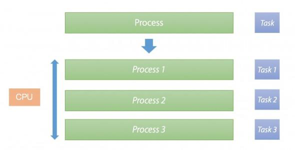

进程是程序执行的实体，每一个进程都是一个应用程序（比如我们运行QQ、浏览器、LOL、网易云音乐等软件），都有自己的内存空间，CPU一个核心同时只能处理一件事情，当出现多个进程需要同时运行时，CPU一般通过`时间片轮转调度`算法，来实现多个进程的同时运行。

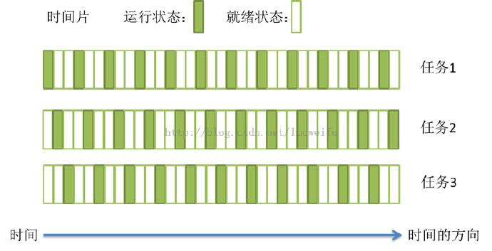

在早期的计算机中，进程是拥有资源和独立运行的最小单位，也是程序执行的最小单位。但是，如果我希望两个任务(这两个任务执行是同一个程序的)同时进行，就必须运行两个进程，由于每个进程都有一个自己的内存空间，进程之间的通信就变得非常麻烦（比如要共享某些数据）而且执行不同进程会产生上下文切换，非常耗时，那么能否实现在一个进程中就能够执行多个任务呢？

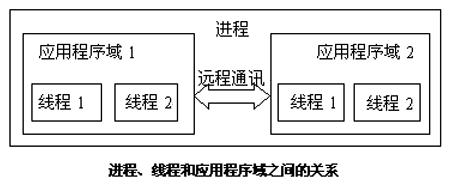

### 线程

后来，线程横空出世，一个进程可以有多个线程，线程是程序执行中一个单一的顺序控制流程，现在线程才是程序执行流的最小单元，各个线程之间共享程序的内存空间（也就是所在进程的内存空间），上下文切换速度也高于进程。

在Java中，我们从开始，一直以来编写的都是单线程应用程序（运行`main()`方法的内容），也就是说只能同时执行一个任务（无论你是调用方法、还是进行计算，始终都是依次进行的，也就是同步的），而如果我们希望同时执行多个任务（两个方法同时在运行或者是两个计算同时在进行，也就是异步的），就需要用到Java多线程框架。实际上一个Java程序启动后，会创建很多线程，不仅仅只运行一个主线程：

```java
public static void main(String[] args) {
    ThreadMXBean bean = ManagementFactory.getThreadMXBean();
    long[] ids = bean.getAllThreadIds();
    ThreadInfo[] infos = bean.getThreadInfo(ids);
    for (ThreadInfo info : infos) {
        System.out.println(info.getThreadName());
    }
}
```

## 并行和并发

我们经常听到并发编程，那么这个并发代表的是什么意思呢？而与之相似的并行又是什么意思？它们之间有什么区别？

比如现在一共有三个工作需要我们去完成。


### 顺序执行

顺序执行其实很好理解，就是我们依次去将这些任务完成了：


实际上就是我们同一时间只能处理一个任务，所以需要前一个任务完成之后，才能继续下一个任务，依次完成所有任务。

### 并发执行

并发执行也是我们同一时间只能处理一个任务，但是我们可以每个任务轮着做（时间片轮转）：

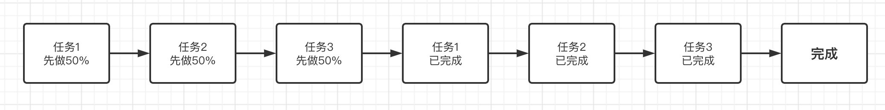

只要我们单次处理分配的时间足够的短，在宏观看来，就是三个任务在同时进行。

而我们Java中的线程，正是这种机制，当我们需要同时处理上百个上千个任务时，很明显CPU的数量是不可能赶得上我们的线程数的，所以说这时就要求我们的程序有良好的并发性能，来应对同一时间大量的任务处理。**所以说，并发其实是时间片轮转执行的。**

### 并行执行

并行执行就突破了同一时间只能处理一个任务的限制，我们同一时间可以做多个任务：


比如我们要进行一些排序操作，就可以用到并行计算，只需要等待所有子任务完成，最后将结果汇总即可。包括分布式计算模型MapReduce，也是采用的并行计算思路。

## 线程常用方法

### 线程的创建和启动

通过创建Thread对象来创建一个新的线程，Thread构造方法中需要传入一个Runnable接口的实现（其实就是编写要在另一个线程执行的内容逻辑）同时Runnable只有一个未实现方法，因此可以直接使用lambda表达式，lambda必须只有一个实现方法才可以使用：

```java
@FunctionalInterface
public interface Runnable {
    /**
     * When an object implementing interface <code>Runnable</code> is used
     * to create a thread, starting the thread causes the object's
     * <code>run</code> method to be called in that separately executing
     * thread.
     * <p>
     * The general contract of the method <code>run</code> is that it may
     * take any action whatsoever.
     *
     * @see     java.lang.Thread#run()
     */
    public abstract void run();
}
```

创建好后，通过调用`start()`方法来运行此线程：

```java
public static void main(String[] args) {
    Thread t = new Thread(() -> {    //直接编写逻辑
        System.out.println("我是另一个线程！");
    });
    t.start();   //调用此方法来开始执行此线程
}
```

可能上面的例子看起来和普通的单线程没两样，那我们先来看看下面这段代码的运行结果：

```java
public static void main(String[] args) {
    Thread t = new Thread(() -> {
        System.out.println("我是线程："+Thread.currentThread().getName());
        System.out.println("我正在计算 0-10000 之间所有数的和...");
        int sum = 0;
        for (int i = 0; i <= 10000; i++) {
            sum += i;
        }
        System.out.println("结果："+sum);
    });
    t.start();
    System.out.println("我是主线程！");
}
```

我们发现，这段代码执行输出结果并不是按照从上往下的顺序了，因为他们分别位于两个线程，他们是同时进行的！如果你还是觉得很疑惑，我们接着来看下面的代码运行结果：

```java
public static void main(String[] args) {
    Thread t1 = new Thread(() -> {
        for (int i = 0; i < 50; i++) {
            System.out.println("我是一号线程："+i);
        }
    });
    Thread t2 = new Thread(() -> {
        for (int i = 0; i < 50; i++) {
            System.out.println("我是二号线程："+i);
        }
    });
    t1.start();
    t2.start();
}
```

我们可以看到打印实际上是在交替进行的，也证明了他们是在同时运行！

> 我们发现还有一个run方法，也能执行线程里面定义的内容，但是run是直接在当前线程执行，并不是创建一个线程执行！

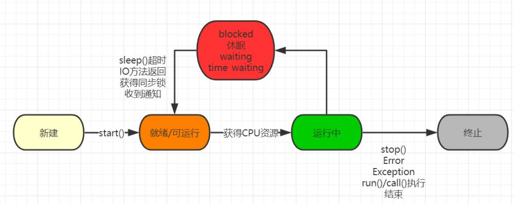

实际上，线程和进程差不多，也会等待获取CPU资源，一旦获取到，就开始按顺序执行我们给定的程序，当需要等待外部IO操作（比如Scanner获取输入的文本），就会暂时处于休眠状态，等待通知，或是调用`sleep()`方法来让当前线程休眠一段时间：

```java
public static void main(String[] args) throws InterruptedException {
    System.out.println("l");
    Thread.sleep(1000);    //休眠时间，以毫秒为单位，1000ms = 1s
    System.out.println("b");
    Thread.sleep(1000);
    System.out.println("w");
    Thread.sleep(1000);
    System.out.println("nb!");
}
```

我们也可以使用`stop()`方法来强行终止此线程：

```java
public static void main(String[] args) throws InterruptedException {
    Thread t = new Thread(() -> {
        Thread me = Thread.currentThread();   //获取当前线程对象
        for (int i = 0; i < 50; i++) {
            System.out.println("打印:"+i);
            if(i == 20) me.stop();  //此方法会直接终止此线程
        }
    });
    t.start();
}
```

虽然`stop()`方法能够终止此线程，但是并不是所推荐的做法，有关线程中断相关问题，我们会在后面继续了解。

**思考**：猜猜以下程序输出结果：

```java
private static int value = 0;

public static void main(String[] args) throws InterruptedException {
    Thread t1 = new Thread(() -> {
        for (int i = 0; i < 10000; i++) value++;
        System.out.println("线程1完成");
    });
    Thread t2 = new Thread(() -> {
        for (int i = 0; i < 10000; i++) value++;
        System.out.println("线程2完成");
    });
    t1.start();
    t2.start();
    Thread.sleep(1000);  //主线程停止1秒，保证两个线程执行完成
    System.out.println(value);
}

// 执行结果
//线程1完成
//线程2完成
//13135
```

我们发现，value最后的值并不是我们理想的结果，有关为什么会出现这种问题，在我们学习到线程锁的时候，再来讨论，这里简单说一下就是这个变量没有加锁，同时被两个线程操作，导致的异常

### 线程的休眠和中断

我们前面提到，一个线程处于运行状态下，线程的下一个状态会出现以下情况：

* 当CPU给予的运行时间结束时，会从运行状态回到就绪（可运行）状态，等待下一次获得CPU资源。
* 当线程进入休眠 / 阻塞(如等待IO请求) / 手动调用`wait()`方法时，会使得线程处于等待状态，当等待状态结束后会回到就绪状态。
* 当线程出现异常或错误 / 被`stop()` 方法强行停止 / 所有代码执行结束时，会使得线程的运行终止。

而这个部分我们着重了解一下线程的休眠和中断，首先我们来了解一下如何使得线程进入休眠状态：

```java
public static void main(String[] args) {
    Thread t = new Thread(() -> {
        try {
            System.out.println("l");
            Thread.sleep(1000);   //sleep方法是Thread的静态方法，它只作用于当前线程（它知道当前线程是哪个）
            System.out.println("b");    //调用sleep后，线程会直接进入到等待状态，直到时间结束
        } catch (InterruptedException e) {
            e.printStackTrace();
        }
    });
    t.start();
}
```

通过调用`sleep()`方法来将当前线程进入休眠，使得线程处于等待状态一段时间。我们发现，此方法显示声明了会抛出一个InterruptedException异常，那么这个异常在什么时候会发生呢？

```java
public static void main(String[] args) {
    Thread t = new Thread(() -> {
        try {
            Thread.sleep(10000);  //休眠10秒
        } catch (InterruptedException e) {
            e.printStackTrace();
        }
    });
    t.start();
    try {
        Thread.sleep(3000);   //休眠3秒，一定比线程t先醒来
        t.interrupt();   //调用t的interrupt方法
    } catch (InterruptedException e) {
        e.printStackTrace();
    }
}
```

我们发现，每一个Thread对象中，都有一个`interrupt()`方法，调用此方法后，会给指定线程添加一个中断标记以告知线程需要立即停止运行或是进行其他操作，由线程来响应此中断并进行相应的处理，我们前面提到的`stop()`方法是强制终止线程，这样的做法虽然简单粗暴，但是很有可能导致资源不能完全释放，而类似这样的发送通知来告知线程需要中断，**让线程自行处理后续，会更加合理一些，也是更加推荐的做法**。我们来看看interrupt的用法：

```java
public static void main(String[] args) {
    Thread t = new Thread(() -> {
        System.out.println("线程开始运行！");
        while (true){   //无限循环
            if(Thread.currentThread().isInterrupted()){   //判断是否存在中断标志
                break;   //响应中断
            }
        }
        System.out.println("线程被中断了！");
    });
    t.start();
    try {
        Thread.sleep(3000);   //休眠3秒，一定比线程t先醒来
        t.interrupt();   //调用t的interrupt方法
    } catch (InterruptedException e) {
        e.printStackTrace();
    }
}
```

通过`isInterrupted()`可以判断线程是否存在中断标志，如果存在，说明外部希望当前线程立即停止，也有可能是给当前线程发送一个其他的信号，如果我们并不是希望收到中断信号就是结束程序，而是通知程序做其他事情，我们可以在收到中断信号后，复位中断标记，然后继续做我们的事情：

```java
public static void main(String[] args) {
    Thread t = new Thread(() -> {
        System.out.println("线程开始运行！");
        while (true){
            if(Thread.currentThread().isInterrupted()){   //判断是否存在中断标志
                System.out.println("发现中断信号，复位，继续运行...");
                Thread.interrupted();  //复位中断标记，注意是interrupted ed方法
            }
        }
    });
    t.start();
    try {
        Thread.sleep(3000);   //休眠3秒，一定比线程t先醒来
        t.interrupt();   //调用t的interrupt方法
    } catch (InterruptedException e) {
        e.printStackTrace();
    }
}
```

复位中断标记后，会立即清除中断标记。那么，如果现在我们想暂停线程呢？我们希望线程暂时停下，比如等待其他线程执行完成后，再继续运行，那这样的操作怎么实现呢？

```java
public static void main(String[] args) {
    Thread t = new Thread(() -> {
        System.out.println("线程开始运行！");
        Thread.currentThread().suspend();   //暂停此线程
        System.out.println("线程继续运行！");
    });
    t.start();
    try {
        Thread.sleep(3000);   //休眠3秒，一定比线程t先醒来
        t.resume();   //恢复此线程
    } catch (InterruptedException e) {
        e.printStackTrace();
    }
}
```

虽然这样很方便地控制了线程的暂停状态，但是这两个方法我们发现实际上也是**不推荐的做法**，它很容易导致死锁！有关为什么被弃用的原因，我们会在线程锁继续探讨。

### 线程的优先级

实际上，Java程序中的每个线程并不是平均分配CPU时间的，为了使得线程资源分配更加合理，Java采用的是抢占式调度方式，优先级越高的线程，优先使用CPU资源！我们希望CPU花费更多的时间去处理更重要的任务，而不太重要的任务，则可以先让出一部分资源。线程的优先级一般分为以下三种：

* MIN_PRIORITY   最低优先级
* MAX_PRIORITY   最高优先级
* NOM_PRIORITY  常规优先级

```java
public static void main(String[] args) {
    Thread t = new Thread(() -> {
        System.out.println("线程开始运行！");
    });
    t.start();
    t.setPriority(Thread.MIN_PRIORITY);  //通过使用setPriority方法来设定优先级
}
```

优先级越高的线程，获得CPU资源的概率会越大，并不是说一定优先级越高的线程越先执行！

### 线程的礼让和加入

我们还可以在当前线程的工作不重要时，将CPU资源让位给其他线程，通过使用`yield()`方法来将当前资源让位给其他同优先级线程：

```java
public static void main(String[] args) {
    Thread t1 = new Thread(() -> {
        System.out.println("线程1开始运行！");
        for (int i = 0; i < 50; i++) {
            if(i % 5 == 0) {
                System.out.println("让位！");
                Thread.yield();
            }
            System.out.println("1打印："+i);
        }
        System.out.println("线程1结束！");
    });
    Thread t2 = new Thread(() -> {
        System.out.println("线程2开始运行！");
        for (int i = 0; i < 50; i++) {
            System.out.println("2打印："+i);
        }
    });
    t1.start();
    t2.start();
}
```

观察结果，我们发现，在让位之后，尽可能多的在执行线程2的内容。

当我们希望一个线程等待另一个线程执行完成后再继续进行，我们可以使用`join()`方法来实现线程的加入：

```java
public static void main(String[] args) {
    Thread t1 = new Thread(() -> {
        System.out.println("线程1开始运行！");
        for (int i = 0; i < 50; i++) {
            System.out.println("1打印："+i);
        }
        System.out.println("线程1结束！");
    });
    Thread t2 = new Thread(() -> {
        System.out.println("线程2开始运行！");
        for (int i = 0; i < 50; i++) {
            System.out.println("2打印："+i);
            if(i == 10){
                try {
                    System.out.println("线程1加入到此线程！");
                    t1.join();    //在i==10时，让线程1加入，先完成线程1的内容，再继续当前内容
                } catch (InterruptedException e) {
                    e.printStackTrace();
                }
            }
        }
    });
    t1.start();
    t2.start();
}
```

我们发现，线程1加入后，线程2等待线程1待执行的内容全部执行完成之后，再继续执行的线程2内容。注意，线程的加入只是等待另一个线程的完成，并不是将另一个线程和当前线程合并！

## 线程锁和线程同步

java多线程的内存管理：

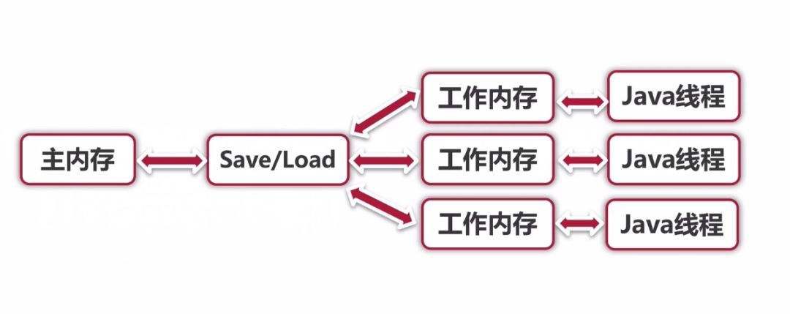

所有线程共享的变量存储在主内存，然后每个线程有一个自己的工作内存，里面复制了一份主内存中共享变量的副本。

本来每个线程访问自己复制的副本这种设计是为了更快速的数据访问，但是如果多个线程同时操作一个内存空间也就是一个数据，那么可能会导致每个工作内存写入到主内存的数据不一致，发生冲突，不能保证缓存一致性。

### 悬念破案

来看一下之前的value最终值不是200000的问题：

```java
private static int value = 0;

public static void main(String[] args) throws InterruptedException {
    Thread t1 = new Thread(() -> {
        for (int i = 0; i < 100000; i++) value++;
        System.out.println("线程1完成");
    });
    Thread t2 = new Thread(() -> {
        for (int i = 0; i < 100000; i++) value++;
        System.out.println("线程2完成");
    });
    t1.start();
    t2.start();
    Thread.sleep(5000);  // 停止5秒，等待上面的计算完成
    System.out.println(value);
}
```

当我们同时去操作一个共享变量时，如果仅仅是读取还好，但是如果同时写入内容，就会出现问题，两个线程同时取的一个值，都添加了1，明明应该加两次，但是两个线程都是把自己线程里的这个变量`+1`，返回给主内存，导致最终结果也是只`+1`，因为两个工作内存返回的都是`+1`

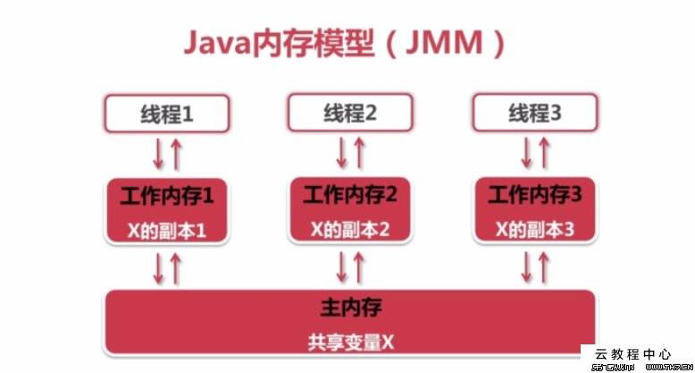

必须增加同步性，保证共享变量value自增操作的原子性，让一个线程独立的操作完之后另一个线程再来操作这个共享变量。

### 线程锁

通过`synchronized`关键字来给一个对象或类添加一个线程锁，给这个对象或类外面套上synchronized即可，要注意同一个操作，要让同一个东西保证原子性，**一定要是同一把锁**(意思是给同一个对象或类套上的锁)。

```java
public class Test {
    private static int value = 0;
    public static void main(String[] args) throws InterruptedException {
        new Thread(()->{
            synchronized (Test.class) {
                for (int i = 0; i < 100000; i++) value++;
                System.out.println("线程1完成");
            }
        }).start();
        new Thread(()->{
            synchronized (Test.class) {
                for (int i = 0; i < 100000; i++) value++;
                System.out.println("线程2完成");
            }
        }).start();
        Thread.sleep(5000);
        System.out.println(value);
    }
}
```

线程进入锁内容时，会自动知道加锁了，等待其它锁释放，然后再运行自己的线程，默认认为一定有其它锁加锁了，这是悲观锁，还有乐观锁后面来研究，也就是默认认为没有其它锁加锁，默认去执行，执行中发现有锁再等待。

使用不同的锁，同步就失效了，**必须加在同一个对象上或者同一个类对象上**：

```java
public class Test {
    private static int value = 0;
    public static void main(String[] args) throws InterruptedException {
        Test test1 = new Test();
        Test test2 = new Test();
        new Thread(()->{
            synchronized (test1) {
                for (int i = 0; i < 100000; i++) value++;
                System.out.println("线程1完成");
            }
        }).start();
        new Thread(()->{
            synchronized (test2) {
                for (int i = 0; i < 100000; i++) value++;
                System.out.println("线程2完成");
            }
        }).start();
        Thread.sleep(5000);
        System.out.println(value);
    }
}
```

当对象不同时，获取到的是对不同对象加上的不同的锁，因此并不能保证自增操作的原子性，最后也得不到我们想要的结果。

`synchronized`关键字也可以**作用于方法**上，还是相当于给调用这个方法的类对象加锁，调用此方法时也会获取锁：

```java
public class Test {
    private static int value = 0;
    private static synchronized void add() {
        value++;
    }
    public static void main(String[] args) throws InterruptedException {
        new Thread(()->{
            for (int i = 0; i < 100000; i++) add();
            System.out.println("线程1完成");
        }).start();
        new Thread(()->{
            for (int i = 0; i < 100000; i++) add();
            System.out.println("线程2完成");
        }).start();
        Thread.sleep(5000);
        System.out.println(value);
    }
}
```

我们发现实际上效果是相同的，只不过这个锁不用你去加，**如果是静态方法，就是使用的类锁，而如果是普通成员方法，就是使用的对象锁。**通过灵活的使用synchronized就能很好地解决我们之前提到的问题了！

### 死锁

其实死锁的概念在`操作系统`中也有提及，它是指两个线程相互持有对方需要的锁，但是又迟迟不释放，导致程序卡住：

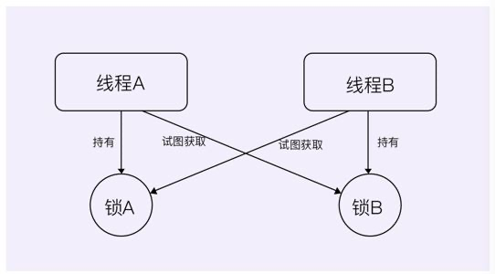

o1锁里面的内容想去锁o2，而o2一开始就被线程2锁住了，所以o1锁无法执行完成，也就无法释放，o2也一样，都无法释放，那么两个锁都无法执行完成，形成死锁。

```java
public class Test {
    public static void main(String[] args) throws InterruptedException {
        Test test1 = new Test();
        Test test2 = new Test();
        new Thread(()->{
            // 首先给test1锁定
            synchronized (test1) {
                try {
                    Thread.sleep(1000);
                    // 想去锁定test2，但是test2已经被下面的另一个线程锁定，并且没有释放
                    // 那么这个线程1一直在尝试锁定test2，也无法完成内容执行，也会一直没有释放
                    synchronized (test2) {
                        System.out.println("线程1");
                    }
                } catch (InterruptedException e) {
                    e.printStackTrace();
                }
            }
        }).start();
        new Thread(()->{
            // 和上面的线程刚好相反，一直没有释放，形成死锁
            synchronized (test2) {
                try {
                    Thread.sleep(1000);
                    synchronized (test1) {
                        System.out.println("线程2");
                    }
                } catch (InterruptedException e) {
                    e.printStackTrace();
                }
            }
        }).start();
    }
}
```

那么我们如何去检测死锁呢？我们可以利用jstack命令来检测死锁，首先利用jps找到我们的java进程：

```shell
nagocoler@NagodeMacBook-Pro ~ % jps
51592 Launcher
51690 Jps
14955 
51693 Main
nagocoler@NagodeMacBook-Pro ~ % jstack 51693
...
Java stack information for the threads listed above:
===================================================
"Thread-1":
	at com.test.Main.lambda$main$1(Main.java:46)
	- waiting to lock <0x000000076ad27fc0> (a java.lang.Object)
	- locked <0x000000076ad27fd0> (a java.lang.Object)
	at com.test.Main$$Lambda$2/1867750575.run(Unknown Source)
	at java.lang.Thread.run(Thread.java:748)
"Thread-0":
	at com.test.Main.lambda$main$0(Main.java:34)
	- waiting to lock <0x000000076ad27fd0> (a java.lang.Object)
	- locked <0x000000076ad27fc0> (a java.lang.Object)
	at com.test.Main$$Lambda$1/396873410.run(Unknown Source)
	at java.lang.Thread.run(Thread.java:748)

Found 1 deadlock.
```

jstack自动帮助我们找到了一个死锁，并打印出了相关线程的栈追踪信息。

不推荐使用 `suspend() `去挂起线程的原因，是因为` suspend() `在使线程暂停的同时，并不会去释放任何锁资源，其他线程都无法访问被它占用的锁。

直到对应的线程执行` resume() `方法后，被挂起的线程才能继续，从而其它被阻塞在这个锁的线程才可以继续执行。

但是，如果` resume() `操作出现在` suspend() `之前执行，那么线程将一直处于挂起状态，同时一直占用锁，这就产生了死锁。

### wait和notify方法

- `wait()`：让当前锁进入等待并释放锁

- `notify()`：唤醒具体的某个等待的锁

- `notifyAll()`：随机唤醒一个等待的锁，因为只能有一个锁运行，所以是唤醒一个

这三个方法需要配合synchronized来使用的，只有在同步代码块中才能使用这些方法：

```java
public class Test {
    public static void main(String[] args) throws InterruptedException {
        Object o = new Object();
        Thread t1 = new Thread(()->{
            synchronized (o) {
                try {
                    System.out.println("开始等待");
                    o.wait();
                    System.out.println("等待结束");
                } catch (InterruptedException e) {
                    e.printStackTrace();
                }
            }
        });
        Thread t2 = new Thread(()->{
            synchronized (o) {
                System.out.println("开始唤醒");
                o.notify();
                for (int i = 0; i < 50; i++) {
                    System.out.println(i);
                }
            }
        });
        t1.start();
        Thread.sleep(1000);
        t2.start();
    }
}
```

调用`wait()`之后就将t1线程暂停挂起，等待t2线程唤醒，当t2线程调用`notify()`唤醒这个线程后，并不是马上执行这个被唤醒的线程t1，而是等这个t2线程自己的内容执行完毕，释放o对象锁之后才开始执行被唤醒的线程。

### synchronized 同步对象

`synchronized`表示独占当前这个对象，其它对象只能等待这个锁释放这个对象，也就是执行完里面的代码

```java
Synchronization_ synchronization_ = new Synchronization_();
// 同步对象,将synchronization_设为同步对象
synchronized (synchronization_) {
	synchronization_.add();	
}
```

将一个方法设置为synchronized，那么其实是锁定这个方法的对象，也就是this嘛，this对象的成员也就锁住了。

```java
public synchronized void add() {
    volumn++;
}
```

如果一个类都是线程独占的方法，那么就是同步类，并不是类上添加`synchronized`，只是里面的方法都是synchronized方法

### lock同步对象

lock和synchronized都是锁住对象，达到同步效果。

不同之处是`synchronized`锁住之后里面的具体内容执行完成就释放对象，但是`lock`必须手动调用`unlock`方法才会释放对象。

为了保证释放的执行，往往会把unlock() 放在finally中进行。

```java
public class Test {
    public static void main(String[] args) throws InterruptedException {
        Cat cat = new Cat();
        // 创建线程并给线程添加名字
        new Thread(cat, "小猫").start();
        new Thread(cat, "小狗").start();
    }
}
class Cat implements Runnable {
    // 在需要创建Lock锁的对象中创建lock成员属性，才可以使用lock锁
    private Lock lock = new ReentrantLock();

    @Override
    public void run() {
        try {
            // 将当前对象锁住，注意lock不能在这里声明，必须是成员属性
            lock.lock();
            for (int i = 0; i < 10; i++) {
                try {
                    Thread.sleep(1000);
                } catch (InterruptedException e) {
                    e.printStackTrace();
                }
                System.out.println(Thread.currentThread().getName());
            }
        } finally {
            lock.unlock();
        }
    }
}
```

可以发现，当我们锁住了之后，只会同时先打印10个小猫，或者10个小狗，如果不锁住对象，那么是小猫小狗交替打印。

同时lock还提供了一个trylock方法，在指定时间范围内`试图占用`，占用不到就拉倒

>  只要这个对象被其它线程占用，没有释放，那么就占用不到

```java
locked = lock.tryLock(1,TimeUnit.SECONDS);
```

# ThreadLocal

hreadLocal类，主要用来创建工作内存中的变量(线程自己的变量，多个线程之间不共享，也就是不保存在共享的主内存中)，它将我们的变量值存储在内部（**只能存储一个变量**），不同的变量访问到ThreadLocal对象时，都只能获取到自己线程所属的变量。

## ThreadLocal两大应用场景

### 每个线程需要一个独享的对象

通常是工具类，典型的有`SimpleDateFormat`和`Random`类，也就是每个线程需要一个**独享**的工具类，如果多个线程同时使用一个工具类，会导致线程不安全，这个工具类返回的值很可能出错，简单来讲就是这个线程让工具类处理我这个线程的数据还没处理完另外一个线程又传入一个数据来处理，处理的可能是之前的线程数据然后返回给我。

可以使用加锁的方式来解决线程安全问题，但是加锁会导致效率降低，因为加锁实际上在工具类的调用上效果和单线程效率一样。

下面以`SimpleDateFormat`工具类来示例：

首先当我们有两个线程需要使用这个工具类来返回具体的时间字符串时：

```java
public class ThreadLocal01 {
    public static void main(String[] args) {
        new Thread(()->{
            System.out.println(new ThreadLocal01().date(10));
        }).start();
        new Thread(()->{
            System.out.println(new ThreadLocal01().date(20));
        }).start();
    }
    public String date (int seconds) {
        Date date = new Date(1000 * seconds);
        SimpleDateFormat dateFormat = new SimpleDateFormat("yyyy-MM-dd hh:mm:ss");
        return dateFormat.format(date);
    }
}
```

上面的代码仅仅是两个线程，问题不大，那么现在我们有30个线程需要使用SimpleDateFormat类呢，还是直接创建30个线程明显是不可取的，这时候需要使用到**线程池**了：

```java
public class ThreadLocal01 {
    // 创建10个线程的固定线程池
    public static ExecutorService threadPool = Executors.newFixedThreadPool(10);
    public static void main(String[] args) {
        for (int i = 0; i < 30; i++) {
            int finalI = i;
            threadPool.submit(()->{
                System.out.println(new ThreadLocal01().date(finalI));
            });
        }
        threadPool.shutdown();
    }
}
```

这时候新的问题又出现了，我们30个线程，创建了30次`SimpleDateFormat`对象，创建30个对象是极大的资源浪费，既然这个对象只是传值给它然后返回具体的时间字符串，做的工作都是一样的，为何不只创建一次，然后传不同的值呢：

```java
public class ThreadLocal01 {
    // 创建10个线程的固定线程池
    public static ExecutorService threadPool = Executors.newFixedThreadPool(10);
    public static SimpleDateFormat dateFormat = new SimpleDateFormat("yyyy-MM-dd hh:mm:ss");
    public static void main(String[] args) throws InterruptedException {
        for (int i = 0; i < 30; i++) {
            int finalI = i;
            threadPool.submit(()->{
                System.out.println(new ThreadLocal01().date(finalI));
            });
        }
        threadPool.shutdown();
    }
}
```

上面使用了一个static对象来保证只创建一次，但是新的问题出现了，会发现输出时间时，有一些重复的，这是因为线程不安全，执行出错了，下面要进行下一步更改：

要解决这个问题也非常简单，无非就是加一把锁就行了：

```java
public String date (int seconds) {
    Date date = new Date(1000 * seconds);
    // 将dateFormat对象锁住，同一时间只允许一个对象使用
    // 当然dateFormat是ThreadLocal01的成员，锁住ThreadLocal01和锁住dateFormat是一样的
    synchronized (ThreadLocal01.class) {
       return dateFormat.format(date);
    }
}
```

但是这样会导致执行效率大大降低，看来这种场景最好的方案还是使用ThreadLocal：

```java
public class ThreadLocal01 {
    // 创建10个线程的固定线程池
    public static ExecutorService threadPool = Executors.newFixedThreadPool(10);
    public static void main(String[] args) throws InterruptedException {
        for (int i = 0; i < 1000; i++) {
            int finalI = i;
            threadPool.submit(()->{
                System.out.println(new ThreadLocal01().date(finalI));
            });
        }
        threadPool.shutdown();
    }
    public String date (int seconds) {
        Date date = new Date(1000 * seconds);
        return ThreadSafeFormatter.dateFormatThreadlocal.get().format(date);

    }
}
class ThreadSafeFormatter {
    // 每个线程创建一个独立的SimpleDateFormat，但是因为线程池只有10个线程
    // 那么只会创建10个SimpleDateFormat
    public static ThreadLocal<SimpleDateFormat> dateFormatThreadlocal =
           ThreadLocal.withInitial(()->{
               return new SimpleDateFormat("yyyy-MM-dd hh:mm:ss");
           });
}
```

### 每个线程内需要保存全局对象

每个线程都有自己的全局对象，然后在多个service类中反复调用这个全局对象，如果使用传递的方式的话，那么调用每个service类的方式时，都要传递这个参数(函数式编程)，十分不方便，这种时候可以使用ThreadLocal的线程内全局对象，每个service类中的方法想使用的时候，直接调用这个即可。

```java
public class ThreadLocal02 {
    public static void main(String[] args) {
        new Service1().process();
    }
}
// 这里创建了3个业务类，每个类中的process方法都要使用user信息
// 当我们在第一个类中设置user信息到ThreadLocal中，后面就可以直接用
class Service1 {
    public void process() {
        User user = new User("超哥");
        UserContextHolder.holder.set(user);
        // 这里就不需要传入这个user参数了，也可以传递user参数，通过ThreadLocal
        new Service2().process();
    }
}
class Service2 {
    public void process() {
        User user = UserContextHolder.holder.get();
        System.out.println(user.name);
        // 这里就不需要传入这个user参数了，也可以传递user参数，通过ThreadLocal
        new Service3().process();
    }
}
class Service3 {
    public void process() {
        User user = UserContextHolder.holder.get();
        System.out.println(user.name);
    }
}
class UserContextHolder {
    public static ThreadLocal<User> holder = new ThreadLocal<>();
}
class User {
    String name;
    User(String name) {
        this.name = name;
    }
}
```

可以发现使用了ThreadLocal之后，会将user信息保存在Thread线程中，只要在当前线程中，都可以使用这个共享变量，而且线程之间是隔离的，不会出现线程安全问题。

## ThreadLocal带来的好处

- 达到线程安全
- 不需要加锁，提高执行效率
- 更高效的利用内存、节省开销，不需要大量创建对象
- 利用了ThreadLocal线程内全局变量共享的原理，免去了反复传参的繁琐，同时使得代码耦合度更低

## ThreadLocal原理

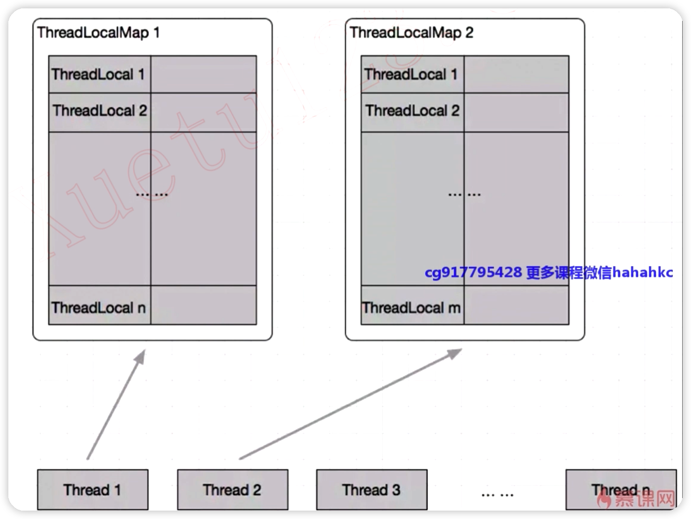

实际上`ThreadLocal`是保存在`ThreadLocalMap`这个Map中的，然后ThreadLocalMap保存在Thread中，所以这些东西都是线程的成员，每个Thread都持有一个ThreadLocalMap成员变量。

## ThreadLocal常用变量

### initialValue

设置ThreadLocal当前线程的初始值，只是一个**延迟加载**的方法，只有在调用`get`的时候，才会触发

当线程第一次使用get方法访问变量时，将调用此方法，只有线程先前调用了`set`方法，不会为线程调用initialValue方法，也就是没有设置值就会调用设置初始值方法，如果没有设置初始值，则返回null

通常每个方法最多只可以调用一次设置初始值，除非调用`remove`方法，则可以再次调用

### set

为这个线程设置一个新值

### get

得到这个线程对应的value，要注意get不需要参数，因为一个ThreadLocal只可以保存一个值，所以不需要传参

### remove

删除这个线程对应的值

## ThreadLocal的继承

我们发现在线程中创建的子线程，无法获得父线程工作内存中的变量：

```java
public static void main(String[] args) {
    ThreadLocal<String> local = new ThreadLocal<>();
    Thread t = new Thread(() -> {
       local.set("lbwnb");
        new Thread(() -> {
            System.out.println(local.get());	// null
        }).start();
    });
    t.start();
}
```

使用`InheritableThreadLocal`可以让子线程获取到父线程的变量值：

```java
public static void main(String[] args) {
    ThreadLocal<String> local = new InheritableThreadLocal<>();
    Thread t = new Thread(() -> {
       local.set("lbwnb");
        new Thread(() -> {
            System.out.println(local.get());	// lbwnb
        }).start();
    });
    t.start();
}
```

在InheritableThreadLocal存放的内容，会自动向子线程传递。

## ThreadLocal注意点

### 内存泄露

某个对象不再有用，但是占用的内存却不能被回收，也就是不能使用这个内存，这就导致了这个内存用不了了，当出现很多这样的内存，最终可能就会导致OOM内存泄露。

引发内存泄露的原因：

ThreadLocal的变量是保存在`Thread->ThreadLocalMap->key(entry)->value`中，也就是要使用value必须找到key(entry，这个key就是ThreadLocal对象名)，但是java中，这个key是弱引用，如果在线程池中一段时间不使用，会被GC垃圾回收掉，但是value是强引用，不会被回收，这样会导致key没了只剩下value，也就找不到这个value了，这个value就泄露了

其实java在设计时已经考虑到这个问题，但我们调用set、remove、rehash等方法的时候，会自动扫描key为null的Entry，如果有就会把对应的value也设置为null，这样value可以会回收

但是实际使用过程中可能我们一段时间不用线程池，也就不会去调用这些方法，那么也会内存泄露。

所以根据阿里规约，我们在使用完ThreadLocal变量之后一定要调用`remove()`方法

### 空指针异常

```java
public class ThreadLocalNull {
    public static void main(String[] args) {
        // 不set直接get取值
        System.out.println(ThreadLocalNPE.get());
    }
}
class ThreadLocalNPE {
    // 泛型必须设置Long包装类型，不能设置long基本类型
    public static ThreadLocal<Long> threadLocal = new ThreadLocal<>();
    static void set() {
        threadLocal.set(Thread.currentThread().getId());
    }
    // 直接放回null，需要自动拆箱转为基本类型long就会报空指针异常
    // 所以需要设置为static Long包装类型，才会返回正常的null
    static long get() {
        return threadLocal.get();
    }
}
```

这就是一个需要注意一下的问题

### 共享对象

如果ThreadLocal.set()的对象本来就是多个线程共享的对象，比如static对象，那么get()还是取的共享对象本身，还是有并发访问线程安全问题，这个理所当然。

# java定时器

## 自定义定时器

使用`Thread.sleep()`来实现定时几秒后执行任务：

```java
public static void main(String[] args) {
    new TimerTask(() -> System.out.println("我是定时任务！"), 3000).start();   //创建并启动此定时任务
}

static class TimerTask{
    Runnable task;
    long time;

    public TimerTask(Runnable runnable, long time){
        this.task = runnable;
        this.time = time;
    }

    public void start(){
        new Thread(() -> {
            try {
                Thread.sleep(time);
                task.run();   //休眠后再运行
            } catch (InterruptedException e) {
                e.printStackTrace();
            }
        }).start();
    }
}
```

现在来设计一个计时器，每隔多久执行一次：

```java
public static void main(String[] args) {
    new TimerLoopTask(() -> System.out.println("我是定时任务！"), 3000).start();   //创建并启动此定时任务
}

static class TimerLoopTask{
    Runnable task;
    long loopTime;

    public TimerLoopTask(Runnable runnable, long loopTime){
        this.task = runnable;
        this.loopTime = loopTime;
    }

    public void start(){
        new Thread(() -> {
            try {
                while (true){   //无限循环执行
                    Thread.sleep(loopTime);
                    task.run();   //休眠后再运行
                }
            } catch (InterruptedException e) {
                e.printStackTrace();
            }
        }).start();
    }
}
```

现在我们将单次执行放入到一个无限循环中，这样就能一直执行了，并且按照我们的间隔时间进行。

## java定时任务

Java为我们提供了一套自己的框架用于处理定时任务：

```java
public static void main(String[] args) {
    Timer timer = new Timer(); //创建定时器对象
    timer.schedule(new TimerTask() { //抽象类，不是接口，无法使用lambda表达式
        @Override
        // 注意会自动去调用Task里面的run方法
        public void run() {
            System.out.println(Thread.currentThread().getName());
        }
    }, 1000);    //执行一个延时任务
}
```

同时可以执行循环定时任务：

```java
public class TimerTest {
    public static void main(String[] args) {
        Timer timer = new Timer();
        timer.schedule(new TimerTask() {
            @Override
            public void run() {
                System.out.println(Thread.currentThread().getName());
            }
        },1000,1000);	// 1秒钟后第一次执行，然后每秒钟执行一次
    }
}
```

我们发现，虽然任务执行完成了，但是我们的程序并没有停止，这是因为Timer内存维护了一个任务队列和一个工作线程：

```java
public class Timer {
    private final TaskQueue queue = new TaskQueue();
    private final TimerThread thread = new TimerThread(queue);
}
```

TimerThread继承自Thread，是一个新创建的线程，在构造时调用构造函数自动启动：

```java
public Timer(String name) {
    thread.setName(name);
    thread.start();
}
```

而它的run方法会循环地读取队列中是否还有任务，如果有任务依次执行，没有的话就暂时处于休眠状态：

```java
public void run() {
    try {
        mainLoop();
    } finally {
        // Someone killed this Thread, behave as if Timer cancelled
        synchronized(queue) {
            newTasksMayBeScheduled = false;
            queue.clear();  // Eliminate obsolete references
        }
    }
}

/**
 * The main timer loop.  (See class comment.)
 */
private void mainLoop() {
  try {
       TimerTask task;
       boolean taskFired;
       synchronized(queue) {
         	// Wait for queue to become non-empty
          while (queue.isEmpty() && newTasksMayBeScheduled)   //当队列为空同时没有被关闭时，会调用wait()方法暂时处于等待状态，当有新的任务时，会被唤醒。
                queue.wait();
          if (queue.isEmpty())
             break;    //当被唤醒后都没有任务时，就会结束循环，也就是结束工作线程
                      ...
}
```

`newTasksMayBeScheduled`实际上就是标记当前定时器是否关闭，当它为false时，表示已经不会再有新的任务到来，也就是关闭，我们可以通过调用`cancel()`方法来关闭它的工作线程：

```java
public void cancel() {
    synchronized(queue) {
        thread.newTasksMayBeScheduled = false;
        queue.clear();
        queue.notify();  //唤醒wait使得工作线程结束
    }
}
```

因此，我们可以在使用完成后，调用Timer的`cancel()`方法以正常退出我们的程序：

```java
public static void main(String[] args) {
    Timer timer = new Timer();
    timer.schedule(new TimerTask() {
        @Override
        public void run() {
            System.out.println(Thread.currentThread().getName());
            timer.cancel();  //结束
        }
    }, 1000);
}
```

# 线程池

当需要创建大量的线程进行业务时，重复的创建销毁会浪费大量的开销，所以需要创建一个线程池，然后业务来时直接使用线程池中已经创建好的线程，重复使用，不创建和关闭线程，来提高效率。

## 线程池工作原理白话版介绍

### 线程池

**「小田螺」** 勤勤恳恳，任劳任怨，夜以继日地工作着。终于有一天，他晋升为公司的主管，负责公司日常业务。

风轻云淡的一天，老板找到了小田螺，“我们公司员工越来越多了，我想搞个**「员工管理系统」**，你那边安排一下哈，要在一个月后完成。” 小田螺拍拍胸口，没问题！

因为当前公司还没有程序员，所以小田螺快马加鞭打开**「猪八戒网」**，提交员工管理系统需求，等待不久，**「开发者（名字，线程A）」** 接单，谈好合同，开始开发，系统交付...一系列流程下来，并且一个月过后，一个五脏俱全的员工管理系统终于完成了...老板对此大加赞赏~

过了不久，老板再次发话，“公司越来越多人迟到了，我们再搞个**「考勤系统」**吧!" 小田螺接到任务，马上又开始上猪八戒网，提需求找人开发，这次来了**「线程B接单」**......

逝者如斯，月底了，老板又提出开发个薪酬系统需求...小田螺听了头皮发麻，one day day的，重复去网上找人开发！“为了节省成本，不如我们雇佣几个程序员(线程a,b,c)，成立自己的IT技术部门吧！我们就管IT部门叫**「线程池」**吧!”老板听了，一拍即合!!!

> ❝线程池就是管理线程的池子，当有任务要处理时，不用频繁创建新线程，而是从池子拿个线程出来处理。当任务执行完，线程并不会被销毁，而是在等待下一个任务。因此可以节省资源，提高响应速度。
> ❞

### 核心线程

**「线程池」**IT部门成立后，雇佣了几个与公司有正式合同关系的员工a，b，c，**「小田螺」**管他们几个正式员工做**「核心线程」**。当老板提一个需求过来，小田螺就把需求分配给**「手上没活干」**的线程处理...

### 阻塞队列

一天早上，老板睡眼惺忪。来到公司后，一口气提了**「四个需求」**，a，b,c 按顺领完任务后，发现还剩余一个需求任务。这个怎么安排呢？难道又去**「猪八戒兼职网」**找人嘛？成立了**「线程池IT部门」**，还去找人（找线程干活），会被人笑落大牙的！

聪明的小田螺想到一个好办法，我们可以搞个DPMS需求池，把还没分配的需求，放进待完成的DPMS需求池里面吧，等到a，b，c谁先干完活，再把这个任务领走。这个DPMS需求池，我们给它取名**「阻塞队列」**，英文名叫**「WorkQueue」**吧！

### 非核心线程

又在一个晴空万里的午后，老板喝了一杯咖啡，闲来没事，就跑去**「阻塞队列」**（DPMS需求池）看看，一看就傻帽了！！需求池堆积了几十个需求，排期都是满满的了。老板马上叫**「小田螺进来办公室」**，以商量如何处理这些需求任务。

“要不，我们雇佣多几个员工（搞多几个**「核心线程」**）？” “不行不行，公司财务**「开销」**有点大！”

“要不然，我们要求业务提少点任务需求？（**「请求少点」**）” “你是不是傻，请求少点，不是自断财路嘛？你回家想想办法先吧！！”老板放大了他的嗓门~

小田螺回家闭目让神，每天早早就睡觉，两耳不闻窗外事...终于有一天，在一个梦香里，他想到了一个好办法。

“老板，我们可以去别的公司（**「外包公司」**）雇佣几个员工（假设名字为d,e,f,g）一段时间，让它们来做**「DPMS需求池（阻塞队列）」** 里面的需求。等到做完需求，再派他们回去就好啦。” 老板一听就乐了，这个方案好，心里美滋滋：**「需求的活有人干了，公司财务又省钱，两全其美呀」**~ 这几个派遣来的外包员工（d,e,f,g），我们就把它叫做**「非核心线程」**吧。

### 空闲时间

自从来了d,e,f,g外包员工（**「非核心线程」**），老板长舒一口气，这么多活，终于有人干了。

但是呢，又有一天，到了7点所谓的下班时间，老板走出办公室，发现**「线程池」**IT部门的员工，都走得七七八八了。心里一怒：**「这帮粉肠，怎么一到下班时间就跑，工作这么不饱和了」**？他随手点进DPMS需求池，才发现，原来需求都被做完了。。。还有一堆外包同事（非核心线程）要发工资呢，这波亏大了~

第二天，小田螺被**「秘密」**叫进了老板办公室，既然DPMS需求池都已经没需求了。我们准备派外包同事（非核心线程）回去吧？但是呢一般，需求一没有，就马上让他们回去（**「线程回收」**），如果需求一下子又来，就有点hold不住了...

“要不酱紫，我们等需求池空的时候，隔个15天还是10天，再让外包同事（**「非核心线程」**）回去吧？” 这个定义的15天或者10天，就是**「线程空闲存活时间」**啦

### 饱和策略

在临近双11的时候，不仅老板提了良多需求，新来的运营小姐姐们，也提了好多好多的需求。新需求如源头活水，滚滚的来~

首先呢，**「线程池」**IT部门a，b，c三个正式员工（核心线程）都忙于处理需求（**「请求」**），接着，DPMS需求池（**「阻塞队列」**）也被挤满了，最后呢，连d,e,f,g外包同事（**「非核心线程」**）也忙得不可开交。

这时候，需求还是做不完，怎么办呢？双11赶着上线呢？小田螺愁眉苦脸，从**「潮起愁到潮落」**...

没办法了，只能动用**「饱和策略」**啦。比如**「丢弃需求任务」**？**「抛异常，告诉老板别加需求了」**？**「丢弃需求池最老的需求任务」**？还是**「交给提需求的人自己处理」**？

最后老板决定，**「拒绝再提新的需求」**，于是**「线程池」**IT部门还是正常运行~

> 线城池的饱和策略事件，主要有四种类型

- AbortPolicy(抛出一个异常，默认的)
- DiscardPolicy(新提交的任务直接被抛弃)
- DiscardOldestPolicy（丢弃队列里最老的任务，将当前这个任务继续提交给线程池）
- CallerRunsPolicy（交给线程池调用所在的线程进行处理，即将某些任务回退到调用者)

### 线程池工作原理流程图 & 源码概览

故事讲完啦，再复习下线程池工作流程图吧~

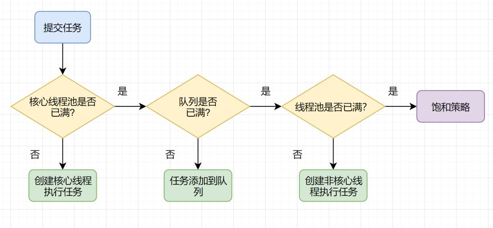

有兴趣的朋友，源码也可以看下~

```java
  if (command == null)
            throw new NullPointerException();
        int c = ctl.get();
        //判断当前活跃线程数是否小于corePoolSize
        if (workerCountOf(c) < corePoolSize) {
            //如果小于，则调用addWorker创建线程执行任务
            if (addWorker(command, true))
                return;
            c = ctl.get();
        }
        //如果大于等于corePoolSize，则将任务添加到workQueue队列。
        if (isRunning(c) && workQueue.offer(command)) {
            int recheck = ctl.get();
            if (! isRunning(recheck) && remove(command))
                reject(command);
            else if (workerCountOf(recheck) == 0)
                addWorker(null, false);
        }
        //如果放入workQueue队列失败，则创建非核心线程执行任务    
        else if (!addWorker(command, false))
            //（如果这时创建线程失败(当前线程数大于等于maximumPoolSize时))
            调用reject拒绝接受任务
            reject(command);
```

## 线程池工作原理

### 线程池

一个拥有一定数量已经创建好的线程的池子，有任务需要使用线程时，直接从这个池子里取出，不需要反复创建销毁，一直存在，减少内存消耗。

同时线程池能够加快响应速度，合理利用cpu和内存资源，而且方便线程的统一管理。

### 线程池适合场景

- 服务器接受大量请求时，可以大大减少线程的创建和销毁次数，提高服务器工作效率
- 如果需要创建5个以上的线程，推荐使用线程池管理

### 线程池构造方法的参数

| 参数名        | 类型                     | 含义                             |
| ------------- | ------------------------ | -------------------------------- |
| corePoolSize  | int                      | 核心线程数                       |
| maxPoolSize   | int                      | 最大线程数                       |
| keepAliveTime | long                     | 保持存活时间                     |
| workQueue     | BlockingQueue            | 任务存储队列                     |
| threadFactory | ThreadFactory            | 创建线程的工厂                   |
| Handle        | RejectedExecutionHandler | 无法接收提交的新任务时的拒绝策略 |

- `corePoolSize`：是指核心常备的线程数，这个线程数量不是一开始就创建好这么多，而是使用的时候需要才一个个创建，直到达到这个数量，不再创建
- `maxPoolSize`：最大的线程数，在核心线程数的基础上，最大能够创建的线程数，线程池的线程数量不能超过这个数值
- `keepAliveTime`：超过核心线程数之后的线程的存活时间，注意核心线程数是一直存在的
- `workQueue`：任务队列，当线程超过核心线程池数量之后，开始放入这个任务队列中，等待执行
- `threadFactory`：默认使用Executors.defaultThreadFactory()，默认创建出来的线程都是在同一个线程组中，如果自己指定，则可以改变线程名、线程组、优先级、是否守护线程
- `Handle`：比如超过最大线程数时如何处理的策略

### 添加线程规则

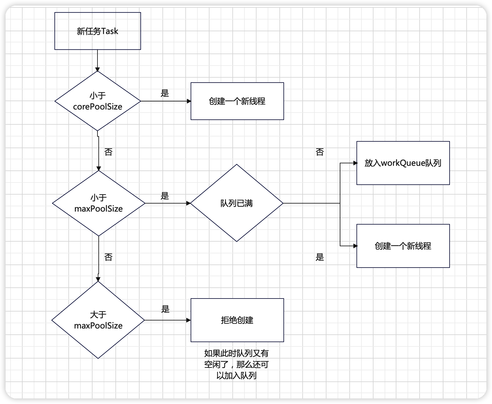

当来了一个新任务，添加线程的规则如下：

1. 如果线程数小于corePoolSize，即使其他工作线程处于空闲状态，也会创建一个新线程来运行新任务。

2. 如果线程数等于（或大于）corePoolSize但少于maxPoolSize，则将任务放入队列。

3. 如果队列已满，并且线程数小于maxPoolSize，则创建一个新线程来运行任务。

4. 如果队列已满，并且线程数大于或等于maxPoolSize，则拒绝该任务。

### 工作队列workQueue

有三种最常用的队列类型：

- `SynchronousQueue`:直接交接，也就是这个队列不存任务，有任务直接要么创建新线程要么就拒绝
- `LinkedBlockingQueue`:无界队列，无上限，一直可以存入任务
- `ArrayBlockingQueue`：有界队列

## java自带常见线程池

### newFixedThreadPool

使用`LinkedBlockingQueue`无界队列，超过核心线程池直接放入队列中，不会再创建新线程，容易造成大量内存占用，可能会导致OOM(内存耗尽)

```java
public class PoolTest {
    public static void main(String[] args) {
      	// 创建4个核心线程
        ExecutorService executorService = Executors.newFixedThreadPool(4);
        for (int i = 0; i < 100; i++) {
            executorService.execute(new Task());
        }
    }
}

class Task implements Runnable {
    @Override
    public void run() {
        try {
            Thread.sleep(500);
        } catch (InterruptedException e) {
            e.printStackTrace();
        }
        System.out.println(Thread.currentThread().getName());
    }
}
```

### newSingleThreadExecutor

使用`LinkedBlockingQueue`无界队列，永远都只有一个线程，单线程，全部加入队列中，当请求堆积的时候，可能会占用大量的内存

```java
public class PoolTest {
    public static void main(String[] args) {
        ExecutorService executorService = Executors.newSingleThreadExecutor();
        for (int i = 0; i < 100; i++) {
            executorService.execute(new Task());
        }
    }
}

class Task implements Runnable {
    @Override
    public void run() {
        try {
            Thread.sleep(500);
        } catch (InterruptedException e) {
            e.printStackTrace();
        }
        System.out.println(Thread.currentThread().getName());
    }
}
```

### newCachedThreadPool

可缓存线程池，可以自动回收多余线程

使用`SynchronousQueue`直接交接队列，不需要队列来存储任务，不需要队列中转，maxPoolSize为Integer.MAX_VALUE，会创建非常多的线程，同样可能导致OOM

```java
public class PoolTest {
    public static void main(String[] args) {
        ExecutorService executorService = Executors.newCachedThreadPool();
        for (int i = 0; i < 1000; i++) {
            executorService.execute(new Task());
        }
    }
}

class Task implements Runnable {
    @Override
    public void run() {
        try {
            Thread.sleep(500);
        } catch (InterruptedException e) {
            e.printStackTrace();
        }
        System.out.println(Thread.currentThread().getName());
    }
}
```

### ScheduledThreadPool

使用`DelayedWorkQueue`延迟队列，延迟一定时间才开始将任务加入线程池，支持定时及周期性任务执行的线程池

```java
public class PoolTest {
    public static void main(String[] args) {
        ScheduledExecutorService scheduledExecutorService = Executors.newScheduledThreadPool(10);
        // 延迟5秒执行
        scheduledExecutorService.schedule(new Task(),5, TimeUnit.SECONDS);
        // 第一次1秒执行，然后每隔3秒执行一次
        scheduledExecutorService.scheduleAtFixedRate(new Task(),1,3,TimeUnit.SECONDS);
    }
}

class Task implements Runnable {
    @Override
    public void run() {
        try {
            Thread.sleep(500);
        } catch (InterruptedException e) {
            e.printStackTrace();
        }
        System.out.println(Thread.currentThread().getName());
    }
```

### workStealingPool

当任务产生子任务时，使用这种线程池比较合适，比如树的相关问题，左右两边又要分左右，也就是有子任务，这种使用`workStealingPool`是比较合适的，暂时不研究

### 创建线程池

线程池最好是自己手动创建，明确线程池类型，工作队列类型，核心线程数，最大线程数等配置，创建最符合当前业务要求的线程池。

线程数量创建规则：

- CPU密集型(加密、计算hash等)：最佳线程数为CPU核心数的1-2倍左右
- 耗时IO型(读写数据库、文件、网络读写等)：最佳线程数一般会大于CPU核心数很多倍，因为主要用到的是磁盘或者网络来处理

上面的规则适合一般的线程池业务，最严谨的是做压力测试测出来，也可以按照下面的公式简单计算。

> 线程数 = CPU核心数 * (1 + 平均等待时间 / 平均工作时间)

## 线程池常用方法

### shutdown

停止线程池，但是不是立即停止，而是将线程池中存在的任务和队列中存在任务执行完成之后再停止，同时不在接收新任务。

```java
public class PoolTest {
    public static void main(String[] args) throws InterruptedException {
        ExecutorService executorService = Executors.newFixedThreadPool(10);
        for (int i = 0; i < 1000; i++) {
            executorService.execute(new Task());
        }
        // 两秒后停止线程池
        Thread.sleep(2000);
        executorService.shutdown();
        System.out.println("shutdown"); // 可以发现其实已经加入了非常多的任务到队列中
    }
}

class Task implements Runnable {
    @Override
    public void run() {
        try {
            Thread.sleep(500);
        } catch (InterruptedException e) {
            e.printStackTrace();
        }
        System.out.println(Thread.currentThread().getName());
    }
}
```

使用`isShutdown`方法判断shutdown方法是否执行成功，不表示是否完成终止任务：

```java
System.out.println(executorService.isShutdown());
```

使用`executorService.isTerminated()`true表示线程池和队列中的任务都已经全部完成

`awaitTermination`，表示等待一段时间，如果这段时间内执行完了则返回true，线程池和队列没执行完返回false

```java
System.out.println(executorService.awaitTermination(1,TimeUnit.SECONDS));
```

使用`shutdownNow`立即终端线程池，会将线程池里面的线程全部中断，然后将队列里面的线程返回，可以将这些保存起来，比如保存到日志，后期继续使用。

```java
public class PoolTest {
    public static void main(String[] args) throws InterruptedException {
        ExecutorService executorService = Executors.newFixedThreadPool(10);
        for (int i = 0; i < 1000; i++) {
            executorService.execute(new Task());
        }
        // 两秒后停止线程池
        Thread.sleep(2000);
        List<Runnable> runnables = executorService.shutdownNow();
    }
}

class Task implements Runnable {
    @Override
    public void run() {
        try {
            Thread.sleep(500);
            System.out.println(Thread.currentThread().getName());
        } catch (InterruptedException e) {
            System.out.println(Thread.currentThread().getName() + "被中断了");
        }
    }
}
```

## 任务拒绝策略

### 拒绝时机

- 当Executor被shutdown关闭之后，再提交任务会被拒绝
- 当达到最大线程且队列达到设计的workQueue容量时(比如`ArrayBlockingQueue`有界队列)

### 拒绝策略

- `AbortPolicy`：直接抛出异常
- `DiscardPolicy`：直接丢弃这个任务
- `DiscardOldestPolicy`：丢弃最老的任务
- `CallerRunsPolicy`：调用者运行此任务，谁(哪个线程)提交的这个任务，谁来执行这个任务，这样做不会有业务损失，比如主线程提交的任务，当使用此策略之后，主线程用来执行这个任务了，也就不能继续提交其它任务了

## 钩子方法

后面再研究

## 线程池的状态

| 状态       | 含义                                                         |
| ---------- | ------------------------------------------------------------ |
| RUNNING    | 接受新任务并处理排队任务                                     |
| SHUTDOWN   | 不接收新任务，但处理排队任务 `shutdown`                      |
| STOP       | 不接收新任务，不处理排队任务，中断正在进行的任务 `shutdownnow` |
| TIDYING    | 所有任务已经终止，workerCount为零时，线程会转换为此状态，会运行钩子方法 |
| TERMINATED | 运行完成 `isTerminated=true`所有任务都已经完成               |


## 自定义一个线程池

### 设计原理

准备一个任务容器

一次性启动10个消费者线程

刚开始任务容器是空的，所以线程都`wait`在上面

直到一个外部线程往这个任务容器中扔了一个任务，就会有一个消费者线程被唤醒`notify`

这个消费者线程取出任务，并且执行这个任务，执行完毕后，继续等待下一次任务的到来。

如果短时间内，有较多的任务加入，那么就会有多个线程被唤醒，去执行这些任务。

在整个过程中，都不需要创建新的线程，而是`循环使用这些已经存在的线程`

### 自定义线程池

创建任务

```java
package com.easylee.multithreading;

public class TestThread {
    public static void main(String[] args) {
        // 1.创建线程池
        ThreadPool pool = new ThreadPool();

        // 2.创建了5个任务
        for (int i = 0; i < 5; i++) {
            // 将任务添加到线程池，然后让线程池里的线程分别处理这五个任务
            pool.add(new Runnable() {
                @Override
                public void run() {
                    System.out.println("正在执行任务");
                }
            });

            try {
                Thread.sleep(1000);
            } catch (InterruptedException e) {
                // TODO Auto-generated catch block
                e.printStackTrace();
            }
        }

    }

}
```

线程池设计

```java
package com.easylee.multithreading;

import java.util.LinkedList;

public class ThreadPool {

    // 线程池大小
    int threadPoolSize;

    // 任务容器，这个是存放任务的容器，线程池独立开来的
    LinkedList<Runnable> tasks = new LinkedList<Runnable>();

    // 1.1 创建线程池
    public ThreadPool() {
        threadPoolSize = 10;

        // 启动10个任务消费者线程，创建后就是闲置等待状态
        // 基于锁定tasks的线程，不会让tasks中资源同时被多个线程操作
        synchronized (tasks) {
            for (int i = 0; i < threadPoolSize; i++) {
                // 创建具体的每个线程池中的线程
                new TaskConsumeThread("任务消费者线程 " + i).start();
            }
        }
    }
  
    // 1.2 消费者线程
    class TaskConsumeThread extends Thread {
        public TaskConsumeThread(String name) {
            super(name);
        }

        // 线程池中具体的某个任务
        Runnable task;

        public void run() {
            System.out.println("启动： " + this.getName());
            while (true) {
                synchronized (tasks) {
                    // 没有任务时，将线程任务池全部置为闲置
                    // 如果一直没有任务，将一直保持等待状态，并在此while循环
                    // 10个线程，就表示有10个线程在闲置在此处并循环
                    while (tasks.isEmpty()) {
                        try {
                          // 等待中，释放task对象，后面的代码就不会执行了，包括这个自己这个while，notifyAll之后才会继续执行while
                            tasks.wait();
                        } catch (InterruptedException e) {
                            // TODO Auto-generated catch block
                            e.printStackTrace();
                        }
                    }
                    // 当没有任务时，下面的代码都不会执行

                    // 当添加任务后，上面的代码不执行了，执行下面的代码完成任务
                    // 2.3 获取最后一个任务
                    task = tasks.removeLast();
                }
                System.out.println(this.getName() + " 获取到任务，并执行");
                task.run();
                // 执行完成后又继续返回上面开始等待
            }
        }
    }

    // 2.1 将任务添加到任务容器中，并通知线程池中所有线程唤醒
    public void add(Runnable r) {
        synchronized (tasks) {
            // 添加到任务容器中，但是线程还是等待中
            tasks.add(r);
            // 2.2 唤醒等待的任务消费者线程，让其继续执行后面的代码
            // 这里一唤醒，整个10个线程都被唤醒，继续执行其while
            tasks.notifyAll();
        }
    }

}
```

注意

等待永远是基于对象的线程等待，就是等待在这个对象上的线程，这个线程是在等待这个对象可以使用

当然这个对象不可以使用，那么基于这个对象的线程也就没有作用，闲置，只有这个对象被唤醒，这些线程才被唤醒

## java自带线程池

java提供自带的线程池，而不需要自己去开发一个自定义线程池了。

线程池类ThreadPoolExecutor在包java.util.concurrent下

```java
ThreadPoolExecutor threadPool= new ThreadPoolExecutor(10, 15, 60, TimeUnit.SECONDS, new LinkedBlockingQueue<Runnable>());
```

第一个参数10 表示这个线程池初始化了10个线程在里面工作

第二个参数15 表示如果10个线程不够用了，就会自动增加到最多15个线程

第三个参数60 结合第四个参数TimeUnit.SECONDS，表示经过60秒，多出来的线程还没有接到活儿，就会回收，最后保持池子里就10个
第四个参数TimeUnit.SECONDS 如上
第五个参数 new LinkedBlockingQueue() 用来放任务的集合

execute方法用于添加新的任务，独立于LinkedBlockingQueue集合任务的任务

```java
package multiplethread;

import java.util.concurrent.LinkedBlockingQueue;
import java.util.concurrent.ThreadPoolExecutor;
import java.util.concurrent.TimeUnit;

public class TestThread {
  public static void main(String[] args) throws InterruptedException {
      ThreadPoolExecutor threadPool= new ThreadPoolExecutor(10, 15, 60, TimeUnit.SECONDS, new LinkedBlockingQueue<Runnable>());

      threadPool.execute(new Runnable(){
          @Override
          public void run() {
              // TODO Auto-generated method stub
              System.out.println("任务1");
          }

      });
   
	}
}
```

 