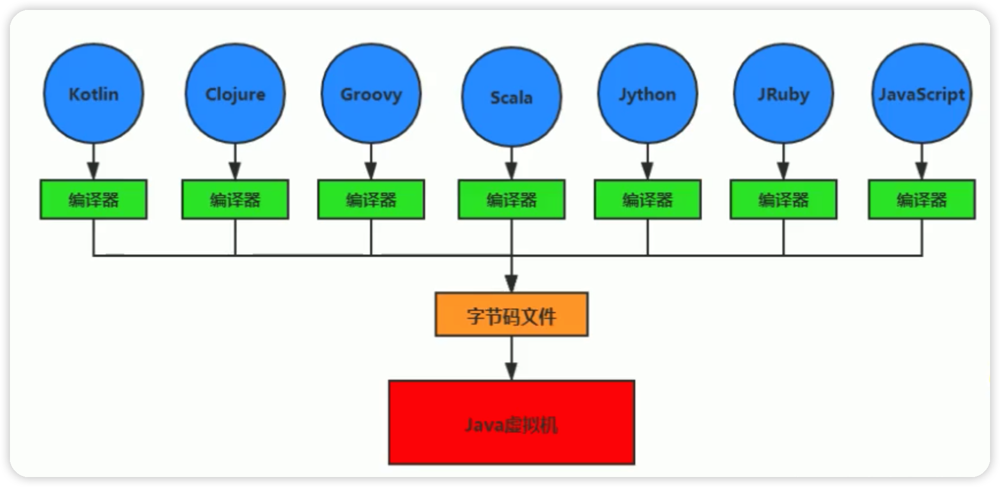
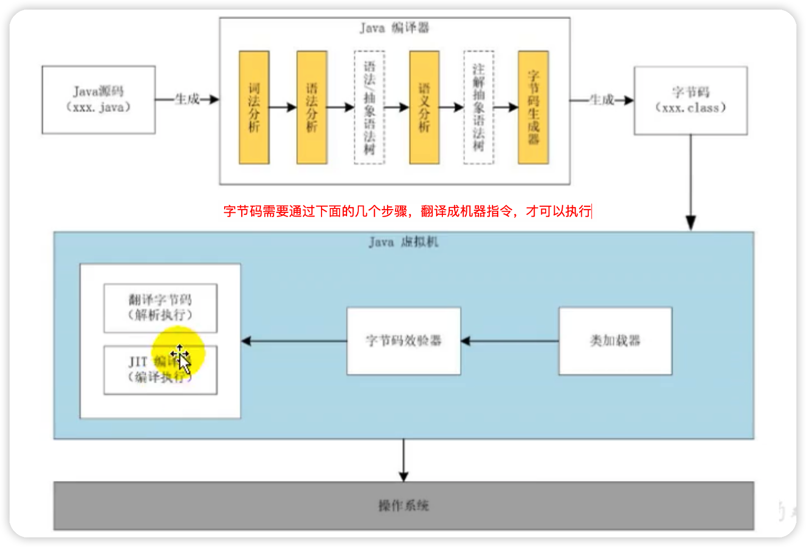

# jvm概述

jvm即java虚拟机，是用于将所有支持java虚拟机规范的语言生成的字节码编译成机器指令的工具。

学习java虚拟机，通过字节码，我们可以发现一些实现相同功能的不同代码的真正区别是什么，如果去解决线上系统卡死、无法访问、OOM内存溢出等问题，如果手动处理和优化JVM GC垃圾回收，自定义配置JVM的参数等。

java虚拟机不仅仅是java的运行平台，目前很多语言都是使用jvm作为运行平台，同时Graal VM还可以支持所有的语言，是一个跨语言全栈虚拟机。

## jvm的相关特点

- 一次编译，到处运行：只需要编写一次java代码，可以在多个操作系统平台之上运行，这句话的真实含义是，编写的代码通过编译成字节码之后，运行在jvm之上，而不同操作系统的jvm都完整的支持。

- 多语言支持：只要将代码编译成支持jvm规范的字节码文件，任何语言都可以运行，包括自己创造的语言。

上图中各个语言的编译器，是前端编译器，是将源代码编译成jvm识别的字节码，在java虚拟机中的编译器是后端编译器，则是将字节码文件编译成操作系统识别机器指令。

## jvm发展历史

- 2000年，JDK 1.3发布，Java Hotspot Virtual Machine 正式发布，成为Java默认的虚拟机。
- 2002年，JDK 1.4发布，古老的 **Classic** 虚拟机退出历中舞台。
- 2006年，JDR 6发布。同年，Java 开源并建立了 **openJDK**。顺理成章，Hotspot 虚拟机也成为了 OpenJDK 中的默认虚拟机。
- 2008年，oracle 收购了 BEA，得到了 **JRockit** 虛拟机。
- 2010年，Oracle 收购了 Sun，获得 Java 商标和最具价值的 **Hotspot** 虛拟机，并计划对 Hotspot 和 JRockit 两款虚拟机进行整合，但难度太大，因为两者从底层架构来讲就不相同。
- 2011年，JDK7 发布。在JDK 1.714中．正式启用了新的垃圾回收器 **G1**。
- 2017年，JDK9 发布。将 G1 设置为默认 GC，替代 CMS，同年，IBM的 **J9** 开源，形成了现在的open J9 社区
- 2018年，JDK11 发布，发布了革命性的 **ZGC**。
- 2019年，JDK12 发布，加入了RedHat领导开发的 Shenandoah GC。

## Java虚拟机

所谓虚拟机(Virtual Machine)，就是一台虚拟机的计算机。它是一款软件，用来执行一系列虚拟计算机指令。大体上，虚拟机可以分为系统虚拟机和程序虚拟机。

系统虚拟机是完全对物理计算机的仿真，如 VMware ，是**直接与硬件进行交互的**，程序虚拟机是专门为执行单个计算机程序而设计，如 Java 虚拟机，是**运行在操作系统之上的**，没有与硬件进行直接的交互。

Java 技术的核心就是 Java 虚拟机，是一台执行 Java 字节码的虚拟计算机，负责装载字节码到虚拟机内部，解释或编译为对应平台

上的机器指令执行。

主要的特点是：

- 一次编译，到处运行
- 自动内存管理
- 自动垃圾回收功能

## 主要的JVM虚拟机种类

- Sun Classic VM：世界上第一款商用Java虚拟机
- HotSpot VM：目前Java默认的虚拟机，使用最广的虚拟机
- BEA 的 JRockit：专注于服务器的，因为是服务器，不需要立马响应，所以内部不包含解析器，只有 JIT 及时编译器，最快的 JVM
- IBM 的 J9：在IBM内部使用时最快...
- Graal VM：跨语言全栈虚拟机，将所有语言都放在JVM虚拟机中执行，同时可以相互调用接口。

其它还有各个公司专门的虚拟机，以及各种高性能虚拟机，各有优劣，当一个公司使用Java到一定程度之后，就会考虑自己定制自己的JVM虚拟机，比如不需要某些功能和场景，可以自己来自定义，更适合公司业务。

## Java代码执行流程

- Java 源码通过 javac 命令，使用前端编译器将源码编译成字节码
- 通过类加载器将字节码加载进 JVM 虚拟机
- 使用翻译执行简单的字节码，使用 JIT 即时编译器编译热点代码，简单的代码，JVM 直接就可以解释，然后立即执行，不卡顿，但是一些需要反复执行的热点代码，需要使用 JIT 即时编译器来先编译，这样刚开始会卡顿，但是编译完成之后就比一句一句的反复翻译同样的代码要快，然后再统一执行，两者二选一，生成机器指令
- 将机器指令交给操作系统运行

## JVM的架构模型

Java编译器输入的指令流基本上是一种**基于栈的指令集架构**，还有一种指令集架构则是**基于寄存器的指令集架构**。

两种架构的区别是：

- 基于栈架构的特点：
  - 设计和实现简单，直接将操作数加入栈即可，适合资源受限的系统(比较小的系统，兼容Java ME)
  - 避开了寄存器的分配难题：使用零地址(没有地址，直接加入栈，按顺序执行)指令方式分配。
  - 因为是零地址指令方法，每一句指令没有地址，所以**指令集更小**，编译器更容易实现。(指令集就是每一句具体的指令)
  - 不需要硬件支持，可移植性更好，可以实现跨平台。(栈什么硬件都可以支持)
  - 每个指令集为8位。
- 基于寄存器的特点：
  - 指令集架构完全依赖硬件，可移植性差。(每一句指令，里面包含了地址和操作数，每一个指令集，每一个指令就更加复杂，也就更大)
  - 性能优秀和执行更高效，使用更少的指令去完成一项操作。
  - 使用寄存器架构的指令往往都以一地址指令、二地址指令和三地址指令为主。
  - 指令是直接由CPU来执行，而不是按照栈执行。
  - 每个指令集16位。

> 栈架构，每个指令的指令集更小，但是完成一项操作一个方法，总的指令就更多了，而寄存器架构，每个指令的指令集更大，但是完成意一项操作，总的指令数更少，可能一个操作，两条指令就搞定了，但是栈架构要10条指令。
>
> 栈：跨平台性好、指令集小、指令多、执行性能比寄存器差。

## JVM的生命周期

### 虚拟机的启动

Java虚拟机的启动是通过引号类加载器 (bootstrap class loader)创建一个初始类(initial class）米完成的，这个类是由虚拟机的具体实现指定的。

### 虚拟机的执行

一个运行中的Java虚拟机有着一个清晰的任务：执行Java程序。程序开始执行时他才运行，程序结束时他就停止。
**执行一个所谓的Java程序的时候，真真正正在执行的是一个叫做Java虛拟机的进程。**

### 虚拟机的退出

- 程序正常执行结束
- 程序在执行过程中遇到了异常或错误而异常终止
- 由于操作系统出现错误而导致Java虚拟机进程终止
- 某线程调用 Runtime 类或 System 类的 `exit` 方法，或 Runtime 类的 `halt` 方法，并且Java安全管理器也允许这次 exit halt操作。
- 除此之外，JNI ( Java Native Interface)规范描述了用JNIInvocation ApT来加载或卸载 Java 虚拟机时，Java 虚拟机的退出情况

