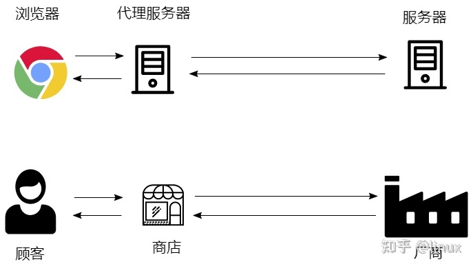
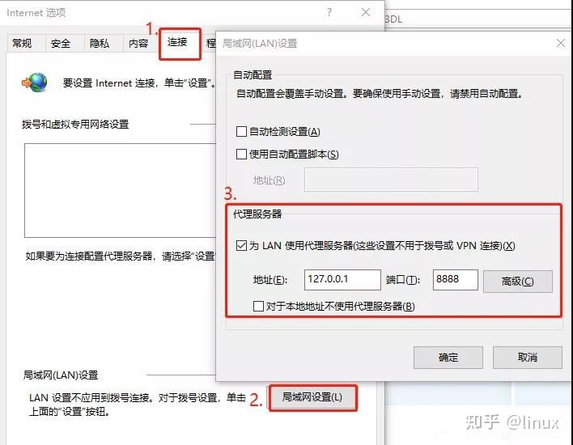
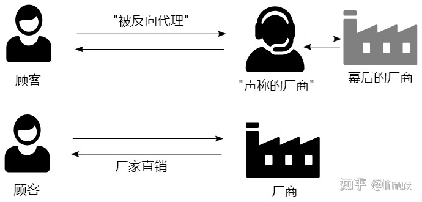
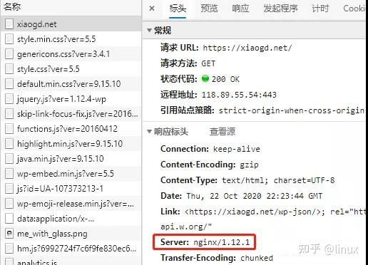
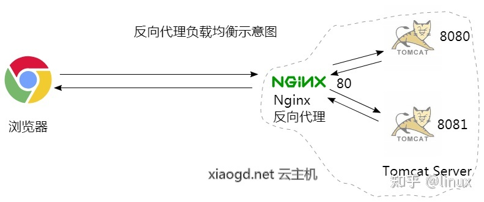
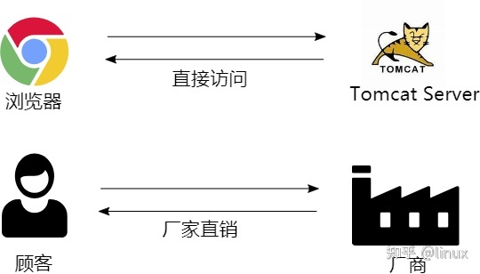
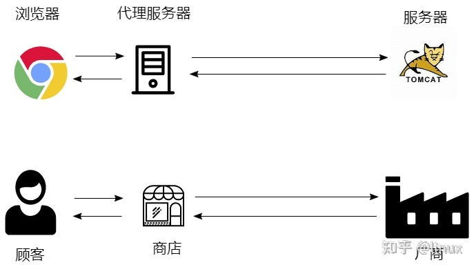
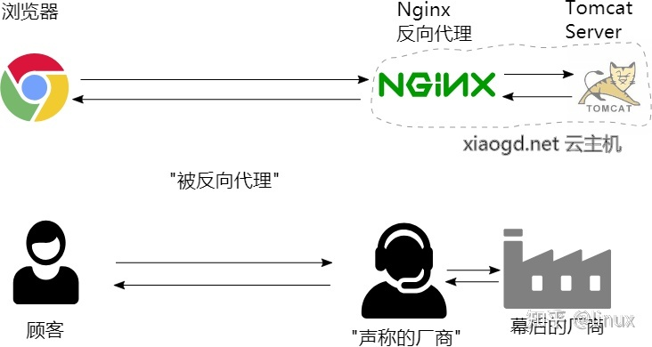

## 要理解什么是 **反向代理(reverse proxy)** , 自然你得先知道什么是 **正向代理(forward proxy)**.

> 另外需要说的是, 一般提到反向代理, 通常是指 http 反向代理, 但反向代理的范围可以更大, 比如 tcp 反向代理, 在这里, 不打算讨论 tcp 之类的反向代理, 当文中说到反向代理时, 指的就是 http 反向代理.

正向代理通常直接称为 **代理(proxy)**, 无需强调它是正向的, 在 http 协议中, 代理即指正向代理.

## **直接访问**

而要谈论什么是正向代理, 则需要先讨论"直接访问"的形式.

> 也就是没有任何代理的模式.

事实上, 直接访问对于很多的小网站来说是最常见的方式. 直接访问用我们日常购物来比喻的话就是类似于"厂家直销", 你直接向生产厂家下单, 没有经过任何的中间商.

从系统的角度看, "直接访问"就是浏览器的请求直接到了最终生成网页的服务器, 中间没有经过任何的 http 代理服务器. 那么代理或者说更啰嗦点的"正向代理"又是什么情况呢?

## **正向代理(forward proxy)**

还是用购物来比喻的话, 你从商店里而不是直接从厂家购买一个商品就类似于代理的模式.

> 比如, 你从商店里买了一盒方便面, 显然, 你很清楚, 商店本身是不生产方便面的, 它不过是个"中间商"而已, 转了一手, 顺便赚点你的钱, 店里的方便面也是它从厂商那边进货来的. 当然, 有些店雁过拔毛拔得有点狠, 那就变成让人厌恶的"中奸商"了.

那么, 对于浏览器的请求处理来说, 一个代理, 更确切的说一台代理服务器, 扮演的角色也是类似的, 它也就是一个请求的中间商而已.

一个正向代理服务器并没有直接响应请求的能力, 就像商店不生产方便面一样, 它不过是把请求转发到最终的网页服务器上, 再把后者的响应再转发给请求者, 也就是浏览器, 如下图所示:



但这里还有个问题, 你知道你家周围有哪些小商店, 你想买些东西的时候直接去找这些"代理商"即可, 问题是浏览器怎么知道代理服务器在哪?

> 最终的服务器浏览器是知道的, 比如你输入我的域名 "[http://xiaogd.net](https://link.zhihu.com/?target=http%3A//xiaogd.net)", 通过 DNS 系统浏览器就能查到对应的 ip 地址是 118.89.55.54, 可浏览器怎么知道哪里有代理服务器, 以及请求是否要经过代理服务器呢?

答案就是你要**主动地**告诉浏览器, 这个过程通常称为"配置代理服务器".

> 后面将看到, 这是正向代理与反向代理的一个重大的区别.
> 这是在 IE 浏览器上配置代理服务器的一个示意图:



### **为什么要启用代理?**

自然, 有人可能会问, 直接访问不香吗? 为何还要这么麻烦经过代理服务器去转手呢? 原因可以有以下这么一些.

一是出于安全审计及控制方面的一些考虑. 在一些组织内, web 相关的端口如 80 及 443 是被封禁的, 你在里面直接是根本上不去网的, 这时你要想上网, 就只能配置组织为你指定的一台内网的代理服务器了.

> 当然了, 代理服务器本身则没有被限制, 它是可以访问外部的网络的.

如此一来, 你的所有上网请求都要经过代理服务器, 而这个代理是由组织控制的, 就可以对请求进行审计了:

- 比如发现你往外面的一个网站上传组织内部的保密资料, 就出手阻止你;
- 又或发现你访问了一个不安全的网站, 可能会导致你的电脑中毒, 于是出手拦截了;
- 又或者是发现你在访问与工作无关的娱乐网站, 于是就给你阻断了~~(为了你的绩效及 KPI 达标, 组织也是操碎了心呀!)

还有一些原因则是出于加速或节省带宽等的考虑. 因为有的代理服务器它不仅能转发, 还能对网页以及其它一些资源进行缓存.

比如我以前在学校念书时, 就曾被学校告知在宿舍上网可以配置代理服务器, 我猜测原因可能是学校整体对外的带宽是有限的.

举个例子, 假如现在很多同学都要去上 [http://qq.com](https://link.zhihu.com/?target=http%3A//qq.com) 的主页, 那么第一个同学请求时, 代理服务器就可以把主页缓存起来一段时间, 碰到后面还要同学想访问这个主页, 就无需再去请求了, 代理服务器直接返回缓存的请求.

> 自然, 缓存也会有一个失效期的, 不会一直缓存下去, 否则内容就得不到更新了.
> 至于多长时间更新缓存, 怎么更新等这些就属于具体的缓存策略问题了.

当然了, 现在很多网页主页都有个性化推荐, 又或者直接就是要登录的, 那通常就无法缓存了, 所以现在配置代理服务器的行为现在也不那么时兴了, 当然也可能现在带宽也提高了, 另外很多人也不懂也不想去知道怎么配置这个代理服务器. 但另一方面, 很多静态资源还是可以缓存的, 比如图片呀, js, css 之类的文件等等, 所以用好了代理服务器依然还是可以发挥作用的.

最后再说一个原因, 由于国家已经决定, 有些国外的技术网站是访问不了的, 而我们又想上去查阅资料解决手中的 bug, 这时就需要一些科学的手段, 直接访问不行, 就必须通过代理来"曲径通幽"了.

> 严格来讲, 这里面很多的代理就是更广义的代理了, 而不是狭义上的 http 代理, 但原理是类似的, 也算是代理模式的一种体现. 经我们配置或一些智能插件的辅助, 浏览器知道直接对某些网站的请求会泥牛入海, 就像掉入了黑洞, 这时就要让这些请求"走代理"以绕过防火墙的限制了.
>
> 对于简单的代理配置来说, 就是配置一台代理服务器地址即可, 但这样有个问题, 那就是所有的请求都会走代理, 有一些高级的代理插件还允许你配置具体的规则, 即你可以配置哪些地址要走代理, 哪些又不走代理, 通常还会带一些预定义的规则, 各种白名单, 黑名单, 你还可以自己添加新的规则.

总之呢, 代理就是这么个中间的角色, 通过它间接访问到了所需资源, 而浏览器也是知道这么个角色的存在的, 因为你需要主动为浏览器去配置并启用. 那么这就是代理, 又或者说"正向代理".

**相关视频推荐**

[深入理解nginx中锁的使用：accept锁、自旋锁、互斥锁、信号量、条件变量](https://link.zhihu.com/?target=https%3A//www.bilibili.com/video/BV1kN411o76c/)

[16w行的nginx源码，如何才能读懂呢？全面分析nginx的机制](https://link.zhihu.com/?target=https%3A//www.bilibili.com/video/BV1Ep4y1p7gn/)

学习地址：[c/c++ linux服务器开发/后台架构师](https://link.zhihu.com/?target=https%3A//ke.qq.com/course/417774%3FflowToken%3D1013300)

需要C/C++ Linux服务器架构师学习资料加群**[812855908](https://link.zhihu.com/?target=https%3A//jq.qq.com/%3F_wv%3D1027%26k%3DgEmPlVSl)**获取（资料包括**C/C++，Linux，golang技术，Nginx，ZeroMQ，MySQL，Redis，fastdfs，MongoDB，ZK，流媒体，CDN，P2P，K8S，Docker，TCP/IP，协程，DPDK，ffmpeg**等），免费分享


## **反向代理(reverse proxy)**

明白了直接访问, 明白了所谓的正向代理, 下面就可以来说说反向代理是怎么回事了.

反向代理与正向代理的一个很大区别就是, 它不需要客户端(浏览器)去做什么配置, 并没有什么配置代理服务器的操作.

如果说正向代理是主动配置, 主动走代理, 那么反向代理则是"**被代理**", 从这点上看, 反向代理有时又称为"**透明代理**", 也即是浏览器都不知道自己被代理了, 浏览器以为发给它响应的就是最终的网页服务器, 其实不过是个"代理".

还是举购物的例子来比喻. 有时你在网上购物会看到有商家声称自己就是厂家, 东西都很便宜, 属于厂家直销, 于是你下单了. 过段时间, 你又发现有另一家店声称自己才是真正的厂家直销, 然后你仔细看了两家店铺的信息, 才发现前一个商家是假的, 它不是真的厂家.

但为啥这个假的厂家直销它还是这么便宜呢? 以至于价格跟真的厂家直销的没啥区别. 原因可能则是店家直接就是坐落在厂家旁边, 然后他可能与厂家有那么点关系, 认识里面一些人之类的, 这让他能以很便宜的价格从厂家拿到货, 又因为离得近, 几乎没有任何物流成本, 从某种层面看, 它声称厂家直销也不算怎么骗人. 当然严格来说, 它属于伪厂家直销, 他依然还是个代理商

> 它声称是李逵, 其实它是李鬼.

用一个图对比一下这两种情形:



那么这样的一种模式就有点 **反向代理** 的味道了, 你以为自己买到了直销, 其实你还是"被代理"了, 还是经过了中间商.

> 只是这个中间商对你来说不是那么明显, 甚至说对你是透明的, 把你蒙在了鼓里.
> 虽然都是"代理", 这跟线下店面购买还是很不同的, 在线下你去商店买时, 你很清楚自己经过了代理的中间商, 也即是商店本身, 但在远程线上这种声称自己是厂家直销的情形, 有时你还真不好判断自己是不是被代理了.

那么 http 的反向代理其实也是这样一个道理. 比如你访问我的网站 [https://xiaogd.net](https://link.zhihu.com/?target=https%3A//xiaogd.net), 然后你看下主页的请求里的服务器信息, 它告诉你响应这个主页请求的是一台 Nginx server, 如下图所示:



问题是 Nginx 是最终生成这个网页的 server 吗? 其实不是的! 如果你了解 Nginx, 就会知道它通常只是一个静态资源服务器, 而我的网站主页是一个动态生成的内容, 其实你要是认真看过我网站底部的一个声明, 如下图所示:


就会明白这个主页其实是 php 的一个叫 wordpress 的建站应用去生成的. 在我的云主机的内部, Nginx 其实是将主页的请求转发给一个所谓的 php-fpm 网关

> 这个 php-fpm 网关基本可以看作是个 php 的 web 服务器, 不过严格来说它用的协议不是 http, 而是一种内部简化的 fastcgi 协议.
> 如果你要较真的话, 这可以算是 反向代理 模式, 但整体不全是 http 反向代理, 但对外而言则确实是.

从它那里取得最终响应的内容, 并再次转发给浏览器, 整个情形见如下的示意图:


这是内部配置的一个情况:

```text
location ~ .php$ {
    root           /ftp/wwwroot;
    fastcgi_pass   127.0.0.1:9000;
    fastcgi_index  index.php;
    fastcgi_param  SCRIPT_FILENAME  $document_root/$fastcgi_script_name;
    include        fastcgi_params;
}
```

请求被转发到内部一个在 9000 端口上监听的 php 应用服务器.

从外部浏览器的角度看, 请求直接发给了 Nginx server, 响应也从 Nginx server 里回来了, 中间没有任何的(正向)代理. 至于说你内部请求又被怎么转发了, 显然浏览器是无从知道也不需要去知道的.

站在整个体系设计者的角度去看, 当然但很多请求 Nginx 其实是没有能力去响应的, 它只不过在内部把它代理给了另一个内部的 php 应用服务器, 内部的 php 应用服务器才是最终的响应生成者.

在整个体系里面, Nginx 的角色就是一个"反向代理"服务器, 浏览器被代理了, 但它无从知道自己是否被代理了, 这一切对它而言是透明的, 反正它自己是没有主动走(正向)代理的.

当然了, 你现在知道了我内部的配置, 如果直接访问 [http://xiaogd.net:9000](https://link.zhihu.com/?target=http%3A//xiaogd.net%3A9000), 那就是真正的"直接访问"了, 那就绕过了 Nginx.

> 不过需要说明的一点是, 直接访问是访问不通的, 因为 9000 端口并没有对外放开. 但是在内部是可以访问到的, 比如这样尝试用 wget 去访问:
> wget localhost:9000
>
> 这样就是真正的"直接访问"了, 没有任何的代理, 既没有正向代理, 也没有反向代理.
> 需要说明的一点是, 用 wget 这样去获取响应还是会报错, 因为 wget 使用的是 http 协议, php 的 cgi 网关实际使用的是 fastcgi 协议, 是一个比 http 更为简化的协议, 作为内部通讯更加高效, 不过 wget 不支持这个协议, 但 Nginx 能理解这个协议, 整个过程是这样的:
> browser -- [http] --> Nginx -- [fastcgi] --> php-fpm
> 严格来说, 不完全是 http 代理, 内部的反向代理实际用的是 fastcgi 网关协议, 不过这个原理还是一样的, 如果内部用一个比如 tomcat 来响应, 那么全程就都可以是 http 协议.
> browser -- [http] --> Nginx -- [http] --> tomcat
> 而如果在内部发请求 80, 比如 `wget localhost` 那就还是被反向代理, 请求先到在 80 端口监听的 Nginx, Nginx 再转给 php-fpm.
> 另: 关于端口及缺省端口相关知识, 可以参考这篇深入理解端口.

### **为什么要使用反向代理?**

那么到了这一步我们又面临一个新的问题, 那就是为啥要整这个反向代理呢? 类似于碰到正向代理时的诘问那样, 直接访问不香吗? 为啥还要走这个反向代理? 关于正向代理前面已经解释了一些原因, 而反向代理的出现, 正像这个世界上没有无缘无故的爱与恨一样, 自然也有它存在的原因.

一个很直接的原因就是利用反向代理可以作为内部 **负载均衡(load balance)** 的手段.

举个例子来说, 假如我现在开发了一个 java web 的应用作为我的网站后台, 我直接部署它到 tomcat 服务器上, 让 tomcat 监听 80 端口, 直接对外服务. 一开始访问量也不大, 所以这样也是没有问题的, 如下图所示:


> 注: 因为 http 协议的缺省端口就是 80, 所以用户输入地址时可以省略这个端口号, 也即只需这样: [http://xiaogd.net](https://link.zhihu.com/?target=http%3A//xiaogd.net), 而不是繁琐的像这样: [http://xiaogd.net:80](https://link.zhihu.com/?target=http%3A//xiaogd.net%3A80), 关于缺省端口的话题, 还是可以参考前面所提的 深入理解端口.

但过一段时间之后, 访问量可能上来了, 一个 tomcat 进程处理不过来, 那怎么办呢? 于是我打算再起一个新的 tomcat 进程, 但这样就面临一个问题, 只有一个 80 端口, 它已经被第一个 tomcat 进程占用, 如果还要再起另外一个, 则只能选用其它的端口, 比如 8080.

当使用另外一个端口时, 确实可以启动两个 tomcat 的进程, 但用户想访问到第二个 tomcat 进程的服务, 却要这样去访问: [http://xiaogd.net:8080](https://link.zhihu.com/?target=http%3A//xiaogd.net%3A8080). 显然, 这样的方案是有问题的, 用户根本不知道 8080 端口上服务的存在, 就算你有办法告诉用户, 用户也可能不太理解, 用户同时也很怕麻烦的, 为啥要我输入一个冒号加 8080 呢?

此外, 就算有些用户愿意如你所说转向访问 8080 端口, 你还是不能很好的控制把访问量平均地分配在两个 tomcat 上, 毕竟这是用户随机决定的, 也许很多用户又突然涌过来了 8080 端口的应用上, 造成了这边的拥挤.

又或者只有很少的用户愿意听从你的劝告转到新的 8080 端口上, 访问还是集中在旧的 80 端口上的, 这样旧的应用上响应还是很缓慢, 而新的应用却因为没几个用户访问而显得空闲, 没有得到充分的使用.

那么, 在这种情况下, 反向代理的好处就体现出来了, 具体的操作是这样的, 让 Nginx 作为一个前置的反向代理, 监听在 80 端口上; 而第一个 tomcat 则躲到幕后, 同时它也不再监听 80 端口(需要让给 Nginx), 而改为监听一个其它没有被使用的端口, 比如 8081, 然后让 Nginx 转发请求给它处理.

当然了, 如果只有一个 tomcat, 配置大概是这样的:

```text
location / {
    proxy_pass   http://127.0.0.1:8080;
}
```

请求处理的流程是这样的:

> 请求: browser -- [http] --> Nginx -- [http] --> tomcat
> 响应: browser <-- [http] -- Nginx <-- [http] -- tomcat

自然, 这种情形下反向代理似乎不太必要, 还加多了一个环节, 响应速度反而慢了.

但如果有两个 tomcat, 情况就不一样了, 此时就可以在 Nginx 这个反向代理的层面, 启用负载均衡的策略, 大概的配置如下:

```text
http {
    upstream myapp1 {
        server 127.0.0.1:8080;
        server 127.0.0.1:8081;
    }

    server {
        listen 80;

        location / {
            proxy_pass http://myapp1;
        }
    }
}
```

此时, 如果同时涌入了很多请求, Nginx 会把一半的请求交给 8080 端口上的 tomcat, 另一半的请求交给 8081 端口上的 tomcat, 如下图所示:



对外来看, 所有请求还是 Nginx 来处理, 用户不需要去做选择, 也不需要知道什么 8080, 8081 端口上应用的存在, 他们还是继续访问原来的网址 [http://xiaogd.net](https://link.zhihu.com/?target=http%3A//xiaogd.net) 即可, 无需做任何改变.

如果你在云上有好几台主机, 甚至还可以将其组成一个内网, 然后将 tomcat 部署在不同的主机上. 比如有三台主机的话, 一台运行 Nginx 监听 80 端口, 其余两台运行 tomcat, 分别监听 8080 和 8081 端口, 同时接受并处理 Nginx 反向代理过来的请求, 如下图所示:


如果两台 tomcat 主机的配置不同, 比如一台的性能更强劲些, 还可以调整负载的比例(即权重, weight), 让性能更强的一台承担更多的请求:

```text
http {
    upstream myapp1 {
        server 192.168.0.20:8080 weight=3;
        server 192.168.0.21:8080 weight=2;
    }

    server {
        listen 80;

        location / {
            proxy_pass http://myapp1;
        }
    }
}
```

如上配置 3:2 的权重比, 让其中一台承担 60% 的请求, 而另一台性能较差的则承担 40%, 也即每 5 个请求, 3 个会被转到 ip 为 20 的主机上, 2 个会转到 ip 为 21 的主机上.

自然, 有人可能还会有疑问, 所有请求都还是要经过 Nginx, 它能处理得过来吗? 答案是可以的, 因为它的功能仅仅是转发, 这就有点像美团外卖, 虽然它每天接受成千上万的人的点餐, 但它自己不需要去买菜, 洗菜, 切菜, 炒菜等, 它仅仅需要把订单交给饭店餐馆, 然后把它们做好的饭菜配送出去, 也即那些耗时的做饭过程都交给了饭店餐馆处理.

在这种反向代理的模式中, 同样的, 生成网页这个重任交到了隐藏在背后的 tomcat, 生成一个复杂的动态网页可能需要经过一些复杂的计算, 要查询数据库, 要拼凑各个页面组件, 可能会比较耗时, 但这些请求被两个 tomcat 应用并发地处理了, 因此响应的速度还是得到了保证, 而这些就是反向代理能给我们带来的好处.

## **总结**

至此, 关于直接访问, (正向)代理以及反向代理就介绍完了, 最后总结下三种情形及与购物例子的比喻.

在直接访问的情形中, 浏览器直接访问了最终生成响应的服务器, 类似我们以厂家直销的方式从厂商购物, 如下图所示:



在(正向)代理的情形中, 浏览器主动访问代理服务器, 通过它间接获取最终响应, 类似我们从商店购物, 而商店的物品又是从厂家购来的, 如下图所示:



在反向代理的情形中, 从浏览器的角度看还是类似于直接访问, 但它的请求在服务端被透明的代理了. 类似于我们在网上从一个声称是厂家直销的"伪厂家"那里购物, 这个伪厂家实际还是把我们的订单转给了真正的厂家, 并从中拿了货给我们, 只是我们无从知道这一切幕后的交易, 如下图所示:



在一个复杂的网络中, 浏览器的请求还可能先被正向代理了, 然后又被反向代理了, 如下图所示::


关于 http 正向代理和反向代理就讲到这里.