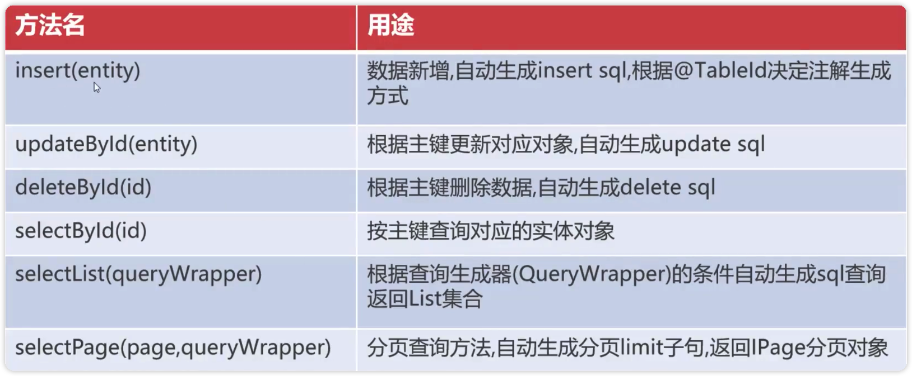

# MyBatis-Plus

MyBatis-Plus是一个Mybatis的增强工具，自动实现Mapper CRUD操作，极致提高数据库开发效率，在Mybatis的基础上只做增强不做改变。


# 整合进Spring项目

### 添加mybatis-plus依赖

```xml
<!--整合mybatis-plus-->
<dependency>
    <groupId>com.baomidou</groupId>
    <artifactId>mybatis-plus</artifactId>
    <version>3.3.2</version>
</dependency>
```

### Spring XMl更改配置SqlSessionFactory实现类

修改`applicationContext.xml`，讲SqlSessionfactory的bean修改为mybatis-plus类，其它项目不需要修改

```xml
 <!--mybatis-plus 容器类-->
<bean id="sessionFactory" class="com.baomidou.mybatisplus.extension.spring.MybatisSqlSessionFactoryBean">
    <property name="dataSource" ref="dataSource" />
    <property name="mapperLocations" value="classpath:mappers/*.xml"/>
    <!--用于指定mybatis配置文件地址-->
    <property name="configLocation" value="classpath:mybatis-config.xml"/>
</bean>
```

### mybatis-config.xml增加MP分页插件

修改mybatis-config.xml配置文件，修改mybatis增加MP分页插件

```xml
<configuration>
    <settings>
        <!--mybatis实现属性名和字段名的自动驼峰命名转换 字段名一般都是小写而属性都是驼峰-->
        <setting name="mapUnderscoreToCamelCase" value="true"/>
    </settings>
    <plugins>
        <!--配置Mybatis-Plus分页插件-->
        <plugin interceptor="com.baomidou.mybatisplus.extension.plugins.PaginationInterceptor"></plugin>
    </plugins>
</configuration>
```

# MyBatis-Plus基础开发

### 创建实体类，设置对应映射

- @TableName-将实体类与表名映射
- @TableId-说明对应属性是表的主键
- @TableField-设置属性与列名的对应关系

然后创建与数据表对应的实体类并设置对应的映射关系，并记得创建对应的getter、setter方法

```java
@TableName("test")
public class Test {
    @TableId("id")
    @TableField("id")
    private int id;
    @TableField("content")
    private String content;
}
```

### 创建Mapper接口继承BaseMapper，并创建对应Mapper XMl

修改Mapper的继承关系，并将自己写的insert修改一下名字，因为和MP的insert重名

```java
public interface TestMapper extends BaseMapper<Test> {
    public void insertSample();
}
```

可以注意到使用MP就不需要配置Mapper Xml了，但是如果要使用自己的方法时，还是需要创建

创建一个测试类

```java
@RunWith(SpringJUnit4ClassRunner.class)
@ContextConfiguration(locations = {"classpath:applicationContext.xml"})
public class MybatisPlusTest {
    @Resource
    private TestMapper testMapper;

    @org.junit.Test
    public void  testInsert() {
        Test test = new Test();
        test.setContent("我是MP测试");
        testMapper.insert(test);
    }
}
```

### 注入Mapper对象，通过内置API实现CRUD操作

BaseMapper接口核心常用API



常用方法演示：

```java
@RunWith(SpringJUnit4ClassRunner.class)
@ContextConfiguration(locations = {"classpath:applicationContext.xml"})
public class MybatisPlusTest {
    @Resource
    private TestMapper testMapper;

    @org.junit.Test
    public void  testInsert() {
        Test test = new Test();
        test.setContent("我是MP测试");
        testMapper.insert(test);
    }

    @org.junit.Test
    public void testUpdate() {
        Test test = testMapper.selectById(22);
        test.setContent("你才是MP测试");
        testMapper.updateById(test);
    }

    @org.junit.Test
    public void testDelete() {
        testMapper.deleteById(22);
    }

    @org.junit.Test
    public void testSelect() {
        // queryWrapper用于设置查询条件，可以设置多重条件
        QueryWrapper<Test> queryWrapper = new QueryWrapper<>();
        queryWrapper.eq("id", 21);
        List<Test> list = testMapper.selectList(queryWrapper);
        System.out.println(list);
    }
}
```


其它常用方法可以在官网查看，都非常简单