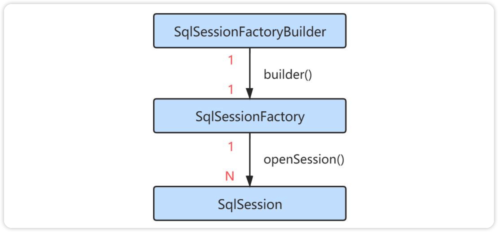
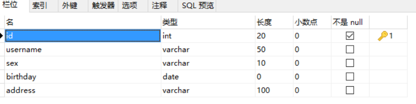
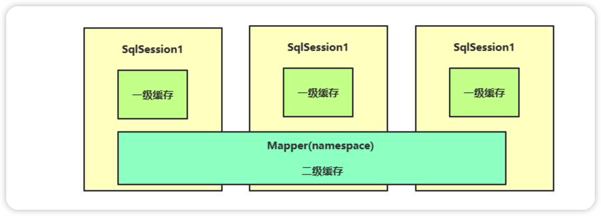
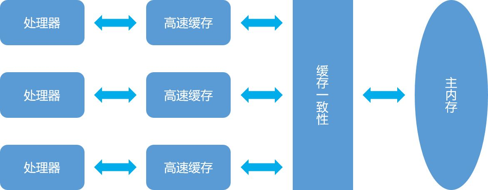
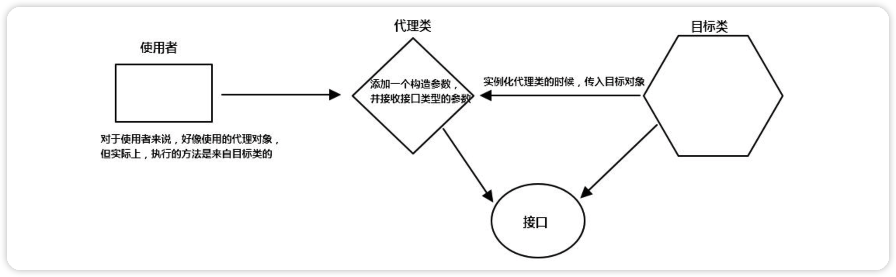

# 认识Mybatis

在前面JDBC的学习中，虽然我们能够通过JDBC来连接和操作数据库，但是哪怕只是完成一个SQL语句的执行，都需要编写大量的代码，更不用说如果我还需要进行实体类映射，将数据转换为我们可以直接操作的实体类型，JDBC很方便，但是还不够方便，我们需要一种更加简洁高效的方式来和数据库进行交互。

再次强调：学习厉害的框架或是厉害的技术，并不是为了一定要去使用它，而是它们能够使得我们在不同的开发场景下，合理地使用这些技术，以灵活地应对需要解决的问题。


MyBatis 是一款优秀的持久层框架，它支持定制化 SQL、存储过程以及高级映射。**MyBatis避免了几乎所有的JDBC代码和手动设置参数以及获取结果集**。MyBatis 可以使用简单的 XML 或注解来配置和映射原生信息，将接口和 Java 的 POJOs(Plain Ordinary Java Object,普通的 Java对象)映射成数据库中的记录。

我们依然使用传统的jar依赖方式，从最原始开始讲起，不使用Maven，有关Maven内容我们会在后面统一讲解！全程围绕官方文档讲解！

这一块内容很多很杂，再次强调要多实践！

# XML语言概述

在开始介绍Mybatis之前，XML语言发明最初是用于数据的存储和传输，它可以长这样：

```xml
<?xml version="1.0" encoding="UTF-8" ?>
<outer>
  <name>阿伟</name>
  <desc>怎么又在玩电动啊</desc>
	<inner type="1">
    <age>10</age>
    <sex>男</sex>
  </inner>
</outer>
```

如果你学习过前端知识，你会发现它和HTML几乎长得一模一样！但是请注意，虽然它们长得差不多，但是他们的意义却不同，HTML主要用于通过编排来展示数据，而XML主要是存放数据，它更像是一个配置文件！当然，浏览器也是可以直接打开XML文件的。

一个XML文件存在以下的格式规范：

* 必须存在一个根节点，将所有的子标签全部包含。
* 可以但不必须包含一个头部声明（主要是可以设定编码格式）
* 所有的标签必须成对出现，可以嵌套但不能交叉嵌套
* 区分大小写。
* 标签中可以存在属性，比如上面的`type="1"`就是`inner`标签的一个属性，属性的值由单引号或双引号包括。

XML文件也可以使用注释：

```xml
<?xml version="1.0" encoding="UTF-8" ?>
<!-- 注释内容 -->
```

通过IDEA我们可以使用`Ctrl+/`来快速添加注释文本（不仅仅适用于XML，还支持很多种类型的文件）

如果嫌一个一个改太麻烦，也可以使用CD来快速创建不解析区域：

```xml
<test>
    <name><![CDATA[我看你<><><>是一点都不懂哦>>>]]></name>
</test>
```

那么，我们现在了解了XML文件的定义，现在该如何去解析一个XML文件呢？比如我们希望将定义好的XML文件读取到Java程序中，这时该怎么做呢？

JDK为我们内置了一个叫做`org.w3c`的XML解析库，我们来看看如何使用它来进行XML文件内容解析：

```java
// 创建DocumentBuilderFactory对象
DocumentBuilderFactory factory = DocumentBuilderFactory.newInstance();
// 创建DocumentBuilder对象
try {
    DocumentBuilder builder = factory.newDocumentBuilder();
    Document d = builder.parse("file:mappers/test.xml");
    // 每一个标签都作为一个节点
    NodeList nodeList = d.getElementsByTagName("test");  // 可能有很多个名字为test的标签
    Node rootNode = nodeList.item(0); // 获取首个

    NodeList childNodes = rootNode.getChildNodes(); // 一个节点下可能会有很多个节点，比如根节点下就囊括了所有的节点
    //节点可以是一个带有内容的标签（它内部就还有子节点），也可以是一段文本内容

    for (int i = 0; i < childNodes.getLength(); i++) {
        Node child = childNodes.item(i);
        if(child.getNodeType() == Node.ELEMENT_NODE)  //过滤换行符之类的内容，因为它们都被认为是一个文本节点
        System.out.println(child.getNodeName() + "：" +child.getFirstChild().getNodeValue());
        // 输出节点名称，也就是标签名称，以及标签内部的文本（内部的内容都是子节点，所以要获取内部的节点）
    }
} catch (Exception e) {
    e.printStackTrace();
}
```

当然，学习和使用XML只是为了更好地去认识Mybatis的工作原理，以及如何使用XML来作为Mybatis的配置文件，这是在开始之前必须要掌握的内容（使用Java读取XML内容不要求掌握，但是需要知道Mybatis就是通过这种方式来读取配置文件的）

不仅仅是Mybatis，包括后面的Spring等众多框架都会用到XML来作为框架的配置文件！

# 初次使用Mybatis

那么我们首先来感受一下Mybatis给我们带来的便捷，就从搭建环境开始，中文文档网站：https://mybatis.org/mybatis-3/zh/configuration.html

我们需要导入Mybatis的依赖，Jar包需要在github上下载，如果卡得一匹，连不上可以在视频简介处从分享的文件中获取。同样地放入到项目的根目录下，右键作为依赖即可！（依赖变多之后，我们可以将其放到一个单独的文件夹，不然会很繁杂）

## 编写mybatis配置文件

依赖导入完成后，我们就可以编写Mybatis的配置文件了（现在不是在Java代码中配置了，而是通过一个XML文件去配置，这样就使得硬编码的部分大大减少，项目后期打包成Jar运行不方便修复，但是通过配置文件，我们随时都可以去修改，就变得很方便了，同时代码量也大幅度减少，配置文件填写完成后，我们只需要关心项目的业务逻辑而不是如何去读取配置文件）我们按照官方文档给定的提示，在项目根目录下新建名为`mybatis-config.xml`的文件，并填写以下内容：

```xml
<?xml version="1.0" encoding="UTF-8" ?>
<!DOCTYPE configuration
  PUBLIC "-//mybatis.org//DTD Config 3.0//EN"
  "http://mybatis.org/dtd/mybatis-3-config.dtd">
<configuration>
  <environments default="development">
    <environment id="development">
      <transactionManager type="JDBC"/>
      <dataSource type="POOLED">
        <property name="driver" value="${驱动类（含包名）}"/>
        <property name="url" value="${数据库连接URL}"/>
        <property name="username" value="${用户名}"/>
        <property name="password" value="${密码}"/>
      </dataSource>
    </environment>
  </environments>
</configuration>
```

### environment常用配置

```xml
<environments default="development">
    <environment id="development">
        <transactionManager type="JDBC"/>
        <dataSource type="POOLED">
            <property name="driver" value="com.mysql.cj.jdbc.Driver"/>
            <property name="url" value="jdbc:mysql://localhost:3306/mybatis"/>
            <property name="username" value="root"/>
            <property name="password" value="root"/>
        </dataSource>
    </environment>
</environments>
```

我们发现，在最上方还引入了一个叫做`DTD`（文档类型定义）的东西，它提前帮助我们规定了一些标签，我们就需要使用Mybatis提前帮助我们规定好的标签来进行配置（因为只有这样Mybatis才能正确识别我们配置的内容）

通过进行配置，我们就告诉了Mybatis我们链接数据库的一些信息，包括URL、用户名、密码等，这样Mybatis就知道该链接哪个数据库、使用哪个账号进行登陆了（也可以不使用配置文件，这里不做讲解，还请各位小伙伴自行阅读官方文档）

## 第一个mybatis

### 创建sqlSession运行sql会话

配置文件完成后，我们需要在Java程序启动时，让Mybatis对配置文件进行读取并得到一个`SqlSessionFactory`对象：

```java
public static void main(String[] args) throws FileNotFoundException {
    SqlSessionFactory sqlSessionFactory = new SqlSessionFactoryBuilder().build(new FileInputStream("mybatis-config.xml"));
    try (SqlSession sqlSession = sqlSessionFactory.openSession(true)){
			//暂时还没有业务
    }
}
```

直接运行即可，虽然没有干什么事情，但是不会出现错误，如果之前的配置文件编写错误，直接运行会产生报错！那么现在我们来看看，`SqlSessionFactory`对象是什么东西：



每个基于 MyBatis 的应用都是以一个 SqlSessionFactory 的实例为核心的，我们可以通过`SqlSessionFactory`来创建多个新的会话，`SqlSession`对象，每个会话就相当于我不同的地方登陆一个账号去访问数据库，你也可以认为这就是之前JDBC中的`Statement`对象，会话之间相互隔离，没有任何关联。

而通过`SqlSession`就可以完成几乎所有的数据库操作，我们发现这个接口中定义了大量数据库操作的方法，因此，现在我们只需要通过一个对象就能完成数据库交互了，极大简化了之前的流程。

### 创建实体类映射数据库数据

我们来尝试一下直接读取实体类，读取实体类肯定需要一个映射规则，比如类中的哪个字段对应数据库中的哪个字段，在查询语句返回结果后，Mybatis就会自动将对应的结果填入到对象的对应字段上。首先编写实体类，直接使用Lombok是不是就很方便了：

```java
import lombok.Data;

@Data
public class Student {
    int sid;   //名称最好和数据库字段名称保持一致，不然可能会映射失败导致查询结果丢失
    String name;
    String sex;
}
```

### 创建mapper关联sql语句

sql语句和实体类以及运行关系(运行时要指定这个mapper的id)的映射

在根目录下重新创建一个mapper文件夹，新建名为`TestMapper.xml`的文件作为我们的映射器，并填写以下内容：

```xml
<?xml version="1.0" encoding="UTF-8" ?>
<!DOCTYPE mapper
        PUBLIC "-//mybatis.org//DTD Mapper 3.0//EN"
        "http://mybatis.org/dtd/mybatis-3-mapper.dtd">
<mapper namespace="com.easylee.TestMapper">
    <select id="selectStudent" resultType="com.test.entity.Student">
        select * from student
    </select>
</mapper>
```

### namespace

namespace其实就是xml文件的package报名，只是xml不可以写报名而已

其中namespace就是命名空间，每个Mapper都是唯一的，因此需要用一个命名空间来区分，它还可以用来绑定一个接口。我们在里面写入了一个select标签，表示添加一个select操作，同时id作为操作的名称，resultType指定为我们刚刚定义的实体类，表示将数据库结果映射为`Student`类，然后就在标签中写入我们的查询语句即可。

### 绑定到总配置文件

让mapper文件生效

编写好后，我们在mybatis总配置文件中添加这个Mapper映射器：

```xml
<mappers>
    <mapper url="file:src/main/java/mapper/UserMapper.xml"/>
    <!--    这里用的是url，也可以使用其他类型，我们会在后面讲解    -->
</mappers>
```

### 运行mapper文件

最后在程序中使用我们定义好的Mapper即可：

```java
public static void main(String[] args) throws FileNotFoundException {
    SqlSessionFactory sqlSessionFactory = new SqlSessionFactoryBuilder().build(new FileInputStream("mybatis-config.xml"));
    try (SqlSession sqlSession = sqlSessionFactory.openSession(true)){
      	// selectList方法指定了这次操作是selectList，一般不用这种方法，而是将要做增删改查具体的操作写到一个Mapper接口文件中，里面指定具体的增删改查操作，而不是在这里调用sqlSession的增删改查方法
        List<Student> student = sqlSession.selectList("selectStudent");
        student.forEach(System.out::println);
    }
}
```

我们会发现，Mybatis非常智能，我们只需要告诉一个映射关系，就能够直接将查询结果转化为一个实体类！

## 使用细节

### 常见bug

#### java.io.FileNotFoundException: mybatis-config.xml (No such file or directory)

解决方案1：需要在pom.xml中build将xml文件和配置文件全部生成，同时是用完整的file路径，从src开始

```java
sqlSessionFactory = new SqlSessionFactoryBuilder().build(new FileInputStream("src/main/resources/mybatis-config.xml"));
```

解决方案2：使用官方推荐的mybatis资源获取方法，使用类路径(推荐)

```java
// 直接输入resources目录下的名称即可，相当于maven生成之后target下面的classes根目录
String resource = "mybatis-config.xml";
InputStream inputStream = Resources.getResourceAsStream(resource);
sqlSessionFactory = new SqlSessionFactoryBuilder().build(inputStream);
```

# 配置Mybatis

在了解了Mybatis为我们带来的便捷之后，现在我们就可以正式地去学习使用Mybatis了！

## 创建mybatis工具类

由于`SqlSessionFactory`一般只需要创建一次，因此我们可以创建一个工具类来集中创建`SqlSession`，这样会更加方便一些：

```java
public class MybatisUtil {

    //在类加载时就进行创建
    private static SqlSessionFactory sqlSessionFactory;
    static {
        try {
            sqlSessionFactory = new SqlSessionFactoryBuilder().build(new FileInputStream("mybatis-config.xml"));
        } catch (FileNotFoundException e) {
            e.printStackTrace();
        }
    }

    /**
     * 获取一个新的会话
     * @param autoCommit 是否开启自动提交（跟JDBC是一样的，如果不自动提交，则会变成事务操作），false则需要手动操作事务
     * @return SqlSession对象
     */
    public static SqlSession getSession(boolean autoCommit){
        return sqlSessionFactory.openSession(autoCommit);
    }
}
```

现在我们只需要在main方法中这样写即可查询结果了：

```java
public static void main(String[] args) {
    try (SqlSession sqlSession = MybatisUtil.getSession(true)){
        List<Student> student = sqlSession.selectList("selectStudent");
        student.forEach(System.out::println);
    }
}
```

## 使用接口的形式映射mybatis

### 创建mapper接口文件

使用mapper接口文件，里面就包含了具体要执行的增删改查方法，而不需要使用sqlsession默认的增删改查方法了，那个方法名是定死的，这个可以自己确定，更加方便

之前我们演示了，如何创建一个映射器来将结果快速转换为实体类，但是这样可能还是不够方便，我们每次都需要去找映射器对应操作的名称，而且还要知道对应的返回类型，再通过`SqlSession`来执行对应的方法，能不能再方便一点呢？

现在，我们可以通过`namespace`来绑定到一个接口上，利用接口的特性，我们可以直接指明方法的行为，而实际实现则是由Mybatis来完成。

```java
public interface TestMapper {
    List<Student> selectStudent();
}
```

### 创建mapper.xml配置文件

将Mapper文件的命名空间修改为我们的接口，建议同时将其放到同名包中，**作为内部资源**：

```xml
<mapper namespace="com.test.mapper.TestMapper">
    <select id="selectStudent" resultType="com.test.entity.Student">
        select * from student
    </select>
</mapper>
```

### 修改总配置文件

作为内部资源后，我们需要修改一下配置文件中的mapper定义，不使用url而是resource表示是Jar内部的文件：

```xml
<mappers>
    <mapper resource="com/test/mapper/TestMapper.xml"/>
</mappers>
```

### 运行mapper

现在我们就可以直接通过`SqlSession`获取对应的实现类，通过接口中定义的行为来直接获取结果：

```java
public static void main(String[] args) {
    try (SqlSession sqlSession = MybatisUtil.getSession(true)){
      	// 获取mapper接口
        TestMapper testMapper = sqlSession.getMapper(TestMapper.class);
      	// 执行mapper的方法，方法会自动找到对应的mapper.xml配置的sql语句  
        List<Student> student = testMapper.selectStudent();
        student.forEach(System.out::println);
    }
}
```

那么肯定有人好奇，TestMapper明明只是定义的一个接口，没有写实现类，Mybatis也不可能提前帮我们写了实现类啊，那这接口怎么就出现了一个实现类呢？我们可以通过调用`getClass()`方法来看看实现类是个什么：

```java
TestMapper testMapper = sqlSession.getMapper(TestMapper.class);
System.out.println(testMapper.getClass());
```

我们发现，实现类名称很奇怪，名称为`com.sun.proxy.$Proxy4`，它是通过动态代理生成的，相当于动态生成了一个实现类，而不是预先定义好的，有关Mybatis这一部分的原理，我们放在最后一节进行讲解。

## 配置文件详解

### environments环境配置

接下来，我们再来看配置文件，之前我们并没有对配置文件进行一个详细的介绍：

```java
<configuration>
    <environments default="development">
        <environment id="development">
            <transactionManager type="JDBC"/>
            <dataSource type="POOLED">
                <property name="driver" value="com.mysql.cj.jdbc.Driver"/>
                <property name="url" value="jdbc:mysql://localhost:3306/study"/>
                <property name="username" value="test"/>
                <property name="password" value="123456"/>
            </dataSource>
        </environment>
    </environments>
    <mappers>
        <mapper resource="com/test/mapper/TestMapper.xml"/>
    </mappers>
</configuration>
```

首先就从`environments`标签说起，一般情况下，我们在开发中，都需要指定一个数据库的配置信息，包含连接URL、用户、密码等信息，而`environment`就是用于进行这些配置的！实际情况下可能会不止有一个数据库连接信息，比如开发过程中我们一般会使用本地的数据库，而如果需要将项目上传到服务器或是防止其他人的电脑上运行时，我们可能就需要配置另一个数据库的信息，因此，我们可以提前定义好所有的数据库信息，该什么时候用什么即可！

#### 使用不同环境

在`environments`标签上有一个default属性，来指定默认的环境，当然如果我们希望使用其他环境，可以修改这个默认环境，也可以在创建工厂时选择环境：

```java
sqlSessionFactory = new SqlSessionFactoryBuilder()
        .build(new FileInputStream("mybatis-config.xml"), "环境ID");
```

### typeAlias类型别名配置

我们还可以给类型起一个别名，以简化Mapper的编写，别名只是针对java bean实体，可别用在namespace上

配置别名是在总配置文件mybatis-config.xml配置

```java
<!-- 需要在environments的上方 -->
<typeAliases>
    <typeAlias type="com.test.entity.Student" alias="Student"/>
</typeAliases>
```

使用是在mapper.xml文件使用

```xml
<mapper namespace="com.test.mapper.TestMapper">
    <select id="selectStudent" resultType="Student">
        select * from student
    </select>
</mapper>
```

如果这样还是很麻烦，我们也可以直接让Mybatis去扫描一个包，并将包下的所有类自动起别名（别名为首字母小写的类名）

```java
<typeAliases>
    <package name="com.test.entity"/>
</typeAliases>
```

也可以为指定实体类添加一个注解，来指定别名：

```java
@Data
@Alias("lbwnb")
public class Student {
    private int sid;
    private String name;
    private String sex;
}
```

当然，Mybatis也包含许多的基础配置，通过使用：

```xml
<settings>
    <setting name="" value=""/>
</settings>
```

所有的配置项可以在中文文档处查询，本文不会进行详细介绍，在后面我们会提出一些比较重要的配置项。

有关配置文件的介绍就暂时到这里为止，我们讨论的重心应该是Mybatis的应用，而不是配置文件，所以省略了一部分内容的讲解。

# 增删改查

在了解了Mybatis的一些基本配置之后，我们就可以正式来使用Mybatis来进行数据库操作了！

## mapper映射器

在前面我们演示了如何快速进行查询，我们只需要编写一个对应的映射器既可以了

### 映射到实体类

```xml
<mapper namespace="com.test.mapper.TestMapper">
    <select id="studentList" resultType="Student">
        select * from student
    </select>
</mapper>
```

当然，如果你不喜欢使用实体类，那么这些属性还可以被**映射到一个Map**上：

```xml
<select id="selectStudent" resultType="Map">
    select * from student
</select>
```

```java
public interface TestMapper {
    List<Map> selectStudent();
}
```

Map中就会以键值对的形式来存放这些结果了。

通过设定一个`resultType`属性，让Mybatis知道查询结果需要映射为哪个实体类，**要求字段名称保持一致**。

如果不一致，那么就只能自己来设置数据库结果集和实体类属性的一一映射关系，我们可以自定义`resultMap`来设定映射规则：

```xml
// resultType、resultMap都是通过下面sql语句查询完成之后，映射到的具体类，如果写实体类就将查询到的数据和写的这个比如User类的属性一一映射，如果写的resultType="Map"，就代表将查询到的数据映射为map

// 如果是resultMap="userResultMap",表示将结果发给后面的<resultMap></resultMap>，里面有具体的将什么字段设置为 什么属性名
<select id="selectUsers" resultMap="userResultMap">
    select * from user
</select>
```

```xml
// type属性的意思是上一步sql查询的数据库结果集映射到哪里

// column表示从数据库结果集中查询到的字段名，property是你要映射到的字段名

// 填写实体类就是映射到实体类，property填写实体类的具体属性名，一般在数据库字段名和实体类属性名不一致时使用，因为数据库字段名有可能是联合查询字段，同时实体类的属性名也可以具体设置，那么要使用property设置实体类的属性名要对应数据库结果集的字段名,这里要保证实体类里面有这个属性名

// 如果填写type="Map"就是映射成一个map,那么连实体类都不需要了，同时要映射的property名称甚至可以随便填，因为只是一个map而已，也不像上面实体类要严格遵照实体类属性

<resultMap id="userResultMap" type="Student">
    <result column="sid" property="sid"/>
    <result column="sex" property="name"/>
    <result column="name" property="sex"/>
</resultMap>
```

通过指定映射规则，我们现在名称和性别一栏就发生了交换，因为我们将其映射字段进行了交换。

### 映射实体类存在多个构造方法

**映射会调用构造方法**

如果一个类中存在多个构造方法，那么很有可能会出现这样的错误：

```java
### Exception in thread "main" org.apache.ibatis.exceptions.PersistenceException: 
### Error querying database.  Cause: org.apache.ibatis.executor.ExecutorException: No constructor found in com.test.entity.Student matching [java.lang.Integer, java.lang.String, java.lang.String]
### The error may exist in com/test/mapper/TestMapper.xml
### The error may involve com.test.mapper.TestMapper.getStudentBySid
### The error occurred while handling results
### SQL: select * from student where sid = ?
### Cause: org.apache.ibatis.executor.ExecutorException: No constructor found in com.test.entity.Student matching [java.lang.Integer, java.lang.String, java.lang.String]
	at org.apache.ibatis.exceptions.ExceptionFactory.wrapException(ExceptionFactory.java:30)
	...
```

这时就需要使用`constructor`标签来指定构造方法：

```xml
<resultMap id="test" type="Student">
    <constructor>
        <arg column="sid" javaType="Integer"/>
        <arg column="name" javaType="String"/>
    </constructor>
</resultMap>
```

值得注意的是，指定构造方法后，若此字段被填入了构造方法作为参数，将不会通过反射给字段单独赋值，而构造方法中没有传入的字段，依然会被反射赋值

也就是设置了上面参数的arg的属性字段就不会自动赋值了，因为这两个属性进入构造方法了，而一般构造方法可以给属性进行一些操作后然后给属性赋值，所以自然不会让映射来多此一举。

但是如果后面继续写了参数映射则会继续映射

```xml
<resultMap id="userResultMap" type="pojo.User">
  <constructor>
    <arg column="id" javaType="Integer"/>
    <arg column="name" javaType="String"/>
  </constructor>
  <id property="id" column="id"/>
  <result property="name" column="name"/>
  <result property="pwd" column="pwd"/>
</resultMap>
```

有关`resultMap`的内容，后面还会继续讲解。

### 设置下划线字段

如果数据库中存在一个带下划线的字段，我们可以通过设置让其映射为以驼峰命名的字段，比如`my_test`映射为`myTest`

```xml
<settings>
    <setting name="mapUnderscoreToCamelCase" value="true"/>
</settings>
```

如果不设置，默认为不开启，也就是默认需要名称保持一致。

## 简单条件查询

我们接着来看看条件查询，既然是条件查询，那么肯定需要我们传入查询条件，比如现在我们想通过sid字段来通过学号查找信息：

```java
Student getStudentBySid(int sid);
```

```xml
<select id="getStudentBySid" parameterType="int" resultType="Student">
    select * from student where sid = #{sid}
</select>
```

我们通过使用`#{xxx}`或是`${xxx}`来填入我们给定的属性，实际上Mybatis本质也是通过`PreparedStatement`首先进行一次预编译，有效地防止SQL注入问题，但是如果使用`${xxx}`就不再是通过预编译，而是直接传值，因此我们一般都使用`#{xxx}`来进行操作。

使用`parameterType`属性来指定参数类型（非必须，可以不用，推荐不用）

接着我们来看插入、更新和删除操作，其实与查询操作差不多，不过需要使用对应的标签，比如插入操作：

```xml
<insert id="addStudent" parameterType="Student">
    insert into student(name, sex) values(#{name}, #{sex})
</insert>
```

```java
int addStudent(Student student);
```

我们这里使用的是一个实体类，我们可以直接使用实体类里面对应属性替换到SQL语句中，只需要填写属性名称即可，和条件查询是一样的。

### 多参数

如果参数不是一个实体类，而是多个参数，那么不能使用参数名来使用，而应该使用下面的形式，因为mybatis不会识别多参数名字

```xml
<insert id="insertTeach">
    insert into teach (id,tid,sid)
    values (#{arg0},#{arg1},#{arg2})
</insert>
```

# 复杂查询

## 一对多查询

一个老师可以教授多个学生，那么能否一次性将老师的学生全部映射给此老师的对象呢，比如：

```java
@Data
public class Teacher {
    int tid;
    String name;
    List<Student> studentList;
}
```

映射为Teacher对象时，同时将其教授的所有学生一并映射为List列表，显然这是一种一对多的查询，那么这时就需要进行复杂查询了。而我们之前编写的都非常简单，直接就能完成映射，因此我们现在需要使用`resultMap`来自定义映射规则：

```xml
<select id="getTeacherByTid" resultMap="asTeacher">
        select *, teacher.name as tname from student inner join teach on student.sid = teach.sid
                              inner join teacher on teach.tid = teacher.tid where teach.tid = #{tid}
</select>

<resultMap id="asTeacher" type="Teacher">
    <id column="tid" property="tid"/>
    <result column="tname" property="name"/>
    <collection property="studentList" ofType="Student">
        <id property="sid" column="sid"/>
        <result column="name" property="name"/>
        <result column="sex" property="sex"/>
    </collection>
</resultMap>
```

可以看到，我们的查询结果是一个多表联查的结果，而联查的数据就是我们需要映射的数据（比如这里是一个老师有N个学生，联查的结果也是这一个老师对应N个学生的N条记录），其中`id`标签用于在多条记录中辨别是否为同一个对象的数据，比如上面的查询语句得到的结果中，`tid`这一行始终为`1`，因此所有的记录都应该是`tid=1`的教师的数据，而不应该变为多个教师的数据，如果不加id进行约束，那么会被识别成多个教师的数据！

也就是说查询出多条记录，每条记录都包含tid=1的教师数据，因为这些数据都是组合数据，如果不设主键id的，那么每条记录都是独立的记录，就代表即使tid都为1，同样识别为不同的老师，那么就有多个老师了，但是**设置tid为id主键，主键不能重复，只能将主键相同的记录识别为一个集合**。

**通过使用collection来表示将得到的所有结果合并为一个集合**，比如上面的数据中每个学生都有单独的一条记录，因此tid相同的全部学生的记录就可以最后合并为一个List，得到最终的映射结果，当然，为了区分，最好也设置一个id，只不过这个例子中可以当做普通的`result`使用

这里设置id，那么有多个id不同的学生，那么就不是一个集合，如果还是id重复，那么又会出现一个集合。

## 多对一查询

了解了一对多，那么多对一又该如何查询呢，比如每个学生都有一个对应的老师，现在Student新增了一个Teacher对象，那么现在又该如何去处理呢？

```java
@Data
@Accessors(chain = true)
public class Student {
    private int sid;
    private String name;
    private String sex;
    private Teacher teacher;
}

@Data
public class Teacher {
    int tid;
    String name;
}
```

现在我们希望的是，每次查询到一个Student对象时都带上它的老师，同样的，我们也可以使用`resultMap`来实现（先修改一下老师的类定义，不然会很麻烦）：

```xml
<resultMap id="test2" type="Student">
    <id column="sid" property="sid"/>
    <result column="name" property="name"/>
    <result column="sex" property="sex"/>
    <association property="teacher" javaType="Teacher">
        <id column="tid" property="tid"/>
        <result column="tname" property="name"/>
    </association>
</resultMap>
<select id="selectStudent" resultMap="test2">
    select *, teacher.name as tname from student left join teach on student.sid = teach.sid
                                                 left join teacher on teach.tid = teacher.tid
</select>
```

通过使用`association`进行关联，形成多对一的关系，实际上和一对多是同理的，都是对查询结果的一种处理方式罢了。

其实association也就是一个result参数而已，只是这个result参数是一个对象，所以必须使用association，如果只是一个字符，联合查询直接查询用result就行了，因为是对象，所以要用association，然后分配这个对象里面的字段

# 事务操作

我们可以在获取`SqlSession`关闭自动提交来开启事务模式，和JDBC其实都差不多：

```java
public static void main(String[] args) {
    try (SqlSession sqlSession = MybatisUtil.getSession(false)){
        TestMapper testMapper = sqlSession.getMapper(TestMapper.class);

        testMapper.addStudent(new Student().setSex("男").setName("小王"));

        testMapper.selectStudent().forEach(System.out::println);
    }
}
```

我们发现，在关闭自动提交后，我们的内容是没有进入到数据库的，现在我们来试一下在最后提交事务：

```java
sqlSession.commit();
```

在事务提交后，我们的内容才会被写入到数据库中。现在我们来试试看回滚操作：

```java
try (SqlSession sqlSession = MybatisUtil.getSession(false)){
    TestMapper testMapper = sqlSession.getMapper(TestMapper.class);

    testMapper.addStudent(new Student().setSex("男").setName("小王"));

    testMapper.selectStudent().forEach(System.out::println);
    sqlSession.rollback();
    sqlSession.commit();
}
```

回滚操作也印证成功。

# 动态SQL

动态 SQL 是 MyBatis 的强大特性之一。如果你使用过 JDBC 或其它类似的框架，你应该能理解根据不同条件拼接 SQL 语句有多痛苦，例如拼接时要确保不能忘记添加必要的空格，还要注意去掉列表最后一个列名的逗号。利用动态 SQL，可以彻底摆脱这种痛苦。

如果你之前用过 JSTL 或任何基于类 XML 语言的文本处理器，你对动态 SQL 元素可能会感觉似曾相识。

借助功能强大的基于 OGNL 的表达式，MyBatis 3 替换了之前的大部分元素，大大精简了元素种类，现在要学习的元素种类比原来的一半还要少。

- if
- choose (when, otherwise)
- trim (where, set)
- foreach

## if语句

前面我们通过实例讲解了用mybatis对一张表进行的CRUD操作，但是我们发现写的 SQL 语句都比较简单，如果有比较复杂的业务，我们需要写复杂的`SQL`语句，往往需要拼接，而拼接SQL ，稍微不注意，由于引号，空格等缺失可能都会导致错误。

那么怎么去解决这个问题呢？这就是本篇所讲的使用 mybatis 动态SQL，通过 if, choose, when, otherwise, trim, where, set, foreach等标签，可组合成非常灵活的SQL语句，从而在提高 SQL 语句的准确性的同时，也大大提高了开发人员的效率。

我们以 User 表为例来说明：



根据`username`和`sex`来查询数据。如果username为空，那么将只根据sex来查询；反之只根据username来查询

首先不使用动态SQL来书写

```xml
<select id="selectUserByUsernameAndSex"
        resultType="user" parameterType="com.harvey.java01.entity.User">
    select * from user where username=#{username} and sex=#{sex}
</select>
```

上面的查询语句，我们可以发现，如果 #{username} 为空，这里的为空并不是不传这个参数，而是传入的参数值是`null`,那么查询结果也是空，如何解决这个问题呢？使用`if`来判断 

```xml
<select id="selectUserByUsernameAndSex" resultType="user" parameterType="com.harvey.java01.entity.User">
    select * from user where
        <if test="username != null">
           username=#{username}
        </if>
         
        <if test="sex != null">
           and sex=#{sex}
        </if>
</select>
```

这样写我们可以看到，如果 sex 等于 null，那么查询语句为 `select * from user where username=#{username}`，但是如果usename 为空呢？那么查询语句为 `select * from user where and sex=#{sex}`，这是错误的 SQL 语句，如何解决呢？请看下面的 where 语句

## if+where 语句

```xml
<select id="selectUserByUsernameAndSex" resultType="user" parameterType="com.harvey.java01.entity.User">
    select * from user
    <where>
        <if test="username != null">
           username=#{username}
        </if>
         
        <if test="sex != null">
           and sex=#{sex}
        </if>
    </where>
</select>
```

这个`where`标签会知道如果它包含的标签中有返回值的话，它就插入一个‘where’。此外，如果标签返回的内容是以`AND` 或`OR` 开头的，则它会剔除掉。

## if+set 语句

同理，上面的对于查询 SQL 语句包含 where 关键字，如果在进行更新操作的时候，含有 set 关键词，我们怎么处理呢？

```xml
<!-- 根据 id 更新 user 表的数据 -->
<update id="updateUserById" parameterType="com.harvey.java01.entity.User">
    update user u
        <set>
            <if test="username != null and username != ''">
                u.username = #{username},
            </if>
            <if test="sex != null and sex != ''">
                u.sex = #{sex}
            </if>
        </set>
     
     where id=#{id}
</update>
```

这样写，如果第一个条件 username 为空，那么 sql 语句为：`update user u set u.sex=? where id=?`

如果第一个条件不为空，那么 sql 语句为：`update user u set u.username = ? ,u.sex = ? where id=?`

## choose(when,otherwise) 语句

有时候，我们不想用到所有的查询条件，只想选择其中的一个，查询条件有一个满足即可，使用 choose 标签可以解决此类问题，类似于 Java 的 switch 语句

```xml
<select id="selectUserByChoose" resultType="com.harvey.java01.entity.User" parameterType="com.harvey.java01.entity.User">
    select * from user
    <where>
        <choose>
            <when test="id !='' and id != null">
                id=#{id}
            </when>
            <when test="username !='' and username != null">
                and username=#{username}
            </when>
            <otherwise>
                and sex=#{sex}
            </otherwise>
        </choose>
    </where>
</select>
```

也就是说，这里我们有三个条件，id,username,sex，只能选择一个作为查询条件

如果 id 不为空，那么查询语句为：`select * from user where  id=?`

如果 id 为空，那么看username 是否为空，如果不为空，那么语句为 `select * from user where username=?;`

如果 username 为空，那么查询语句为 `select * from user where sex=?`

## trim 语句

trim标记是一个格式化的标记，可以完成set或者是where标记的功能

用 `trim` 改写上面的 if+where语句:

```xml
<select id="selectUserByUsernameAndSex" resultType="user" parameterType="com.harvey.java01.entity.User">
    select * from user
    <!-- <where>
            <if test="username != null">
               username=#{username}
            </if>

            <if test="sex != null">
               and sex=#{sex}
            </if>
        </where>  -->
    <trim prefix="where" prefixOverrides="and | or">
        <if test="username != null">
            and username=#{username}
        </if>
        <if test="sex != null">
            and sex=#{sex}
        </if>
    </trim>
</select>
```

`prefix`：前缀

`prefixoverride`：去掉第一个and或者是or

用 trim 改写上面的 if+set 语句:

```xml
<!-- 根据 id 更新 user 表的数据 -->
<update id="updateUserById" parameterType="com.ys.po.User">
    update user u
        <!-- <set>
                <if test="username != null and username != ''">
                    u.username = #{username},
                </if>
                <if test="sex != null and sex != ''">
                    u.sex = #{sex}
                </if>
            </set> -->
    <trim prefix="set" suffixOverrides=",">
        <if test="username != null and username != ''">
            u.username = #{username},
        </if>
        <if test="sex != null and sex != ''">
            u.sex = #{sex},
        </if>
    </trim>

    where id=#{id}
</update>
```

`suffix`：后缀

`suffixoverride`：去掉最后一个逗号（也可以是其他的标记，就像是上面前缀中的and一样）

## SQL片段

有时候可能某个 sql 语句我们用的特别多，为了增加代码的重用性，简化代码，我们需要将这些代码抽取出来，然后使用时直接调用。

比如：假如我们需要经常根据用户名和性别来进行联合查询，那么我们就把这个代码抽取出来，如下：

```xml
<!-- 定义 sql 片段 -->
<sql id="selectUserByUserNameAndSexSQL">
    <if test="username != null and username != ''">
        AND username = #{username}
    </if>
    <if test="sex != null and sex != ''">
        AND sex = #{sex}
    </if>
</sql>
```

引用 sql 片段

```xml
<select id="selectUserByUsernameAndSex" resultType="user" parameterType="com.harvey.java01.entity.User">
    select * from user
    <trim prefix="where" prefixOverrides="and | or">
        <!-- 引用 sql 片段，如果refid 指定的不在本文件中，那么需要在前面加上 namespace -->
        <include refid="selectUserByUserNameAndSexSQL"></include>
        <!-- 在这里还可以引用其他的 sql 片段 -->
    </trim>
</select>
```

> - 最好基于单表来定义sql片段，提高片段的可重用性
>
> - 在sql片段中最好不要包括where 

## foreach 语句

需求：我们需要查询 user 表中 id 分别为1,2,3的用户

sql语句：`select * from user where id=1 or id=2 or id=3`或`select * from user where id in (1,2,3)`


我们用 foreach 来改写 `select * from user where id=1 or id=2 or id=3`

```xml
<select id="selectUserByListId" parameterType="java.util.List" resultType="com.harvey.java01.entity.User">
	select * from user
	<where>
		<!--
			collection:指定输入对象中的集合属性
			item:每次遍历生成的对象
			open:开始遍历时的拼接字符串
			close:结束时拼接的字符串
			separator:遍历对象之间需要拼接的字符串
			select * from user where 1=1 and (id=1 or id=2 or id=3)
		  -->
		<foreach collection="list" item="id" open="and (" close=")" separator="or">
			id=#{id}
		</foreach>
	</where>
</select>
```

你可以将任何可迭代对象（如 List、Set 等）、Map 对象或者数组对象作为集合参数传递给foreach。当使用可迭代对象或者数组时，index 是当前迭代的序号，item 的值是本次迭代获取到的元素。当使用 Map 对象（或者 Map.Entry 对象的集合）时，index 是键，item 是值。

在使用foreach的时候最关键的也是最容易出错的就是`collection`属性，该属性是必须指定的，**而且必须是一个集合**，但是在不同情况下，该属性的值是不一样的，主要有一下3种情况：

1. 如果传入的是单参数且参数类型是一个List的时候，collection属性值为list
2. 如果传入的是单参数且参数类型是一个array数组的时候，collection的属性值为array
3. 如果传入的参数是多个的时候，我们就需要把它们封装成一个Map了，collection的属性值为map里面集合的key值

```xml
<select id="dynamicForeach3Test" parameterType="java.util.HashMap" resultType="Blog">
  select * from t_blog where title like "%"#{title}"%" and id in
  <foreach collection="ids" index="index" item="item" open="(" separator="," close=")">
    #{item}
  </foreach>
</select>
```

前面两个传入的都是只有一个参数，一个是List，一个是Array数组，都是只传了一个参数，但是如果有多个参数的话，必须使用第三种方式，比如要传入一个`name`名称，一个`id`属性，同时还需要设置这个foreach的collection属性来通过多个值查询sql语句怎么办呢？

只有使用第三种方式，创建一个map：

```java
// 先创建多个值的集合
List ids = new ArrayList();
ids.add(1);
ids.add(2);
ids.add(3);
ids.add(6);
ids.add(7);
ids.add(9);
// 创建map
Map params = new HashMap();
// 加入其它的多个参数
params.put("id", 1);
params.put("name", "小张")
// 加入多个值的数组
params.put("ids", ids);
```

然后将这个map传值给mapper即可，然后foreach的collection属性其实还是取的map的`ids`集合属性而已，所以上面collection属性要设置为`ids`

我们用 foreach 来改写 `select * from user where id in (1,2,3)`

```xml
<select id="selectUserByListId" parameterType="java.util.List" resultType="com.harvey.java01.entity.User">
	select * from user
	<where>
		<!--
			collection:指定输入对象中的集合属性
			item:每次遍历生成的对象
			open:开始遍历时的拼接字符串
			close:结束时拼接的字符串
			separator:遍历对象之间需要拼接的字符串
			select * from user and id in (1,2,3)
		  -->
		<foreach collection="list" item="id" open="id in (" close=") " separator=",">
			#{id}
		</foreach>
	</where>
</select>
```

## 总结

其实动态sql语句的编写往往就是一个拼接的问题，为了保证拼接准确，我们**最好先写原生的sql语句出来**，然后在通过mybatis动态sql对照着改，防止出错。

# 缓存机制

MyBatis 内置了一个强大的事务性查询缓存机制，它可以非常方便地配置和定制。 

其实缓存机制我们在之前学习IO流的时候已经提及过了，我们可以提前将一部分内容放入缓存，下次需要获取数据时，我们就可以直接从缓存中读取，这样的话相当于直接从内存中获取而不是再去向数据库索要数据，效率会更高。

因此Mybatis内置了一个缓存机制，我们查询时，如果缓存中存在数据，那么我们就可以直接从缓存中获取，而不是再去向数据库进行请求。



## 一级缓存

Mybatis存在一级缓存和二级缓存，我们首先来看一下一级缓存，默认情况下，只启用了本地的会话缓存，它仅仅对一个会话中的数据进行缓存（一级缓存无法关闭，只能调整），我们来看看下面这段代码：

```java
public static void main(String[] args) throws InterruptedException {
    try (SqlSession sqlSession = MybatisUtil.getSession(true)){
        TestMapper testMapper = sqlSession.getMapper(TestMapper.class);
        Student student1 = testMapper.getStudentBySid(1);
        Student student2 = testMapper.getStudentBySid(1);
        System.out.println(student1 == student2); // true
    }
}
```

我们发现，两次得到的是同一个Student对象，也就是说我们第二次查询并没有重新去构造对象，而是直接得到之前创建好的对象。如果还不是很明显，我们可以修改一下实体类：

```java
@Data
@Accessors(chain = true)
public class Student {

    public Student(){
        System.out.println("我被构造了");
    }

    private int sid;
    private String name;
    private String sex;
}
```

我们通过前面的学习得知Mybatis在映射为对象时，在只有一个构造方法的情况下，无论你构造方法写成什么样子，都会去调用一次构造方法，如果存在多个构造方法，那么就会去找匹配的构造方法。我们可以通过查看构造方法来验证对象被创建了几次。

结果显而易见，**只创建了一次**，也就是说当第二次进行同样的查询时，会直接使用第一次的结果，因为第一次的结果已经被缓存了。

那么如果我修改了数据库中的内容，缓存还会生效吗：

```java
public static void main(String[] args) throws InterruptedException {
    try (SqlSession sqlSession = MybatisUtil.getSession(true)){
        TestMapper testMapper = sqlSession.getMapper(TestMapper.class);
        Student student1 = testMapper.getStudentBySid(1);
        testMapper.addStudent(new Student().setName("小李").setSex("男"));
        Student student2 = testMapper.getStudentBySid(1);
        System.out.println(student1 == student2); // false
    }
}
```

我们发现，当我们进行了插入操作后，缓存就没有生效了，我们再次进行查询得到的是一个新创建的对象。

也就是说，**一级缓存，在进行DML操作后，会使得缓存失效**，也就是说Mybatis知道我们对数据库里面的数据进行了修改，所以之前缓存的内容可能就不是当前数据库里面最新的内容了。还有一种情况就是，当前会话结束后，也会清理全部的缓存，因为已经不会再用到了。**一级缓存只针对于单个会话，多个会话之间不相通**。

```java
public static void main(String[] args) {
    try (SqlSession sqlSession = MybatisUtil.getSession(true)){
        TestMapper testMapper = sqlSession.getMapper(TestMapper.class);

        Student student2;
        try(SqlSession sqlSession2 = MybatisUtil.getSession(true)){
            TestMapper testMapper2 = sqlSession2.getMapper(TestMapper.class);
            student2 = testMapper2.getStudentBySid(1);
        }

        Student student1 = testMapper.getStudentBySid(1);
        System.out.println(student1 == student2); // false
    }
}
```

> 一个会话DML操作，当前的mapper对象上操作，只会重置当前会话的缓存，不会重置其他会话的缓存，也就是说，其他会话缓存是不会更新的！

## 二级缓存

一级缓存给我们提供了很高速的访问效率，但是它的作用范围实在是有限，如果一个会话结束，那么之前的缓存就全部失效了，但是我们希望缓存能够扩展到所有会话都能使用，因此我们可以通过二级缓存来实现，二级缓存默认是关闭状态，要开启二级缓存，我们需要在映射器XML文件中添加：

```xml
<cache/>
```

可见二级缓存是Mapper级别的，也就是说，当一个会话失效时，它的缓存依然会存在于二级缓存中，因此如果我们再次创建一个新的会话会直接使用之前的缓存，我们首先根据官方文档进行一些配置：

```xml
<cache
  eviction="FIFO"
  flushInterval="60000"
  size="512"
  readOnly="true"/>
```

- eviction：清除策略 LRU|FIFO|SOFT|WEAK
- flushInterval:自动清除时间间隔
- size:引用数目大小，最多有多少个mapper对象，默认1024
- readOnly：（只读）属性可以被设置为 true 或 false。只读的缓存会给所有调用者返回缓存对象的相同实例。 因此这些对象不能被修改。这就提供了可观的性能提升。而可读写的缓存会（通过序列化）返回缓存对象的拷贝。 速度上会慢一些，但是更安全，因此默认值是 false。

我们来编写一个代码：

```java
public static void main(String[] args) {
    Student student;
    try (SqlSession sqlSession = MybatisUtil.getSession(true)){
        TestMapper testMapper = sqlSession.getMapper(TestMapper.class);
        student = testMapper.getStudentBySid(1);
    }

    try (SqlSession sqlSession2 = MybatisUtil.getSession(true)){
        TestMapper testMapper2 = sqlSession2.getMapper(TestMapper.class);
        Student student2 = testMapper2.getStudentBySid(1);
        System.out.println(student2 == student); // true
    }
}
```

我们可以看到，上面的代码中首先是第一个会话在进行读操作，完成后会结束会话，而第二个操作重新创建了一个新的会话，再次执行了同样的查询，我们发现得到的依然是缓存的结果。

那么如果我不希望某个方法开启缓存呢？我们可以添加`useCache`属性来关闭缓存：

useCache:将其设置为true后，将会导致本条语句的结果被二级缓存缓存起来，默认值：对select元素为`true`，因为这个mapper设置了`二级缓存`，一般设置false来单独对某个命令不设置缓存。

```xml
<select id="getStudentBySid" resultType="Student" useCache="false">
    select * from student where sid = #{sid}
</select>
```

我们也可以使用`flushCache="true"`在每次执行后本地缓存和二级缓存都会清空，通过`flushCache="false"`我们还可以控制DML操作完成之后不清空一级本地缓存。

```xml
<select id="getStudentBySid" resultType="Student" flushCache="true">
    select * from student where sid = #{sid}
</select>
```

添加了二级缓存之后，会**先从二级缓存中查找数据，当二级缓存中没有时，才会从一级缓存中获取，当一级缓存中都还没有数据时，才会请求数据库**，因此我们再来执行上面的代码：

```java
public static void main(String[] args) {
    try (SqlSession sqlSession = MybatisUtil.getSession(true)){
        TestMapper testMapper = sqlSession.getMapper(TestMapper.class);

        Student student2;
        try(SqlSession sqlSession2 = MybatisUtil.getSession(true)){
            TestMapper testMapper2 = sqlSession2.getMapper(TestMapper.class);
            student2 = testMapper2.getStudentBySid(1);
        }

        Student student1 = testMapper.getStudentBySid(1);
        System.out.println(student1 == student2);	// true
    }
}
```

得到的结果就会是同一个对象了，因为现在是优先从二级缓存中获取。

读取顺序：二级缓存 => 一级缓存 => 数据库

## 缓存内容不同步



虽然缓存机制给我们提供了很大的性能提升，但是缓存存在一个问题，我们之前在**计算机组成原理**中可能学习过缓存一致性问题，也就是说当多个CPU在操作自己的缓存时，可能会出现各自的**缓存内容不同步**的问题，而Mybatis也会这样，我们来看看这个例子：

```java
public static void main(String[] args) throws InterruptedException {
    try (SqlSession sqlSession = MybatisUtil.getSession(true)){
        TestMapper testMapper = sqlSession.getMapper(TestMapper.class);
        while (true){
            Thread.sleep(3000);
            System.out.println(testMapper.getStudentBySid(1));
        }
    }
}
```

我们现在循环地每三秒读取一次，而在这个过程中，我们使用IDEA手动修改数据库中的数据，将1号同学的学号改成100，那么理想情况下，下一次读取将无法获取到小明，因为小明的学号已经发生变化了。

但是结果却是依然能够读取，并且sid并没有发生改变，这也证明了Mybatis的缓存在生效，因为我们是**从外部进行修改**，Mybatis不知道我们修改了数据，所以依然在使用缓存中的数据，但是这样很明显是不正确的，因此，如果存在多台服务器或者是多个程序都在使用Mybatis操作同一个数据库，并且都开启了缓存，需要解决这个问题，

就得关闭Mybatis的缓存来保证一致性：

```xml
<settings>
    <setting name="cacheEnabled" value="false"/>
</settings>
```

或者指令不使用缓存：

```xml
<select id="getStudentBySid" resultType="Student" useCache="false" flushCache="true">
    select * from student where sid = #{sid}
</select>
```

要么就需要实现缓存共用，也就是让所有的机器所有的程序的Mybatis都使用同一个缓存进行数据存取，可以保证都使用的是同一个缓存数据，比如DML操作后，都是操作的一个缓存，所以最后这些程序调用的还是一个缓存，可以保证一致性，但是这个一样无法解决手动修改了数据库导致的缓存失效。

一般通过`Redis`、`Ehcache`、`Memcache`等缓存框架，使用这些工具，就能够很好地解决缓存一致性问题。

# 使用注解开发

在之前的开发中，我们已经体验到Mybatis为我们带来的便捷了，我们只需要编写对应的映射器，并将其绑定到一个接口上，即可直接通过该接口执行我们的SQL语句，极大的简化了我们之前JDBC那样的代码编写模式。那么，能否实现无需xml映射器配置，而是直接使用注解在接口上进行配置呢？答案是可以的，也是现在推荐的一种方式（也不是说XML就不要去用了，由于Java注解的表达能力和灵活性十分有限，可能相对于XML配置某些功能实现起来会不太好办，但是在大部分场景下，直接使用注解开发已经绰绰有余了）

## 基本查询

首先我们来看一下，使用XML进行映射器编写时，我们需要现在XML中定义映射规则和SQL语句，然后再将其绑定到一个接口的方法定义上，然后再使用接口来执行：

```xml
<insert id="addStudent">
    insert into student(name, sex) values(#{name}, #{sex})
</insert>
```

```java
int addStudent(Student student);
```

而现在，我们可以直接使用注解来实现，每个操作都有一个对应的注解：

```java
@Insert("insert into student(name, sex) values(#{name}, #{sex})")
int addStudent(Student student);
```

当然，我们还需要修改一下配置文件中的映射器注册：

```java
<mappers>
    <mapper class="com.test.mapper.MyMapper"/>
    <!--  也可以直接注册整个包下的 <package name="com.test.mapper"/>  -->
</mappers>
```

通过直接指定`Class`，而不是之前的`resource`，来让Mybatis知道我们这里有一个通过注解实现的映射器。

我们接着来看一下，如何使用注解进行自定义映射规则：

```java
@Results({
        @Result(id = true, column = "sid", property = "sid"),
        @Result(column = "sex", property = "name"),
        @Result(column = "name", property = "sex")
})
@Select("select * from student")
List<Student> getAllStudent();
```

直接通过`@Results`注解，就可以直接进行配置了，此注解的value是一个`@Result`注解数组，每个`@Result`注解都都一个单独的字段配置，其实就是我们之前在XML映射器中写的：

```xml
<resultMap id="test" type="Student">
    <id property="sid" column="sid"/>
    <result column="name" property="sex"/>    
  	<result column="sex" property="name"/>
</resultMap>
```

现在我们就可以通过注解来自定义映射规则了。

## 复杂查询

那么如何使用注解来完成复杂查询呢？我们还是使用一个老师多个学生的例子：

```java
@Results({
  // 2.映射老师表中的前两个数据
  @Result(id = true, column = "id", property = "id"),
  @Result(column = "name", property = "name"),
  // 这里的many=@Many表示将@Many(select)子查询的结果拿出来当做集合，这里的column表示传入子查询的参数，然后映射到property
  @Result(column = "id", property = "students", many =
          @Many(select = "getStudentByTid")
         )
})
// 1.首先查询指定的老师
@Select("select * from teacher where id = #{tid}")
Teacher getTeacherByTid(int tid);

@Select("select * from student inner join teach on student.id = teach.sid where tid = #{tid}")
List<Student> getStudentByTid(int tid);
```

我们发现，多出了一个子查询，而这个子查询是单独查询该老师所属学生的信息，而子查询结果作为`@Result`注解的一个many结果，代表子查询的所有结果都归入此集合中（也就是之前的collection标签）

```xml
<resultMap id="asTeacher" type="Teacher">
    <id column="tid" property="tid"/>
    <result column="tname" property="name"/>
    <collection property="studentList" ofType="Student">
        <id property="sid" column="sid"/>
        <result column="name" property="name"/>
        <result column="sex" property="sex"/>
    </collection>
</resultMap>
```

同理，`@Result`也提供了`@One`子注解来实现一对一的关系表示，类似于之前的`assocation`标签：

```java
@Results({
        @Result(id = true, column = "sid", property = "sid"),
        @Result(column = "sex", property = "name"),
        @Result(column = "name", property = "sex"),
        @Result(column = "sid", property = "teacher", one =
            @One(select = "getTeacherBySid")
        )
})
@Select("select * from student")
List<Student> getAllStudent();
```

如果现在我希望直接使用注解编写SQL语句但是我希望**映射规则依然使用XML**来实现，这时该怎么办呢？

```java
@ResultMap("test")
@Select("select * from student")
List<Student> getAllStudent();
```

提供了`@ResultMap`注解，直接指定ID即可，这样我们就可以使用XML中编写的映射规则了，这里就不再演示了。

## 构造冲突

那么如果出现之前的两个构造方法的情况，且没有任何一个构造方法匹配的话，该怎么处理呢？

```java
@Data
@Accessors(chain = true)
public class Student {

    public Student(int sid){
        System.out.println("我是一号构造方法"+sid);
    }

    public Student(int sid, String name){
        System.out.println("我是二号构造方法"+sid+name);
    }

    private int sid;
    private String name;
    private String sex;
}
```

我们可以通过`@ConstructorArgs`注解来指定构造方法：

```java
@ConstructorArgs({
        @Arg(column = "sid", javaType = int.class),
        @Arg(column = "name", javaType = String.class)
})
@Select("select * from student where sid = #{sid} and sex = #{sex}")
Student getStudentBySidAndSex(@Param("sid") int sid, @Param("sex") String sex);
```

得到的结果和使用`constructor`标签效果一致，这里就不多做讲解了。

## 多参数

我们发现，当参数列表中出现两个以上的参数时，会出现错误：

```java
@Select("select * from student where sid = #{sid} and sex = #{sex}")
Student getStudentBySidAndSex(int sid, String sex);
```

```java
Exception in thread "main" org.apache.ibatis.exceptions.PersistenceException: 
### Error querying database.  Cause: org.apache.ibatis.binding.BindingException: Parameter 'sid' not found. Available parameters are [arg1, arg0, param1, param2]
### Cause: org.apache.ibatis.binding.BindingException: Parameter 'sid' not found. Available parameters are [arg1, arg0, param1, param2]
	at org.apache.ibatis.exceptions.ExceptionFactory.wrapException(ExceptionFactory.java:30)
	at org.apache.ibatis.session.defaults.DefaultSqlSession.selectList(DefaultSqlSession.java:153)
	at org.apache.ibatis.session.defaults.DefaultSqlSession.selectList(DefaultSqlSession.java:145)
	at org.apache.ibatis.session.defaults.DefaultSqlSession.selectList(DefaultSqlSession.java:140)
	at org.apache.ibatis.session.defaults.DefaultSqlSession.selectOne(DefaultSqlSession.java:76)
	at org.apache.ibatis.binding.MapperMethod.execute(MapperMethod.java:87)
	at org.apache.ibatis.binding.MapperProxy$PlainMethodInvoker.invoke(MapperProxy.java:145)
	at org.apache.ibatis.binding.MapperProxy.invoke(MapperProxy.java:86)
	at com.sun.proxy.$Proxy6.getStudentBySidAndSex(Unknown Source)
	at com.test.Main.main(Main.java:16)
```

原因是Mybatis不明确到底哪个参数是什么，因此我们可以添加`@Param`来指定参数名称：

```java
@Select("select * from student where sid = #{sid} and sex = #{sex}")
Student getStudentBySidAndSex(@Param("sid") int sid, @Param("sex") String sex);
```

**探究：**要是我两个参数一个是基本类型一个是对象类型呢？

```java
System.out.println(testMapper.addStudent(100, new Student().setName("小陆").setSex("男")));
```

```java
@Insert("insert into student(sid, name, sex) values(#{sid}, #{name}, #{sex})")
int addStudent(@Param("sid") int sid, @Param("student")  Student student);
```

那么这个时候，就出现问题了，Mybatis就不能明确这些属性是从哪里来的：

```java
### SQL: insert into student(sid, name, sex) values(?, ?, ?)
### Cause: org.apache.ibatis.binding.BindingException: Parameter 'name' not found. Available parameters are [student, param1, sid, param2]
	at org.apache.ibatis.exceptions.ExceptionFactory.wrapException(ExceptionFactory.java:30)
	at org.apache.ibatis.session.defaults.DefaultSqlSession.update(DefaultSqlSession.java:196)
	at org.apache.ibatis.session.defaults.DefaultSqlSession.insert(DefaultSqlSession.java:181)
	at org.apache.ibatis.binding.MapperMethod.execute(MapperMethod.java:62)
	at org.apache.ibatis.binding.MapperProxy$PlainMethodInvoker.invoke(MapperProxy.java:145)
	at org.apache.ibatis.binding.MapperProxy.invoke(MapperProxy.java:86)
	at com.sun.proxy.$Proxy6.addStudent(Unknown Source)
	at com.test.Main.main(Main.java:16)
```

那么我们就通过`参数名称.属性`的方式去让Mybatis知道我们要用的是哪个属性：

```java
@Insert("insert into student(sid, name, sex) values(#{sid}, #{student.name}, #{student.sex})")
int addStudent(@Param("sid") int sid, @Param("student")  Student student);
```

### 缓存控制

那么如何通过注解控制缓存机制呢？

```java
@CacheNamespace(readWrite = false)
public interface MyMapper {

    @Select("select * from student")
    @Options(useCache = false)
    List<Student> getAllStudent();
```

使用`@CacheNamespace`注解直接定义在接口上即可，这是对整个mapper的定义，然后我们可以通过使用`@Options`来控制单个操作的缓存启用。

# 探究Mybatis的动态代理机制

在探究动态代理机制之前，我们要先聊聊什么是代理：其实顾名思义，就好比我开了个大棚，里面栽种的西瓜，那么西瓜成熟了是不是得去卖掉赚钱，而我们的西瓜非常多，一个人肯定卖不过来，肯定就要去多找几个开水果摊的帮我们卖，这就是一种代理。实际上是由水果摊老板在帮我们卖瓜，我们只告诉老板卖多少钱，而至于怎么卖的是由水果摊老板决定的。



## 静态代理

那么现在我们来尝试实现一下这样的类结构，首先定义一个接口用于规范行为：

```java
public interface Shopper {

    //卖瓜行为
    void saleWatermelon(String customer);
}
```

然后需要实现一下卖瓜行为，也就是我们要告诉老板卖多少钱，这里就直接写成成功出售：

```java
public class ShopperImpl implements Shopper{

    //卖瓜行为的实现
    @Override
    public void saleWatermelon(String customer) {
        System.out.println("成功出售西瓜给 ===> "+customer);
    }
}
```

最后老板代理后肯定要用自己的方式去出售这些西瓜，成交之后再按照我们告诉老板的价格进行出售：

```java
public class ShopperProxy implements Shopper{

    private final Shopper impl;

    public ShopperProxy(Shopper impl){
        this.impl = impl;
    }

    //代理卖瓜行为
    @Override
    public void saleWatermelon(String customer) {
        //首先进行 代理商讨价还价行为
        System.out.println(customer + "：哥们，这瓜多少钱一斤啊？");
        System.out.println("老板：两块钱一斤。");
        System.out.println(customer + "：你这瓜皮子是金子做的，还是瓜粒子是金子做的？");
        System.out.println("老板：你瞅瞅现在哪有瓜啊，这都是大棚的瓜，你嫌贵我还嫌贵呢。");
        System.out.println(customer + "：给我挑一个。");

        impl.saleWatermelon(customer);   //讨价还价成功，进行我们告诉代理商的卖瓜行为
    }
}
```

现在我们来试试看：

```java
public class Main {
    public static void main(String[] args) {
        // 传入的new ShopperImpl()还是商家的实现类，并不是代理商的，代理商只是在卖瓜之前进行了一些操作
        Shopper shopper = new ShopperProxy(new ShopperImpl());
        shopper.saleWatermelon("小强");
    }
}
```

这样的操作称为**静态代理**，也就是说我们**需要提前知道接口的定义并进行实现才可以完成代理**，而Mybatis这样的是无法预知代理接口的，我们就需要用到动态代理。

## 动态代理

JDK提供的反射框架就为我们很好地解决了动态代理的问题，在这里相当于对JavaSE阶段反射的内容进行一个补充。

```java
public class ShopperProxy implements InvocationHandler {

    Object target;
    public ShopperProxy(Object target){
        this.target = target;
    }

    @Override
    public Object invoke(Object proxy, Method method, Object[] args) throws Throwable {
        String customer = (String) args[0];
        System.out.println(customer + "：哥们，这瓜多少钱一斤啊？");
        System.out.println("老板：两块钱一斤。");
        System.out.println(customer + "：你这瓜皮子是金子做的，还是瓜粒子是金子做的？");
        System.out.println("老板：你瞅瞅现在哪有瓜啊，这都是大棚的瓜，你嫌贵我还嫌贵呢。");
        System.out.println(customer + "：行，给我挑一个。");
        return method.invoke(target, args);
    }
}
```

通过实现InvocationHandler来成为一个动态代理，我们发现它提供了一个invoke方法，用于调用被代理对象的方法并完成我们的代理工作。现在就可以通过` Proxy.newProxyInstance`来生成一个动态代理类：

```java
public static void main(String[] args) {
    Shopper impl = new ShopperImpl();
    Shopper shopper = (Shopper) Proxy.newProxyInstance(impl.getClass().getClassLoader(),
            impl.getClass().getInterfaces(), new ShopperProxy(impl));
    shopper.saleWatermelon("小强");
  	System.out.println(shopper.getClass());
}
```

通过打印类型我们发现，就是我们之前看到的那种奇怪的类：`class com.sun.proxy.$Proxy0`，因此Mybatis其实也是这样的来实现的（肯定有人问了：Mybatis是直接代理接口啊，你这个不还是要把接口实现了吗？）那我们来改改，现在我们不代理任何类了，直接做接口实现：

```java
public class ShopperProxy implements InvocationHandler {

    @Override
    public Object invoke(Object proxy, Method method, Object[] args) throws Throwable {
        String customer = (String) args[0];
        System.out.println(customer + "：哥们，这瓜多少钱一斤啊？");
        System.out.println("老板：两块钱一斤。");
        System.out.println(customer + "：你这瓜皮子是金子做的，还是瓜粒子是金子做的？");
        System.out.println("老板：你瞅瞅现在哪有瓜啊，这都是大棚的瓜，你嫌贵我还嫌贵呢。");
        System.out.println(customer + "：行，给我挑一个。");
        return null;
    }
}
```

```java
public static void main(String[] args) {
    Shopper shopper = (Shopper) Proxy.newProxyInstance(Shopper.class.getClassLoader(),
            new Class[]{ Shopper.class },   //因为本身就是接口，所以直接用就行
            new ShopperProxy());
    shopper.saleWatermelon("小强");
    System.out.println(shopper.getClass());
}
```

我们可以去看看Mybatis的源码。

Mybatis的学习差不多就到这里为止了，不过，同样类型的框架还有很多，Mybatis属于半自动框架，SQL语句依然需要我们自己编写，虽然存在一定的麻烦，但是会更加灵活，而后面我们还会学习JPA，它是全自动的框架，你几乎见不到SQL的影子！
