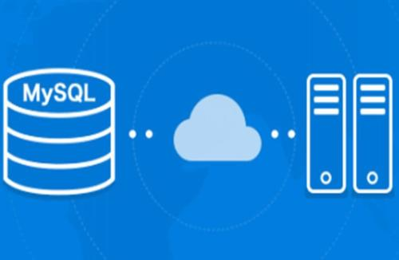
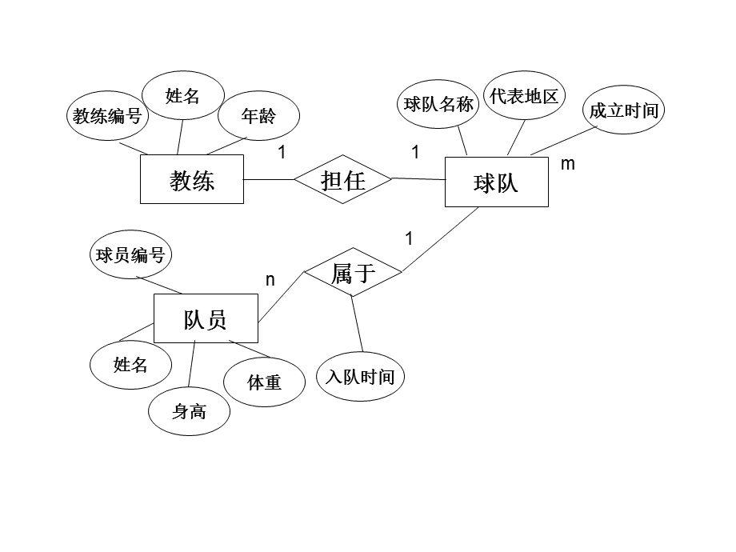
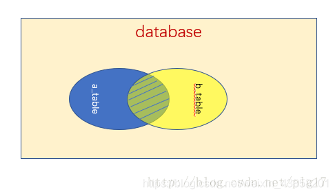
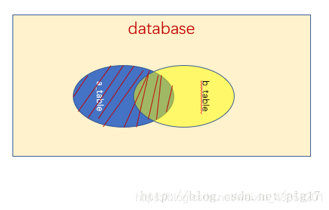

# 数据库基础

数据库是学习JavaWeb的一个前置，只有了解了数据库的操作和使用，我们才能更好地组织和管理网站应用产生的数据。



## 什么是数据库

数据库是数据管理的有效技术，是由一批数据构成的有序集合，这些数据被存放在结构化的数据表里。数据表之间相互关联，反映客观事物间的本质联系。数据库能有效地帮助一个组织或企业科学地管理各类信息资源。简而言之，我们的数据可以交给数据库来帮助我们进行管理，同时数据库能够为我们提供高效的访问性能。

在JavaSE学习阶段中，我们学习了如何使用文件I/O来将数据保存到本地，这样就可以将一个数据持久地存储在本地，即使程序重新打开，我们也能加载回上一次的数据，但是当我们的数据变得非常多的时候，这样的方式就显得不太方便了。同时我们如果需要查找众多数据的中的某一个，就只能加载到内存再进行查找，这样显然是很难受的！

而数据库就是专门做这事的，我们可以快速查找想要的数据，便捷地插入、修改和删除数据，并且数据库不仅能做这些事，还能提供更多便于管理数据和操作数据的功能！

### 常见的数据库

常见的数据库有很多种，包括但不限于：

* MySQL - 免费，用的最多的，开源数据库，适用于中小型
* Microsoft SQL Server - 收钱的，但是提供技术支持，适用于Windows Server
* Oracle - 收钱的，大型数据库系统

而我们要学习的是MySQL数据，其实无论学习哪种数据库，SQL语句大部分都是通用的，只有少许语法是不通用的，因此我们只需要学习一种数据库其他的也就差不多都会了。

### 数据模型

数据模型与现实世界中的模型一样，是对现实世界数据特征的一种抽象。实际上，我们之前学习的类就是对现实世界数据的一种抽象，比如一个学生的特征包括姓名，年龄，年级，学号，专业等，这些特征也称为实体的一种属性，属性具有以下特点：

* 属性不可再分
* 一个实体的属性可以有很多个
* 用于唯一区分不同实体的的属性，称为Key，比如每个同学的学号都是不一样的
* 属性取值可以有一定的约束，比如性别只能是男或是女

实体或是属性之间可以具有一定的联系，比如一个老师可以教很多个学生，而学生相对于老师就是被教授的关系；又比如每个同学都有一个学号与其唯一对应，因此学号和学生之间也有一种联系。而像一个老师教多个学生的联系就是一种一对多的联系（1:n），而学号唯一对应，就是一种一对一的联系（1:1）；每一个老师不仅可以教多个学生，每一个学生也可以有多个教师，这就是一种多对多的联系（n:m）

MySQL就是一种关系型数据库，通过使用关系型数据库，我们就可以很好地存储这样带有一定联系的数据。



通过构建一个ER图，我们就能很好地理清不同数据模型之间的关系和特点。

# 安装、卸载、备份、配置

## 安装相关

### 安装mysql

- 下载地址：[MySQL :: Download MySQL Community Server](https://dev.mysql.com/downloads/mysql/) 选择MySQL Community Server然后选择对应的版本即可
- 直接安装
- 在系统偏好设置面板进行配置


### 卸载

直接在偏好设置面板卸载即可


### 可视化软件

推荐使用navicat

使用navicat进行备份和还原


## 相关配置

### 开启INNODB引擎

超过mysql5.7默认使用INNODB引擎，之前是使用的mysql引擎


### 配置环境变量

默认控制台配置

```shell
// 打开配置文件
open ~/.bash_profile

// 加入mysql命令
export PATH=${PATH}:/usr/local/mysql/bin

// 更新配置文件
source ~/.bash_profile
```


zsh控制台配置

```shell
// 打开配置文件
open ~/.zshrc

// 加入mysql命令
export PATH=${PATH}:/usr/local/mysql/bin

// 更新配置文件
source ~/.zshrc
```


### 修改mysql密码

打开mysql命令行(可以在navicat中打开)

```shell
alter user 'root'@'localhost' identified by 'root';
```

# 认识SQL语句

结构化查询语言（Structured Query Language）简称SQL，这是一种特殊的语言，它专门用于数据库的操作。每一种数据库都支持SQL，但是他们之间会存在一些细微的差异，因此不同的数据库都存在自己的“方言”。

SQL语句不区分大小写（关键字推荐使用大写），它支持多行，并且需要使用`;`进行结尾！

SQL也支持注释，通过使用`--`或是`#`来编写注释内容，也可以使用`/*`来进行多行注释。

我们要学习的就是以下四种类型的SQL语言：

* 数据查询语言（Data Query Language, DQL）基本结构是由SELECT子句，FROM子句，WHERE子句组成的查询块。
* 数据操纵语言（Data Manipulation Language, DML）是SQL语言中，负责对数据库对象运行数据访问工作的指令集，以INSERT、UPDATE、DELETE三种指令为核心，分别代表插入、更新与删除，是开发以数据为中心的应用程序必定会使用到的指令。
* 数据库定义语言DDL(Data Definition Language)，是用于描述数据库中要存储的现实世界实体的语言。
* DCL（Data Control Language）是数据库控制语言。是用来设置或更改数据库用户或角色权限的语句，包括（grant,deny,revoke等）语句。在默认状态下，只有sysadmin,dbcreator,db_owner或db_securityadmin等人员才有权力执行DCL。

我们平时所说的CRUD其实就是增删改查（Create/Retrieve/Update/Delete）

***

# 数据库定义语言（DDL）

## 数据库操作

我们可以通过`create database`来创建一个数据库：

```sql
create database 数据库名
```

为了能够支持中文，我们在创建时可以设定编码格式：

```sql
CREATE DATABASE IF NOT EXISTS 数据库名 DEFAULT CHARSET utf8 COLLATE utf8_general_ci;
```

如果我们创建错误了，我们可以将此数据库删除，通过使用`drop database`来删除一个数据库：

```sql
drop database 数据库名
```

## 创建表

数据库创建完成后，我们一般通过`create table`语句来创建一张表：

```sql
create table 表名(列名 数据类型[列级约束条件],
             列名 数据类型[列级约束条件],
             ...
             [,表级约束条件])
```

## SQL数据类型

以下的数据类型用于字符串存储：

* char(n)可以存储任意字符串，但是是固定长度为n，如果插入的长度小于定义长度时，则用空格填充。
* varchar(n)也可以存储任意数量字符串，长度不固定，但不能超过n，不会用空格填充。

以下数据类型用于存储数字：

* smallint用于存储小的整数，范围在 (-32768，32767)
* int用于存储一般的整数，范围在 (-2147483648，2147483647)
* bigint用于存储大型整数，范围在 (-9,223,372,036,854,775,808，9,223,372,036,854,775,807)
* float用于存储单精度小数
* double用于存储双精度的小数

以下数据类型用于存储时间：

* date存储日期
* time存储时间
* year存储年份
* datetime用于混合存储日期+时间

## 列级约束条件

列级约束有六种：主键Primary key、外键foreign key 、唯一 unique、检查 check （MySQL不支持）、默认default 、非空/空值 not null/ null

## 表级约束条件

表级约束有四种：主键、外键、唯一、检查

现在我们通过SQL语句来创建我们之前提到的三张表。

```sql
[CONSTRAINT <外键名>] FOREIGN KEY 字段名 [，字段名2，…] REFERENCES <主表名> 主键列1 [，主键列2，…]
```

## 修改表

如果我们想修改表结构，我们可以通过`alter table`来进行修改：

```sql
ALTER TABLE 表名[ADD 新列名 数据类型[列级约束条件]]
							 [DROP COLUMN 列名[restrict|cascade]]
							 [ALTER COLUMN 列名 新数据类型]
```

我们可以通过ADD来添加一个新的列，通过DROP来删除一个列，不过我们可以添加restrict或cascade，默认是restrict，表示如果此列作为其他表的约束或视图引用到此列时，将无法删除，而cascade会强制连带引用此列的约束、视图一起删除。还可以通过ALTER来修改此列的属性。

## 删除表

我们可以通过`drop table`来删除一个表：

```sql
DROP TABLE 表名[restrict|cascade]
```

其中restrict和cascade上面的效果一致。

***

# 数据库操纵语言（DML）

前面我们已经学习了如何使用SQL语句来创建、修改、删除数据库以及表，而如何向数据库中插入、删除、更新数据，将是本版块讨论的重点。

## 插入数据

通过使用`insert into`语句来向数据库中插入一条数据（一条记录）：

```sql
INSERT INTO 表名 VALUES(值1, 值2, 值3)
```

如果插入的数据与列一一对应，那么可以省略列名，但是如果希望向指定列上插入数据，就需要给出列名：

```sql
INSERT INTO 表名(列名1, 列名2) VALUES(值1, 值2)
```

我们也可以一次性向数据库中插入多条数据：

```sql
INSERT INTO 表名(列名1, 列名2) VALUES(值1, 值2), (值1, 值2), (值1, 值2)
```

我们来试试看向我们刚刚创建的表中添加三条数据。

## 修改数据

我们可以通过`update`语句来更新表中的数据：

```sql
UPDATE 表名 SET 列名=值,... WHERE 条件
```

注意，SQL语句中的等于判断是`=`

**警告：**如果忘记添加`WHERE`字句来限定条件，将使得整个表中此列的所有数据都被修改！

## 删除数据

我们可以通过使用`delete`来删除表中的数据：

```sql
DELETE FROM 表名
```

通过这种方式，将删除表中全部数据，我们也可以使用`where`来添加条件，只删除指定的数据：

```sql
DELETE FROM 表名 WHERE 条件
```

***

# 数据库查询语言（DQL）

数据库的查询是我们整个数据库学习中的重点内容，面对数据库中庞大的数据，该如何去寻找我们想要的数据，就是我们主要讨论的问题。

## 单表查询

单表查询是最简单的一种查询，我们只需要在一张表中去查找数据即可，通过使用`select`语句来进行单表查询：

```sql
-- 指定查询某一列数据
SELECT 列名[,列名] FROM 表名
-- 会以别名显示此列
SELECT 列名 别名 FROM 表名
-- 查询所有的列数据
SELECT * FROM 表名
-- 只查询不重复的值
SELECT DISTINCT 列名 FROM 表名
```

我们也可以添加`where`字句来限定查询目标：

```sql
SELECT * FROM 表名 WHERE 条件
```

## 常用查询条件

* 一般的比较运算符，包括=、>、<、>=、<=、!=等。
* 是否在集合中：in、not in
* 字符模糊匹配：like，not like
* 多重条件连接查询：and、or、not

我们来尝试使用一下上面这几种条件。

## 排序查询

我们可以通过`order by`来将查询结果进行排序：

```sql
SELECT * FROM 表名 WHERE 条件 ORDER BY 列名 ASC|DESC
```

使用ASC表示升序排序，使用DESC表示降序排序，默认为升序。

我们也可以可以同时添加多个排序：

```sql
SELECT * FROM 表名 WHERE 条件 ORDER BY 列名1 ASC|DESC, 列名2 ASC|DESC
```

这样会先按照列名1进行排序，每组列名1相同的数据再按照列名2排序。

## 聚集函数

聚集函数一般用作统计，包括：

* `count([distinct]*)`统计所有的行数（distinct表示去重再统计，下同）
* `count([distinct]列名)`统计某列的值总和
* `sum([distinct]列名)`求一列的和（注意必须是数字类型的）
* `avg([distinct]列名)`求一列的平均值（注意必须是数字类型）
* `max([distinct]列名)`求一列的最大值
* `min([distinct]列名)`求一列的最小值

一般聚集函数是这样使用的：

```sql
SELECT count(distinct 列名) FROM 表名 WHERE 条件 
```

## 分组和分页查询

通过使用`group by`来对查询结果进行分组，它需要结合聚合函数一起使用：

```sql
SELECT sum(*) FROM 表名 WHERE 条件 GROUP BY 列名
```

我们还可以添加`having`来限制分组条件：

```sql
SELECT sum(*) FROM 表名 WHERE 条件 GROUP BY 列名 HAVING 约束条件
```

我们可以通过`limit`来限制查询的数量，只取前n个结果：

```sql
SELECT * FROM 表名 LIMIT 数量
```

我们也可以进行分页：

```sql
SELECT * FROM 表名 LIMIT 起始位置,数量
```

## 多表查询

多表查询是同时查询的两个或两个以上的表，多表查询会提通过连接转换为单表查询。

```sql
SELECT * FROM 表1, 表2
```

直接这样查询会得到两张表的笛卡尔积，也就是每一项数据和另一张表的每一项数据都结合一次，会产生庞大的数据。

```sql
SELECT * FROM 表1, 表2 WHERE 条件
```

这样，只会从笛卡尔积的结果中得到满足条件的数据。

**注意：**如果两个表中都带有此属性吗，需要添加表名前缀来指明是哪一个表的数据。

## 自身连接查询

自身连接，就是将表本身和表进行笛卡尔积计算，得到结果，但是由于表名相同，因此要先起一个别名：

```sql
SELECT * FROM 表名 别名1, 表名 别名2
```

其实自身连接查询和前面的是一样的，只是连接对象变成自己和自己了。

## 外连接查询

外连接就是专门用于联合查询情景的，比如现在有一个存储所有用户的表，还有一张用户详细信息的表，我希望将这两张表结合到一起来查看完整的数据，我们就可以通过使用外连接来进行查询，外连接有三种方式：

* 通过使用`inner join`进行内连接，只会返回两个表满足条件的交集部分：



* 通过使用`left join`进行左连接，不仅会返回两个表满足条件的交集部分，也会返回左边表中的全部数据，而在右表中缺失的数据会使用`null`来代替（右连接`right join`同理，只是反过来而已，这里就不再介绍了）：



## 嵌套查询

我们可以将查询的结果作为另一个查询的条件，比如：

```sql
SELECT * FROM 表名 WHERE 列名 = (SELECT 列名 FROM 表名 WHERE 条件)
```

我们来再次尝试编写一下在最开始我们查找某教师所有学生的SQL语句。

***

# 数据库控制语言（DCL）

庞大的数据库不可能由一个人来管理，我们需要更多的用户来一起管理整个数据库。

## 创建用户

我们可以通过`create user`来创建用户：

```sql
CREATE USER 用户名 identified by 密码;
```

也可以不带密码：

```sql
CREATE USER 用户名;
```

我们可以通过@来限制用户登录的登录IP地址，`%`表示匹配所有的IP地址，默认使用的就是任意IP地址。

## 登陆用户

首先需要添加一个环境变量，然后我们通过cmd去登陆mysql：

```sql
login -u 用户名 -p
```

输入密码后即可登陆此用户，我们输入以下命令来看看能否访问所有数据库：

```sql
show databases;
```

我们发现，虽然此用户能够成功登录，但是并不能查看完整的数据库列表，这是因为此用户还没有权限！

## 用户授权

我们可以通过使用`grant`来为一个数据库用户进行授权：

```sql
grant all|权限1,权限2...(列1,...) on 数据库.表 to 用户 [with grant option]
```

其中all代表授予所有权限，当数据库和表为`*`，代表为所有的数据库和表都授权。如果在最后添加了`with grant option`，那么被授权的用户还能将已获得的授权继续授权给其他用户。

我们可以使用`revoke`来收回一个权限：

```sql
revoke all|权限1,权限2...(列1,...) on 数据库.表 from 用户
```

# 视图

视图本质就是一个查询的结果，不过我们每次都可以通过打开视图来按照我们想要的样子查看数据。既然视图本质就是一个查询的结果，那么它本身就是一个虚表，并不是真实存在的，数据实际上还是存放在原来的表中。

我们可以通过`create view`来创建视图;

```sql
CREATE VIEW 视图名称(列名) as 子查询语句 [WITH CHECK OPTION];
```

WITH CHECK OPTION是指当创建后，如果更新视图中的数据，是否要满足子查询中的条件表达式，不满足将无法插入，创建后，我们就可以使用`select`语句来直接查询视图上的数据了，因此，还能在视图的基础上，导出其他的视图。

1. 若视图是由两个以上基本表导出的，则此视图不允许更新。
2. 若视图的字段来自字段表达式或常数，则不允许对此视图执行INSERT和UPDATE操作，但允许执行DELETE操作。
3. 若视图的字段来自集函数，则此视图不允许更新。
4. 若视图定义中含有GROUP BY子句，则此视图不允许更新。
5. 若视图定义中含有DISTINCT短语，则此视图不允许更新。
6. 若视图定义中有嵌套查询，并且内层查询的FROM子句中涉及的表也是导出该视图的基本表，则此视图不允许更新。例如将成绩在平均成绩之上的元组定义成一个视图GOOD_SC： CREATE VIEW GOOD_SC AS SELECT Sno, Cno, Grade FROM SC WHERE Grade > (SELECT AVG(Grade) FROM SC); 　　导出视图GOOD_SC的基本表是SC，内层查询中涉及的表也是SC，所以视图GOOD_SC是不允许更新的。
7. 一个不允许更新的视图上定义的视图也不允许更新

通过`drop`来删除一个视图：

```sql
drop view apptest
```

# 事务

事务包含更多的内容，包括隔离级别，数据库锁等内容


### 事务的特性

`原子性`

要么都成功，要么都失败，事务里面的所有操作成为一个原子操作


`一致性`

事务前后的数据完整性要保证一直，比如最开始所有数值总数为1000，无论怎么操作，最终的总数还是1000


`持久性`

事务一旦提交则不可逆，被持久化到数据库中


`隔离性`

多个用户同时操作时，每个用户操作的数据通过事务的隔离不相互影响

多个用户多个事务相互隔离


### 事务提交

```sql
-- mysql默认开始事务自动提交
SET autocommit = 0 -- 关闭自动提交
SET autocommit = 1 -- 开启(默认)

-- 一般要使用事务，首先应该关闭自动提交，手动处理
SET autocommit = 0
START TRANSACTION	-- 开启事务
insert xxx
update xxx
COMMIT -- 提交：持久化(成功)
ROLLBACK -- 回滚：说明失败了
SET autocommit = 1	-- 事务结束，重新开启自动提交

-- 保存节点，就是存档点，下次直接在这个节点开始执行
SAVEPOINT 保存点名	-- 设置保存节点
ROLLBACK TO SAVEPOINT 保存点名 -- 回滚到保存节点
RELEASE SAVEPOINT 保存点名 -- 撤销保存点
```


# 索引

索引是帮助mysql高校获取数据的数据结构，其实就是根据数据结构生成一个索引文件，然后获取数据的时候更加快速


### 索引分类

- 主键索引(primary key)
  - 唯一标识，主键不可重复，只能有一个列
- 唯一索引(unique key)
  - 避免重复列出现，可以设置多个重复索引
- 常规索引(key/index)
  - 默认的，index 使用key关键字来设置
- 全文索引
  - 在特定的数据库引擎下才有，myisam，新版INOODB也有
  - 快速定位text中的数据


### 索引操作

```sql
-- 显示所有的索引信息
show index from student

-- 增加一个全文索引
ALTER TABLE school.student add fulltext index studentname(studentname) -- 前面的student那么表示索引名称，显示在索引列表

-- explain 分析sql语句执行的情况，包含检索了多少行数据
EXPLAIN select * from student -- 非全文索引
EXPLAIN select * from student where Match(studentname) AGAINST('刘')
```


### 索引原则

- 索引不是越多越好
- 不要对经常变动的数据加索引，因为加索引需要时间
- 小数据量的表不需要添加索引
- 索引一般加在经常查询的字段上

## 触发器

触发器就像其名字一样，在某种条件下会自动触发，在`select`/`update`/`delete`时，会自动执行我们预先设定的内容，触发器通常用于检查内容的安全性，相比直接添加约束，触发器显得更加灵活。

触发器所依附的表称为基本表，当触发器表上发生`select`/`update`/`delete`等操作时，会自动生成两个临时的表（new表和old表，只能由触发器使用）

比如在`insert`操作时，新的内容会被插入到new表中；在`delete`操作时，旧的内容会被移到old表中，我们仍可在old表中拿到被删除的数据；在`update`操作时，旧的内容会被移到old表中，新的内容会出现在new表中。

```sql
CREATE TRIGGER 触发器名称 [BEFORE|AFTER] [INSERT|UPDATE|DELETE] ON 表名/视图名 FOR EACH ROW DELETE FROM student WHERE student.sno = new.sno
```

 FOR EACH ROW表示针对每一行都会生效，无论哪行进行指定操作都会执行触发器！

通过下面的命令来查看触发器：

```sql
SHOW TRIGGERS
```

如果不需要，我们就可以删除此触发器：

```sql
DROP TRIGGER 触发器名称
```

# 权限管理

## 用户管理

```sql
-- 创建用户
create user kuangshen identified by 'password'

-- 修改密码(修改当前用户密码)
set password = password('xxxx')

-- 修改密码(指定用户)
set password for kuangshen = password('xxx')

-- 修改用户名
rename user kuangshen to kuangshen2

-- 用户授权 ALL PRIVILEGES全部的权限
-- ALL PRIVILEGES除了给别人授权，包含其余所有权限，只有root才能给别人授权
grant all privileges on *.* -- *.*表示所有的库和表

-- 给用户添加包含授权的权限
grant all privileges on *.* to 'kuangshen'@'localhost' with grant option

-- 查询权限
show grants for kuangshen
show grants for root@localhost

-- 撤销权限
revoke all privileges on *.* from kuangshen

-- 删除用户
drop user kuangshen
```


# 备份

## 使用命令行备份

```bash
# mysqldump -h 主机 -u 用户名 -p 密码 数据库 表名 > 磁盘/文件名
mysqldump -hlocalhost -uroot -p123456 school student >d:/a.sql

# 导入
# 登陆的该情况下，切换到指定的数据库
use school
source d:/a.sql

# 未登录情况下
mysql -uroot -p123456 库名 < d:/a.sql
```


# 规范数据库设计

设计数据库需要有一定的规范，否则会造成数据冗余，字段冗余，插入和删除麻烦、程序形成差


## 数据库设计步骤

### 收集信息，分析需求

通过分析，然后列出需要的表


### 设计E-R图

设计不同表之间的关系图


### 设计实体

将每个表具体的字段设计出来，并关联不同表之间的关系


## 三大范式

### 第一范式

原子性：`保证每一列不可再分`

也就是一个字段里面只能包含一个东西，不能年龄和生日放在一个字段


### 第二范式

前提：保证第一范式

`每张表只描述一件事情`

不能为了方便将很多不属于这个表的字段也放在这个表


### 第三范式

前提：满足第一范式和第二范式

`确保数据表中的每一列数据都和主键直接相关而不是间接相关`

很多字段可以新开一张表，不能图方便


### BCNF

BCNF作为第三范式的补充，假设仓库管理关系表为StorehouseManage(仓库ID, 存储物品ID, 管理员ID, 数量)，且有一个管理员只在一个仓库工作；一个仓库可以存储多种物品。这个数据库表中存在如下决定关系：

(仓库ID, 存储物品ID) →(管理员ID, 数量)

(管理员ID, 存储物品ID) → (仓库ID, 数量)

所以，(仓库ID, 存储物品ID)和(管理员ID, 存储物品ID)都是StorehouseManage的候选关键字，表中的唯一非关键字段为数量，它是符合第三范式的。但是，由于存在如下决定关系：

(仓库ID) → (管理员ID)

(管理员ID) → (仓库ID)

即存在关键字段决定关键字段的情况，如果修改管理员ID，那么就必须逐一进行修改，所以其不符合BCNF范式。


### 规范性和性能的取舍

阿里数据库规范：关联查询不得超过三张表

- 考虑商业化需求和目标，有时候数据库的性能更重要，可以添加一些冗余字段，而避免去多关联查询多个表
- 在规范性能的问题的时候，适当的考虑规范性
- 故意给某些表增加一些冗余的字段，从多表查询变成单表查询
- 故意增加一些计算列，比如count可以计算，但是最好是设计一个字段，每次增加+1，直接获取，而不是通过count查询时计算


# 进阶知识

一般进阶知识都会放在这里，等待后期快面试的时候再继续研究

**函数**和**存储过程**并没有包含在我们的教程当中，但是这并不代表它们就不重要，通过学习它们能够让你的数据库管理能力更上一层楼，它们能够捆绑一组SQL语句运行，并且可以反复使用，大大提高工作效率。

- 事务、数据库锁、索引高级、聚合、mysql优化：[沉默的反补的个人空间_哔哩哔哩_bilibili](https://space.bilibili.com/564757/search/video?keyword=mysql)

- 数据源、连接池、开源数据源

  - dbcp
  - c3p0
  - druid:阿里巴巴

  使用这些数据库连接池之后，就不需要编写连接数据库的代码，同时这些是支持连接池功能的
