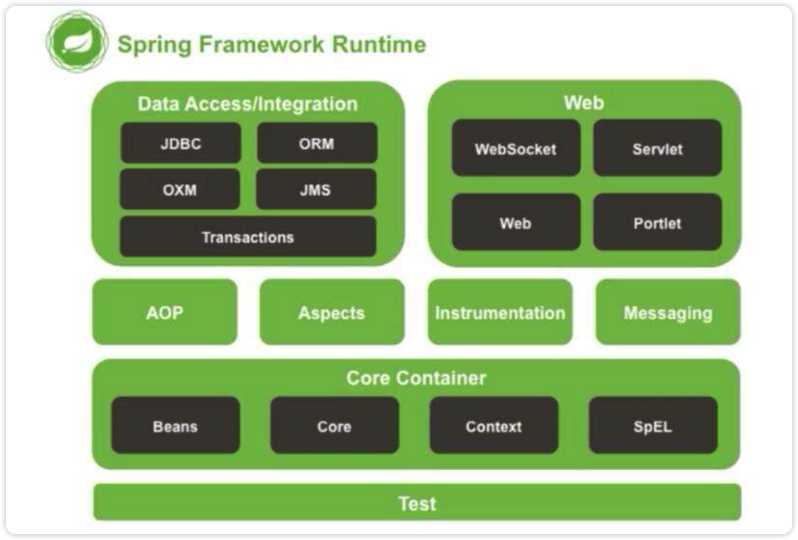
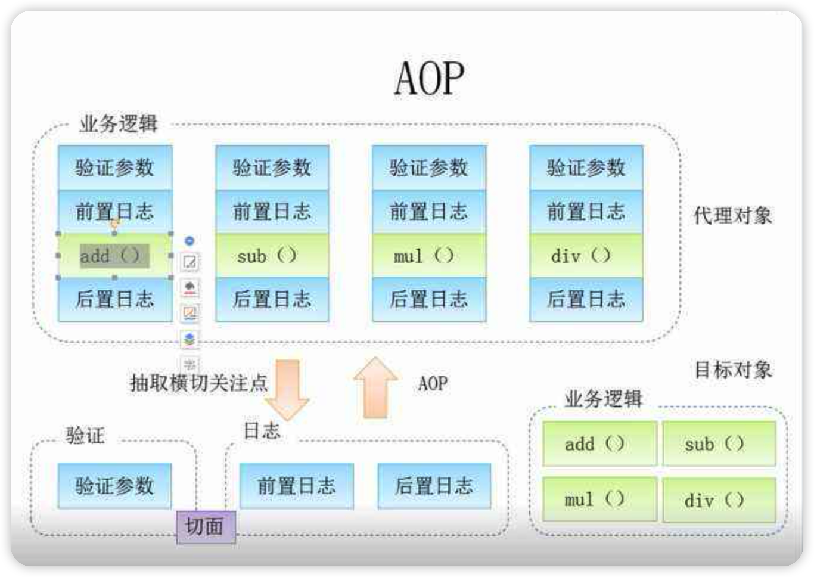
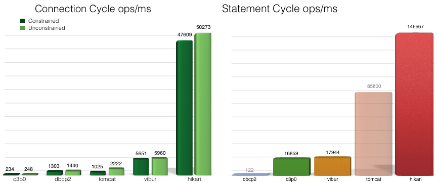
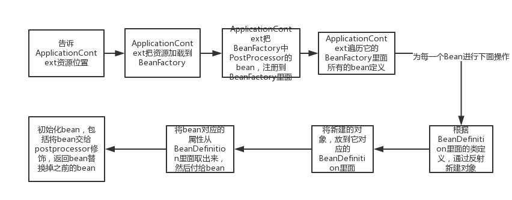
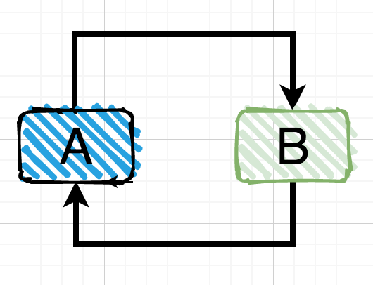

Spring框架（文档：https://docs.spring.io/spring-framework/docs/5.2.13.RELEASE/spring-framework-reference/），为了简化开发而生，它是轻量级的**IoC**和**AOP**的容器框架，主要是针对`JavaBean`的生命周期进行管理的轻量级容器，并且它的生态已经发展得极为庞大。那么，首先一问，什么是**IoC**和**AOP**，什么又是JavaBean呢？只是听起来满满的高级感，实际上没有多高级（很多东西都是这样，名字听起来很牛，实际上只是一个很容易理解的东西）

因此，一切的一切，我们还要从JavaBean说起，从这颗豆子生根发芽开始。

# 什么是JavaBean

JavaBean就是有一定规范的Java实体类，跟普通类差不多，不同的是类内部提供了一些公共的方法以便外界对该对象内部属性进行操作，比如set、get操作，实际上，就是我们之前一直在用的：

```java
public class User{
	private String name;
	private int age;
	public String getName(){
		return name;
	}
	public String getAge(){
		return age;
	}
	public void setName(String name){
		this.name = name;
	}
	public void setAge(int age){
		this.age = age;
	}
}
```

它的所有属性都是private，所有的属性都可以通过get/set方法进行访问，同时还需要有一个无参构造（默认就有），因此我们之前编写的很多类，其实都可以是一个JavaBean。

# IoC容器

## IoC理论基础

在我们之前的图书管理系统Web应用程序中，我们发现，整个程序其实是依靠各个部分相互协作，共同完成一个操作，比如要展示借阅信息列表，那么首先需要使用Servlet进行请求和响应的数据处理，然后请求的数据全部交给对应的Service（业务层）来处理，当Service发现要从数据库中获取数据时，再向对应的Mapper发起请求。

它们之间就像连接在一起的齿轮，谁也离不开谁：


就像一个团队，每个人的分工都很明确，流水线上的一套操作必须环环相扣，这是一种高度耦合的体系。

虽然这样的体系逻辑非常清晰，整个流程也能够让人快速了解，但是这样存在一个很严重的问题，我们现在的时代实际上是一个软件项目高速迭代的时代，我们发现很多App三天两头隔三差五地就更新，而且是什么功能当下最火，就马不停蹄地进行跟进开发，因此，就很容易出现，之前写好的代码，实现的功能，需要全部推翻，改成新的功能，那么我们就不得不去修改某些流水线上的模块，但是这样一修改，会直接导致整个流水线的引用关系大面积更新。

就像我不想用这个`Service`实现类了，我想使用其他的实现类用不同的逻辑做这些功能，那么这个时候，我们只能每个类都去挨个进行修改，去指定新的Service实现类，当项目特别庞大时，光是改个类名就够你改一天。

因此，高耦合度带来的缺点是很明显的，也是现代软件开发中很致命的问题。如果要改善这种情况，我们只能将各个模块进行解耦，让各个模块之间的依赖性不再那么地强。也就是说，Service的实现类，不再由我们决定，而是让程序自己决定，这个程序是独立于`Controller`的第三方程序，所有的实现类对象，全部交给程序来管理，所有对象之间的关系，也由程序来动态决定，这样就引入了IoC理论。

IOC是Inversion of Control的缩写，翻译为：“控制反转”，把复杂系统分解成相互合作的对象，这些对象类通过封装以后，内部实现对外部是透明的，从而降低了解决问题的复杂度，而且可以灵活地被重用和扩展。


我们可以将对象交给IoC容器进行管理，比如当我们需要一个接口的实现时，由它根据配置文件来决定到底给我们哪一个实现类，这样，我们就可以不用再关心我们要去使用哪一个实现类了，我们只需要关心，给到我的一定是一个可以正常使用的实现类，能用就完事了，反正接口定义了啥，我只管调，这样，我们就可以放心地让一个人去写视图层的代码，一个人去写业务层的代码，开发效率那是高的一匹啊。

**高内聚，低耦合，是现代软件的开发的设计目标**，而Spring框架就给我们提供了这样的一个IoC容器进行对象的管

首先一定要明确，使用Spring首要目的是为了使得软件项目进行解耦，而不是为了去简化代码！

Spring并不是一个独立的框架，它实际上包含了很多的模块：



而我们首先要去学习的就是Core Container，也就是核心容器模块。

Spring是一个非入侵式的框架，就像一个工具库一样，因此，我们只需要直接导入其依赖就可以使用了。

## 第一个Spring项目

我们创建一个新的Maven项目，并导入Spring框架的依赖`spring-context`，Spring框架的坐标：

```xml
<dependency>
    <groupId>org.springframework</groupId>
    <artifactId>spring-context</artifactId>
    <version>5.3.13</version>
</dependency>
```

接着在resource中创建一个Spring配置文件，命名为`applicationContext.xml`，直接右键点击即可创建：

```xml
<?xml version="1.0" encoding="UTF-8"?>
<beans xmlns="http://www.springframework.org/schema/beans"
       xmlns:xsi="http://www.w3.org/2001/XMLSchema-instance"
       xsi:schemaLocation="http://www.springframework.org/schema/beans
        https://www.springframework.org/schema/beans/spring-beans.xsd">

</beans>
```

最后，在主方法中编写：

```java
public static void main(String[] args) {
    ClassPathXmlApplicationContext context = new ClassPathXmlApplicationContext("applicationContext.xml");
    
}
```

这样，一个最基本的Spring项目就创建完成了，接着我们来看看如何向IoC容器中注册JavaBean，首先创建一个Student类：

```java
//注意，这里还用不到值注入，只需要包含成员属性即可，不用Getter/Setter。
public class Student {
    String name;
    int age;
}
```

然后在配置文件中添加这个bean：

```xml
<bean name="student" class="com.test.bean.Student"/>
```

现在，这个对象不需要我们再去生成了，而是由IoC容器来提供：

```java
public static void main(String[] args) {
    ClassPathXmlApplicationContext context = new ClassPathXmlApplicationContext("test.xml");
    Student student = (Student) context.getBean("student");
    System.out.println(student);
}
```

更推荐使用**获取类对象**的方法创建bean，这样就不需要进行类型强制转换了

```java
public static void main(String[] args) {
    ClassPathXmlApplicationContext context = new ClassPathXmlApplicationContext("test.xml");
    Student student = context.getBean(Student.class);
    System.out.println(student);
}
```

实际上，这里得到的Student对象是由Spring通过反射机制帮助我们创建的，初学者会非常疑惑，为什么要这样来创建对象，我们直接new一个它不香吗？为什么要交给IoC容器管理呢？在后面的学习中，我们再慢慢进行体会。

## 使用配置文件配置JavaBean

### 注入bean

通过前面的例子，我们发现只要将我们创建好的JavaBean通过配置文件编写，即可将其交给IoC容器进行管理，那么，我们来看看，一个JavaBean的详细配置：

```xml
<bean name="student" class="com.test.bean.Student"/>
```

其中`name`属性（也可以是`id`属性），全局唯一，不可出现重复的名称，我们发现，之前其实就是通过Bean的名称来向IoC容器索要对应的对象，也可以通过其他方式获取。

我们现在在主方法中连续获取两个对象：

```java
ClassPathXmlApplicationContext context = new ClassPathXmlApplicationContext("test.xml");
Student student = (Student) context.getBean("student");
Student student2 = (Student) context.getBean("student");
System.out.println(student);
System.out.println(student2);
```

### scope作用域

我们发现两次获取到的实际上是同一个对象，也就是说，默认情况下，通过IoC容器进行管理的JavaBean是**单例模式**的，无论怎么获取始终为那一个对象，那么如何进行修改呢？只需要修改其作用域即可，添加`scope`属性：

```xml
<bean name="student" class="com.test.bean.Student" scope="prototype"/>
```

通过将其设定为`prototype`（原型模式）来使得其每次都会创建一个新的对象。我们接着来观察一下，这两种模式下Bean的生命周期，我们给构造方法添加一个输出：

```java
public class Student {
    String name;
    int age;

    public Student(){
        System.out.println("我被构造了！");
    }
}
```

接着我们在mian方法中打上断点来查看对象分别是在什么时候被构造的。

我们发现，**当Bean的作用域为单例模式，那么它会在一开始就被创建，而处于原型模式下，只有在获取时才会被创建，**也就是说，单例模式下，Bean会被IoC容器存储，只要容器没有被销毁，那么此对象将一直存在，而原型模式才是相当于直接new了一个对象，并不会被保存。

### 初始化方法

我们还可以通过配置文件，告诉创建一个对象需要执行此初始化方法，以及销毁一个对象的销毁方法：

```java
public class Student {
    String name;
    int age;

    private void init(){
        System.out.println("我是初始化方法！");
    }

    private void destroy(){
        System.out.println("我是销毁方法！");
    }

    public Student(){
        System.out.println("我被构造了！");
    }
}
```

```java
public static void main(String[] args) {
    ClassPathXmlApplicationContext context = new ClassPathXmlApplicationContext("test.xml");
    Student student = (Student) context.getBean("student");
    System.out.println(student);
    context.close();  //手动销毁容器
}
```

最后在XML文件中编写配置：

```xml
<bean name="student" class="com.test.bean.Student" init-method="init" destroy-method="destroy"/>
```

接下来测试一下即可。

我们还可以手动指定Bean的加载顺序，若某个Bean需要保证一定在另一个Bean加载之前加载，那么就可以使用`depend-on`属性。

```xml
<bean name="teacher" class="bean.Teacher" />
<bean name="student" class="bean.Student" depends-on="teacher"/>
```

设置bean之间相互依赖之后，即使没有调用`teacher bean`，也会自动先创建teacher bean

## 依赖注入DI

### 普通成员注入

现在我们已经了解了如何注册和使用一个Bean，那么，如何向Bean的成员属性进行赋值呢？也就是说，IoC在创建对象时，需要将我们预先给定的属性注入到对象中，非常简单，我们可以使用`property`标签来实现，但是一定注意，此属性必须存在一个set方法，否则无法赋值：

```xml
<bean name="student" class="com.test.bean.Student">
    <property name="name" value="小明"/>
</bean>
```

```java
public class Student {
    String name;
    int age;

    public void setName(String name) {
        this.name = name;
    }

    public void say(){
        System.out.println("我是："+name);
    }
}
```

最后测试是否能够成功将属性注入到我们的对象中：

```java
public static void main(String[] args) {
    ClassPathXmlApplicationContext context = new ClassPathXmlApplicationContext("test.xml");
    Student student = (Student) context.getBean("student");
    student.say();
}
```

### 实体注入

那么，如果成员属性是一个非基本类型非String的对象类型，我们该怎么注入呢？

```java
public class Card {
}
```

```java
public class Student {
    String name;
    int age;
    Card card;

    public void setCard(Card card) {
        this.card = card;
    }
  
  	public void setName(String name) {
        this.name = name;
    }

    public void say(){
        System.out.println("我是："+name+"，我都学生证："+card);
    }
}
```

我们只需要将对应的类型也注册为bean即可，然后直接使用`ref`属性来进行引用：

```xml
<bean name="card" class="com.test.bean.Card"/>
<bean name="student" class="com.test.bean.Student">
    <property name="name" value="小明"/>
    <property name="card" ref="card"/>
</bean>
```

### 集合注入

那么，集合如何实现注入呢？我们需要在`property`内部进行编写：

```xml
<bean name="student" class="com.test.bean.Student">
    <property name="list">
        <list>
            <value type="double">100.0</value>
            <value type="double">95.0</value>
            <value type="double">92.5</value>
        </list>
    </property>
</bean>
```

现在，我们就可以直接以一个数组的方式将属性注入，注意如果是List类型的话，我们也可以使用`array`数组。同样的，如果是一个Map类型，我们也可以使用`entry`来注入：

```java
public class Student {
    String name;
    int age;
    Map<String, Double> map;

    public void setMap(Map<String, Double> map) {
        this.map = map;
    }

    public void say(){
        System.out.println("我的成绩："+ map);
    }
}
```

```xml
<bean name="student" class="com.test.bean.Student">
    <property name="map">
        <map>
            <entry key="语文" value="100.0"/>
            <entry key="数学" value="80.0"/>
            <entry key="英语" value="92.5"/>
        </map>
    </property>
</bean>
```

我们还可以使用自动装配来实现属性值的注入，要注意自动注入一定是注入同样在bean注册器中注册了的bean，如果没有注入肯定不能找到，更谈不上自动注入：

```xml
<bean name="card" class="com.test.bean.Card"/>
<bean name="student" class="com.test.bean.Student" autowire="byType"/>
```

自动装配会根据set方法中需要的类型，自动在容器中查找是否存在对应类型或是对应名称以及对应构造方法的Bean，比如我们上面指定的为`byType`，那么其中的card属性就会被自动注入类型为`Card`的`Bean`

我们已经了解了如何使用set方法来创建对象，那么能否不使用默认的无参构造方法，而是指定一个有参构造进行对象的创建呢？我们可以指定构造方法：

```xml
<bean name="student" class="com.test.bean.Student">
  <constructor-arg name="name" value="小明"/>
  <constructor-arg index="1" value="18"/>
</bean>
```

```java
public class Student {
    String name;
    int age;

    public Student(String name, int age){
        this.name = name;
        this.age = age;
    }

    public void say(){
        System.out.println("我是："+name+"今年"+age+"岁了！");
    }
}
```

通过手动指定构造方法参数，我们就可以直接告诉容器使用哪一个构造方法来创建对象。

## 注解实现配置文件

### 主配置文件

那么，现在既然不使用XML文件了，那通过注解的方式就只能以实体类的形式进行配置了，我们在要作为配置的类上添加`@Configuration`注解，我们这里创建一个新的类`MainConfiguration`：

```java
@Configuration
public class MainConfiguration {
    //没有配置任何Bean
}
```

你可以直接把它等价于：

```xml
<?xml version="1.0" encoding="UTF-8"?>
<beans xmlns="http://www.springframework.org/schema/beans"
       xmlns:xsi="http://www.w3.org/2001/XMLSchema-instance"
       xsi:schemaLocation="http://www.springframework.org/schema/beans
        https://www.springframework.org/schema/beans/spring-beans.xsd">
		<!-- 没有配置任何Bean -->
</beans>
```

### 主配置文件添加bean

那么我们来看看，如何配置Bean，之前我们是直接在配置文件中编写Bean的一些信息，**现在在配置类中**，我们只需要编写一个方法，并返回我们要创建的Bean的对象即可，并在其上方添加`@Bean`注解：

```java
@Bean
public Card card(){
    return new Card();
}
```

这样，等价于：

```xml
<?xml version="1.0" encoding="UTF-8"?>
<beans xmlns="http://www.springframework.org/schema/beans"
       xmlns:xsi="http://www.w3.org/2001/XMLSchema-instance"
       xsi:schemaLocation="http://www.springframework.org/schema/beans
        https://www.springframework.org/schema/beans/spring-beans.xsd">
		<bean class="com.test.bean.Card"></bean>
</beans>
```

我们还可以继续添加`@Scope`注解来指定作用域，这里我们就用原型模式：

```java
@Bean
@Scope("prototype")
public Card card(){
    return new Card();
}
```

采用这种方式，我们就可以更加方便地控制一个Bean对象的创建过程，现在相当于这个对象时由我们创建好了再交给Spring进行后续处理，我们可以在对象创建时做很多额外的操作，包括一些属性值的配置等。

既然现在我们已经创建好了配置类，接着我们就可以在主方法中加载此配置类，并创建一个基于配置类的容器：

```java
public class Main {
    public static void main(String[] args) {
      	//使用AnnotationConfigApplicationContext来实现注解配置
        AnnotationConfigApplicationContext context = new AnnotationConfigApplicationContext(MainConfiguration.class); //这里需要告诉Spring哪个类作为配置类
        Card card = context.getBean(Card.class);  //容器用法和之前一样
        System.out.println(card);
    }
}
```

### bean设置名称

在配置的过程中，我们可以点击IDEA底部的Spring标签，打开后可以对当前向容器中注册的Bean进行集中查看，并且会标注Bean之间的依赖关系，我们可以发现，Bean的默认名称实际上就是首字母小写的方法名称，我们也可以手动指定：

```java
@Bean("lbwnb")
@Scope("prototype")
public Card card(){
    return new Card();
}
```

### 使用@Component添加bean

除了像原来一样在配置文件中创建Bean以外，我们还可以直接在类上添加`@Component`注解来将一个类进行注册**（现在最常用的方式）**，不过要实现这样的方式，我们需要添加一个自动扫描，来告诉Spring需要在哪些包中查找我们提供`@Component`声明的Bean。

只需要在配置类上添加一个`@ComponentScan`注解即可，如果要添加多个包进行扫描，可以使用`@ComponentScans`来批量添加。这里我们演示将`bean`包下的所有类进行扫描：

```java
@ComponentScan("com.test.bean")
@Configuration
public class MainConfiguration {

}
```

现在删除类中的Bean定义，我们在Student类的上面添加`@Component`注解，来表示此类型需要作为Bean交给容器进行管理：

```java
@Component
@Scope("prototype")
public class Student {
    String name;
    int age;
    Card card;
}
```

同样的，在类上也可以直接添加`@Scope`来限定作用域。

效果和刚刚实际上是相同的，我们可以来测试一下：

```java
public class Main {
    public static void main(String[] args) {
        AnnotationConfigApplicationContext context = new AnnotationConfigApplicationContext(MainConfiguration.class);
        System.out.println(context.getBean(Student.class));
    }
}
```

我们可以看到IDEA的Spring板块中也显示了我们刚刚通过直接在类上添加`@Component`声明的Bean。

与`@Component`同样效果的还有`@Controller`、`@Service`和`@Repository`，但是现在暂时不提，讲到SpringMVC时再来探讨。

### 注解自动注入

现在我们就有两种方式注册一个Bean了，那么如何实现像之前一样的自动注入呢，比如我们**将Card也注册为Bean**，我们希望Spring自动将其注入到Student的属性中：

```java
@Component
public class Student {
    String name;
    int sid;
    Card card;
}
```

因此，我们可以将此类型，也通过这种方式注册为一个Bean：

```java
@Component
@Scope("prototype")
public class Card {
}
```

现在，我们在需要注入的位置，添加一个`@Resource`注解来实现自动装配：

```java
@Component
public class Student {
    String name;
    int sid;
    
    @Resource
    Card card;
}
```

这样的好处是，我们完全不需要创建任何的set方法，只需要添加这样的一个注解就可以了，Spring会跟之前配置文件的自动注入一样，在整个容器中进行查找，并将对应的Bean实例对象注入到此属性中，当然，如果还是需要通过set方法来注入，可以将注解添加到方法上：

```java
@Component
public class Student {
    String name;
    int sid;
    Card card;

    @Resource
    public void setCard(Card card) {
        System.out.println("通过方法");
        this.card = card;
    }
}
```

除了使用`@Resource`以外，我们还可以使用`@Autowired`（IDEA不推荐将其使用在字段上，会出现黄标，但是可以放在方法或是构造方法上），它们的效果是一样的，但是它们存在区别，虽然它们都是自动装配：

* @Resource默认`ByName`如果找不到则ByType，可以添加到set方法、字段上。
* @Autowired默认是`byType`，可以添加在构造方法、set方法、字段、方法参数上。

并且`@Autowired`可以配合`@Qualifier`使用，默认是注入同名的对象，并且在`setCardsetCard(Card card)`内因为写死了是`Card`，所以只可以注入Card，其它bean不可以，但是可以设置多个Card类型的bean，多绑定几次，但是每个bean name不同，里面的`return`实现不同，使用@Qualifier，来指定一个名称的Bean进行注入：

```java
@Autowired
@Qualifier("sxc")
public void setCard(Card card) {
    System.out.println("通过方法");
    this.card = card;
}
```

如果Bean是在主配置文件中进行定义的，我们还可以在方法的参数中使用`@Autowired`来进行自动注入：

```java
@ComponentScan("com.test.bean")
@Configuration
public class MainConfiguration {

    @Bean
    public Student student(@Autowired Card card){
        Student student = new Student();
        student.setCard(card);
        return student;
    }
}
```

我们还可以通过`@PostConstruct`注解来添加构造后执行的方法，它等价于之前讲解的`init-method`：

```java
@PostConstruct
public void init(){
    System.out.println("我是初始化方法！1");
}
```

注意它们的顺序：Constructor(构造方法) -> @Autowired(依赖注入) -> @PostConstruct

同样的，如果需要销毁方法，也可以使用`@PreDestroy`注解，这里就不做演示了。

这样，两种通过注解进行Bean声明的方式就讲解完毕了，那么什么时候该用什么方式去声明呢？

* 如果要注册为Bean的类是由其他框架提供，我们无法修改其源代码，那么我们就在总配置文件进行配置。
* 如果要注册为Bean的类是我们自己编写的，我们就可以直接在类上添加注解，**并在配置中添加扫描**。

# 面向切面AOP

又是一个听起来很高大上的名词，AOP思想实际上就是：在**运行时，动态地将代码切入到类的指定方法、指定位置上的编程思想就是面向切面的编程**。也就是说，我们可以使用AOP来帮助我们在方法执行前或执行之后，做一些额外的操作，实际上，就是代理！

通过AOP我们可以在保证原有业务不变的情况下，添加额外的动作，比如我们的某些方法执行完成之后，需要打印日志，那么这个时候，我们就可以使用AOP来帮助我们完成，它可以批量地为这些方法添加动作。可以说，它相当于将我们原有的方法，在不改变源代码的基础上进行了增强处理。



相当于我们的整个业务流程，被直接斩断，并在断掉的位置添加了一个额外的操作，再连接起来，也就是在一个切点位置插入内容。它的原理实际上就是通过**动态代理**机制实现的，我们在JavaWeb阶段已经给大家讲解过动态代理了。**不过Spring底层并不是使用的JDK提供的动态代理，而是使用的第三方库实现，它能够以父类的形式代理，而不是接口。**

### 使用SpringAOP

Spring是支持AOP编程的框架之一（实际上它整合了AspectJ框架的一部分），要使用AOP我们需要先导入一个依赖：

```xml
<dependency>
    <groupId>org.springframework</groupId>
    <artifactId>spring-aspects</artifactId>
    <version>5.3.13</version>
</dependency>
```

那么，如何使用AOP呢？首先我们要明确，要实现AOP操作，我们需要知道这些内容：

1. 需要切入的类，类的哪个方法需要被切入
2. 切入之后需要执行什么动作
3. 是在方法执行前切入还是在方法执行后切入
4. 如何告诉Spring需要进行切入

那么我们依次来看，首先需要解决的问题是，找到需要切入的类：

```java
public class Student {
    String name;
    int age;

		//分别在test方法执行前后切入
    public int test(String str) {
        System.out.println("我是一个测试方法："+str);
        return str.length();
    }
}
```

现在我们希望在`test`方法执行前后添加我们的额外执行的内容，接着，我们来看看如何为方法执行前和执行后添加切入动作。比如现在我们想在方法返回之后，再执行我们的动作，首先定义我们要执行的操作：

```java
public class AopTest {

    //执行之后的方法
    public void after(){
        System.out.println("我是执行之后");
    }

    //执行之前的方法
    public void before(){
        System.out.println("我是执行之前");
    }
}
```

那么，现在如何告诉Spring我们需要在方法执行之前和之后插入其他逻辑呢？首先我们将要进行AOP操作的类注册为Bean：

```xml
<bean name="student" class="com.test.bean.Student"/>
<bean name="aopTest" class="com.test.aop.AopTest"/>
```

一个是Student类，还有一个就是包含我们要切入方法的AopTest类，注册为Bean后，他们就交给Spring进行管理，这样Spring才能帮助我们完成AOP操作。

接着，我们需要告诉Spring，我们需要添加切入点，首先将顶部修改为，引入aop相关标签：

```xml
<?xml version="1.0" encoding="UTF-8"?>
<beans xmlns="http://www.springframework.org/schema/beans"
       xmlns:xsi="http://www.w3.org/2001/XMLSchema-instance"
       xmlns:aop="http://www.springframework.org/schema/aop"
       xsi:schemaLocation="http://www.springframework.org/schema/beans http://www.springframework.org/schema/beans/spring-beans.xsd
       http://www.springframework.org/schema/aop http://www.springframework.org/schema/aop/spring-aop.xsd">
```

通过使用`aop:config`来添加一个新的AOP配置：

```xml
<aop:config>
    
</aop:config>
```

首先第一行，我们需要告诉Spring，我们要切入的是哪一个类的哪个或是哪些方法：

```xml
<aop:pointcut id="test" expression="execution(* com.test.bean.Student.test(String))"/>
```

其中，`expression`属性的`execution`填写格式如下：

```xml
修饰符 包名.类名.方法名称(方法参数)
```

* 修饰符：public、protected、private、包括返回值类型、static等等（使用*代表任意修饰符）
* 包名：如com.test（\*代表全部，比如com.*代表com包下的全部包）
* 类名：使用*也可以代表包下的所有类
* 方法名称：可以使用*代表全部方法
* 方法参数：填写对应的参数即可，比如(String, String)，也可以使用*来代表任意一个参数，使用..代表所有参数。

也可以使用其他属性来进行匹配，比如`@annotation(注解名)`可以用于表示根据注解名查找方法切入。

```xml
<aop:pointcut id="test2" expression="@annotation(Override)"/>
```

接着，我们需要为此方法添加一个执行前动作和一个执行后动作：

```xml
<aop:aspect ref="aopTest">
    <aop:pointcut id="test" expression="execution(* com.test.bean.Student.test(String))"/>
    <aop:before method="before" pointcut-ref="test"/>
  	<!--pointcut-ref="test"表示是针对的上面定义的切点-->
    <aop:after-returning method="after" pointcut-ref="test"/>
</aop:aspect>
```

上面是一个完整的按照一个切点配置的AOP，这样，我们就完成了全部的配置，现在来实验一下吧：

```java
public static void main(String[] args) {
    ClassPathXmlApplicationContext context = new ClassPathXmlApplicationContext("test.xml");
    Student student = context.getBean(Student.class);
    student.test("lbwnb");
}
```

我们发现，方法执行前后，分别调用了我们对应的方法。但是仅仅这样还是不能满足一些需求，在某些情况下，我们可以需求方法执行的一些参数，比如方法执行之后返回了什么，或是方法开始之前传入了什么参数等等。

这个时候，我们可以为我们切入的方法添加一个参数，通过此参数就可以快速获取切点位置的一些信息：

```java
//执行之前的方法
public void before(JoinPoint point){
    System.out.println("我是执行之前");
    System.out.println(point.getTarget());  //获取执行方法的对象
    System.out.println(Arrays.toString(point.getArgs()));  //获取传入方法的实参
}
```

通过添加JoinPoint作为形参，Spring会自动给我们一个实现类对象，这样我们就能获取方法的一些信息了。

最后我们再来看环绕方法，环绕方法相当于完全代理了此方法，它完全将真正的目标方法包含在中间，需要我们手动调用才可以执行此方法，并且我们可以直接获取更多的参数：

```xml
<aop:before method="around" pointcut-ref="test"/>
```

```java
public Object around(ProceedingJoinPoint joinPoint) throws Throwable {
    System.out.println("方法开始之前");
    Object value = joinPoint.proceed();
    System.out.println("方法执行完成，结果为："+value);
    return value;
}
```

注意，如果代理方法存在返回值，那么环绕方法也需要有一个返回值，通过`proceed`方法来执行代理的方法，也可以修改参数之后调用`proceed(Object[])`，使用我们给定的参数再去执行：

```java
public Object around(ProceedingJoinPoint joinPoint) throws Throwable {
    System.out.println("方法开始之前");
    String arg = joinPoint.getArgs()[0] + "伞兵一号";
    Object value = joinPoint.proceed(new Object[]{arg});
    System.out.println("方法执行完成，结果为："+value);
    return value;
}
```

### 使用接口实现AOP

前面我们介绍了如何使用xml配置一个AOP操作，这节课我们来看看如何使用Advice实现AOP。

它与我们之前学习的动态代理更接近一些，比如在方法开始执行之前或是执行之后会去调用我们实现的接口，首先我们需要将一个类实现Advice接口，只有实现此接口，才可以被通知，比如我们这里使用`MethodBeforeAdvice`表示是一个在方法执行之前的动作：

```java
public class AopTest implements MethodBeforeAdvice {
    @Override
    public void before(Method method, Object[] args, Object target) throws Throwable {
        System.out.println("通过Advice实现AOP");
    }
}
```

我们发现，方法中包括了很多的参数，其中args代表的是方法执行前得到的实参列表，还有target表示执行此方法的实例对象。运行之后，效果和之前是一样的，但是在这里我们就可以快速获取到更多信息。

```xml
<aop:config>
    <aop:pointcut id="stu" expression="execution(* com.test.bean.Student.say(String))"/>
    <aop:advisor advice-ref="before" pointcut-ref="stu"/>
</aop:config>
```

除了此接口以外，还有其他的接口，比如`AfterReturningAdvice`就需要实现一个方法执行之后的操作：

```java
public class AopTest implements MethodBeforeAdvice, AfterReturningAdvice {
    @Override
    public void before(Method method, Object[] args, Object target) throws Throwable {
        System.out.println("我是方法执行之前！");
    }

    @Override
    public void afterReturning(Object returnValue, Method method, Object[] args, Object target) throws Throwable {
        System.out.println("我是方法执行之后！");
    }
}
```

其实，我们之前学习的操作正好对应了AOP 领域中的特性术语：

- 通知（Advice）: AOP 框架中的增强处理，通知描述了切面何时执行以及如何执行增强处理，也就是我们上面编写的方法实现。
- 连接点（join point）: 连接点表示应用执行过程中能够插入切面的一个点，这个点可以是方法的调用、异常的抛出，实际上就是我们在方法执行前或是执行后需要做的内容。
- 切点（PointCut）: 可以插入增强处理的连接点，可以是方法执行之前也可以方法执行之后，还可以是抛出异常之类的。
- 切面（Aspect）: 切面是通知和切点的结合，我们之前在xml中定义的就是切面，包括很多信息。
- 引入（Introduction）：引入允许我们向现有的类添加新的方法或者属性。
- 织入（Weaving）: 将增强处理添加到目标对象中，并创建一个被增强的对象，我们之前都是在将我们的增强处理添加到目标对象，也就是织入（这名字挺有文艺范的）

### 注解实现AOP操作

了解了如何使用注解注册Bean之后，我们接着来看如何通过注解实现AOP操作，首先我们需要在主类添加`@EnableAspectJAutoProxy`注解，开启AOP注解支持：

```java
@EnableAspectJAutoProxy
@ComponentScan("com.test.bean")
@Configuration
public class MainConfiguration {
}
```

接着我们只需在定义AOP增强操作的类上添加`@Aspect`注解和`@Component`将其注册为Bean即可，就像我们之前在配置文件中也要将其注册为Bean：

```java
@Component
@Aspect
public class AopTest {

}
```

接着，我们直接在里面编写方法，并将此方法添加到一个切点中，比如我们希望在Student的test方法执行之前执行我们的方法：

```java
public int test(String str){
    System.out.println("我被调用了:"+str);
    return str.length();
}
```

只需要添加`@Before`注解即可：

```java
@Before("execution(* com.test.bean.Student.test(..))")
public void before(){
    System.out.println("我是之前执行的内容！");
}
```

同样的，我们可以为其添加`JoinPoint`参数来获取切入点信息：

```java
@Before("execution(* com.test.bean.Student.test(..))")
public void before(JoinPoint point){
    System.out.println("参数列表："+ Arrays.toString(point.getArgs()));
    System.out.println("我是之前执行的内容！");
}
```

我们也可以使用`@AfterReturning`注解来指定方法返回后的操作：

```java
@AfterReturning(value = "execution(* com.test.bean.Student.test(..))", returning = "returnVal")
public void after(Object returnVal){
    System.out.println("方法已返回，结果为："+returnVal);
}
```

我们还可以指定returning属性，并将其作为方法某个参数的实参。同样的，环绕也可以直接通过注解声明：

```java
@Around("execution(* com.test.bean.Student.test(..))")
public Object around(ProceedingJoinPoint point) throws Throwable {
    System.out.println("方法执行之前！");
    Object val = point.proceed();
    System.out.println("方法执行之后！");
    return val;
}
```

# 其他注解配置

配置文件可能不止一个，我们有可能会根据模块划分，定义多个配置文件，这个时候，可能会出现很多个配置类，如果我们需要`@Import`注解来快速将某个类加入到容器中，比如我们现在创建一个新的配置文件，并将数据库Bean也搬过去：

```java
public class Test2Configuration {
    @Bean
    public Connection getConnection() throws SQLException {
        System.out.println("创建新的连接！");
        return DriverManager.getConnection("jdbc:mysql://localhost:3306/study",
                "root",
                "root");
    }
}
```

```java
@EnableAspectJAutoProxy
@Configuration
@ComponentScan("com.test")
@Import(Test2Configuration.class)
public class TestConfiguration {

    @Resource
    Connection connection;

    @PostConstruct
    public void init(){
        System.out.println(connection);
    }
}
```

注意第一个配置类并没有添加任何注解，实际上，只是将它导入主配置类，导入之后自动这个被导入的类也就被注册了，相当于导入的类被强制注册为了一个Bean，到现在，我们一共了解了三种注册为Bean的方式，利用这种特性，我们还可以将其他的类型也强制注册为Bean：

```java
@EnableAspectJAutoProxy
@Configuration
@ComponentScan("com.test")
@Import({Test2Configuration.class, Date.class})
public class TestConfiguration {

    @Resource
    Connection connection;
    @Resource
    Date date;

    @PostConstruct
    public void init(){
        System.out.println(date+" -> "+connection);
    }
}
```

可以看到，日期直接作为一个Bean放入到IoC容器中了，并且时间永远都是被new的那个时间，也就是同一个对象（因为默认是单例模式）。

通过`@Import`方式最主要为了实现的目标并不是创建Bean，而是为了方便一些框架的`Registrar`进行Bean定义，在讲解到Spring原理时，我们再来详细讨论，目前只做了解即可。

到这里，关于Spring框架的大致内容就聊得差不多了，其余的内容，我们会在后面继续讲解。

# 深入Mybatis框架

学习了Spring之后，我们已经了解如何将一个类作为Bean交由IoC容器管理，也就是说，现在我们可以通过更方便的方式来使用Mybatis框架，我们可以直接把SqlSessionFactory、Mapper交给Spring进行管理，并且可以通过注入的方式快速地使用它们，因此，我们要学习一下如何将Mybatis与Spring进行整合。

### 整合Mybatis框架

通过了解数据源，我们已经清楚，Mybatis实际上是在使用自己编写的数据源（数据源有很多，之后我们再聊其他的）默认使用的是池化的数据源，它预先存储了很多的连接对象。

那么我们来看一下，如何将Mybatis与Spring更好的结合呢，比如我们现在希望将SqlSessionFactory交给IoC容器进行管理，而不是我们自己创建工具类来管理（我们之前一直都在使用工具类管理和创建会话）

首先导入依赖：

```xml
<dependency>
    <groupId>mysql</groupId>
    <artifactId>mysql-connector-java</artifactId>
    <version>8.0.25</version>
</dependency>
<dependency>
    <groupId>org.mybatis</groupId>
    <artifactId>mybatis</artifactId>
    <version>3.5.7</version>
</dependency>
<dependency>
    <groupId>org.mybatis</groupId>
    <artifactId>mybatis-spring</artifactId>
    <version>2.0.6</version>
</dependency>
<dependency>
    <groupId>org.springframework</groupId>
    <artifactId>spring-jdbc</artifactId>
    <version>5.3.13</version>
</dependency>
```

在mybatis-spring依赖中，为我们提供了SqlSessionTemplate类，它其实就是官方封装的一个工具类，我们可以将其注册为Bean，这样我们随时都可以向IoC容器索要，而不用自己再去编写一个工具类了，我们可以直接在配置类中创建：

```java
@Configuration
@ComponentScan("com.test")
public class TestConfiguration {
    @Bean
    public SqlSessionTemplate sqlSessionTemplate() throws IOException {
        SqlSessionFactory factory = new SqlSessionFactoryBuilder().build(Resources.getResourceAsReader("mybatis-config.xml"));
        return new SqlSessionTemplate(factory);
    }
}
```

```xml
<?xml version="1.0" encoding="UTF-8" ?>
<!DOCTYPE configuration
        PUBLIC "-//mybatis.org//DTD Config 3.0//EN"
        "http://mybatis.org/dtd/mybatis-3-config.dtd">
<configuration>
    <environments default="development">
        <environment id="development">
            <transactionManager type="JDBC"/>
            <dataSource type="POOLED">
                <property name="driver" value="com.mysql.cj.jdbc.Driver"/>
                <property name="url" value="jdbc:mysql://localhost:3306/study"/>
                <property name="username" value="root"/>
                <property name="password" value="123456"/>
            </dataSource>
        </environment>
    </environments>
  	<mappers>
        <mapper class="com.test.mapper.TestMapper"/>
    </mappers>
</configuration>
```

```java
public static void main(String[] args) {
    ApplicationContext context = new AnnotationConfigApplicationContext(TestConfiguration.class);
    SqlSessionTemplate template = context.getBean(SqlSessionTemplate.class);
    TestMapper testMapper = template.getMapper(TestMapper.class);
    System.out.println(testMapper.getStudent());
}
```

```java
@Mapper
public interface TestMapper {

    @Select("select * from student where sid = 1")
    Student getStudent();
}
```

```java
@Data
public class Student {
    int sid;
    String name;
    String sex;
}
```

最后成功得到Student实体类，证明`SqlSessionTemplate`成功注册为Bean可以使用了。虽然这样已经很方便了，但是还不够方便，我们依然需要手动去获取Mapper对象，那么能否直接得到对应的Mapper对象呢，我们希望让Spring直接帮助我们管理所有的Mapper，当需要时，可以直接从容器中获取，我们可以直接在配置类上方添加注解：

```java
@MapperScan("com.test.mapper")
```

这样，Spring会自动扫描所有的Mapper，并将其实现注册为Bean，那么我们现在就可以直接通过容器获取了：

```java
public static void main(String[] args) throws InterruptedException {
    ApplicationContext context = new AnnotationConfigApplicationContext(TestConfiguration.class);
    TestMapper mapper = context.getBean(TestMapper.class);
    System.out.println(mapper.getStudent());
}
```

请一定注意，必须存在`SqlSessionTemplate`或是`SqlSessionFactoryBean`的Bean，否则会无法初始化（毕竟要数据库的链接信息）

我们接着来看，如果我们希望直接去除Mybatis的配置文件，那么改怎么去实现呢？我们可以使用`SqlSessionFactoryBean`类：

```java
@Configuration
@ComponentScan("com.test")
@MapperScan("com.test.mapper")
public class TestConfiguration {
    @Bean
    public DataSource dataSource(){
        return new PooledDataSource("com.mysql.cj.jdbc.Driver",
                "jdbc:mysql://localhost:3306/study", "root", "123456");
    }

    @Bean
    public SqlSessionFactoryBean sqlSessionFactoryBean(@Autowired DataSource dataSource){
        SqlSessionFactoryBean bean = new SqlSessionFactoryBean();
        bean.setDataSource(dataSource);
        return bean;
    }
}
```

首先我们需要创建一个数据源的实现类，因为这是数据库最基本的信息，然后再给到`SqlSessionFactoryBean`实例，这样，我们相当于直接在一开始通过IoC容器配置了`SqlSessionFactory`，只需要传入一个`DataSource`的实现即可。

删除配置文件，重新再来运行，同样可以正常使用Mapper。从这里开始，通过IoC容器，Mybatis已经不再需要使用配置文件了，之后基于Spring的开发将不会再出现Mybatis的配置文件。

### 使用HikariCP连接池

前面我们提到了数据源还有其他实现，比如C3P0、Druid等，它们都是非常优秀的数据源实现（可以自行了解），不过我们这里要介绍的，是之后在SpringBoot中还会遇到的HikariCP连接池。

> HikariCP是由日本程序员开源的一个数据库连接池组件，代码非常轻量，并且速度非常的快。根据官方提供的数据，在酷睿i7开启32个线程32个连接的情况下，进行随机数据库读写操作，HikariCP的速度是现在常用的C3P0数据库连接池的数百倍。在SpringBoot2.0中，官方也是推荐使用HikariCP。



首先，我们需要导入依赖：

```xml
<dependency>
    <groupId>com.zaxxer</groupId>
    <artifactId>HikariCP</artifactId>
    <version>3.4.5</version>
</dependency>
```

接着修改一下Bean的定义：

```java
@Bean
public DataSource dataSource() throws SQLException {
    HikariDataSource dataSource = new HikariDataSource();
    dataSource.setJdbcUrl("jdbc:mysql://localhost:3306/study");
    dataSource.setDriverClassName("com.mysql.cj.jdbc.Driver");
    dataSource.setUsername("root");
    dataSource.setPassword("123456");
    return dataSource;
}
```

最后我们发现，同样可以得到输出结果，但是出现了一个报错：

```xml
SLF4J: Failed to load class "org.slf4j.impl.StaticLoggerBinder".
SLF4J: Defaulting to no-operation (NOP) logger implementation
SLF4J: See http://www.slf4j.org/codes.html#StaticLoggerBinder for further details.
```

此数据源实际上是采用了SLF4J日志框架打印日志信息，但是现在没有任何的日志实现（slf4j只是一个API标准，它规范了多种日志框架的操作，统一使用SLF4J定义的方法来操作不同的日志框架）我们这里就使用JUL作为日志实现，我们需要导入另一个依赖：

```xml
<dependency>
    <groupId>org.slf4j</groupId>
    <artifactId>slf4j-jdk14</artifactId>
    <version>1.7.25</version>
</dependency>
```

注意版本一定要和`slf4j-api`保持一致！

这样就能得到我们的日志信息了：

```xml
十二月 07, 2021 8:46:41 下午 com.zaxxer.hikari.HikariDataSource getConnection
信息: HikariPool-1 - Starting...
十二月 07, 2021 8:46:41 下午 com.zaxxer.hikari.HikariDataSource getConnection
信息: HikariPool-1 - Start completed.
Student(sid=1, name=小明, sex=男)
```

在SpringBoot阶段，我们还会遇到`HikariPool-1 - Starting...`和`HikariPool-1 - Start completed.`同款日志信息。

当然，Lombok肯定也是支持这个日志框架快速注解的：

```java
@Slf4j
public class Main {
    public static void main(String[] args) {
        log.info("项目正在启动...");
        ApplicationContext context = new AnnotationConfigApplicationContext(TestConfiguration.class);
        TestMapper mapper = context.getBean(TestMapper.class);
        System.out.println(mapper.getStudent());
    }
}
```

### 使用Spring事务管理

现在我们来学习一下Spring提供的事务管理（Spring事务管理分为编程式事务和声明式事务，但是编程式事务过于复杂并且具有高度耦合性，违背了Spring框架的设计初衷，因此这里只讲解声明式事务）声明式事务是基于AOP实现的。

使用声明式事务非常简单，我们只需要在配置类添加`@EnableTransactionManagement`注解即可，这样就可以开启Spring的事务支持了。接着，我们只需要把一个事务要做的所有事情封装到Service层的一个方法中即可，首先需要在配置文件中注册一个新的Bean，事务需要执行必须有一个事务管理器：

```java
@Bean
public TransactionManager transactionManager(@Autowired DataSource dataSource){
    return new DataSourceTransactionManager(dataSource);
}
```

接着编写Mapper操作：

```java
@Mapper
public interface TestMapper {

    @Insert("insert into student(name, sex) values('测试', '男')")
    void insertStudent();
}
```

这样会向数据库中插入一条新的学生信息，接着，假设我们这里有一个业务需要连续插入两条学生信息，首先编写业务层的接口：

```java
public interface TestService {

    void test();
}
```

接着，我们再来编写业务层的实现，我们可以直接将其注册为Bean，交给Spring来进行管理，这样就可以自动将Mapper注入到类中了，并且可以支持事务：

```java
@Component
public class TestServiceImpl implements TestService{

    @Resource
    TestMapper mapper;

    @Transactional
    @Override
    public void test() {
        mapper.insertStudent();
        if(true) throw new RuntimeException("我是测试异常！");
        mapper.insertStudent();
    }
}
```

我们只需在方法上添加`@Transactional`注解，即可表示此方法执行的是一个事务操作，在调用此方法时，Spring会通过AOP机制为其进行增强，一旦发现异常，事务会自动回滚。最后我们来调用一下此方法：

```java
@Slf4j
public class Main {
    public static void main(String[] args) {
        log.info("项目正在启动...");
        ApplicationContext context = new AnnotationConfigApplicationContext(TestConfiguration.class);
        TestService service = context.getBean(TestService.class);
        service.test();
    }
}
```

得到的结果是出现错误：

```java
十二月 08, 2021 3:09:29 下午 com.test.Main main
信息: 项目正在启动...
十二月 08, 2021 3:09:29 下午 com.zaxxer.hikari.HikariDataSource getConnection
信息: HikariPool-1 - Starting...
十二月 08, 2021 3:09:29 下午 com.zaxxer.hikari.HikariDataSource getConnection
信息: HikariPool-1 - Start completed.
Exception in thread "main" java.lang.RuntimeException: 我是测试异常！
	at com.test.service.TestServiceImpl.test(TestServiceImpl.java:22)
	at sun.reflect.NativeMethodAccessorImpl.invoke0(Native Method)
	at sun.reflect.NativeMethodAccessorImpl.invoke(NativeMethodAccessorImpl.java:62)
	at sun.reflect.DelegatingMethodAccessorImpl.invoke(DelegatingMethodAccessorImpl.java:43)
	at java.lang.reflect.Method.invoke(Method.java:498)
	at org.springframework.aop.support.AopUtils.invokeJoinpointUsingReflection(AopUtils.java:344)
	at org.springframework.aop.framework.ReflectiveMethodInvocation.invokeJoinpoint(ReflectiveMethodInvocation.java:198)
	at org.springframework.aop.framework.ReflectiveMethodInvocation.proceed(ReflectiveMethodInvocation.java:163)
	at org.springframework.transaction.interceptor.TransactionInterceptor$1.proceedWithInvocation(TransactionInterceptor.java:123)
	at org.springframework.transaction.interceptor.TransactionAspectSupport.invokeWithinTransaction(TransactionAspectSupport.java:388)
	at org.springframework.transaction.interceptor.TransactionInterceptor.invoke(TransactionInterceptor.java:119)
	at org.springframework.aop.framework.ReflectiveMethodInvocation.proceed(ReflectiveMethodInvocation.java:186)
	at org.springframework.aop.framework.JdkDynamicAopProxy.invoke(JdkDynamicAopProxy.java:215)
	at com.sun.proxy.$Proxy30.test(Unknown Source)
	at com.test.Main.main(Main.java:17)
```

我们发现，整个栈追踪信息中包含了大量aop包下的相关内容，也就印证了，它确实是通过AOP实现的，那么我们接着来看一下，数据库中的数据是否没有发生变化（出现异常回滚了）

结果显而易见，确实被回滚了，数据库中没有任何的内容。

我们接着来研究一下`@Transactional`注解的一些参数：

```java
@Target({ElementType.TYPE, ElementType.METHOD})
@Retention(RetentionPolicy.RUNTIME)
@Inherited
@Documented
public @interface Transactional {
    @AliasFor("transactionManager")
    String value() default "";

    @AliasFor("value")
    String transactionManager() default "";

    String[] label() default {};

    Propagation propagation() default Propagation.REQUIRED;

    Isolation isolation() default Isolation.DEFAULT;

    int timeout() default -1;

    String timeoutString() default "";

    boolean readOnly() default false;

    Class<? extends Throwable>[] rollbackFor() default {};

    String[] rollbackForClassName() default {};

    Class<? extends Throwable>[] noRollbackFor() default {};

    String[] noRollbackForClassName() default {};
}
```

我们来讲解几个比较关键的信息：

* transactionManager：指定事务管理器
* propagation：事务传播规则，一个事务可以包括N个子事务
* isolation：事务隔离级别，不多说了
* timeout：事务超时时间
* readOnly：是否为只读事务，不同的数据库会根据只读属性进行优化，比如MySQL一旦声明事务为只读，那么久不允许增删改操作了。
* rollbackFor和noRollbackFor：发生指定异常时回滚或是不回滚，默认发生任何异常都回滚

除了事务的传播规则，其他的内容其实已经给大家讲解过了，那么我们就来看看事务的传播。事务传播一共有七种级别：


Spring默认的传播级别是`PROPAGATION_REQUIRED`，那么我们来看看，它是如何传播的，现在我们的`Service`类中一共存在两个事务，而一个事务方法包含了另一个事务方法：

```java
@Transactional
public void test() {
    test2();
    if(true) throw new RuntimeException("我是测试异常！");  //发生异常时，会回滚另一个事务吗？
}

@Transactional
public void test2() {
    mapper.insertStudent();
}
```

最后我们得到结果，另一个事务被回滚了，也就是说，相当于另一个事务直接加入到此事务中了，也就是表中所描述的那样。

如果单独执行`test2()`则会开启一个新的事务，而执行`test()`则会直接让内部的`test2()`加入到当前事务中。

```java
@Transactional
public void test() {
    test2();
}

@Transactional(propagation = Propagation.SUPPORTS)
public void test2() {
    mapper.insertStudent();
   	if(true) throw new RuntimeException("我是测试异常！");
}
```

现在我们将`test2()`的传播级别设定为`SUPPORTS`，那么这时如果单独调用`test2()`方法，并不会以事务的方式执行，当发生异常时，虽然依然存在AOP增强，但是不会进行回滚操作，而现在再调用`test()`方法，才会以事务的方式执行。

我们接着来看`MANDATORY`，它非常严格，如果当前方法并没有在任何事务中进行，会直接出现异常：

```java
@Transactional
public void test() {
    test2();
}

@Transactional(propagation = Propagation.MANDATORY)
public void test2() {
    mapper.insertStudent();
    if(true) throw new RuntimeException("我是测试异常！");
}
```

直接运行`test2()`方法，报错如下：

```java
Exception in thread "main" org.springframework.transaction.IllegalTransactionStateException: No existing transaction found for transaction marked with propagation 'mandatory'
	at org.springframework.transaction.support.AbstractPlatformTransactionManager.getTransaction(AbstractPlatformTransactionManager.java:362)
	at org.springframework.transaction.interceptor.TransactionAspectSupport.createTransactionIfNecessary(TransactionAspectSupport.java:595)
	at org.springframework.transaction.interceptor.TransactionAspectSupport.invokeWithinTransaction(TransactionAspectSupport.java:382)
	at org.springframework.transaction.interceptor.TransactionInterceptor.invoke(TransactionInterceptor.java:119)
	at org.springframework.aop.framework.ReflectiveMethodInvocation.proceed(ReflectiveMethodInvocation.java:186)
	at org.springframework.aop.framework.JdkDynamicAopProxy.invoke(JdkDynamicAopProxy.java:215)
	at com.sun.proxy.$Proxy29.test2(Unknown Source)
	at com.test.Main.main(Main.java:17)
```

`NESTED`级别表示如果存在外层事务，则此方法单独创建一个子事务，回滚只会影响到此子事务，实际上就是利用创建Savepoint，然后回滚到此保存点实现的。`NEVER`级别表示此方法不应该加入到任何事务中，其余类型适用于同时操作多数据源情况下的分布式事务管理，这里暂时不做介绍。

至此，有关Spring的核心内容就讲解完毕了。

***

# 集成JUnit测试

既然使用了Spring，那么怎么集成到JUnit中进行测试呢，首先大家能够想到的肯定是：

```java
public class TestMain {

    @Test
    public void test(){
        ApplicationContext context = new AnnotationConfigApplicationContext(TestConfiguration.class);
        TestService service = context.getBean(TestService.class);
        service.test();
    }
}
```

直接编写一个测试用例即可，但是这样的话，如果我们有很多个测试用例，那么我们不可能每次测试都去创建ApplicationContext吧？我们可以使用`@Before`添加一个测试前动作来提前配置ApplicationContext，但是这样的话，还是不够简便，能不能有更快速高效的方法呢？

Spring为我们提供了一个Test模块，它会自动集成Junit进行测试，我们可以导入一下依赖：

```xml
<dependency>
    <groupId>org.junit.jupiter</groupId>
    <artifactId>junit-jupiter</artifactId>
    <version>5.8.1</version>
    <scope>test</scope>
</dependency>
<dependency>
    <groupId>org.springframework</groupId>
    <artifactId>spring-test</artifactId>
    <version>5.3.12</version>
</dependency>
```

这里导入的是JUnit5和SpringTest模块依赖，然后直接在我们的测试类上添加两个注解就可以搞定：

```java
@ExtendWith(SpringExtension.class)
@ContextConfiguration(classes = TestConfiguration.class)
public class TestMain {

    @Autowired
    TestService service;
    
    @Test
    public void test(){
        service.test();
    }
}
```

`@ExtendWith`是由JUnit提供的注解，等同于旧版本的`@RunWith`注解，然后使用SpringTest模块提供的`@ContextConfiguration`注解来表示要加载哪一个配置文件，可以是XML文件也可以是类，我们这里就直接使用类进行加载。

配置完成后，我们可以直接使用`@Autowired`来进行依赖注入，并且直接在测试方法中使用注入的Bean，现在就非常方便了。

***

# 探究Spring原理

**注意：**本版块难度很大，作为选学内容。

如果学习Spring基本内容对你来说已经非常困难了，建议跳过此小节，直接进入MVC阶段的学习，此小节会从源码角度解释Spring的整个运行原理，对初学者来说等同于小学跨越到高中，它并不是必学内容，但是对于个人开发能力的提升极为重要（推荐完成整个SSM阶段的学习并且加以实战之后再来看此部分），如果你还是觉得自己能够跟上节奏继续深入钻研底层原理，那么现在就开始吧。

### 探究IoC原理

首先我们大致了解一下ApplicationContext的加载流程：



我们可以看到，整个过程极为复杂，一句话肯定是无法解释的，所以我们就从`ApplicationContext`说起吧。

由于Spring的源码极为复杂，因此我们不可能再像了解其他框架那样直接自底向上逐行干源码了（可以自己点开看看，代码量非常之多），我们可以先从一些最基本的接口定义开始讲起，自顶向下逐步瓦解，那么我们来看看`ApplicationContext`最顶层接口是什么，一直往上，我们会发现有一个`AbstractApplicationContext`类，我们直接右键生成一个UML类图查看

我们发现最顶层实际上是一个BeanFactory接口，那么我们就从这个接口开始研究起。

我们可以看到此接口中定义了很多的行为：

```java
public interface BeanFactory {
    String FACTORY_BEAN_PREFIX = "&";

    Object getBean(String var1) throws BeansException;

    <T> T getBean(String var1, Class<T> var2) throws BeansException;

    Object getBean(String var1, Object... var2) throws BeansException;

    <T> T getBean(Class<T> var1) throws BeansException;

    <T> T getBean(Class<T> var1, Object... var2) throws BeansException;

    <T> ObjectProvider<T> getBeanProvider(Class<T> var1);

    <T> ObjectProvider<T> getBeanProvider(ResolvableType var1);

    boolean containsBean(String var1);

    boolean isSingleton(String var1) throws NoSuchBeanDefinitionException;

    boolean isPrototype(String var1) throws NoSuchBeanDefinitionException;

    boolean isTypeMatch(String var1, ResolvableType var2) throws NoSuchBeanDefinitionException;

    boolean isTypeMatch(String var1, Class<?> var2) throws NoSuchBeanDefinitionException;

    @Nullable
    Class<?> getType(String var1) throws NoSuchBeanDefinitionException;

    @Nullable
    Class<?> getType(String var1, boolean var2) throws NoSuchBeanDefinitionException;

    String[] getAliases(String var1);
}
```

我们发现，其中最眼熟的就是`getBean()`方法了，此方法被重载了很多次，可以接受多种参数，因此，我们可以断定，一个IoC容器最基本的行为在此接口中已经被定义好了，也就是说，所有的BeanFactory实现类都应该具备容器管理Bean的基本能力，就像它的名字一样，它就是一个Bean工厂，工厂就是用来生产Bean实例对象的。

我们可以直接找到此接口的一个抽象实现`AbstractBeanFactory`类，它实现了`getBean()`方法：

```java
public Object getBean(String name) throws BeansException {
    return this.doGetBean(name, (Class)null, (Object[])null, false);
}
```

那么我们`doGetBean()`接着来看方法里面干了什么：

```java
protected <T> T doGetBean(String name, @Nullable Class<T> requiredType, @Nullable Object[] args, boolean typeCheckOnly) throws BeansException {
    String beanName = this.transformedBeanName(name);
    Object sharedInstance = this.getSingleton(beanName);
    Object beanInstance;
    if (sharedInstance != null && args == null) {
      ...
```

因为所有的Bean默认都是单例模式，对象只会存在一个，因此它会先调用父类的`getSingleton()`方法来直接获取单例对象，如果有的话，就可以直接拿到Bean的实例。如果没有会进入else代码块，我们接着来看，首先会进行一个判断：

```java
if (this.isPrototypeCurrentlyInCreation(beanName)) {
    throw new BeanCurrentlyInCreationException(beanName);
}
```

这是为了解决循环依赖进行的处理，比如A和B都是以原型模式进行创建，而A中需要注入B，B中需要注入A，这时就会出现A还未创建完成，就需要B，而B这时也没创建完成，因为B需要A，而A等着B，这样就只能无限循环下去了，所以就出现了循环依赖的问题（同理，一个对象，多个对象也会出现这种情况）但是在单例模式下，由于每个Bean只会创建一个实例，Spring完全有机会处理好循环依赖的问题，只需要一个正确的赋值操作实现循环即可。那么单例模式下是如何解决循环依赖问题的呢？



我们回到`getSingleton()`方法中，单例模式是可以自动解决循环依赖问题的：

```java
@Nullable
protected Object getSingleton(String beanName, boolean allowEarlyReference) {
    Object singletonObject = this.singletonObjects.get(beanName);
  	//先从第一层列表中拿Bean实例，拿到直接返回
    if (singletonObject == null && this.isSingletonCurrentlyInCreation(beanName)) {
      	//第一层拿不到，并且已经认定为处于循环状态，看看第二层有没有
        singletonObject = this.earlySingletonObjects.get(beanName);
        if (singletonObject == null && allowEarlyReference) {
            synchronized(this.singletonObjects) {
              	//加锁再执行一次上述流程
                singletonObject = this.singletonObjects.get(beanName);
                if (singletonObject == null) {
                    singletonObject = this.earlySingletonObjects.get(beanName);
                    if (singletonObject == null) {
                      	//仍然没有获取到实例，只能从singletonFactory中获取了
                        ObjectFactory<?> singletonFactory = (ObjectFactory)this.singletonFactories.get(beanName);
                        if (singletonFactory != null) {
                            singletonObject = singletonFactory.getObject();
                          	//丢进earlySingletonObjects中，下次就可以直接在第二层拿到了
                            this.earlySingletonObjects.put(beanName, singletonObject);
                            this.singletonFactories.remove(beanName);
                        }
                    }
                }
            }
        }
    }

    return singletonObject;
}
```

看起来很复杂，实际上它使用了三层列表的方式来处理循环依赖的问题。包括：

* singletonObjects
* earlySingletonObjects
* singletonFactories

当第一层拿不到时，会接着判断这个Bean是否处于创建状态`isSingletonCurrentlyInCreation()`，它会从一个Set集合中查询，这个集合中存储了已经创建但还未注入属性的实例对象，也就是说处于正在创建状态，如果说发现此Bean处于正在创建状态（一定是因为某个Bean需要注入这个Bean的实例），就可以断定它应该是出现了循环依赖的情况。

earlySingletonObjects相当于是专门处理循环依赖的表，一般包含singletonObjects中的全部实例，如果这个里面还是没有，接着往下走，这时会从singletonFactories中获取（所有的Bean初始化完成之后都会被丢进singletonFactories，也就是只创建了，但是还没进行依赖注入的时候）在获取到后，向earlySingletonObjects中丢入此Bean的实例，并将实例从singletonFactories中移除。

我们最后再来梳理一下流程，还是用我们刚才的例子，A依赖于B，B依赖于A：

1. 假如A先载入，那么A首先进入了singletonFactories中，注意这时还没进行依赖注入，A中的B还是null
   * singletonFactories：A
   * earlySingletonObjects：
   * singletonObjects：
2. 接着肯定是注入A的依赖B了，但是B还没初始化，因此现在先把B给载入了，B构造完成后也进了singletonFactories
   * singletonFactories：A，B
   * earlySingletonObjects：
   * singletonObjects：
3. 开始为B注入依赖，发现B依赖于A，这时又得去获取A的实例，根据上面的分析，这时候A还在singletonFactories中，那么它会被丢进earlySingletonObjects，然后从singletonFactories中移除，然后返回A的实例（注意此时A中的B依赖还是null）
   * singletonFactories：B
   * earlySingletonObjects：A
   * singletonObjects：
4. 这时B已经完成依赖注入了，因此可以直接丢进singletonObjects中
   * singletonFactories：
   * earlySingletonObjects：A
   * singletonObjects：B
5. 然后再将B注入到A中，完成A的依赖注入，A也被丢进singletonObjects中，至此循环依赖完成，A和B完成实例创建
   * singletonFactories：
   * earlySingletonObjects：
   * singletonObjects：A，B

经过整体过程梳理，关于Spring如何解决单例模式的循环依赖理解起来就非常简单了。

现在让我们回到之前的地方，原型模式下如果出现循环依赖会直接抛出异常，如果不存在会接着向下：

```java
//BeanFactory存在父子关系
BeanFactory parentBeanFactory = this.getParentBeanFactory();
//如果存在父BeanFactory，同时当前BeanFactory没有这个Bean的定义
if (parentBeanFactory != null && !this.containsBeanDefinition(beanName)) {
  	//这里是因为Bean可能有别名，找最原始的那个名称
    String nameToLookup = this.originalBeanName(name);
    if (parentBeanFactory instanceof AbstractBeanFactory) {
      	//向父BeanFactory递归查找
        return ((AbstractBeanFactory)parentBeanFactory).doGetBean(nameToLookup, requiredType, args, typeCheckOnly);
    }

    if (args != null) {
      	//根据参数查找
        return parentBeanFactory.getBean(nameToLookup, args);
    }

    if (requiredType != null) {
      	//根据类型查找
        return parentBeanFactory.getBean(nameToLookup, requiredType);
    }

  	//各种找
    return parentBeanFactory.getBean(nameToLookup);
}
```

也就是说，BeanFactory会先看当前是否存在Bean的定义，如果没有会直接用父BeanFactory各种找。这里出现了一个新的接口`BeanDefinition`，既然工厂需要生产商品，那么肯定需要拿到商品的原材料以及制作配方，我们的Bean也是这样，Bean工厂需要拿到Bean的信息才可以去生成这个Bean的实例对象，而`BeanDefinition`就是用于存放Bean的信息的，所有的Bean信息正是从XML配置文件读取或是注解扫描后得到的。

我们接着来看，如果此BeanFactory不存在父BeanFactory或是包含了Bean的定义，那么会接着往下走，这时只能自己创建Bean了，首先会拿到一个`RootBeanDefinition`对象：

```java
try {
    if (requiredType != null) {
        beanCreation.tag("beanType", requiredType::toString);
    }

    RootBeanDefinition mbd = this.getMergedLocalBeanDefinition(beanName);
```

下面的内容就非常复杂了，但是我们可以知道，它一定是根据对应的类型（单例、原型）进行了对应的处理，最后自行创建一个新的对象返回。一个Bean的加载流程为：

首先拿到`BeanDefinition`定义，选择对应的构造方法，通过反射进行实例化，然后进行属性填充（依赖注入），完成之后再调用初始化方法（init-method），最后如果存在AOP，则会生成一个代理对象，最后返回的才是我们真正得到的Bean对象。

最后让我们回到`ApplicationContext`中，实际上，它就是一个强化版的`BeanFactory`，在最基本的Bean管理基础上，还添加了：

* 国际化（MessageSource）
* 访问资源，如URL和文件（ResourceLoader）
* 载入多个（有继承关系）上下文 
* 消息发送、响应机制（ApplicationEventPublisher）
* AOP机制

我们发现，无论是还是的构造方法中都会调用`refresh()`方法来刷新应用程序上下文：

```java
public AnnotationConfigApplicationContext(Class<?>... componentClasses) {
    this();
    this.register(componentClasses);
    this.refresh();
}
```

此方法在讲解完AOP原理之后，再进行讲解。综上，有关IoC容器的大部分原理就讲解完毕了。

### 探究AOP原理

前面我们提到了`PostProcessor`，它其实是Spring提供的一种后置处理机制，它可以让我们能够插手Bean、BeanFactory、BeanDefinition的创建过程，相当于进行一个最终的处理，而最后得到的结果（比如Bean实例、Bean定义等）就是经过后置处理器返回的结果，它是整个加载过程的最后一步。

而AOP机制正是通过它来实现的，我们首先来认识一下第一个接口`BeanPostProcessor`，它相当于Bean初始化的一个后置动作，我们可以直接实现此接口：

```java
//注意它后置处理器也要进行注册
@Component
public class TestBeanProcessor implements BeanPostProcessor {
    @Override
    public Object postProcessAfterInitialization(Object bean, String beanName) throws BeansException {
        System.out.println(beanName);  //打印bean的名称
        return bean;
    }

    @Override
    public Object postProcessBeforeInitialization(Object bean, String beanName) throws BeansException {
        return BeanPostProcessor.super.postProcessBeforeInitialization(bean, beanName);
    }
}
```

我们发现，此接口中包括两个方法，一个是`postProcessAfterInitialization`用于在Bean初始化之后进行处理，还有一个`postProcessBeforeInitialization`用于在Bean初始化之前进行处理，注意这里的初始化不是创建对象，而是调用类的初始化方法，比如：

```java
@Component
public class TestBeanProcessor implements BeanPostProcessor {
    @Override
    public Object postProcessAfterInitialization(Object bean, String beanName) throws BeansException {
        System.out.println("我是之后："+beanName);
        return bean;   //这里返回的Bean相当于最终的结果了，我们依然能够插手修改，这里返回之后是什么就是什么了
    }

    @Override
    public Object postProcessBeforeInitialization(Object bean, String beanName) throws BeansException {
        System.out.println("我是之前："+beanName);
        return bean;   //这里返回的Bean会交给下一个阶段，也就是初始化方法
    }
}
```

```java
@Component
public class TestServiceImpl implements TestService{

    public TestServiceImpl(){
        System.out.println("我是构造方法");
    }

    @PostConstruct
    public void init(){
        System.out.println("我是初始化方法");
    }

    TestMapper mapper;

    @Autowired
    public void setMapper(TestMapper mapper) {
        System.out.println("我是依赖注入");
        this.mapper = mapper;
    }
  	
  	...
```

而TestServiceImpl的加载顺序为：

```xml
我是构造方法
我是依赖注入
我是之前：testServiceImpl
我是初始化方法
我是之后：testServiceImpl
```

现在我们再来总结一下一个Bean的加载流程：

[Bean定义]首先扫描Bean，加载Bean定义 -> [依赖注入]根据Bean定义通过反射创建Bean实例 -> [依赖注入]进行依赖注入（顺便解决循环依赖问题）-> [初始化Bean]BeanPostProcessor的初始化之前方法 -> [初始化Bean]Bean初始化方法 -> [初始化Bean]BeanPostProcessor的初始化之前后方法 -> [完成]最终得到的Bean加载完成的实例

利用这种机制，理解Aop的实现过程就非常简单了，AOP实际上也是通过这种机制实现的，它的实现类是`AnnotationAwareAspectJAutoProxyCreator`，而它就是在最后对Bean进行了代理，因此最后我们得到的结果实际上就是一个动态代理的对象（有关详细实现过程，这里就不进行列举了，感兴趣的可以继续深入）

那么肯定有人有疑问了，这个类没有被注册啊，那按理说它不应该参与到Bean的初始化流程中的，为什么它直接就被加载了呢？

还记得`@EnableAspectJAutoProxy`吗？我们来看看它是如何定义就知道了：

```java
@Target({ElementType.TYPE})
@Retention(RetentionPolicy.RUNTIME)
@Documented
@Import({AspectJAutoProxyRegistrar.class})
public @interface EnableAspectJAutoProxy {
    boolean proxyTargetClass() default false;

    boolean exposeProxy() default false;
}
```

我们发现它使用了`@Import`来注册`AspectJAutoProxyRegistrar`，那么这个类又是什么呢，我们接着来看：

```java
class AspectJAutoProxyRegistrar implements ImportBeanDefinitionRegistrar {
    AspectJAutoProxyRegistrar() {
    }

    public void registerBeanDefinitions(AnnotationMetadata importingClassMetadata, BeanDefinitionRegistry registry) {
      	//注册AnnotationAwareAspectJAutoProxyCreator到容器中
        AopConfigUtils.registerAspectJAnnotationAutoProxyCreatorIfNecessary(registry);
        AnnotationAttributes enableAspectJAutoProxy = AnnotationConfigUtils.attributesFor(importingClassMetadata, EnableAspectJAutoProxy.class);
        if (enableAspectJAutoProxy != null) {
            if (enableAspectJAutoProxy.getBoolean("proxyTargetClass")) {
                AopConfigUtils.forceAutoProxyCreatorToUseClassProxying(registry);
            }

            if (enableAspectJAutoProxy.getBoolean("exposeProxy")) {
                AopConfigUtils.forceAutoProxyCreatorToExposeProxy(registry);
            }
        }

    }
}
```

它实现了接口，这个接口也是Spring提供的一种Bean加载机制，它支持直接向容器中添加Bean定义，容器也会加载这个Bean：

* ImportBeanDefinitionRegistrar类只能通过其他类@Import的方式来加载，通常是启动类或配置类。
* 使用@Import，如果括号中的类是ImportBeanDefinitionRegistrar的实现类，则会调用接口中方法（一般用于注册Bean）
* 实现该接口的类拥有注册bean的能力。

我们可以看到此接口提供了一个`BeanDefinitionRegistry`正是用于注册Bean的定义的。

因此，当我们打上了`@EnableAspectJAutoProxy`注解之后，首先会通过`@Import`加载AspectJAutoProxyRegistrar，然后调用其`registerBeanDefinitions`方法，然后使用工具类注册AnnotationAwareAspectJAutoProxyCreator到容器中，这样在每个Bean创建之后，如果需要使用AOP，那么就会通过AOP的后置处理器进行处理，最后返回一个代理对象。

我们也可以尝试编写一个自己的ImportBeanDefinitionRegistrar实现，首先编写一个测试Bean：

```java
public class TestBean {
    
    @PostConstruct
    void init(){
        System.out.println("我被初始化了！");
    }
}
```

```java
public class TestBeanDefinitionRegistrar implements ImportBeanDefinitionRegistrar {

    @Override
    public void registerBeanDefinitions(AnnotationMetadata importingClassMetadata, BeanDefinitionRegistry registry) {
        BeanDefinition definition = BeanDefinitionBuilder.rootBeanDefinition(Student.class).getBeanDefinition();
        registry.registerBeanDefinition("lbwnb", definition);
    }
}
```

观察控制台输出，成功加载Bean实例。

与`BeanPostProcessor`差不多的还有`BeanFactoryPostProcessor`，它和前者一样，也是用于我们自己处理后置动作的，不过这里是用于处理BeanFactory加载的后置动作，`BeanDefinitionRegistryPostProcessor`直接继承自`BeanFactoryPostProcessor`，并且还添加了新的动作`postProcessBeanDefinitionRegistry`，你可以在这里动态添加Bean定义或是修改已经存在的Bean定义，这里我们就直接演示`BeanDefinitionRegistryPostProcessor`的实现：

```java
@Component
public class TestDefinitionProcessor implements BeanDefinitionRegistryPostProcessor {
    @Override
    public void postProcessBeanDefinitionRegistry(BeanDefinitionRegistry registry) throws BeansException {
        System.out.println("我是Bean定义后置处理！");
        BeanDefinition definition = BeanDefinitionBuilder.rootBeanDefinition(TestBean.class).getBeanDefinition();
        registry.registerBeanDefinition("lbwnb", definition);
    }

    @Override
    public void postProcessBeanFactory(ConfigurableListableBeanFactory configurableListableBeanFactory) throws BeansException {
        System.out.println("我是Bean工厂后置处理！");
    }
}
```

在这里注册Bean定义其实和之前那种方法效果一样。

最后，我们再完善一下Bean加载流程（加粗部分是新增的）：

[Bean定义]首先扫描Bean，加载Bean定义 -> **[Bean定义]Bean定义和Bean工厂后置处理** -> [依赖注入]根据Bean定义通过反射创建Bean实例 -> [依赖注入]进行依赖注入（顺便解决循环依赖问题）-> [初始化Bean]BeanPostProcessor的初始化之前方法 -> [初始化Bean]Bean初始化方法 -> [初始化Bean]BeanPostProcessor的初始化之前后方法 -> [完成]最终得到的Bean加载完成的实例

最后我们再来研究一下ApplicationContext中的`refresh()`方法：

```java
public void refresh() throws BeansException, IllegalStateException {
    synchronized(this.startupShutdownMonitor) {
        StartupStep contextRefresh = this.applicationStartup.start("spring.context.refresh");
        this.prepareRefresh();
        ConfigurableListableBeanFactory beanFactory = this.obtainFreshBeanFactory();
      	//初始化Bean工厂
        this.prepareBeanFactory(beanFactory);

        try {
            this.postProcessBeanFactory(beanFactory);
            StartupStep beanPostProcess = this.applicationStartup.start("spring.context.beans.post-process");
          	//调用所有的Bean工厂、Bean注册后置处理器
            this.invokeBeanFactoryPostProcessors(beanFactory);
          	//注册Bean后置处理器（包括Spring内部的）
            this.registerBeanPostProcessors(beanFactory);
            beanPostProcess.end();
          	//国际化支持
            this.initMessageSource();
          	//监听和事件广播
            this.initApplicationEventMulticaster();
            this.onRefresh();
            this.registerListeners();
          	//实例化所有的Bean
            this.finishBeanFactoryInitialization(beanFactory);
            this.finishRefresh();
        } catch (BeansException var10) {
            if (this.logger.isWarnEnabled()) {
                this.logger.warn("Exception encountered during context initialization - cancelling refresh attempt: " + var10);
            }

            this.destroyBeans();
            this.cancelRefresh(var10);
            throw var10;
        } finally {
            this.resetCommonCaches();
            contextRefresh.end();
        }

    }
}
```

我们可以给这些部分分别打上断点来观察一下此方法的整体加载流程。

### Mybatis整合原理

通过之前的了解，我们再来看Mybatis的`@MapperScan`是如何实现的，现在理解起来就非常简单了。

我们可以直接打开查看：

```java
@Retention(RetentionPolicy.RUNTIME)
@Target({ElementType.TYPE})
@Documented
@Import({MapperScannerRegistrar.class})
@Repeatable(MapperScans.class)
public @interface MapperScan {
    String[] value() default {};

    String[] basePackages() default {};
  	...
```

我们发现，和Aop一样，它也是通过Registrar机制，通过`@Import`来进行Bean的注册，我们来看看`MapperScannerRegistrar`是个什么东西，关键代码如下：

```java
void registerBeanDefinitions(AnnotationMetadata annoMeta, AnnotationAttributes annoAttrs, BeanDefinitionRegistry registry, String beanName) {
    BeanDefinitionBuilder builder = BeanDefinitionBuilder.genericBeanDefinition(MapperScannerConfigurer.class);
    builder.addPropertyValue("processPropertyPlaceHolders", true);
    Class<? extends Annotation> annotationClass = annoAttrs.getClass("annotationClass");
    if (!Annotation.class.equals(annotationClass)) {
        builder.addPropertyValue("annotationClass", annotationClass);
    }

    Class<?> markerInterface = annoAttrs.getClass("markerInterface");
    if (!Class.class.equals(markerInterface)) {
        builder.addPropertyValue("markerInterface", markerInterface);
    }

    Class<? extends BeanNameGenerator> generatorClass = annoAttrs.getClass("nameGenerator");
    if (!BeanNameGenerator.class.equals(generatorClass)) {
        builder.addPropertyValue("nameGenerator", BeanUtils.instantiateClass(generatorClass));
    }

    Class<? extends MapperFactoryBean> mapperFactoryBeanClass = annoAttrs.getClass("factoryBean");
    if (!MapperFactoryBean.class.equals(mapperFactoryBeanClass)) {
        builder.addPropertyValue("mapperFactoryBeanClass", mapperFactoryBeanClass);
    }

    String sqlSessionTemplateRef = annoAttrs.getString("sqlSessionTemplateRef");
    if (StringUtils.hasText(sqlSessionTemplateRef)) {
        builder.addPropertyValue("sqlSessionTemplateBeanName", annoAttrs.getString("sqlSessionTemplateRef"));
    }

    String sqlSessionFactoryRef = annoAttrs.getString("sqlSessionFactoryRef");
    if (StringUtils.hasText(sqlSessionFactoryRef)) {
        builder.addPropertyValue("sqlSessionFactoryBeanName", annoAttrs.getString("sqlSessionFactoryRef"));
    }

    List<String> basePackages = new ArrayList();
    basePackages.addAll((Collection)Arrays.stream(annoAttrs.getStringArray("value")).filter(StringUtils::hasText).collect(Collectors.toList()));
    basePackages.addAll((Collection)Arrays.stream(annoAttrs.getStringArray("basePackages")).filter(StringUtils::hasText).collect(Collectors.toList()));
    basePackages.addAll((Collection)Arrays.stream(annoAttrs.getClassArray("basePackageClasses")).map(ClassUtils::getPackageName).collect(Collectors.toList()));
    if (basePackages.isEmpty()) {
        basePackages.add(getDefaultBasePackage(annoMeta));
    }

    String lazyInitialization = annoAttrs.getString("lazyInitialization");
    if (StringUtils.hasText(lazyInitialization)) {
        builder.addPropertyValue("lazyInitialization", lazyInitialization);
    }

    String defaultScope = annoAttrs.getString("defaultScope");
    if (!"".equals(defaultScope)) {
        builder.addPropertyValue("defaultScope", defaultScope);
    }

    builder.addPropertyValue("basePackage", StringUtils.collectionToCommaDelimitedString(basePackages));
    registry.registerBeanDefinition(beanName, builder.getBeanDefinition());
}
```

虽然很长很多，但是这些代码都是在添加一些Bean定义的属性，而最关键的则是最上方的`MapperScannerConfigurer`，Mybatis将其Bean信息注册到了容器中，那么这个类又是干嘛的呢？

```java
public class MapperScannerConfigurer implements BeanDefinitionRegistryPostProcessor, InitializingBean, ApplicationContextAware, BeanNameAware {
    private String basePackage;
```

它实现了BeanDefinitionRegistryPostProcessor，也就是说它为Bean信息加载提供了后置处理，我们接着来看看它在Bean信息后置处理中做了什么：

```java
public void postProcessBeanDefinitionRegistry(BeanDefinitionRegistry registry) {
    if (this.processPropertyPlaceHolders) {
        this.processPropertyPlaceHolders();
    }

  	//初始化类路径Mapper扫描器，它相当于是一个工具类，可以快速扫描出整个包下的类定义信息
  	//ClassPathMapperScanner是Mybatis自己实现的一个扫描器，修改了一些扫描规则
    ClassPathMapperScanner scanner = new ClassPathMapperScanner(registry);
    scanner.setAddToConfig(this.addToConfig);
    scanner.setAnnotationClass(this.annotationClass);
    scanner.setMarkerInterface(this.markerInterface);
    scanner.setSqlSessionFactory(this.sqlSessionFactory);
    scanner.setSqlSessionTemplate(this.sqlSessionTemplate);
    scanner.setSqlSessionFactoryBeanName(this.sqlSessionFactoryBeanName);
    scanner.setSqlSessionTemplateBeanName(this.sqlSessionTemplateBeanName);
    scanner.setResourceLoader(this.applicationContext);
    scanner.setBeanNameGenerator(this.nameGenerator);
    scanner.setMapperFactoryBeanClass(this.mapperFactoryBeanClass);
    if (StringUtils.hasText(this.lazyInitialization)) {
        scanner.setLazyInitialization(Boolean.valueOf(this.lazyInitialization));
    }

    if (StringUtils.hasText(this.defaultScope)) {
        scanner.setDefaultScope(this.defaultScope);
    }

  	//添加过滤器，这里会配置为所有的接口都能被扫描（因此即使你不添加@Mapper注解都能够被扫描并加载）
    scanner.registerFilters();
  	//开始扫描
    scanner.scan(StringUtils.tokenizeToStringArray(this.basePackage, ",; \t\n"));
}
```

开始扫描后，会调用`doScan()`方法，我们接着来看（这是`ClassPathMapperScanner`中的扫描方法）：

```java
public Set<BeanDefinitionHolder> doScan(String... basePackages) {
    Set<BeanDefinitionHolder> beanDefinitions = super.doScan(basePackages);
  	//首先从包中扫描所有的Bean定义
    if (beanDefinitions.isEmpty()) {
        LOGGER.warn(() -> {
            return "No MyBatis mapper was found in '" + Arrays.toString(basePackages) + "' package. Please check your configuration.";
        });
    } else {
      	//处理所有的Bean定义，实际上就是生成对应Mapper的代理对象，并注册到容器中
        this.processBeanDefinitions(beanDefinitions);
    }

  	//最后返回所有的Bean定义集合
    return beanDefinitions;
}
```

通过断点我们发现，最后处理得到的Bean定义发现此Bean是一个MapperFactoryBean，它不同于普通的Bean，FactoryBean相当于为普通的Bean添加了一层外壳，它并不是依靠Spring直接通过反射创建，而是使用接口中的方法：

```java
public interface FactoryBean<T> {
    String OBJECT_TYPE_ATTRIBUTE = "factoryBeanObjectType";

    @Nullable
    T getObject() throws Exception;

    @Nullable
    Class<?> getObjectType();

    default boolean isSingleton() {
        return true;
    }
}
```

通过`getObject()`方法，就可以获取到Bean的实例了。

注意这里一定要区分FactoryBean和BeanFactory的概念：

* BeanFactory是个Factory，也就是 IOC 容器或对象工厂，所有的 Bean 都是由 BeanFactory( 也就是 IOC 容器 ) 来进行管理。
* FactoryBean是一个能生产或者修饰生成对象的工厂Bean(本质上也是一个Bean)，可以在BeanFactory（IOC容器）中被管理，所以它并不是一个简单的Bean。当使用容器中factory bean的时候，该容器不会返回factory bean本身，而是返回其生成的对象。要想获取FactoryBean的实现类本身，得在getBean(String BeanName)中的BeanName之前加上&,写成getBean(String &BeanName)。

我们也可以自己编写一个实现：

```java
@Component("test")
public class TestFb implements FactoryBean<Student> {
    @Override
    public Student getObject() throws Exception {
        System.out.println("获取了学生");
        return new Student();
    }

    @Override
    public Class<?> getObjectType() {
        return Student.class;
    }
}
```

```java
public static void main(String[] args) {
    log.info("项目正在启动...");
    ApplicationContext context = new AnnotationConfigApplicationContext(TestConfiguration.class);
    System.out.println(context.getBean("&test"));   //得到FactoryBean本身（得加个&搞得像C语言指针一样）
    System.out.println(context.getBean("test"));   //得到FactoryBean调用getObject()之后的结果
}
```

因此，实际上我们的Mapper最终就以FactoryBean的形式，被注册到容器中进行加载了：

```java
public T getObject() throws Exception {
    return this.getSqlSession().getMapper(this.mapperInterface);
}
```

这样，整个Mybatis的`@MapperScan`的原理就全部解释完毕了。

在了解完了Spring的底层原理之后，我们其实已经完全可以根据这些实现原理来手写一个Spring框架了。