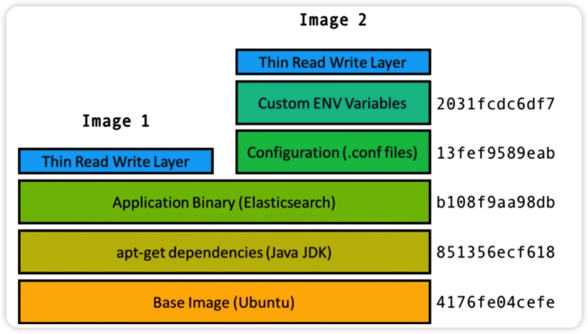
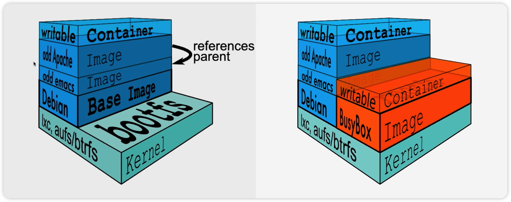

Docker是一个用来装程序及其环境的容器，属于Linux容器的一种封装，提供简单易用的容器使用接口，它是目前最流行Linux容器解决方案。


# docker重要概念

## image镜像

镜像就是一系列文件系统的集合，要注意docker文件系统是使用的`UnionFS`，联合文件系统，将文件进行分层，最底层是基础环境，上面的文件依赖下面的环境，一层一层的，通常我们自己开发一个镜像，也是在别的镜像的基础上面添加自己的文件内容。



在镜像中，只有最上层是可以写入的，下面的多层文件系统只能读取，因为下面的层都是环境，不允许修改，要修改那么就是换一个镜像了，而最上层通常用来保存一些运行的日志，总要进行一些写入的工作，所以单独上面生成了一层来做这个事情。

当我们要找哪些文件被修改过，或者发生了变化，一定是从最上层开始往下找的，要注意下面的层只是不允许我们手动写入，但是它自己是可以产生写入文件的，比如运行的bug日志等等。

这些生成的文件同时会生成一个副本保存到最上一层。



## 容器

镜像就类似于java中的类，而容器就类似于java中的实例，也就是说镜像具体化之后也就变成了容器，在上图中可见最上面一层就是容器，下面的层都是镜像，可以看出**容器其实就是依托下面的多个镜像文件系统生成的一个具体的运行时候的实体**。

容器就是镜像的最上一层，是可以修改的，而下面的镜像是不可以修改的。

同一个镜像是可以生成多个容器，独立运行，不同的容器之间没有任何的干扰。

## 仓库

存放镜像的位置，中转镜像文件

官方仓库：[hub.docker.com](hub.docker.com)

## client

本地客户端，用户输入Docker提供的命令来管理本地或远程的服务器

## deamon

服务端守护进程，接受Client发送的命令并执行相应的操作

# centos安装docker

### 1.有一个Cent OS 7.6系统

这个很重要，不同版本按照的时候是不一样的。

查看CentOS版本 

```shell
cat /etc/redhat-release 
```

### 2.配置国内yum源

将默认的yum源改为阿里云的源

```shell
wget -O /etc/yum.repos.d/CentOS-Base.repo http://mirrors.aliyun.com/repo/Centos-7.repo
```

清理所有的软件

```shell
yum clean all
```

将所有软件的包信息缓存到本地，这样检索的速度会大幅度提升

```shell
yum makecache
```

### 3.卸载旧版本docker

较旧的Docker版本称为docker或docker-engine。如果已安装这些程序，请卸载它们以及相关的依赖项。

```shell
yum remove docker \
docker-client \
docker-client-latest \
docker-common \
docker-latest \
docker-latest-logrotate \
docker-logrotate \
docker-engine
```

如果yum报告未安装这些软件包，也没问题。

### 4.更新yum

```shell
yum check-update
yum update
```

### 5.安装docker之前所需的软件包

```shell
yum install -y yum-utils \
device-mapper-persistent-data \
lvm2
```

### 6.使用以下命令来设置稳定的docker存储库

yum默认是没有docker相关库的，添加下面的地址，yum才知道到哪里下载，这里当然可以设置任何源地址都可以

```shell
sudo yum-config-manager --add-repo http://mirrors.aliyun.com/docker-ce/linux/centos/docker-ce.repo
```

### 7.查看目前可以安装的docker版本

```shell
yum list docker-ce --showduplicates | sort -r
```

### 8.安装指定的版本

```shell
yum install docker-ce-18.09.0 docker-ce-cli-18.09.0 containerd.io
```

### 9.启动docker

Docker是服务器----客户端架构，命令行运行docker命令的时候，需要本机有Docker服务。用下面的命令启动服务

```shell
systemctl start docker
```

停止docker

```shell
systemctl stop docker
```

### 10.安装完成后，运行下面的命令，验证是否安装成功。

```shell
docker version
```

# 第一个docker容器

### 下载镜像

docker pull [option] name[:tag]

docker image [options] [repository[:tag]]

### 运行镜像

```shell
docker run [options] image [command][arg...]
```

### 后台运行镜像

```shell
docker run -d nginx:1.13.0
```

### 查看运行状态

```shell
docker ps
```

### 进入容器内部

进入容器内部就跟进入虚拟机，进入一台新的linux是差不多的

```shell
docker exec -it ac bash
```

其中的ac表示容器的id，总共有64位，随便输入几位就可以了，只是为了区分不同的运行中的容器

# docker网络模式

docker有三种网络模式，分别是桥接、宿主网络、none

其中桥接的意思是通过一座桥将两个环境的网络连通，但是这两个环境依然有自己的环境，网卡等都是独立的，而宿主网络则是子环境直接使用宿主的网络，网卡等，自身没有网络环境，none不设置网络。

其中**桥接**是最常用的网络模式，可以将服务器的某个端口和容器的某个端口映射联通：

```shell
docker run -d -p 8080:80 nginx:1.13.0
```

表示将宿主的8080端口映射到容器的80端口，可以使用下面的命令来查看具体的端口使用情况：

```shell
netstat -na|grep 8080
```

端口在监听中，表示正在使用

如果容器有很多的服务需要端口映射，比如nginx，tomcat，以及其它服务都要映射，那么可以使用自动端口映射命令，这样就不用每个单独指定了：

```
docker run -d -P nginx
```


# 制作镜像

使用dockerfile来配置自己的镜像，其实也就是在其它镜像的基础上，制作镜像

下面是dockerfile配置文件的具体配置内容：

```shell
# alpine是一个linux的很小的基础环境，非常适合来当做最底层的环境
FROM alpine:latest
# 主要是谁来维护的这个环境
MAINTAINER imooc
# 运行时显示的文字描述
CMD ehco 'hello my dockerfile'
```

下面我们来创建这个文件：

```shell
# 创建dockerfile文件
touch dockerfile
# 打开这个文件
vim dockerfile
```

打开之后在里面添加上面的配置内容，保存之后，我们来创建镜像：

```shell
# -t 指定镜像名字 名字后可以指定标签设定版本，默认latest，最后的.表示dockerfile的路径
docker build -t hello_world .
```

