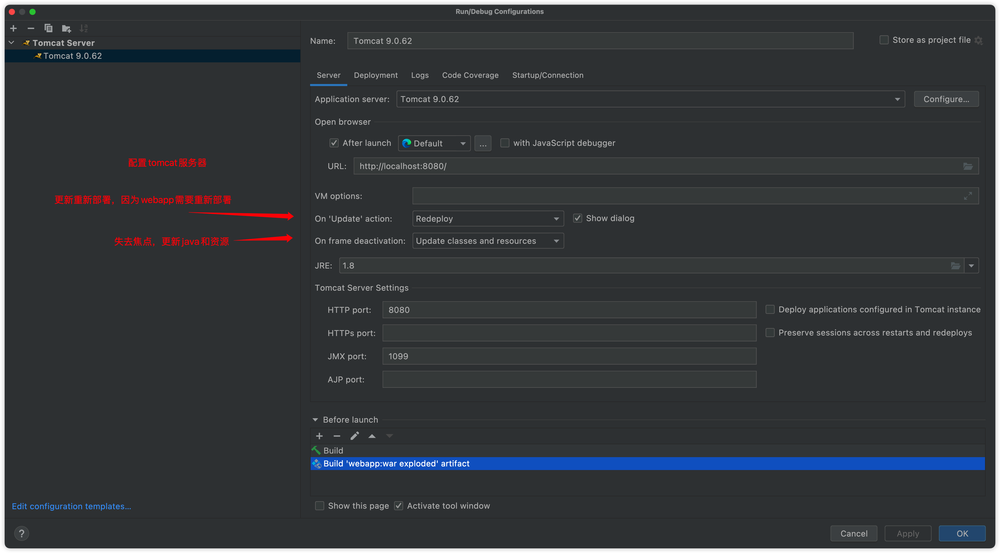

# tomcat web服务器

## 安装tomcat

tomcat官网：http://tomcat.apache.org/


## 启动tomcat服务器

下载之后直接解压即可


bin目录下启动tomcat


如果显示找不到startup.sh

那么执行以下命令启动

其实执行startup.bat或者startup.sh也是执行下面这个

```shell
sh catalina.sh run 
```


访问测试：http://localhost:8080/

## tomcat配置

conf目录下，server.xml是服务器核心配置文件

可以配置启动的端口号

- tomcat的默认端口号为：8080 

- mysql：3306 

- http：80

- https：443

```xml
<Connector port="8081" protocol="HTTP/1.1" connectionTimeout="20000" redirectPort="8443" />
```


可以配置主机的名称

默认的主机名为：localhost->127.0.0.1 

默认网站应用存放的位置为：webapps，指的是所有网站都必须放在这个里面才能找得到，而不是直接在webapps放具体项目文件，里面还可以新建项目目录

```xml
<Host name="www.qinjiang.com" appBase="webapps" unpackWARs="true" autoDeploy="true">
```


## 高难度面试题

请你谈谈网站是如何进行访问的！

1. 输入一个域名,回车
2. 检查本机的 C:\Windows\System32\drivers\etc\hosts配置文件下有没有这个域名映射
3. 有：直接返回对应的ip地址，这个地址中，有我们需要访问的web程序，可以直接访问
4. 没有：去DNS服务器找，找到的话就返回，找不到就返回找不到；

```xml
127.0.0.1 www.qinjiang.com
```


## tomcat网站项目基本结构


## tomcat idea配置



注意上面的两个热更新需要配置deployment之后才会出现	


## 热更新配置

级别update classes and resources最低，restart最高

on update action：代码改变时

On frame deactivation：窗口失去焦点时

- update classes and resources：改了html,css,js
- redeploy：改了后台Java代码
- restart：改了服务器配置