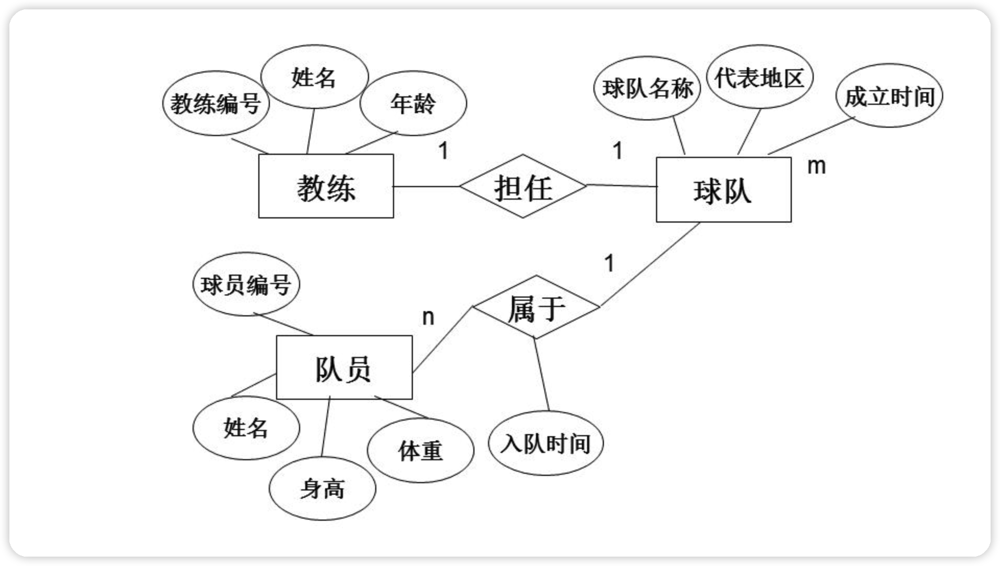
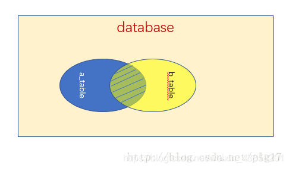
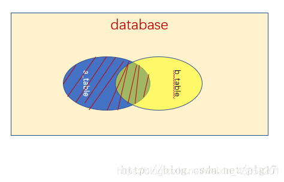
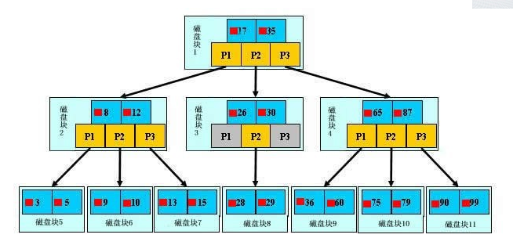

# 数据库基础

数据库是学习JavaWeb的一个前置，只有了解了数据库的操作和使用，我们才能更好地组织和管理网站应用产生的数据。


## 什么是数据库

数据库是数据管理的有效技术，是由一批数据构成的有序集合，这些数据被存放在结构化的数据表里。数据表之间相互关联，反映客观事物间的本质联系。数据库能有效地帮助一个组织或企业科学地管理各类信息资源。简而言之，我们的数据可以交给数据库来帮助我们进行管理，同时数据库能够为我们提供高效的访问性能。

在JavaSE学习阶段中，我们学习了如何使用文件I/O来将数据保存到本地，这样就可以将一个数据持久地存储在本地，即使程序重新打开，我们也能加载回上一次的数据，但是当我们的数据变得非常多的时候，这样的方式就显得不太方便了。同时我们如果需要查找众多数据的中的某一个，就只能加载到内存再进行查找，这样显然是很难受的！

而数据库就是专门做这事的，我们可以快速查找想要的数据，便捷地插入、修改和删除数据，并且数据库不仅能做这些事，还能提供更多便于管理数据和操作数据的功能！

### 常见的数据库

常见的数据库有很多种，包括但不限于：

* MySQL - 免费，用的最多的，开源数据库，适用于中小型
* Microsoft SQL Server - 收钱的，但是提供技术支持，适用于Windows Server
* Oracle - 收钱的，大型数据库系统

而我们要学习的是MySQL数据，其实无论学习哪种数据库，SQL语句大部分都是通用的，只有少许语法是不通用的，因此我们只需要学习一种数据库其他的也就差不多都会了。

### 数据模型

数据模型与现实世界中的模型一样，是对现实世界数据特征的一种抽象。实际上，我们之前学习的类就是对现实世界数据的一种抽象，比如一个学生的特征包括姓名，年龄，年级，学号，专业等，这些特征也称为实体的一种属性，属性具有以下特点：

* 属性不可再分
* 一个实体的属性可以有很多个
* 用于唯一区分不同实体的的属性，称为Key，比如每个同学的学号都是不一样的
* 属性取值可以有一定的约束，比如性别只能是男或是女

实体或是属性之间可以具有一定的联系，比如一个老师可以教很多个学生，而学生相对于老师就是被教授的关系；又比如每个同学都有一个学号与其唯一对应，因此学号和学生之间也有一种联系。而像一个老师教多个学生的联系就是一种一对多的联系（1:n），而学号唯一对应，就是一种一对一的联系（1:1）；每一个老师不仅可以教多个学生，每一个学生也可以有多个教师，这就是一种多对多的联系（n:m）

MySQL就是一种关系型数据库，通过使用关系型数据库，我们就可以很好地存储这样带有一定联系的数据。



通过构建一个ER图，我们就能很好地理清不同数据模型之间的关系和特点。

# 安装、卸载、备份、配置

## 安装相关

### 安装mysql

- 下载地址：[MySQL :: Download MySQL Community Server](https://dev.mysql.com/downloads/mysql/) 选择MySQL Community Server然后选择对应的版本即可
- 直接安装
- 在系统偏好设置面板进行配置


### 卸载

直接在偏好设置面板卸载即可


### 可视化软件

推荐使用navicat

使用navicat进行备份和还原


## 相关配置

### 开启INNODB引擎

超过mysql5.7默认使用INNODB引擎，之前是使用的mysql引擎


### 配置环境变量

默认控制台配置

```shell
// 打开配置文件
open ~/.bash_profile

// 加入mysql命令
export PATH=${PATH}:/usr/local/mysql/bin

// 更新配置文件
source ~/.bash_profile
```


zsh控制台配置

```shell
// 打开配置文件
open ~/.zshrc

// 加入mysql命令
export PATH=${PATH}:/usr/local/mysql/bin

// 更新配置文件
source ~/.zshrc
```


### 修改mysql密码

打开mysql命令行(可以在navicat中打开)

```shell
alter user 'root'@'localhost' identified by 'root';
```

# 认识SQL语句

结构化查询语言（Structured Query Language）简称SQL，这是一种特殊的语言，它专门用于数据库的操作。每一种数据库都支持SQL，但是他们之间会存在一些细微的差异，因此不同的数据库都存在自己的“方言”。

SQL语句不区分大小写（关键字推荐使用大写），它支持多行，并且需要使用`;`进行结尾！

SQL也支持注释，通过使用`--`或是`#`来编写注释内容，也可以使用`/*`来进行多行注释。

我们要学习的就是以下四种类型的SQL语言：

* 数据查询语言（Data Query Language, DQL）基本结构是由SELECT子句，FROM子句，WHERE子句组成的查询块。
* 数据操纵语言（Data Manipulation Language, DML）是SQL语言中，负责对数据库对象运行数据访问工作的指令集，以INSERT、UPDATE、DELETE三种指令为核心，分别代表插入、更新与删除，是开发以数据为中心的应用程序必定会使用到的指令。
* 数据库定义语言DDL(Data Definition Language)，是用于描述数据库中要存储的现实世界实体的语言。
* DCL（Data Control Language）是数据库控制语言。是用来设置或更改数据库用户或角色权限的语句，包括（grant,deny,revoke等）语句。在默认状态下，只有sysadmin,dbcreator,db_owner或db_securityadmin等人员才有权力执行DCL。

我们平时所说的CRUD其实就是增删改查（Create/Retrieve/Update/Delete）

***

# 数据库定义语言（DDL）

## 数据库操作

我们可以通过`create database`来创建一个数据库：

```sql
create database 数据库名
```

为了能够支持中文，我们在创建时可以设定编码格式：

```sql
CREATE DATABASE IF NOT EXISTS 数据库名 DEFAULT CHARSET utf8 COLLATE utf8_general_ci;
```

如果我们创建错误了，我们可以将此数据库删除，通过使用`drop database`来删除一个数据库：

```sql
drop database 数据库名
```

## 创建表

数据库创建完成后，我们一般通过`create table`语句来创建一张表：

```sql
create table 表名(列名 数据类型[列级约束条件],
             列名 数据类型[列级约束条件],
             ...
             [,表级约束条件])
```

## SQL数据类型

以下的数据类型用于字符串存储：

* char(n)可以存储任意字符串，但是是固定长度为n，如果插入的长度小于定义长度时，则用空格填充。
* varchar(n)也可以存储任意数量字符串，长度不固定，但不能超过n，不会用空格填充。

以下数据类型用于存储数字：

* smallint用于存储小的整数，范围在 (-32768，32767)
* int用于存储一般的整数，范围在 (-2147483648，2147483647)
* bigint用于存储大型整数，范围在 (-9,223,372,036,854,775,808，9,223,372,036,854,775,807)
* float用于存储单精度小数
* double用于存储双精度的小数

以下数据类型用于存储时间：

* date存储日期
* time存储时间
* year存储年份
* datetime用于混合存储日期+时间

## 列级约束条件

列级约束有六种：主键Primary key、外键foreign key 、唯一 unique、检查 check （MySQL不支持）、默认default 、非空/空值 not null/ null

## 表级约束条件

表级约束有四种：主键、外键、唯一、检查

现在我们通过SQL语句来创建我们之前提到的三张表。

```sql
[CONSTRAINT <外键名>] FOREIGN KEY 字段名 [，字段名2，…] REFERENCES <主表名> 主键列1 [，主键列2，…]
```

## 修改表

如果我们想修改表结构，我们可以通过`alter table`来进行修改：

```sql
ALTER TABLE 表名[ADD 新列名 数据类型[列级约束条件]]
							 [DROP COLUMN 列名[restrict|cascade]]
							 [ALTER COLUMN 列名 新数据类型]
```

我们可以通过ADD来添加一个新的列，通过DROP来删除一个列，不过我们可以添加restrict或cascade，默认是restrict，表示如果此列作为其他表的约束或视图引用到此列时，将无法删除，而cascade会强制连带引用此列的约束、视图一起删除。还可以通过ALTER来修改此列的属性。

## 删除表

我们可以通过`drop table`来删除一个表：

```sql
DROP TABLE 表名[restrict|cascade]
```

其中restrict和cascade上面的效果一致。

***

# 数据库操纵语言（DML）

前面我们已经学习了如何使用SQL语句来创建、修改、删除数据库以及表，而如何向数据库中插入、删除、更新数据，将是本版块讨论的重点。

## 插入数据

通过使用`insert into`语句来向数据库中插入一条数据（一条记录）：

```sql
INSERT INTO 表名 VALUES(值1, 值2, 值3)
```

如果插入的数据与列一一对应，那么可以省略列名，但是如果希望向指定列上插入数据，就需要给出列名：

```sql
INSERT INTO 表名(列名1, 列名2) VALUES(值1, 值2)
```

我们也可以一次性向数据库中插入多条数据：

```sql
INSERT INTO 表名(列名1, 列名2) VALUES(值1, 值2), (值1, 值2), (值1, 值2)
```

我们来试试看向我们刚刚创建的表中添加三条数据。

## 修改数据

我们可以通过`update`语句来更新表中的数据：

```sql
UPDATE 表名 SET 列名=值,... WHERE 条件
```

注意，SQL语句中的等于判断是`=`

**警告：**如果忘记添加`WHERE`字句来限定条件，将使得整个表中此列的所有数据都被修改！

## 删除数据

我们可以通过使用`delete`来删除表中的数据：

```sql
DELETE FROM 表名
```

通过这种方式，将删除表中全部数据，我们也可以使用`where`来添加条件，只删除指定的数据：

```sql
DELETE FROM 表名 WHERE 条件
```

***

# 数据库查询语言（DQL）

数据库的查询是我们整个数据库学习中的重点内容，面对数据库中庞大的数据，该如何去寻找我们想要的数据，就是我们主要讨论的问题。

## 单表查询

单表查询是最简单的一种查询，我们只需要在一张表中去查找数据即可，通过使用`select`语句来进行单表查询：

```sql
-- 指定查询某一列数据
SELECT 列名[,列名] FROM 表名
-- 会以别名显示此列
SELECT 列名 别名 FROM 表名
-- 查询所有的列数据
SELECT * FROM 表名
-- 只查询不重复的值
SELECT DISTINCT 列名 FROM 表名
```

我们也可以添加`where`字句来限定查询目标：

```sql
SELECT * FROM 表名 WHERE 条件
```

## 常用查询条件

* 一般的比较运算符，包括=、>、<、>=、<=、!=等。
* 是否在集合中：in、not in
* 字符模糊匹配：like，not like
* 多重条件连接查询：and、or、not

我们来尝试使用一下上面这几种条件。

## 排序查询

我们可以通过`order by`来将查询结果进行排序：

```sql
SELECT * FROM 表名 WHERE 条件 ORDER BY 列名 ASC|DESC
```

使用ASC表示升序排序，使用DESC表示降序排序，默认为升序。

我们也可以可以同时添加多个排序：

```sql
SELECT * FROM 表名 WHERE 条件 ORDER BY 列名1 ASC|DESC, 列名2 ASC|DESC
```

这样会先按照列名1进行排序，每组列名1相同的数据再按照列名2排序。

## 聚集函数

聚集函数一般用作统计，包括：

* `count([distinct]*)`统计所有的行数（distinct表示去重再统计，下同）
* `count([distinct]列名)`统计某列的值总和
* `sum([distinct]列名)`求一列的和（注意必须是数字类型的）
* `avg([distinct]列名)`求一列的平均值（注意必须是数字类型）
* `max([distinct]列名)`求一列的最大值
* `min([distinct]列名)`求一列的最小值

一般聚集函数是这样使用的：

```sql
SELECT count(distinct 列名) FROM 表名 WHERE 条件 
```

## 分组和分页查询

通过使用`group by`来对查询结果进行分组，它需要结合聚合函数一起使用：

```sql
SELECT sum(*) FROM 表名 WHERE 条件 GROUP BY 列名
```

我们还可以添加`having`来限制分组条件：

```sql
SELECT sum(*) FROM 表名 WHERE 条件 GROUP BY 列名 HAVING 约束条件
```

我们可以通过`limit`来限制查询的数量，只取前n个结果：

```sql
SELECT * FROM 表名 LIMIT 数量
```

我们也可以进行分页：

```sql
SELECT * FROM 表名 LIMIT 起始位置,数量
```

## 多表查询

多表查询是同时查询的两个或两个以上的表，多表查询会提通过连接转换为单表查询。

```sql
SELECT * FROM 表1, 表2
```

直接这样查询会得到两张表的笛卡尔积，也就是每一项数据和另一张表的每一项数据都结合一次，会产生庞大的数据。

```sql
SELECT * FROM 表1, 表2 WHERE 条件
```

这样，只会从笛卡尔积的结果中得到满足条件的数据。

**注意：**如果两个表中都带有此属性吗，需要添加表名前缀来指明是哪一个表的数据。

## 自身连接查询

自身连接，就是将表本身和表进行笛卡尔积计算，得到结果，但是由于表名相同，因此要先起一个别名：

```sql
SELECT * FROM 表名 别名1, 表名 别名2
```

其实自身连接查询和前面的是一样的，只是连接对象变成自己和自己了。

## 外连接查询

外连接就是专门用于联合查询情景的，比如现在有一个存储所有用户的表，还有一张用户详细信息的表，我希望将这两张表结合到一起来查看完整的数据，我们就可以通过使用外连接来进行查询，外连接有三种方式：

* 通过使用`inner join`进行内连接，只会返回两个表满足条件的交集部分：



* 通过使用`left join`进行左连接，不仅会返回两个表满足条件的交集部分，也会返回左边表中的全部数据，而在右表中缺失的数据会使用`null`来代替（右连接`right join`同理，只是反过来而已，这里就不再介绍了）：



## 嵌套查询

我们可以将查询的结果作为另一个查询的条件，比如：

```sql
SELECT * FROM 表名 WHERE 列名 = (SELECT 列名 FROM 表名 WHERE 条件)
```

我们来再次尝试编写一下在最开始我们查找某教师所有学生的SQL语句。

***

# 数据库控制语言（DCL）

庞大的数据库不可能由一个人来管理，我们需要更多的用户来一起管理整个数据库。

## 创建用户

我们可以通过`create user`来创建用户：

```sql
CREATE USER 用户名 identified by 密码;
```

也可以不带密码：

```sql
CREATE USER 用户名;
```

我们可以通过@来限制用户登录的登录IP地址，`%`表示匹配所有的IP地址，默认使用的就是任意IP地址。

## 登陆用户

首先需要添加一个环境变量，然后我们通过cmd去登陆mysql：

```sql
login -u 用户名 -p
```

输入密码后即可登陆此用户，我们输入以下命令来看看能否访问所有数据库：

```sql
show databases;
```

我们发现，虽然此用户能够成功登录，但是并不能查看完整的数据库列表，这是因为此用户还没有权限！

## 用户授权

我们可以通过使用`grant`来为一个数据库用户进行授权：

```sql
grant all|权限1,权限2...(列1,...) on 数据库.表 to 用户 [with grant option]
```

其中all代表授予所有权限，当数据库和表为`*`，代表为所有的数据库和表都授权。如果在最后添加了`with grant option`，那么被授权的用户还能将已获得的授权继续授权给其他用户。

我们可以使用`revoke`来收回一个权限：

```sql
revoke all|权限1,权限2...(列1,...) on 数据库.表 from 用户
```

# 视图

视图本质就是一个查询的结果，不过我们每次都可以通过打开视图来按照我们想要的样子查看数据。既然视图本质就是一个查询的结果，那么它本身就是一个虚表，并不是真实存在的，数据实际上还是存放在原来的表中。

我们可以通过`create view`来创建视图;

```sql
CREATE VIEW 视图名称(列名) as 子查询语句 [WITH CHECK OPTION];
```

WITH CHECK OPTION是指当创建后，如果更新视图中的数据，是否要满足子查询中的条件表达式，不满足将无法插入，创建后，我们就可以使用`select`语句来直接查询视图上的数据了，因此，还能在视图的基础上，导出其他的视图。

1. 若视图是由两个以上基本表导出的，则此视图不允许更新。
2. 若视图的字段来自字段表达式或常数，则不允许对此视图执行INSERT和UPDATE操作，但允许执行DELETE操作。
3. 若视图的字段来自集函数，则此视图不允许更新。
4. 若视图定义中含有GROUP BY子句，则此视图不允许更新。
5. 若视图定义中含有DISTINCT短语，则此视图不允许更新。
6. 若视图定义中有嵌套查询，并且内层查询的FROM子句中涉及的表也是导出该视图的基本表，则此视图不允许更新。例如将成绩在平均成绩之上的元组定义成一个视图GOOD_SC： CREATE VIEW GOOD_SC AS SELECT Sno, Cno, Grade FROM SC WHERE Grade > (SELECT AVG(Grade) FROM SC); 　　导出视图GOOD_SC的基本表是SC，内层查询中涉及的表也是SC，所以视图GOOD_SC是不允许更新的。
7. 一个不允许更新的视图上定义的视图也不允许更新

通过`drop`来删除一个视图：

```sql
drop view apptest
```

# 事务

事务包含更多的内容，包括隔离级别，数据库锁等内容


### 事务的特性

`原子性`

要么都成功，要么都失败，事务里面的所有操作成为一个原子操作


`一致性`

事务前后的数据完整性要保证一直，比如最开始所有数值总数为1000，无论怎么操作，最终的总数还是1000


`持久性`

事务一旦提交则不可逆，被持久化到数据库中


`隔离性`

多个用户同时操作时，每个用户操作的数据通过事务的隔离不相互影响

多个用户多个事务相互隔离


### 事务提交

```sql
-- mysql默认开始事务自动提交
SET autocommit = 0 -- 关闭自动提交
SET autocommit = 1 -- 开启(默认)

-- 一般要使用事务，首先应该关闭自动提交，手动处理
SET autocommit = 0
START TRANSACTION	-- 开启事务
insert xxx
update xxx
COMMIT -- 提交：持久化(成功)
ROLLBACK -- 回滚：说明失败了
SET autocommit = 1	-- 事务结束，重新开启自动提交

-- 保存节点，就是存档点，下次直接在这个节点开始执行
SAVEPOINT 保存点名	-- 设置保存节点
ROLLBACK TO SAVEPOINT 保存点名 -- 回滚到保存节点
RELEASE SAVEPOINT 保存点名 -- 撤销保存点
```


# 索引

索引是帮助mysql高校获取数据的数据结构，其实就是根据数据结构生成一个索引文件，然后获取数据的时候更加快速

索引就好像我们书的目录，每本书都有一个目录用于我们快速定位我们想要的内容在哪一页，索引也是，通过建立索引，我们就可以根据索引来快速找到想要的一条记录，大大提高查询效率。

## 索引分类

- 主键索引(primary key)
  - 唯一标识，主键不可重复，只能有一个列
- 唯一索引(unique key)
  - 避免重复列出现，可以设置多个重复索引
- 常规索引(key/index)
  - 默认的，index 使用key关键字来设置
- 全文索引
  - 在特定的数据库引擎下才有，myisam，新版INOODB也有
  - 快速定位text中的数据

### 索引基本操作

```sql
-- 显示所有的索引信息
show index from student

-- 增加一个全文索引
ALTER TABLE school.student add fulltext index studentname(studentname) -- 前面的student那么表示索引名称，显示在索引列表

-- explain 分析sql语句执行的情况，包含检索了多少行数据
EXPLAIN select * from student -- 非全文索引
EXPLAIN select * from student where Match(studentname) AGAINST('刘')
```

### 单列索引

单列索引只针对于某一列数据创建索引，单列索引有以下几种类型：

* **NORMAL：**普通的索引类型，完完全全相当于一本书的目录。
* **UNIQUE：**唯一索引，我们之前已经用过了，一旦建立唯一索引，那么整个列中将不允许出现重复数据。每个表的主键列，都有一个特殊的唯一索引，叫做Primary Key，它不仅仅要求不允许出现重复，还要求不能为NULL，它还可以自动递增。每张表可以有多个唯一索引，但是只能有一个Primary索引。
* **SPATIAL：**空间索引，空间索引是对空间数据类型的字段建立的索引，MYSQL中的空间数据类型有4种，分别是GEOMETRY、POINT、LINESTRING、POLYGON，不是很常用，这里不做介绍。
* **FULLTEXT：**全文索引（MySQL 5.6 之后InnoDB才支持），它是模糊匹配的一种更好的解决方案，它的效率要比使用`like %`更高，并且它还支持多种匹配方式，灵活性也更加强大。只有字段的数据类型为 char、varchar、text 及其系列才可以建全文索引。

我们来看看如何使用全文索引，首先创建一张用于测试全文索引的表：

```sql
CREATE TABLE articles (
  id INT UNSIGNED AUTO_INCREMENT NOT NULL PRIMARY KEY,
  title VARCHAR(200),
  body TEXT,
  FULLTEXT (body));
```

```sql
INSERT INTO articles VALUES
	(NULL,'MySQL Tutorial', 'DBMS stands for DataBase ...'),
	(NULL,'How To Use MySQL Efficiently', 'After you went through a ...'),
	(NULL,'Optimising MySQL','In this tutorial we will show ...'),
	(NULL,'1001 MySQL Tricks','1. Never run mysqld as root. 2. ...'),
	(NULL,'MySQL vs. YourSQL', 'In the following database comparison ...'),
	(NULL,'MySQL Security', 'When configured properly, MySQL ...');
```

最后我们使用全文索引进行模糊匹配：

```sql
SELECT * FROM articles WHERE MATCH (body) AGAINST ('database');
```

注意全文索引如何定义字段的，match中就必须是哪些字段，against中定义需要模糊匹配的字符串，我们用作查找的字符串实际上是被分词之后的结果，如果进行模糊匹配的不是一个词语，那么会查找失败，但是它的效率远高于以下这种写法：

```sql
SELECT * FROM articles WHERE body like '%database%';
```

### 组合索引

组合索引实际上就是将多行捆绑在一起，作为一个索引，它同样支持以上几种索引类型，我们可以在Navicat中进行演示。

注意组合索引在进行匹配时，遵循最左原则。

我们可以使用`explain`语句（它可以用于分析select语句的执行计划，也就是MySQL到底是如何在执行某条select语句的）来分析查询语句到底有没有通过索引进行匹配。

```sql
explain select * from student where name = '小王';
```

得到的结果如下：

* select_type：查询类型，上面的就是简单查询（SIMPLE）
* table：查询的表
* type：MySQL决定如何查找对应的记录，效率从高到低：system > const > eq_ref > ref > range > index > all
* possible_keys：执行查询时可能会用到的索引
* key：实际使用的索引
* key_len：Mysql在索引里使用的字节数，字段的最大可能长度
* rows：扫描的行数
* extra：附加说明

## 索引原则

- 索引不是越多越好
- 不要对经常变动的数据加索引，因为加索引需要时间
- 小数据量的表不需要添加索引
- 索引一般加在经常查询的字段上

## 索引底层原理

在了解完了索引的类型之后，我们接着来看看索引是如何实现的。

既然我们要通过索引来快速查找内容，那么如何设计索引就是我们的重点内容，因为索引是存储在硬盘上的，跟我们之前使用的HashMap之类的不同，它们都是在内存中的，但是硬盘的读取速度远小于内存的速度，每一次IO操作都会耗费大量的时间，我们也不可能把整个磁盘上的索引全部导入内存，因此我们需要考虑尽可能多的减少IO次数，索引的实现可以依靠两种数据结构，一种是我们在JavaSE阶段已经学习过的Hash表，还有一种就是B-Tree。

我们首先来看看哈希表，实际上就是计算Hash值来快速定位：


通过对Key进行散列值计算，我们可以直接得到对应数据的存放位置，它的查询效率能够达到O(1)，但是它也存在一定的缺陷：

* Hash索引仅仅能满足“=”，“in”查询条件，不能使用范围查询模糊匹配。 
* Hash碰撞问题。
* 不能用部分索引键来搜索，因为组合索引在计算哈希值的时候是一起计算的。

那么，既然要解决这些问题，我们还有一种方案就是使用类似于二叉树那样的数据结构来存储索引，但是这样相比使用Hash索引，会牺牲一定的读取速度。

但是这里并没有使用二叉树，而是使用了BTree，它是专门为磁盘数据读取设计的一种度为n的查找树：

* 树中每个结点最多含有m个孩子（m >= 2）
* 除根结点和叶子结点外，其它每个结点至少有[ceil(m / 2)]个孩子。
* 若根结点不是叶子结点，则至少有2个孩子。
* 所有叶子结点都出现在同一层。
* 每个非终端结点中包含有n个键值信息： (P1，K1，P2，K2，P3，......，Kn，Pn+1)。其中： 
         
  1. Ki (i=1...n)为键值，且键值按顺序升序排序K(i-1)< Ki。  
  2. Pi为指向子树根的结点，且指针P(i)指向的子树中所有结点的键值均小于Ki，但都大于K(i-1)。  
  3. 键值的个数n必须满足： [ceil(m / 2)-1] <= n <= m-1。



比如现在我们要对键值为**10**的记录进行查找，过程如下：

1. 读取根节点数据（目前进行了一次IO操作）
2. 根据根节点数据进行判断得到10<17，因为P1指向的子树中所有值都是小于17的，所以这时我们将P1指向的节点读取（目前进行了两次IO操作）
3. 再次进行判断，得到8<10<12，因为P2指向的子树中所有的值都是小于12大于8的，所以这时读取P2指向的节点（目前进行了三次IO操作）
4. 成功找到。

我们接着来看，虽然BTree能够很好地利用二叉查找树的思想大幅度减少查找次数，但是它的查找效率还是很低，因此它的优化版本B+Tree诞生了，它拥有更稳定的查询效率和更低的IO读取次数：


我们可以发现，它和BTree有一定的区别：

* 有n棵子树的结点中含有n个键值，BTree只有n-1个。
* 所有的键值信息只在叶子节点中包含，非叶子节点仅仅保存子节点的最小（或最大）值，和指向叶子节点的指针，这样相比BTree每一个节点在硬盘中存放了更少的内容（没有键值信息了）
* 所有叶子节点都有一个根据大小顺序指向下一个叶子节点的指针Q，本质上数据就是一个链表。

这样，读取IO的时间相比BTree就减少了很多，并且查询任何键值信息都需要完整地走到叶子节点，保证了查询的IO读取次数一致。因此MySQL默认选择B+Tree作为索引的存储数据结构。

这是MyISAM存储引擎下的B+Tree实现：


这是InnoDB存储引擎下的B+Tree实现：


InnoDB与MyISAM实现的不同之处：

* 数据本身就是索引的一部分（所以这里建议主键使用自增）
* 非主键索引的数据实际上存储的是对应记录的主键值（因此InnoDB必须有主键，若没有也会自动查找替代）

## 触发器

触发器就像其名字一样，在某种条件下会自动触发，在`select`/`update`/`delete`时，会自动执行我们预先设定的内容，触发器通常用于检查内容的安全性，相比直接添加约束，触发器显得更加灵活。

触发器所依附的表称为基本表，当触发器表上发生`select`/`update`/`delete`等操作时，会自动生成两个临时的表（new表和old表，只能由触发器使用）

比如在`insert`操作时，新的内容会被插入到new表中；在`delete`操作时，旧的内容会被移到old表中，我们仍可在old表中拿到被删除的数据；在`update`操作时，旧的内容会被移到old表中，新的内容会出现在new表中。

```sql
CREATE TRIGGER 触发器名称 [BEFORE|AFTER] [INSERT|UPDATE|DELETE] ON 表名/视图名 FOR EACH ROW DELETE FROM student WHERE student.sno = new.sno
```

 FOR EACH ROW表示针对每一行都会生效，无论哪行进行指定操作都会执行触发器！

通过下面的命令来查看触发器：

```sql
SHOW TRIGGERS
```

如果不需要，我们就可以删除此触发器：

```sql
DROP TRIGGER 触发器名称
```


本版块我们会详细介绍索引的几种类型，以及索引的底层存储原理。

* 

# 权限管理

## 用户管理

```sql
-- 创建用户
create user kuangshen identified by 'password'

-- 修改密码(修改当前用户密码)
set password = password('xxxx')

-- 修改密码(指定用户)
set password for kuangshen = password('xxx')

-- 修改用户名
rename user kuangshen to kuangshen2

-- 用户授权 ALL PRIVILEGES全部的权限
-- ALL PRIVILEGES除了给别人授权，包含其余所有权限，只有root才能给别人授权
grant all privileges on *.* -- *.*表示所有的库和表

-- 给用户添加包含授权的权限
grant all privileges on *.* to 'kuangshen'@'localhost' with grant option

-- 查询权限
show grants for kuangshen
show grants for root@localhost

-- 撤销权限
revoke all privileges on *.* from kuangshen

-- 删除用户
drop user kuangshen
```


# 备份

## 使用命令行备份

```bash
# mysqldump -h 主机 -u 用户名 -p 密码 数据库 表名 > 磁盘/文件名
mysqldump -hlocalhost -uroot -p123456 school student >d:/a.sql

# 导入
# 登陆的该情况下，切换到指定的数据库
use school
source d:/a.sql

# 未登录情况下
mysql -uroot -p123456 库名 < d:/a.sql
```


# 规范数据库设计

设计数据库需要有一定的规范，否则会造成数据冗余，字段冗余，插入和删除麻烦、程序形成差


## 数据库设计步骤

### 收集信息，分析需求

通过分析，然后列出需要的表

### 设计E-R图

设计不同表之间的关系图

### 设计实体

将每个表具体的字段设计出来，并关联不同表之间的关系

## 三大范式

### 第一范式

原子性：`保证每一列不可再分`

也就是一个字段里面只能包含一个东西，不能年龄和生日放在一个字段

### 第二范式

前提：保证第一范式

`每张表只描述一件事情`

不能为了方便将很多不属于这个表的字段也放在这个表

### 第三范式

前提：满足第一范式和第二范式

`确保数据表中的每一列数据都和主键直接相关而不是间接相关`

很多字段可以新开一张表，不能图方便

### BCNF

BCNF作为第三范式的补充，假设仓库管理关系表为StorehouseManage(仓库ID, 存储物品ID, 管理员ID, 数量)，且有一个管理员只在一个仓库工作；一个仓库可以存储多种物品。这个数据库表中存在如下决定关系：

(仓库ID, 存储物品ID) →(管理员ID, 数量)

(管理员ID, 存储物品ID) → (仓库ID, 数量)

所以，(仓库ID, 存储物品ID)和(管理员ID, 存储物品ID)都是StorehouseManage的候选关键字，表中的唯一非关键字段为数量，它是符合第三范式的。但是，由于存在如下决定关系：

(仓库ID) → (管理员ID)

(管理员ID) → (仓库ID)

即存在关键字段决定关键字段的情况，如果修改管理员ID，那么就必须逐一进行修改，所以其不符合BCNF范式。

### 规范性和性能的取舍

阿里数据库规范：关联查询不得超过三张表

- 考虑商业化需求和目标，有时候数据库的性能更重要，可以添加一些冗余字段，而避免去多关联查询多个表
- 在规范性能的问题的时候，适当的考虑规范性
- 故意给某些表增加一些冗余的字段，从多表查询变成单表查询
- 故意增加一些计算列，比如count可以计算，但是最好是设计一个字段，每次增加+1，直接获取，而不是通过count查询时计算

# 函数

其实函数我们在之前已经接触到一部分了，在JavaWeb阶段，我们了解了聚集函数，聚集函数一般用作统计，包括：

* count([distinct]*)    统计所有的行数（distinct表示去重再统计，下同）
* count([distinct]列名)    统计某列的值总和
* sum([distinct]列名)    求一列的和（注意必须是数字类型的）
* avg([distinct]列名)    求一列的平均值（注意必须是数字类型）
* max([distinct]列名)    求一列的最大值
* min([distinct]列名)    求一列的最小值

比如我们需要计算某个表一共有多少行：

```sql
SELECT COUNT(*) FROM student
```

通过使用COUNT聚集函数，就可以快速统计并得到结果，比如我们想计算某一列上所有数字的和：

```sql
SELECT SUM(sid) FROM student
```

通过SUM聚集函数，就可以快速计算每一列的和，实际上这些函数都是由系统提供的函数，我们可以直接使用。

本版块我们会详细介绍各类系统函数以及如何编写自定义函数。

## 系统函数

系统为我们提供的函数也是非常实用的，我们将会分为几个类型进行讲解。

### 字符串函数

处理字符串是一个比较重要的内容，我们可以使用字符串函数来帮助我们快速处理字符串，其中常用比如用于字符串分割的函数有：

#### substring(字符串, 起始位置, 结束位置)

同Java中String类的substring一致，但是注意下标是**从1开始**，下同

比如我们只想获取所有学生姓名的第二个字，那么可以像这样写：

```sql
SELECT SUBSTRING(name, 2, 2) FROM student
```

当然也可以不从数据库中取

```SQL
SELECT SUBSTRING('123456',3,6) 
```

#### left(字符串, 长度)     

从最左边向右截取字符串

比如我们想获取所有学生姓名的第一个字，可以像这样写：

```sql
SELECT LEFT(name, 1) FROM student
```

#### right(字符串, 长度)     

从最右边向左截取字符串

#### upper(字符串)     

字符串中的所有字母转换为大写字母

比如我们希望将一个字符串所有字符专为大写：

```sql
SELECT UPPER('abcdefg')
```

#### lower(字符串)     

字符串中的所有字母转换为小写字母

#### replace(字符串, 原文, 替换文)     

同Java中String的replace效果

比如现在我们希望将查询到的所有同学的名称中的`小`全部替换`大`：

```sql
SELECT REPLACE(`name`, '小', '大') FROM student
```

#### concat(字符串1, 字符串2)   

连接两个字符串

比如我们希望将查询到的所有同学的名称最后都添加一个`子`字：

```sql
SELECT concat(name, '子') FROM student
```

#### length(字符串)    

获取字符串长度（注意如果使用的是UTF-8编码格式，那么一个汉字占3字节，数字和字母占一个字节）

比如我们要获取所有人名字的长度：

```sql
SELECT LENGTH(`name`) FROM student
```

### 日期函数

MySQL提供的日期函数也非常实用，我们可以快速对日期进行操作，比如我们想要快速将日期添加N天，就可以使用：

#### date_add(日期, interval 增量 单位)

比如我们希望让2022-1-1向后5天：

```sql
SELECT DATE_ADD('2022-1-1',INTERVAL 5 day)
```

同理，向前1年：

```sql
SELECT DATE_ADD('2022-1-1',INTERVAL -1 year)
```

单位有：year（年）、month（月）、day（日）、hour（小时）、minute（分钟）、second（秒）

#### datediff(日期1, 日期2)

快速计算日期的间隔天数，比如我们想计算2022年的2月有多少天：

```sql
SELECT DATEDIFF('2022-3-1','2022-2-1')
```

#### curdate()     

当前的日期

#### curtime()     

当前的时间

#### now()    

当前的日期+时间

#### day(日期)    

获取日期是几号

#### month(日期)   

获取日期是几月

#### year(日期)      

获取日期是哪一年

比如我们想获取今天是几号：

```sql
SELECT DAY(NOW())
```

### 数学函数

数学函数比较常规，基本与Java的Math工具类一致，这里列出即可，各位可以自行尝试：

* abs(x)   求x的绝对值
* ceiling(x)   x向上取整
* floor(x)  x向下取整
* round(x, 精度)  x取四舍五入，遵循小数点精度 
* exp(x)   e的x次方
* rand()   0-1之间的随机数
* log(x)    x的对数
* pi()     π
* power(x, n)    x的n次方
* sqrt(x)     x的平方根
* sin(x)  cos(x)   tan(x)     三角函数（貌似没有arctan这类反函数？）

### 类型转换函数

MySQL的类型转换也分为隐式类型转换和显示类型转换，首先我们来看看隐式类型转换：

```sql
SELECT 1+'2'
```

虽然这句中既包含了数字和字符，但是字符串会被进行隐式转换（注意这里并不是按照字符的ASCII码转换，而是写的多少表示多少）所以最后得到的就是1+2的结果为3

```sql
SELECT CONCAT(1, '2')
```

这里因为需要传入字符串类型的数据，但是我们给的是1这个数字，因此这里也会发生隐式类型转换，1会被直接转换为字符串的'1'，所以这里得到的结果是'12'

在某些情况下，我们可能需要使用强制类型转换来将得到的数据转换成我们需要的数据类型，这时就需要用到类型转换函数了，MySQL提供了：

#### cast(数据 as 数据类型)

数据类型有以下几种：

* BINARY[(N)] ：二进制字符串，转换后长度小于N个字节
* CHAR[(N)] ：字符串，转换后长度小于N个字符
* DATE ：日期
* DATETIME ：日期时间
* DECIMAL[(M[,N])] ：浮点数，M为数字总位数(包括整数部分和小数部分)，N为小数点后的位数
* SIGNED [INTEGER] ：有符号整数
* TIME ：时间
* UNSIGNED [INTEGER] ：无符号整数

比如我们现在需要将一个浮点数转换为一个整数：

```sql
SELECT CAST(pi() AS SIGNED)
```

我们还可以将字符串转换为数字，会自动进行扫描，值得注意的是一旦遇到非数字的字符，会停止扫描：

```sql
SELECT CAST('123abc456' as SIGNED)
```

除了cast以外还有convert函数，功能比较相似，这里就不做讲解了。

### 流程控制函数

MySQL还为我们提供了很多的逻辑判断函数，比如：

#### if(条件表达式, 结果1, 结果2)    

与Java中的三目运算符一致 a > b ? "AAA" : "BBB"

比如现在我们想判断：

```sql
SELECT IF(1 < 0,'lbwnb','yyds')
```

#### ifnull(值1, 值2)     

如果值1为NULL则返回值2，否则返回值1，这个比较有用，比如有些属性默认不传为空，但是要进行一些统计、平均的计算就会报错，所以最好设置初始值

```SQL
SELECT IFNULL(NAME,'0')
```

#### nullif(值1, 值2)     

如果值1与值2相等，那么返回NULL

#### isnull(值)      

判断值是否为NULL

通过判断函数，我们就可以很方便地进行一些条件判断操作。

#### 多分支结构

除了IF条件判断，我们还可以使用类似Switch一样的语句完成多分支结构：

```sql
SELECT 
CASE 2
	WHEN 1 THEN
		10
	ELSE
		5
END;
```

我们也可以将自定义的判断条件放入When之后，它类似于else-if：

```sql
SELECT 
CASE
	WHEN 3>5 THEN
		10
	WHEN 0<1 THEN
		11
	ELSE
		5
END;
```

还有一个类似于Java中的Thread.sleep的函数，以秒为单位：

```sql
SELECT sleep(10);
```

有关MySQL8.0新增的窗口函数这里暂时不做介绍。

## 自定义函数

除了使用系统为我们提供的函数以外，我们也可以自定义函数，并使用我们自定义的函数进行数据处理，唯一比较麻烦的就是函数定义后不能修改，只能删了重新写。

### 基本语法

MySQL的函数与Java中的方法类似，也可以添加参数和返回值，可以通过`CREATE FUNCTION`创建函数：

```sql
CREATE FUNCTION test() RETURNS INT
BEGIN
RETURN 666;
END
```

定义函数的格式为：

* create function 函数名称([参数列表]) returns 返回值类型
* begin 和 end 之间写函数的其他逻辑，begin和end就相当于Java中的花括号`{  ...  }`
* return后紧跟返回的结果

添加参数也很简单，我们只需要在函数名称括号中添加即可，注意类型需要写在参数名称后面：

```sql
CREATE FUNCTION test(i INT) RETURNS INT
BEGIN
RETURN i * i;
END
```

我们可以在BEGIN和RETURN之间编写一些其他的逻辑，比如我们想要定义一个局部变量，并为其赋值：

```sql
BEGIN
DECLARE a INT;
SET a = 10;
RETURN i * i * a;
END
```

定义局部变量的格式为：

* declare 变量名称 变量类型 [, ...]
* declare 变量名称 变量类型 default 默认值

为变量赋值的格式为：

* set 变量名称 = 值

我们还可以在函数内部使用`select`语句，它可以直接从表中读取数据，并可以结合into关键字**将查询结果赋值给变量**：

```sql
BEGIN
DECLARE a INT;
-- select into from 语句
SELECT COUNT(*) INTO a FROM student;
RETURN a;
END
```

### 流程控制

接着我们来看一下如何使用流程控制语句，其中最关键的就是IF判断语句：

```sql
BEGIN
DECLARE a INT DEFAULT 10;
IF a > 10 THEN
	RETURN 1;
ELSE
	RETURN 2;
END IF;
END
```

#### IF分支

IF分支语句的格式为：

* if 判断条件 then  ... else if 判断条件 then .... else ... end if;

我们可以结合`exists`关键字来判断是否为NULL：

```sql
BEGIN
DECLARE a INT DEFAULT 0;
-- IF EXISTS(SELECT * FROM student WHERE sid = 100) THEN
IF NOT EXISTS(SELECT * FROM student WHERE sid = 100) THEN
	SET a = 10;
END IF;
RETURN a;
END
```

我们也可以在函数中使用switch语句：

```sql
BEGIN
DECLARE a INT DEFAULT 10;
CASE a
	WHEN 10 THEN
		RETURN 2;
	ELSE
		RETURN 1;
END CASE;
END
```

#### SWITCH分支

SWITCH分支语句的格式为：

* case 变量 when 具体值或是布尔表达式 then ... when * then ... else ... end case;

与Java不同的是，它支持使用布尔表达式：

```sql
BEGIN
DECLARE a INT DEFAULT 10;
CASE
	WHEN 1 < 5 THEN
		SET a = 5;
	ELSE
		SET a = 10;
END CASE;
RETURN a;
END
```

我们以类似于elseif的形式进行判断，其实和上面直接使用是一样的。

#### While循环

我们接着来看循环语句，MySQL提供了三种循环语句，其中第一种是WHILE语句：

```sql
BEGIN
DECLARE a INT DEFAULT 10;
WHILE a < 11 DO
	SET a = a + 1;
END WHILE;
RETURN a;
END
```

格式为：

* while 循环条件 do ...  end while;

#### LOOP循环

我们接着来看第二种循环语句，LOOP循环：

```sql
BEGIN
DECLARE a INT DEFAULT 10;
lp1: LOOP
  SET a = a - 1;
	IF a = 0 THEN
		LEAVE lp1; 
	END IF; 
END LOOP lp1;
RETURN a;
END
```

相比while语句，我们可以使用`LEAVE`精准控制结束哪个循环，有点类似于goto语句：

```sql
BEGIN
DECLARE a INT DEFAULT 0;
lp1: LOOP
  lp2: LOOP
	SET a = a + 1;
	IF a > 5 THEN
		LEAVE lp1; 
	END IF; 
	END LOOP lp2;
END LOOP lp1;
RETURN a;
END
```

类似于Java中的goto写法（在JavaSE阶段已经讲解过）：

```java
public static void main(String[] args) {
    int a = 0;
    lp1: while (true){
        lp2: while (true){
            a++;
            if(a > 5) break lp1;
        }
    }
    System.out.println(a);
}
```

它的语法格式如下：

* 循环名称 loop ...(可以插入leave语句结束) end loop 循环名称;

#### repeat语句

接着我们来看最后一种循环语句，repeat语句：

```sql
BEGIN
DECLARE a INT DEFAULT 0;
REPEAT
	SET a = a + 1;
UNTIL a > 0 END REPEAT;
RETURN a;
END
```

它类似于Java中的do-while循环语句，它会先去执行里面的内容，再进行判断，格式为：

* repeat ... until 结束循环条件 end repeat;

### 全局变量

某些情况下，我们可以直接在一次会话中直接定义变量并使用，这时它并不是位于函数内的，这就是全局变量，它无需预先定义，直接使用即可：

```sql
set @x = 10;
```

我们可以将全局变量作为参数传递给函数：

```sql
select test(@x);
```

除了我们自己定义的全部变量以外，系统默认也有很多的变量，因此我们自己定义的变量称为用户变量，系统默认变量称为系统变量。查看系统变量的命令为：

```sql
show GLOBAL VARIABLES
```

# 存储过程

存储过程是一个包括多条SQL语句的集合，专用于特定表的特定操作，比如我们之前实战项目中的创建用户，那么我们就需要一次性为两张表添加数据，但是如果不使用Java，而是每次都去使用SQL命令来完成，就需要手动敲两次命令，非常麻烦，因此我们可以提前将这些操作定义好，预留出需要填写数据的位置，下次输入参数直接调用即可。

这里很容易与函数搞混淆，存储过程也是执行多条SQL语句，但是它们的出发点不一样，函数是专用于进行数据处理，并将结果返回给调用者，它更多情况下是一条SQL语句的参与者，无法直接运行，**必须在一条sql语句中才可以运行函数**，并且不涉及某个特定表，可以说跟具体某个表是没什么关系的，只是专注进行数据处理，无论给它什么表：

```sql
select count(*) from student;
```

而存储过程是多条SQL语句的执行者，这是它们的本质区别。

定义存储过程与定义函数极为相似，它也可以包含参数，函数中使用的语句这里也能使用，但是它没有返回值，同时存储过程一定是操作某张表的：

```sql
CREATE PROCEDURE lbwnb(`name` VARCHAR(20), pwd VARCHAR(255))
BEGIN
  INSERT INTO users(username, `password`) VALUES(`name`, pwd);
END
```

我们可以在存储过程中编写多条SQL语句，但是注意，MySQL的存储过程不具有原子性，当出现错误时，并不会回滚之前的操作，因此需要我们自己来编写事务保证原子性。

接着我们来看看如何执行存储过程：

```sql
CALL lbwnb('111', '2222')
```

通过使用`call`来执行一个存储过程，如果存储过程有参数，那么还需要填写参数。

比如现在我们想要实现查询用户表，如果包含用户`test`那么就删除用户，如果不包含，就添加用户：

```sql
CREATE PROCEDURE `lbwnb`()
BEGIN
	IF NOT EXISTS(SELECT * FROM users WHERE username = 'test') THEN
		INSERT INTO users(username, `password`) VALUES('test', '123456');
	ELSE
		DELETE FROM users WHERE username = 'test';
	END IF;
END
```

这里其实只需要一个简单的IF判断即可实现。

那么如果我们希望遍历一个SELECT语句查询的结果呢？我们可以使用游标来完成：

```sql
BEGIN
	DECLARE id INT;
	DECLARE `name` VARCHAR(10);
	DECLARE sex VARCHAR(5);
	# 定义一个游标
	DECLARE cur CURSOR FOR SELECT * FROM student;
	# 开启游标
	OPEN cur;
	WHILE TRUE DO
		# 将游标对象的内容放入具体的变量中
		FETCH cur INTO id, `name`, sex;
		SELECT id, `name`, sex;
	END WHILE;
	CLOSE cur;
END
```

游标的使用分为4个步骤：

* DECLARE 游标名称 CURSOR FOR 查询结果   -  定义游标
* OPEN cur     -   开启游标
* FETCH 游标名称 INTO 存储结果的变量    -    从顶部开始，每执行一次，向下移动，如果已经在最底部，则触发异常
* CLOSE cur    -   关闭游标

我们这里利用了一个while循环来多次通过游标获取查询结果，但是最后是因为出现异常才退出的，这样会导致之后的代码就无法继续正常运行了。

我们接着来看如何处理异常：

```sql
BEGIN
	DECLARE id INT;
	DECLARE `name` VARCHAR(10);
	DECLARE sex VARCHAR(5);
	DECLARE score INT;
	DECLARE a INT DEFAULT 0;
	DECLARE cur CURSOR FOR SELECT * FROM student;
	-- 必须在游标定义之后编写
	DECLARE CONTINUE HANDLER FOR 1329 SET a = 1;
	OPEN cur;
	WHILE a = 0 DO
		FETCH cur INTO id, `name`, sex, score;
		SELECT id, `name`, sex, score;
	END WHILE;
	CLOSE cur;
	SELECT 1;
END
```

我们可以声明一个异常处理器（句柄），格式如下：

* declear (continue/exit) handler for 异常名称(ID) 做点什么

我们还可以限定存储过程的参数传递，比如我们只希望用户给我们一个参数用于接收数据，而不是值传递，我们可以将其设定为OUT类型：

```sql
CREATE PROCEDURE `lbwnb`(OUT a INT)
BEGIN
	SELECT a;
	SET a = 10;
END
```

```shell
set @x = 100	
call lbwnb(@x)	# 执行函数过程，里面并不会将x变为10
```

所有的参数默认为`IN`类型，也就是值传递，也就是把值传进来了，而这里将参数设定为`OUT`类型，那么也就是变成了地址传递，里面也就是赋值到了@x这个外部变量了，相当于修改了内存，但是无法传递它的具体值了，只传递了地址，如果我们既希望参数可以传入也可以被重新赋值，我们可以将其修改为`INOUT`类型。

# 存储引擎

存储引擎就像我们电脑中的CPU，它是整个MySQL最核心的部分，数据库中的数据如何存储，数据库能够支持哪些功能，我们的增删改查请求如何执行，都是由存储引擎来决定的。

我们可以大致了解一下以下三种存储引擎：

* **MyISAM：**MySQL5.5之前的默认存储引擎，在插入和查询的情况下性能很高，但是它不支持事务，只能添加表级锁。
* **InnoDB：**MySQL5.5之后的默认存储引擎，它支持ACID事务、行级锁、外键，但是性能比不过MyISAM，更加消耗资源。
* **Memory：**数据都存放在内存中，数据库重启或发生崩溃，表中的数据都将消失。

我们可以使用下面的命令来查看MySQL支持的存储引擎：

```sql
show engines;
```

在创建表时，我们也可以为表指定其存储引擎。

我们还可以在配置文件中修改默认的存储引擎，在Windows 11系统下，MySQL的配置文件默认放在`C:\ProgramData\MySQL\MySQL Server 5.7`中，注意ProgramData是个隐藏文件夹。

* 

# 锁机制

在JavaSE的学习中，我们在多线程板块首次用到了锁机制，当我们对某个方法或是某个代码块加锁后，除非锁的持有者释放当前的锁，否则其他线程无法进入此方法或是代码块，我们可以利用锁机制来保证多线程之间的安全性。

在MySQL中，就很容易出现多线程同时操作表中数据的情况，如果要避免潜在的并发问题，那么我们可以使用之前讲解的事务隔离级别来处理，而事务隔离中利用了锁机制。

- 读未提交(Read Uncommitted)：能够读取到其他事务中未提交的内容，存在脏读问题。
- 读已提交(Read Committed RC)：只能读取其他事务已经提交的内容，存在不可重复读问题。
- 可重复读(Repeated Read RR)：在读取某行后不允许其他事务操作此行，直到事务结束，但是依然存在幻读问题。
- 串行读(Serializable)：一个事务的开始必须等待另一个事务的完成。

我们可以切换隔离级别分别演示一下：

```sql
set session transaction isolation level read uncommitted;
```

在RR级别下，MySQL在一定程度上解决了幻读问题：

* 在快照读（不加锁）读情况下，mysql通过mvcc来避免幻读。
* 在当前读（加锁）读情况下，mysql通过next-key来避免幻读。

> **`MVCC`**，全称 `Multi-Version Concurrency Control` ，即多版本并发控制。MVCC 是一种并发控制的方法，一般在数据库管理系统中，实现对数据库的并发访问，在编程语言中实现事务内存。

### 读锁和写锁

从对数据的操作类型上来说，锁分为读锁和写锁：

* **读锁：**也叫共享锁，当一个事务添加了读锁后，其他的事务也可以添加读锁或是读取数据，但是不能进行写操作，只能等到所有的读锁全部释放。
* **写锁：**也叫排他锁，当一个事务添加了写锁后，其他事务不能读不能写也不能添加任何锁，只能等待当前事务释放锁。

### 全局锁、表锁和行锁

从锁的作用范围上划分，分为全局锁、表锁和行锁：

* **全局锁：**锁作用于全局，整个数据库的所有操作全部受到锁限制。
* **表锁：**锁作用于整个表，所有对表的操作都会收到锁限制。
* **行锁：**锁作用于表中的某一行，只会通过锁限制对某一行的操作（仅InnoDB支持）

#### 全局锁

我们首先来看全局锁，它作用于整个数据库，我们可以使用以下命令来开启读全局锁：

```sql
flush tables with read lock;
```

开启后，整个数据库被上读锁，我们只能去读取数据，但是不允许进行写操作（包括更新、插入、删除等）一旦执行写操作，会被阻塞，直到锁被释放，我们可以使用以下命令来解锁：

```sql
unlock tables;
```

除了手动释放锁之外，当我们的会话结束后，锁也会被自动释放。

#### 表锁

表锁作用于某一张表，也是MyISAM和InnoDB存储引擎支持的方式，我们可以使用以下命令来为表添加锁：

```sql
lock table 表名称 read/write;
```

在我们为表添加写锁后，我们发现其他地方是无法访问此表的，一律都被阻塞。

#### 行锁

表锁的作用范围太广了，如果我们仅仅只是对某一行进行操作，那么大可不必对整个表进行加锁，因此`InnoDB`支持了行锁，我们可以使用以下命令来对某一行进行加锁：

```sql
-- 添加读锁（共享锁）
select * from ... lock in share mode;
-- 添加写锁（排他锁）
select * from ... for update;
```

使用InnoDB的情况下，在执行更新、删除、插入操作时，数据库也会自动为所涉及的行添加写锁（排他锁），直到事务提交时，才会释放锁，执行普通的查询操作时，不会添加任何锁。使用MyISAM的情况下，在执行更新、删除、插入操作时，数据库会对涉及的表添加写锁，在执行查询操作时，数据库会对涉及的表添加读锁。

**提问：**当我们不使用id进行选择，行锁会发生什么变化？（行锁升级）

### 记录锁、间隙锁和临键锁

我们知道InnoDB支持使用行锁，但是行锁比较复杂，它可以继续分为多个类型。

#### 记录锁

（Record Locks）记录锁, 仅仅锁住索引记录的一行，在单条索引记录上加锁。Record lock锁住的永远是索引，而非记录本身，即使该表上没有任何索引，那么innodb会在后台创建一个隐藏的聚集主键索引，那么锁住的就是这个隐藏的聚集主键索引。所以说当一条sql没有走任何索引时，那么将会在每一条聚合索引后面加写锁，这个类似于表锁，但原理上和表锁应该是完全不同的。

#### 间隙锁

（Gap Locks）仅仅锁住一个索引区间（开区间，不包括双端端点）。在索引记录之间的间隙中加锁，或者是在某一条索引记录之前或者之后加锁，并不包括该索引记录本身。比如在 1、2中，间隙锁的可能值有 (-∞, 1)，(1, 2)，(2, +∞)，间隙锁可用于防止幻读，保证索引间的不会被插入数据。

#### 临键锁

（Next-Key Locks）Record lock + Gap lock，左开右闭区间。默认情况下，`InnoDB`正是使用Next-key Locks来锁定记录（如select … for update语句）它还会根据场景进行灵活变换：

| 场景                                       | 转换                           |
| :----------------------------------------- | ------------------------------ |
| 使用唯一索引进行精确匹配，但表中不存在记录 | 自动转换为 Gap Locks           |
| 使用唯一索引进行精确匹配，且表中存在记录   | 自动转换为 Record Locks        |
| 使用非唯一索引进行精确匹配                 | 不转换                         |
| 使用唯一索引进行范围匹配                   | 不转换，但是只锁上界，不锁下界 |

https://zhuanlan.zhihu.com/p/48269420


# 进阶知识

一般进阶知识都会放在这里，等待后期快面试的时候再继续研究

**函数**和**存储过程**并没有包含在我们的教程当中，但是这并不代表它们就不重要，通过学习它们能够让你的数据库管理能力更上一层楼，它们能够捆绑一组SQL语句运行，并且可以反复使用，大大提高工作效率。

- 事务、数据库锁、索引高级、聚合、mysql优化：[沉默的反补的个人空间_哔哩哔哩_bilibili](https://space.bilibili.com/564757/search/video?keyword=mysql)

- 数据源、连接池、开源数据源

  - dbcp
  - c3p0
  - druid:阿里巴巴

  使用这些数据库连接池之后，就不需要编写连接数据库的代码，同时这些是支持连接池功能的
