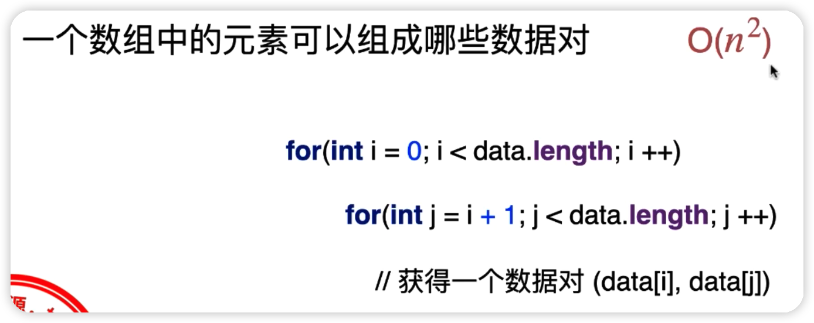
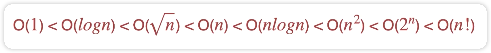

# 算法

> 学算法第一要诀，搞不懂就背，很多算法是真的难，不如先背下来用起来

算法是解决问题的方法，是一系列解决问题的，清晰的，可执行的计算机指令。

算法具有以下的五个特点：

- 有限性：一个算法，一定要在有限的时间内完成
- 确定性：不会产生二义性，只是说语句是清晰的，不会产生分歧，并不代表同样的输入必须输出同样的结果，比如随机算法就不会输出同样的结果，只要符合预期的清晰结果即可。
- 可行性：每一步应该可行，不要中间有一句语句是实际上做不到的
- 输入：要有输入
- 输出：要有结果输出

## 相关概念

### 循环不变量

在循环中，什么是不变的量，一定要搞清楚，这是搞懂循环到底在做什么事情的关键

循环中，循环体的作用是维持循环不变量，如果循环之后具体的底层循环体出现变化，那么这个循环一定存在问题。

### 复杂度分析

复杂度使用O来表示，复杂度通常看最差的情况，并不是看最优情况，复杂度不是看具体执行了多少条指令，而是判断和n的数量比，也就是变量总数n的变化趋势。

在复杂度分析中，**常数是不需要考虑的**，主要是描述随着数据规模n的增大，算法性能的变化趋势。

同时复杂度研究的是n无限增大，也就是n无穷情况下呈现出来的复杂情况，而不是去寻找最简单的执行复杂度。

常见的复杂度如下：



1. 一个数组中的元素可以组成哪些数据对？

分析：两两组成数据对，第一个数和后面的所有数字组成数据对，然后第二个数和第三个(后面)的数组组成数据对，循环

```java
public class Test {
    public static void main(String[] args) {
        int[] arr = {11,33,2,34,55,32,53};
        for (int i = 0; i < arr.length; i++) {
            for (int j = i + 1; j < arr.length; j++) {
                System.out.println(arr[i] + ":" + arr[j]);
            }
        }
    }
}
```

时间复杂度为：`O(n²)`，循环了两次n，当然具体没有到n²，大概只有½n²那么多次，不过常数忽略不计

2. 遍历一个n * n的二维数组

```java
public class Test {
    public static void main(String[] args) {
        int[][] arr = {{1,2,3},{1,2,3},{1,2,3}};
        for (int i = 0; i < arr.length; i++) {
            for (int j = 0; j < arr[i].length; j++) {
                System.out.println(arr[i][j]);
            }
        }
    }
}
```

时间复杂度为：`O(n²)`，在这里n是二维数组的两个纬度，而且两个纬度一样都是n

3. 遍历一个a * a = n的二维数组

```java
public class Test {
    public static void main(String[] args) {
        int[][] arr = {{1,2,3},{1,2,3},{1,2,3}};
        for (int i = 0; i < arr.length; i++) {
            for (int j = 0; j < arr[i].length; j++) {
                System.out.println(arr[i][j]);
            }
        }
    }
}
```

时间复杂度为：`O(n)`,要注意这里的n不是二维数组的纬度，而是二维数组元素的总数，两个纬度相乘

4. 数字n的二进制位数

一个数字转换为二进制位数，一位一位输出

```java
public class Test {
    public static void main(String[] args) {
        int n = 5;
        if (n == 0 || n == 1)
            System.out.println(n);
        while (n != 0 && n != 1) {
            int one = n % 2;
            System.out.println(one);
            n /= 2;
            if (n == 0 || n == 1)
                System.out.println(n);
        }
    }
}
```

时间复杂度为：`O(logn)`,因为每次除以了2，所以为O(logn)，要注意这里的底数不管是几，复杂度都是一样的，因为时间复杂度和常数无关

5. 数字n的所有约数

这里可以有两种算法：

```java
public static void main(String[] args) {
    int n = 10;
    for (int i = 1; i <= n; i++) {
        if (n % i == 0)
            System.out.println(i);
    }
}
```

时间复杂度为：`O(n)`

```java
public static void main(String[] args) {
    int n = 10;
    // 只需要循环的i * i次即可，也就是O(Vn)
    for (int i = 1; i * i <= n; i++) {
        if (n % i == 0) {
            // 这里一次可以输出两个约数
            System.out.println(i);
            System.out.println(n / i);
        }
    }
}
```

时间复杂度为：`O(根号n)`

6. 长度为n的二进制数字转为10进制最大可以表示为多少

时间复杂度为：`O(2^n)`，表示的是长度n要经过2^n次方次运算

7. 长度为n的数组的所有排列

时间复杂度为：`O(n!)`，每个数可以排列的剩余数字依次减少，形成阶乘

8. 判断数字n是否为偶数

时间复杂度为：`O(1)`，只有一行代码就可以判断

### 常用算法复杂度排序



# 基础算法

## 线性查找法

从一个数组中，从前往后逐一线性的查找。

比如：从data数组中查找16的位置，输入目标数组和目标元素，输出元素所在的索引，不存在返回-1。

```java
public class Student {
    private String name;
    public Student(String name) {
        this.name = name;
    }

    @Override
    // 因为是重写父类的equals，所以参数是Object，如果改为Student obj是错误的
    // 因为传过来时使用了泛型，就会是Object类型，无论它具体是什么类型，都是Object
    public boolean equals(Object student) {
        if (this == student)
            return true;
        if (student == null)
            return false;
        if (this.getClass() != student.getClass())
            return false;
        Student another = (Student) student;
        return this.name.toLowerCase().equals(another.name.toLowerCase());
    }
}
```

```java
public class LinearSearch {
    public static <E> int search(E[] data, E target) {
        for (int i = 0; i < data.length; i++)
            // 由于这个equals方法是调用的泛型通用的equals，所以每次只会调用
            // Object的equals，要使用自定义类的equals，只有重写父类才可以
            // 其中target虽然传入的是Student，但是由于使用了泛型，同样会表示为Object
            if (data[i].equals(target))
                return i;
        return -1;
    }

    public static void main(String[] args) {
      	// 查找数字
        Integer[] data = {245,22,33,13,56,44,23,4};
        int res = LinearSearch.search(data, 22);
        System.out.println(res);

      	// 查找指定对象
        Student[] students = {
                new Student("小红"),
                new Student("小明"),
                new Student("小张")
        };
        int res2 = LinearSearch.<Student>search(students,new Student("小明"));
        System.out.println(res2);
    }
}
```