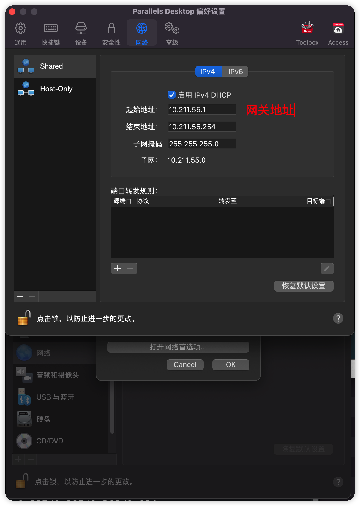

# 镜像下载

## 下载地址

推荐使用国内镜像站下载：

华为：https://mirrors.huaweicloud.com/

阿里：http://mirrors.aliyun.com/

腾讯：https://mirrors.cloud.tencent.com//

搜狐：http://mirrors.sohu.com/

网易：http://mirrors.163.com/

官网下载，速度非常慢

[CentOS Mirrors List](http://isoredirect.centos.org/centos)

## 镜像站详细下载链接

以华为镜像站为例


CentOS 是最新版的，里面的老版镜像里面只有一个 readme.txt 指向 Centos-Vault 老版镜像站，所以下载老版直接使用 **Centos-Vault**


进入下载连接之后，选择需要的版本，**推荐 7.4**，因为之前都是用的 7.4...

- 选择 isos 文件夹
- 选择 x86_64
- 选择 DVD 标准版即可

## 版本说明

- CentOS ISO：DVD是标准安装盘，一般下载这个就可以了，里面包含大量的常用软件，大部分情况下安装时无需再在线下载，体积为4G
- Minimal ISO：精简版本，包含核心组件，体积才600多MB
- Everything ISO：对完整版安装盘的软件进行补充，集成所有软件
- NetInstall ISO：网络安装镜像
- LiveGNOME ISO：GNOME桌面版
- LiveKDE ISO：KDE桌面版
- LiveCD ISO：光盘上运行的系统，类拟于winpe

# 系统安装

## 虚拟机设置

使用 **Parallels Desktop** 虚拟机安装系统

有几个点需要配置

**一个是内存要设置虚拟机监控程序为虚拟机本身，不能设置为 apple**


然后将硬盘设置 20G 即可，已经够用了

## Cent OS 安装

**选择 GNOME 桌面软件**


**禁用 KDUMP**，少占点内存


### 自定义分区


选择 LVM 标准分区方案


接着创建三个挂载点，分别是 

- `/boot`：引导区，200Mib，文件系统 ext4
- `/swap`：交换区，2048Mib
- `/`：根目录，剩余所有空间 Gib，文件系统 ext4

设备类型都设置为**标准分区**

`swap` 需要设置为这个文件系统


### 配置静态 IP

安装的时候先不配置，等待系统安装完成之后配置

首先打开虚拟机的网络配置，查看网关地址，和可以配置静态 IP 的范围



选择一个起始地址和结束地址中间的 IP，比如 **10.211.55.10**

下面打卡 CentOS 的终端，查看使用的网卡

```shell
ifconfig
```

选择一个网卡进行配置，比如 `eth0`

```shell
vim  /etc/sysconfig/network-scripts/ifcfg-eth0
```

配置下面的信息


重启网络

```shell
service network restart
```

虚拟机测试网络联通

```shell
ping www.baidu.com
```

本地电脑端测试虚拟机是否联通

```shell
ping 10.211.55.10 
```

### 安装完成

安装完成之后因为是图形界面，需要设置一个用户账户，注册进入系统之后，注销，然后登陆 **root** 账号


