## 安装环境

- vmware Fusion
- Centos7.4
- termius-ssh链接和sftp文件传输


## 开始安装

### 创建虚拟机

>  拖入iso进入vmware fusion

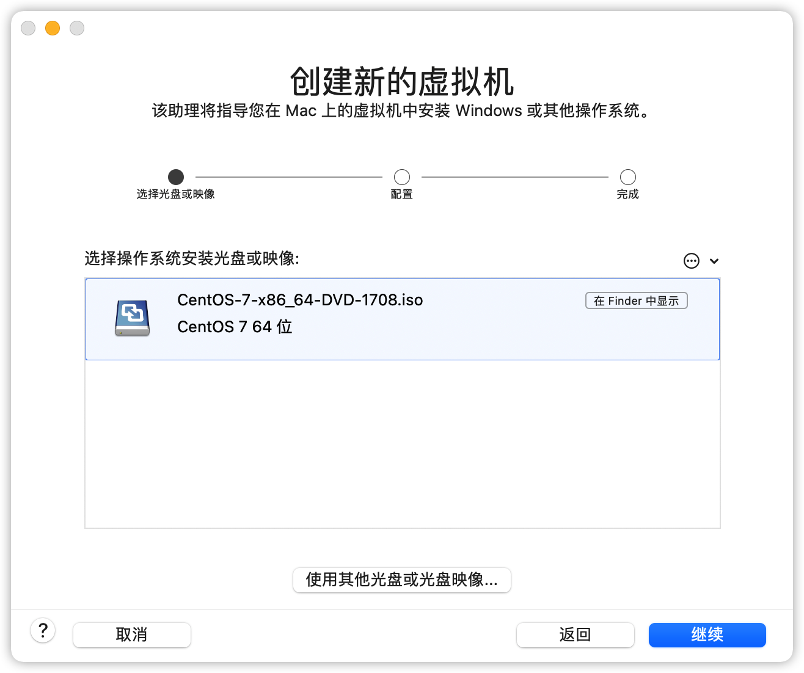

>不使用快捷安装，后面自己配置

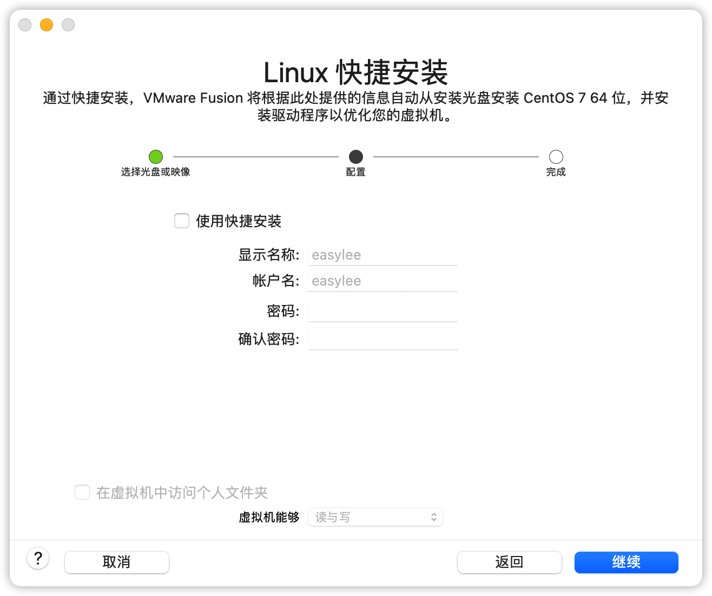

>  配置内存和硬盘

2核2G和30G即可，后期可以更改

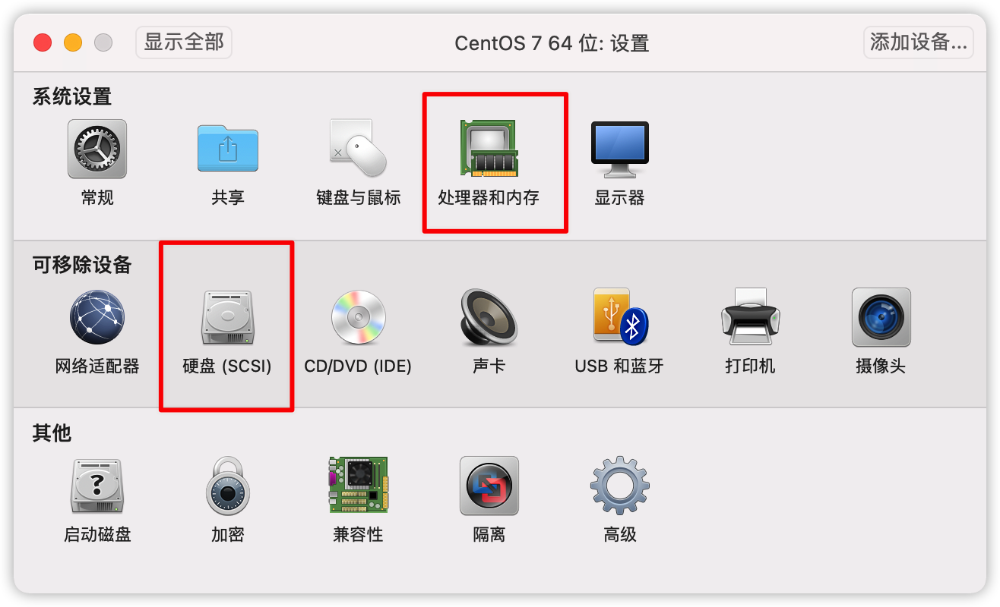

### 开始安装

> 开始安装页面

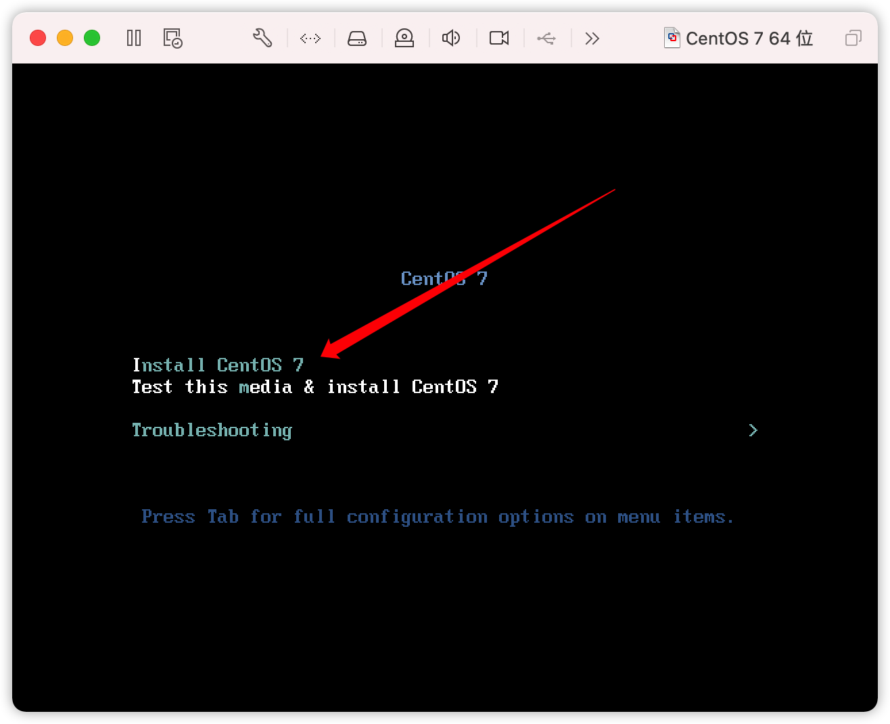

> 选择预安装软件，最小化安装即可

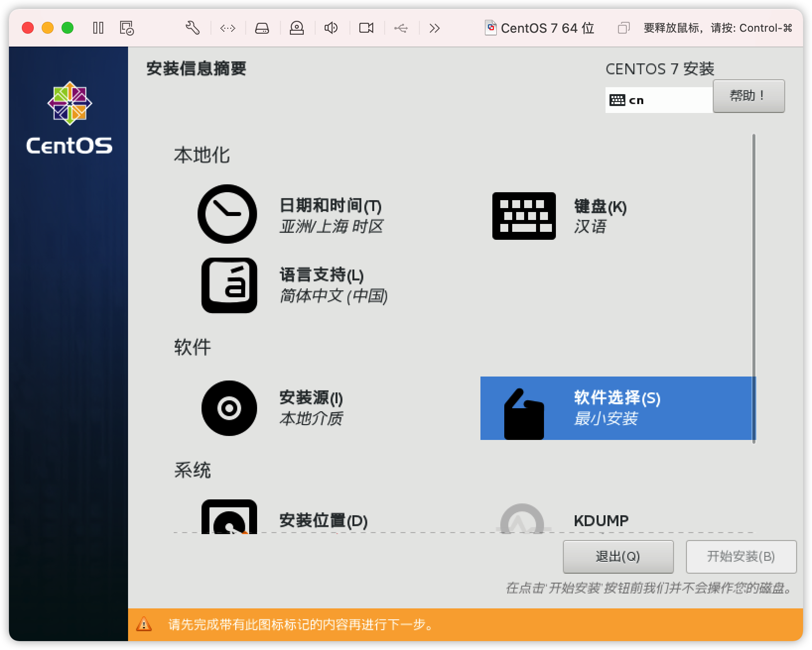

> 选择安装位置，自动分配分区即可

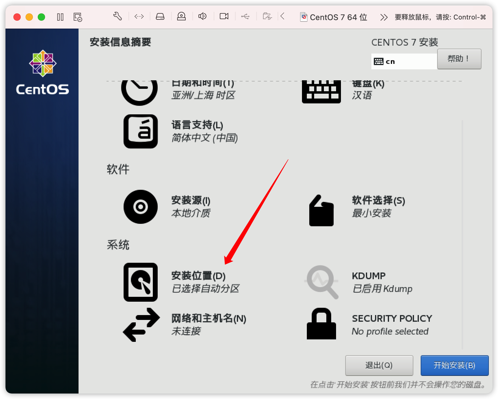

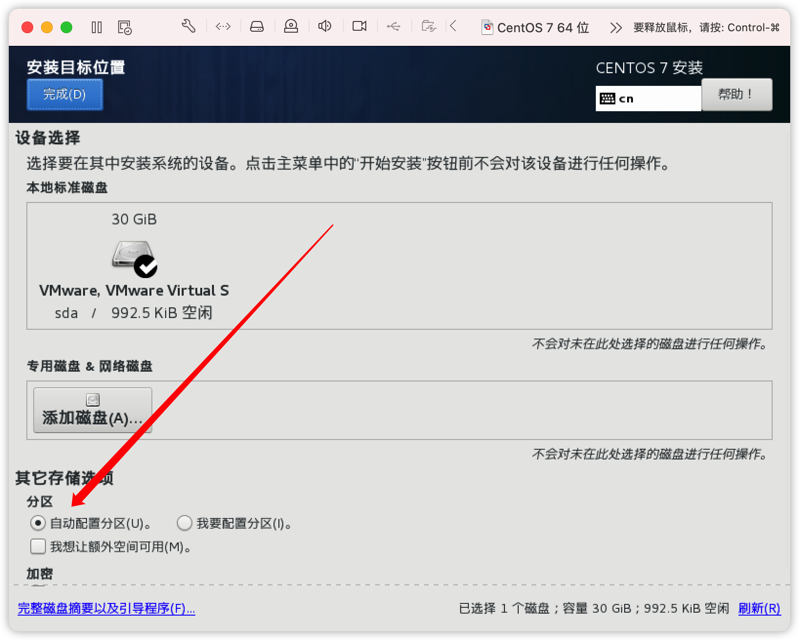

> 开始安装即可，其余项暂时不配置

> 设置root密码，自己的使用用户，密码均为easylee
>
> 新建了一个easylee用户，密码也是easylee

## 网络配置

> 1.打开虚拟机网络配置-与我的Mac共享

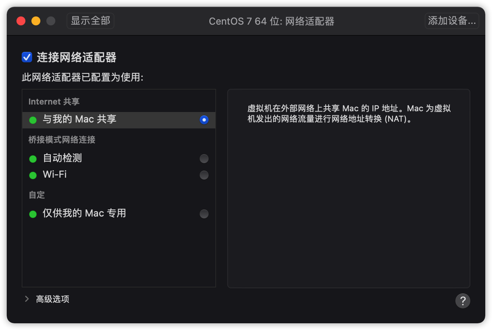

> 2.分配固定内网ip地址

首先需要预先三个数据，进入mac一下的虚拟机网络配置目录查看

```bash
cd /Library/Preferences/VMware\ Fusion/vmnet8
```

- 本机网关和子网掩码

```bash
cat nat.conf
```

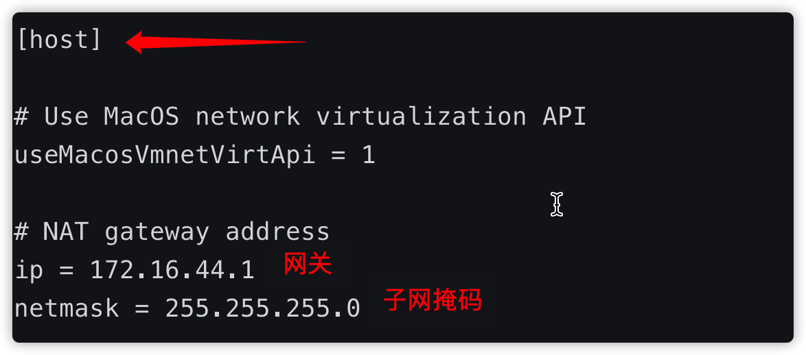

- 本机可以给虚拟机配置的静态ip范围

```bash
cat dhcpd.conf
```

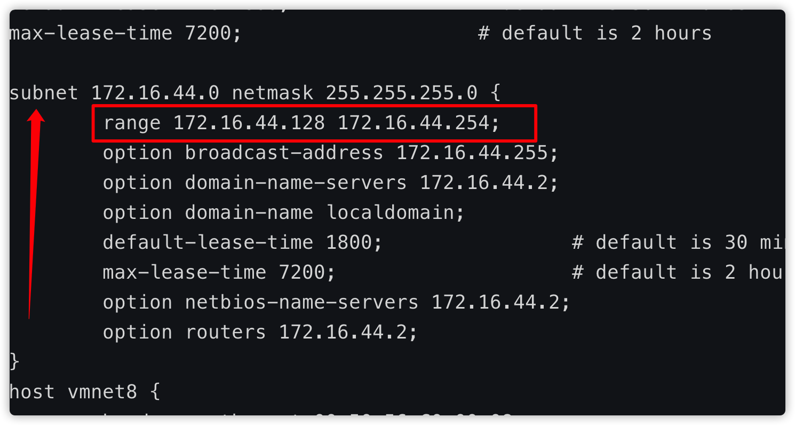

ip地址选择这个范围内的都可以配置

- 查看本机DNS

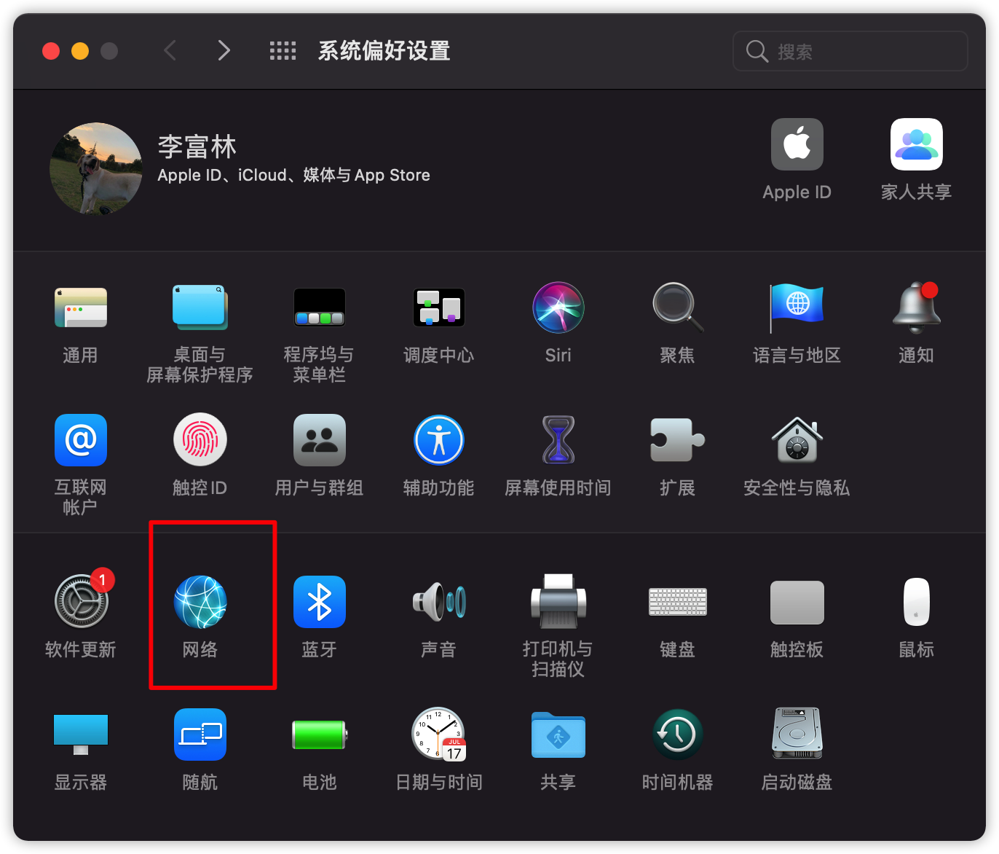

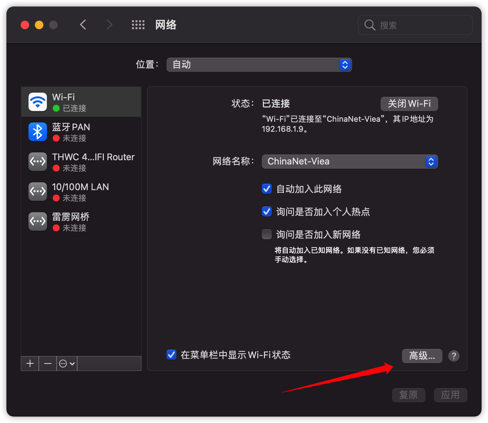

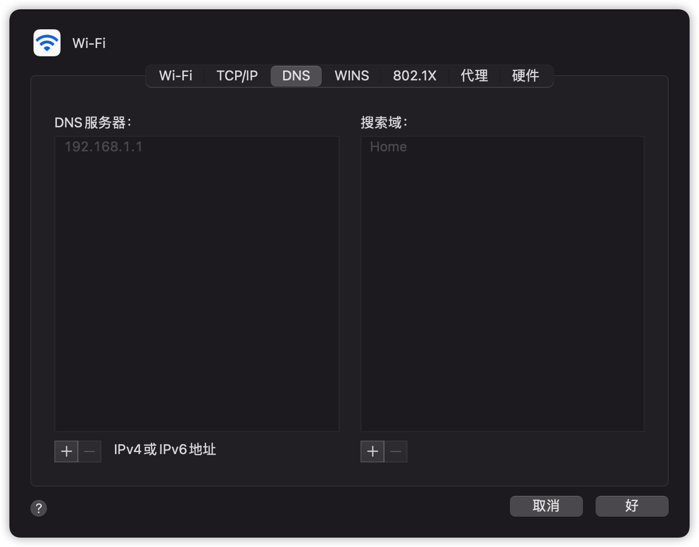

> 3.开始配置虚拟机

- 打开虚拟机配置文件

```bash
vi /etc/sysconfig/network-scripts/ifcfg-ens33
```

非root用户一定要加sudo

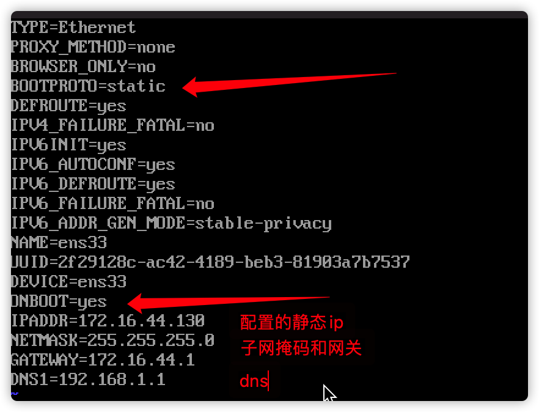

- 重启网络服务

```bash
service network restart
```

- 查看网络是否联通

```bash
ping www.baidu.com
```


至此，centos就安装完毕了！