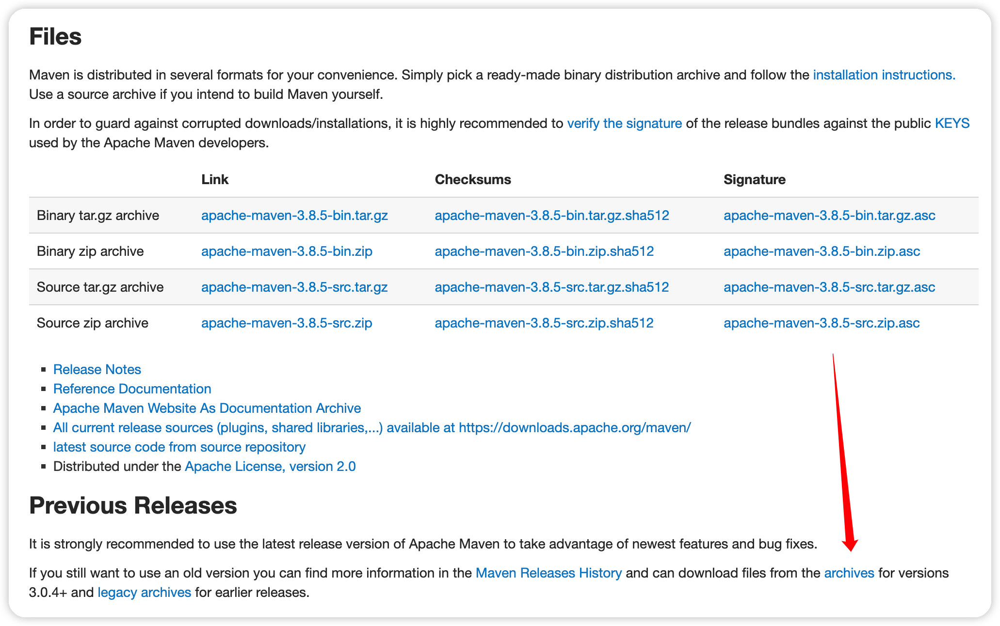
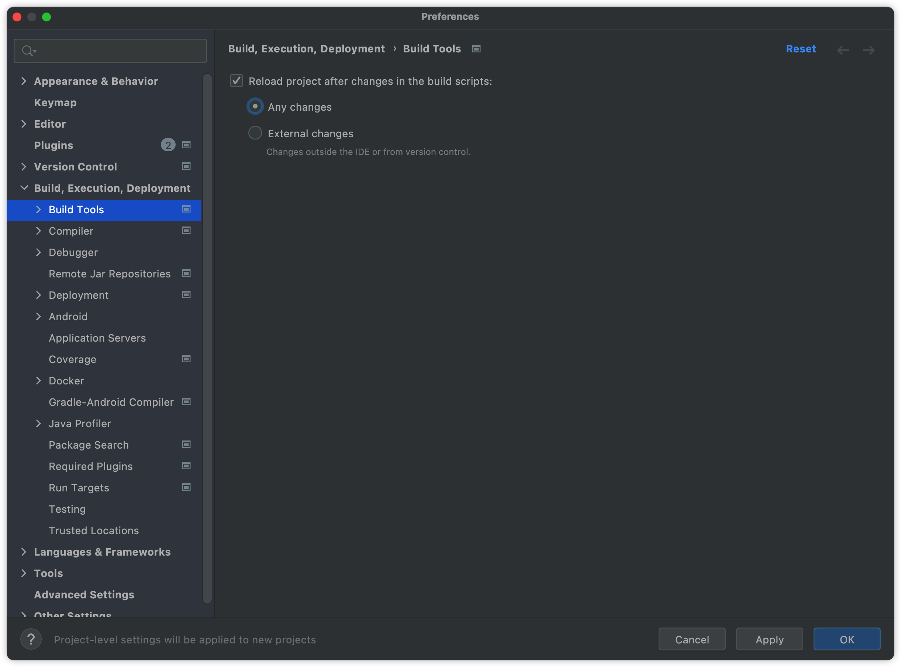
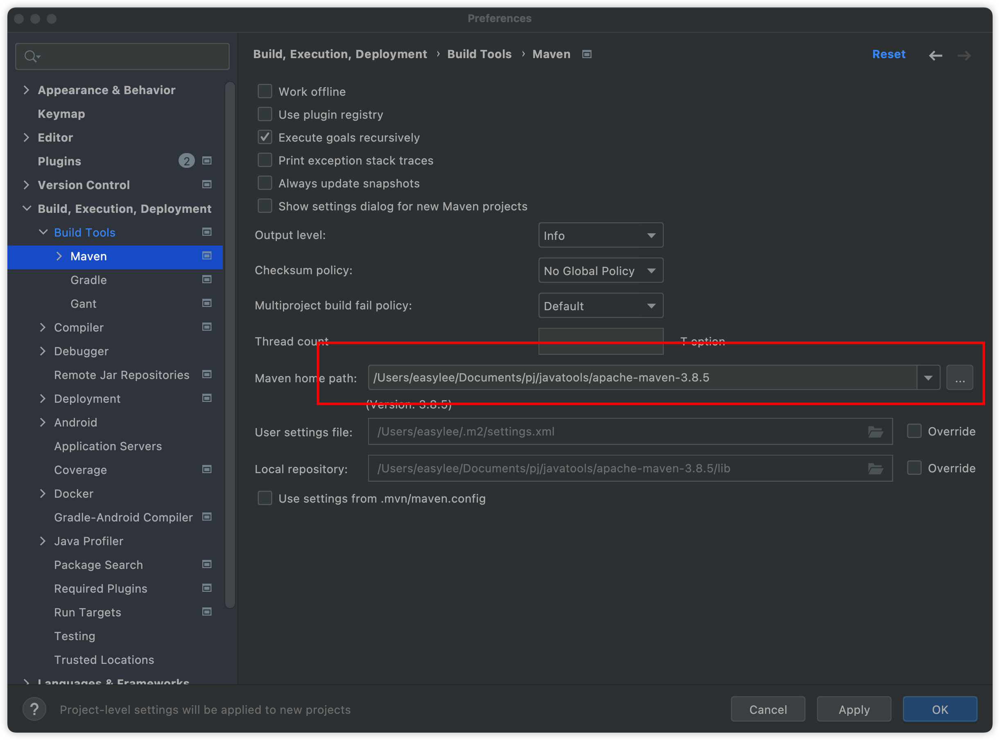
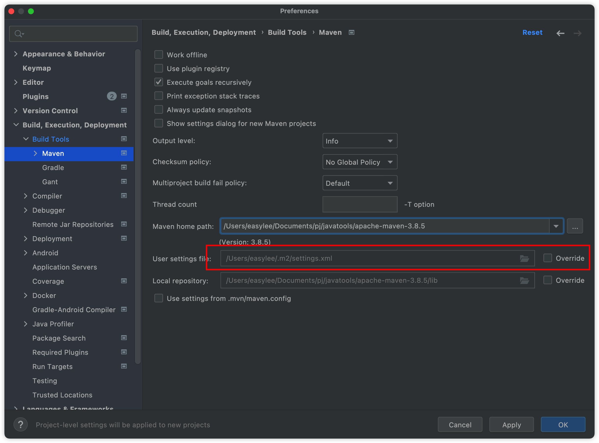
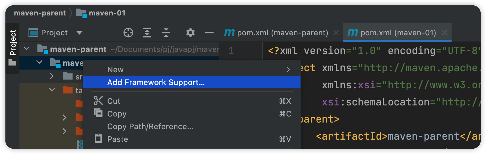
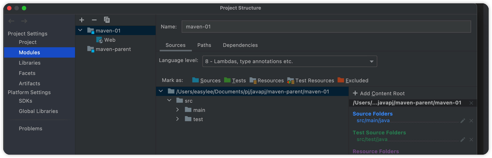
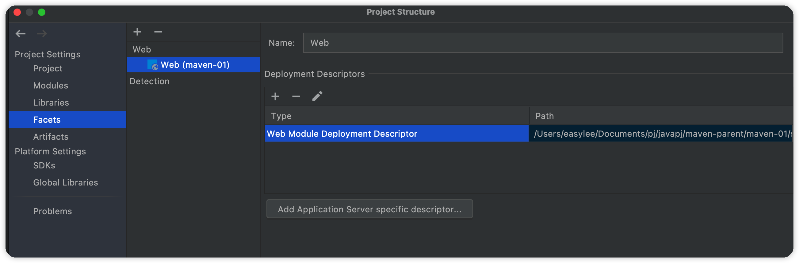

# Maven 概述

来源：[代码重工 (gitee.io)](http://heavy_code_industry.gitee.io/code_heavy_industry/pro002-maven/) 已做精简

Maven 是一个**依赖管理工具**，用来导入其它的 jar 包，jar 包还会继续依赖其它 jar 包，层层依赖。

Maven 可以方便的从网络上下来别人打包的 jar 包。

同时 Maven 还是一个**构建管理工具**，可以看一下下面这张图：


在本地开发完成代码之后，需要推送到版本控制服务器，然后自动触发钩子程序，Maven 会在持续集成环境，将源代码构建成一个 jar 包或者 war 包，最后部署到服务器上。

## 相关概念

### 构建过程

- 清理：清理上次构建的结果
- 编译：编译成字节码文件
- 测试：运行 Junit 单元测试
- 报告：根据测试生成一个报告
- 打包：
  - Java 工程打包成 jar 包
  - Web 工程打包成 war 包
- 安装：这里安装是将打包完的包存入 Maven 仓库，可不是安装到服务器上
- 部署：这才是部署到服务器上
  - jar 包：部署到 Nexus 私服服务器
  - war 包：借助 Maven 插件(例如 cargo )，然后部署到 Tomcat 服务器上，事实上 Maven 的所有功能都是以插件的形式实现的

### 工作机制


Maven 仓库主要包含本地的 Maven 仓库 jar 包、第三方 jar 包，以及 Maven 插件的 jar 包。

### 相关地址

官网地址：[Maven – Welcome to Apache Maven](https://maven.apache.org/)

## 安装和配置

Maven 安装包下载之后直接解压即可

下载地址：[Maven – Download Apache Maven](https://maven.apache.org/download.cgi)

### 下载 Maven 

maven 3.6.3 版本，新版本的 Maven 都有bug



接着来进行一些配置文件配置，Maven 的核心配置文件是：`conf/settings.xml`

### 配置本地仓库

所有下载的远程 jar 包，和本地 install 安装的 jar 包都会存放在这个文件夹内，这里就放在 Maven 安装包里面的 lib 目录下就挺好：

`/Users/easylee/Documents/pj/javatools/apache-maven-3.6.3/lib`

修改配置文件

```xml
<localRepository>/Users/easylee/Documents/pj/javatools/apache-maven-3.6.3/lib</localRepository>
```

### 配置阿里云镜像

如果直接从中央仓库进行下载很慢

```xml
<mirror>
  <id>nexus-aliyun</id>
  <mirrorOf>central</mirrorOf>
  <name>Nexus aliyun</name>
  <url>http://maven.aliyun.com/nexus/content/groups/public</url>
</mirror>

<!--新版-->
<mirror>
  <id>alimaven</id>
  <mirrorOf>central</mirrorOf>
  <name>aliyun maven</name>
  <url>https://maven.aliyun.com/repository/public</url>
</mirror>
```

### 配置基础 JDK 版本

默认 Java 工程使用的默认 JDK 版本是 1.5，改为常用的 1.8，修改 `profiles` 标签

```xml
<profile>
  <id>jdk-1.8</id>
  <activation>
    <activeByDefault>true</activeByDefault>
    <jdk>1.8</jdk>
  </activation>
  <properties>
    <maven.compiler.source>1.8</maven.compiler.source>
    <maven.compiler.target>1.8</maven.compiler.target>
    <maven.compiler.compilerVersion>1.8</maven.compiler.compilerVersion>
  </properties>
</profile>
```

### 配置环境变量

参考mac环境变量配置笔记

## 命名坐标详解

- groupId：公司或组织的名称 id，通常使用 com.h2study.maven 这样的形式
- artifactId：一个项目或者是项目中的一个模块的名称 id
- version：版本号

要注意项目和工程的区别，一个项目可以包含很多工程，说明这个主要是因为在多工程的项目中，artifactId 名称很可能是工程名那么就只有这样 `java.spring`，也就是单独的名称不够用了，有时候项目名也可以放在 groupId 上，都是可以的，反正区分好就行

## 生命周期

Maven 有三个声明周期，没有周期含有多个环节，**执行一个生命周期里面的任何环节的任何操作，都是从前面的环节操作开始全部执行到当前操作**

### Clean

清理操作相关

- pre-clean
- clean
- post-clean

### Site

生成站点相关

- pre-site
- site
- post-site
- deploy-site：部署站点

### Default

主要的构建过程

- validate 
- generate-sources 
- process-sources 
- generate-resources 
- process-resources 复制并处理资源文件，至目标目录，准备打包。
- compile 编译项目 main 目录下的源代码。 
- process-classes 
- generate-test-sources 
- process-test-sources 
- generate-test-resources 
- process-test-resources 复制并处理资源文件，至目标测试目录。 
- test-compile 编译测试源代码。 
- process-test-classes test 使用合适的单元测试框架运行测试。这些测试代码不会被打包或部署。 
- prepare-package package 接受编译好的代码，打包成可发布的格式，如JAR。 
- pre-integration-test 
- integration-test 
- post-integration-test 
- verify 
- install：将包安装至本地仓库，以让其它项目依赖。 deploy将最终的包复制到远程的仓库，以让其它开发人员共享；或者部署到服务器上运行（需借助插件，例如：cargo）。

# Maven常用命令

### 构建命令

- `mvn clean`：删除 target 目录
- `mvn compile`：主程序编译，存放位置：target/classes
- `mvn test-compile`：测试程序编译，存放位置：target/test-classes
- `mvn test`：测试操作，会自动先执行编译操作，运行测试，并会生成一个测试报告，存放位置：target/surefire-reports
- `mvn package`：打包操作，打包成一个 jar 包，存放在 target 中
- `mvn install`：安装操作，其实就是安装在本地 Maven 仓库中，同时包含 pom.xml 文件

- `mvn install -Dmaven.test.skip=true`：安装时跳过测试，或者直接点击 Idea 上闪电标志

### 常用命令

- `mvn dependency:list`：查看当前项目依赖的 jar 包列表
- `mvn dependency:tree`：以树形查看

# POM文件解读

## POM 详解

**pom 文件有时候下载依赖报错，可以更换maven下载或者将lib目录删除或者更换重新下载尝试**

```xml
<!-- 根标签，表示对当前工程进行配置、管理 -->>
<project xmlns="http://maven.apache.org/POM/4.0.0" xmlns:xsi="http://www.w3.org/2001/XMLSchema-instance"
  xsi:schemaLocation="http://maven.apache.org/POM/4.0.0 http://maven.apache.org/xsd/maven-4.0.0.xsd">

  <!-- 从 Maven 2 开始固定就是 4.0.0 -->
  <!-- 代表当前 pom.xml 所采用的的结构 -->
  <modelVersion>4.0.0</modelVersion>

  <!-- 坐标信息 -->
  <!-- 公司或组织下某一个项目 -->
  <groupId>com.h2study.maven</groupId>
  <!-- 代表项目下的某一个模块 -->
  <artifactId>maven01</artifactId>
  <!-- 代表项目的版本号 -->
  <version>1.0-SNAPSHOT</version>

  <!-- 打包方式 -->
  <!-- jar：表示这是一个 Java工程 -->
  <!-- war：表示这是一个 Web 工程 -->
  <!-- pom：表示这个工程是管理其它工程的项目，也就是聚合工程的总工程 -->
  <packaging>jar</packaging>

  <name>maven01</name>
  <url>http://maven.apache.org</url>

  <!-- 配置参数，后面可以以 ${project.build.sourceEncoding} 的形式使用 -->
  <properties>
    <project.build.sourceEncoding>UTF-8</project.build.sourceEncoding>
  </properties>

  <!-- 项目依赖 -->
  <dependencies>
    <dependency>
      <groupId>junit</groupId>
      <artifactId>junit</artifactId>
      <version>4.12</version>
      <!-- 依赖生效范围，后面详解 -->
      <scope>test</scope>
    </dependency>
  </dependencies>
</project>
```

### 参数配置

在 `properties` 中配置参数

然后使用的使用使用下面的形式

```xml
${project.build.sourceEncoding} 
```

### scope 标签

scope 标签指定了，jar 在什么时候生效

- `compile`：默认属性，说明该依赖在 main 目录、test 目录、开发过程、线上部署期间均生效
- `test`：在 test 目录生效，在 mian 目录中使用无效，开发过程有效，线上部署期间无效
- `provided`：如果一个包服务器 tomcat 里面有，就必须设置 provided，部署线上服务器时不生效，直接使用服务器的包，如果设置为其它的，会和服务器上的包产生冲突。

### scope 依赖传递

一个工程，依赖了一个包 A，这个包自己又依赖了其它包 B，那么这个工程只有包 A，设置的 `scope` 为默认 `compile` 时，才能在这个功能直接使用包  B，否则无法传递。

### 依赖排除

在依赖传递中，如果不想使用包 B 这个依赖，那么需要排除掉，以免出冲突

```xml
<dependency>
	<groupId>com.atguigu.maven</groupId>
	<artifactId>pro01-maven-java</artifactId>
	<version>1.0-SNAPSHOT</version>
	<scope>compile</scope>
	<!-- 使用excludes标签配置依赖的排除	-->
	<exclusions>
		<!-- 在exclude标签中配置一个具体的排除 -->
		<exclusion>
			<!-- 指定要排除的依赖的坐标（不需要写version） -->
			<groupId>commons-logging</groupId>
			<artifactId>commons-logging</artifactId>
		</exclusion>
	</exclusions>
</dependency>
```

上面我们依赖了 `pro01-maven-java`，但是不想使用它依赖的 `commons-logging`，所以排除掉

## 继承/聚合

继承多用于项目聚合，也就是父工程管理子工程的项目中，比如 Spring Cloud 中，用于统一管理依赖的版本等信息，因为配置一套完整可靠的依赖系统并不容易，配好之后不要轻易改变，以免出现一些未知的冲突

同时当执行 `mvn install` 安装时，聚合项目可以直接在父工程直接安装，不过不是聚合的工程，就需要一个一个子项目单独安装

> 注意创建父项目时， <packaging>pom</packaging>，必须是 pom

创建子项目之后，父项目 pom.xml 中会添加子项目的信息

```xml
<modules>  
	<module>pro04-maven-module</module>
	<module>pro05-maven-module</module>
	<module>pro06-maven-module</module>
</modules>
```

而子项目中，也会添加父项目的信息

```xml
<!-- 使用parent标签指定当前工程的父工程 -->
<parent>
	<!-- 父工程的坐标 -->
	<groupId>com.atguigu.maven</groupId>
	<artifactId>pro03-maven-parent</artifactId>
	<version>1.0-SNAPSHOT</version>
</parent>
```

**创建父项目统一管理**

需要使用 `dependencyManagement` 标签配置对依赖的管理

```xml
<!-- 使用dependencyManagement标签配置对依赖的管理 -->
<!-- 被管理的依赖并没有真正被引入到工程 -->
<dependencyManagement>
	<dependencies>
		<dependency>
			<groupId>org.springframework</groupId>
			<artifactId>spring-core</artifactId>
			<version>4.0.0.RELEASE</version>
		</dependency>
		<dependency>
			<groupId>org.springframework</groupId>
			<artifactId>spring-beans</artifactId>
			<version>4.0.0.RELEASE</version>
		</dependency>
		<dependency>
			<groupId>org.springframework</groupId>
			<artifactId>spring-context</artifactId>
			<version>4.0.0.RELEASE</version>
		</dependency>
		<dependency>
			<groupId>org.springframework</groupId>
			<artifactId>spring-expression</artifactId>
			<version>4.0.0.RELEASE</version>
		</dependency>
		<dependency>
			<groupId>org.springframework</groupId>
			<artifactId>spring-aop</artifactId>
			<version>4.0.0.RELEASE</version>
		</dependency>
	</dependencies>
</dependencyManagement>
```

然后在子项目中就不需要写版本号，直接使用之前配置的版本号

```xml
<!-- 子工程引用父工程中的依赖信息时，可以把版本号去掉。	-->
<!-- 把版本号去掉就表示子工程中这个依赖的版本由父工程决定。 -->
<!-- 具体来说是由父工程的dependencyManagement来决定。 -->
<dependencies>
	<dependency>
		<groupId>org.springframework</groupId>
		<artifactId>spring-core</artifactId>
	</dependency>
	<dependency>
		<groupId>org.springframework</groupId>
		<artifactId>spring-beans</artifactId>
	</dependency>
	<dependency>
		<groupId>org.springframework</groupId>
		<artifactId>spring-context</artifactId>
	</dependency>
	<dependency>
		<groupId>org.springframework</groupId>
		<artifactId>spring-expression</artifactId>
	</dependency>
	<dependency>
		<groupId>org.springframework</groupId>
		<artifactId>spring-aop</artifactId>
	</dependency>
</dependencies>
```

# Idea配置

## 相关配置

### pom 自动更新

任何修改，都应该更新pom



### Maven 配置

应该将 Maven 设置为自己下载的 Maven，如果不设置，那么将使用 Idea 默认的，不稳定



注意这个配置，当选择自己的 Maven 之后，默认就会使用配置的 Maven 路径下的 `setting.xml`，所以这个选项不需要配置，只有当路径下的 setting.xml 找不到时，才会使用用户路径下的这个默认配置文件



### 配置 web 项目

要想将一个 Java 项目变为 Web 项目，需要添加 Web 框架支持，这里想给哪个子项目添加就给哪个子项目添加成 Web 项目，注意父项目是不能设置为 Web 项目的，因为父项目是一个 `<packaging>pom</packaging>` 的管理其它项目的父项目，只能是 pom



注意添加了框架支持之后，将 web 文件夹移动到 src/main 目录下，不要单独一个文件夹，然后改名为 **webapp**，文件夹会亮起一个地球的图标才算成功

还需要将打包方式更改为 war，要不然仍然是 java 项目

```xml
<artifactId>maven-01</artifactId>
<packaging>war</packaging>
```

## 模块 Module 导入

如果直接复制到当前父工程，那么无法识别这是一个 Module，必须在 Project Structure 中的 Module 处导入



如果导入的是一个 web 项目，那么还需要检查一下，是否已经添加了 web 框架相关的信息，如果没有则需要添加一下，如果多了就删除一下(有时候之前有，导入又创建了)



**修改 pom.xml**

需要将导入的这个项目的父工程 id 修改为当前本地的这个父工程 id，要不然还是它自己以前的工程的