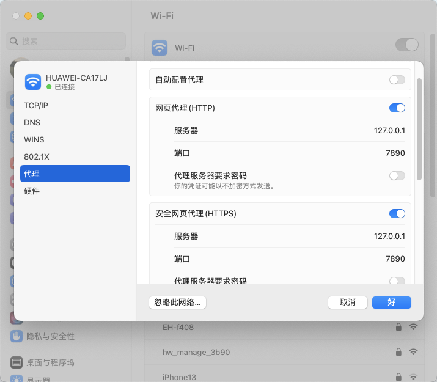

## 开始

> ### Git概述
>
> Git 是一个免费的、开源的分布式版本控制系统，可以快速高效地处理从小型到大型的各种项目。
>
> 分布式版本控制系统以前是集中式版本控制系统，常见软件如：SVN，主要区别如下：
>
> 1. 服务器断网的情况下也可以进行开发（因为版本控制是在本地进行的），SVN断网没有历史记录；
> 2. 每个客户端保存的也都是整个完整的项目（包含历史记录，更加安全）。
>
> Git中的文件分为四个状态：
>
> - 工作区：本地写代码的目录，此时文件未经Git负责监管。
> - 暂存区：工作区文件通过 `git add`添加之后，保存到暂存区，此时文件变为已追踪状态，但未形成实际记录。
> - 本地库：暂存区通过 `git commit` 提交之后，保存到本地库，形成版本，可以恢复。
> - 远程库：本地库通过 `git push` 推送之后，提交到远程库，方便团队成员和外部人员使用。
>
> ### 笔记说明
>
> 本篇笔记只记录Git常用命令，和一些需要注意的事项。
>
> 搭配使用Git GUI软件**SourceTree**，尽量使用GUI软件进行操作，操作更加简便。

## 常用命令

> ### 用户签名
>
> 设置用户签名是Git操作的第一步：
>
> - 设置用户签名：`git config --global user.name 用户名`  
> - 设置用户邮箱：`git config --global user.email 邮箱`
>
> > 设置提交本地Git的签名，和远程推送无关，远程推送的用户签名是通过登陆形成的。`--global`表示设置全局签名，去除 `--global` 表示当前仓库签名，优先级大于全局签名。
>
> ### 本地库操作
>
> - 当前目录创建本地库： `git init`
>
> - 查看本地库状态：`git status`
>
> - 撤销本地修改的文件到上次提交时状态：`git checkout -- filename`，所有修改都将失效。
>
> - 撤销暂存区文件：`git reset <filename>`，之前的修改不会失效。
>
> - 添加暂存区：`git add 文件名`，添加之后文件从未追踪状态变为已追踪。
>
> - 提交本地库：`git commit -m '日志信息' 文件名`，不添加文件名，则提交所有暂存区文件。**每次提交必须记录清楚提交信息**
>
> - 查看历史版本：
>
>   - `git reflog`：简略查看
>   - `git log`：详细查看
>
> - 切换版本：`git reset --hard 版本号`
>
>   > 必须使用 `--hard` 才可以切换成功，注意：如果当前版本修改了文件还没有提交保存，那么切换回其它版本后，这些修改后的文件都丢失。
>   >
>   > Git切换版本的原理只是通过移动 `HEAD` 指针指向不同的版本号，并不是复制多份文件来切换。
>
> ### 分支操作
>
> 分支是通过复制多个副本，不同的功能在不同的副本上进行开发，开发完成后，合并到主分支中，这样不会影响到主分支正常运行的代码。
>
> - 创建分支：`git branch 分支名`
> - 查看分支：`git branch -v`
> - 切换分支： `git checkout 分支名`，检出分支，切换分支的原理同样是切换`HEAD`的位置。
> - 合并分支：`git merge 分支名`，把指定分支合并到当前分支上。
>
> > 合并分支冲突：
> >
> > 如果指定版本中修改的文件，当前分支也修改过，那么就会发生冲突，解决方法如下：
> >
> > 1. 合并代码：`git merge 分支名`
> > 2. 打开当前分支的冲突文件，并手动编辑想要最终保留的部分，然后保存这个文件
> > 3. 添加到缓存区： `git add 冲突文件`
> > 4. 提交代码：`git commit`，**这里不能带文件名**，因为是操作合并时的冲突文件，并不是具体的文件。
>
> ### 远程仓库
>
> - 查看当前所有别名仓库：`git remote -v`
> - 给远程仓库取别名：`git remote add 别名 远程地址`，非必须，也可以直接使用远程地址，只是不方便。
> - 推送本地当前分支到远程仓库：`git push 别名 远程分支`
> - 克隆远程仓库：`git clone 远程地址`
> - 拉取远程仓库最新代码并合并到本地仓库：
>   - `git fecth`：从远程拉取代码但并不合并进本地仓库；
>   - `git merge`：合并拉取回来的代码；
>   - `git pull 远程仓库别名 远程分支名`，这个命令是上面两个命令的组合。
> - 远程的两个分支合并：均需要拉取到本地，然后合并之后提交推送，远程的分支也就合并了。
>
> > 远程仓库注意事项：
> >
> > 1. 如果远程仓库的版本，比本地新，那么无法推送数据，所以**推送之前务必拉取代码。**
> >
> > 2. 拉取代码会直接和本地进行合并，如果存在冲突是无法拉取的，正确步骤是：
> >
> >    1. 将本地修改代码提交到本地仓库；**有时候不提交不冲突也不会报错，但是不推荐**
> >    2. 拉取远程代码；
> >
> >    3. 修改冲突文件；
> >
> >    4. 提交并推送修改好的冲突文件。
> >
> > 3. 使用远程仓库首先需要邀请，加入后才可以进行代码拉取和推送。
>
> - 开源项目：开源项目和团队项目略有不同，具体如下：
>   - 首先需要 `Fork`代码，也就是复制一份远程的副本到远程，一般到远程`Github`上；
>   - 然后拉取代码、修改代码、推送代码；
>   - 修改完成后，添加 `Pull Request(PR)`请求让开源项目管理员拉取，并写上注释；
>   - 管理员 `Merge pull reque `合并代码。
>

## 相关问题处理

> ### 远程库登陆相关
>
> - `Https`方式：克隆之后，连接需要登陆帐号密码，不方便，但是如果是使用的SourceTree或者vscode等软件，则不需要，因为这些软件登陆后会保存登陆信息。
>
> - `SSH`免密登录：
>
>   - 首先创建本地电脑的 SSH 公钥和私钥：
>
>   ```shell
>   # 创建公钥私钥
>   ssh-keygen -t rsa -C 2452241217@qq.com
>   # 获取公钥并复制
>   cat id_rsa.pub
>   # 保存位置：/Users/easylee/.ssh/id_rsa
>   ```
>
>   - 登陆 `Github`：点击用户头像→Settings→SSH and GPG keys，添加刚才复制的公钥；
>   - 之后上传代码，可以直接推送了。
>
>   > SSH免密登录原理：
>   >
>   > 1. 客户端生成公钥和私钥两个文件；
>   > 1. 公钥传递给需要验证客户端身份的服务端，所有服务端都可以；
>   > 1. 请求时，客户端发送私钥信息到服务端，进行认证；
>   > 1. 认证成功，则登陆成功。
>   >
>   > 使用SSH登陆的方式安全性比较，但是一定要注意私钥一定不能泄漏，拿到私钥就可以进行随意登陆。
>
> ### 代理问题说明
>
> 多数情况下，连接Github是需要进行代理的，下面来看一下代理问题的配置。Git远程库有两种连接方式，`https`和 `ssh`，两种方式需要不同的代理方式：
>
> `Https`代理：
>
> - iterm2：使用命令行连接，代理需要配置命令，可以使用`proxifier`等软件进行配置，直接输入命令比较麻烦。
>
> - SourceTree：代理需要进行如下配置，注意是针对项目仓库的，而不是全局
>
>   - 打开项目后-右上角设置-远程仓库-编辑配置文件
>
>   - 添加如下代理信息：
>
>     ```json
>     [http]
>     	sslVerify = false
>     	proxy=127.0.0.1:7890
>     ```
>
>     其中的端口来源于代理软件启动之后，将本地网页代理和安全网页代理配置成的ip，在网络连接，代理处即可查看
>
>     
>
> - Github Desktop：不需要配置，默认就会使用上面的网页代理和安全网页代理的端口
>
> `ssh`代理
>
> `ssh`代理方式完全不同，可以搜索参考proxifier软件的相关配置，所以推荐使用 `https`连接github的项目即可。
>
> > 注意：代理软件使用全局代理对sourcetree和iterm2这些软件是不起作用的，这个设置只是对使用了网页代理和安全网页代理的软件起作用，前面这两个软件默认是不走系统的网页代理的，所以需要进行配置。
>
> ### Https证书问题
>
> 默认应该开始证书验证，以保证安全，如果是本地自建的仓库没有证书，必要时可以关闭
>
> ```shell
> git config --global http.sslVerify false
> ```
>
> ### 403问题
>
> 一般使用SourceTree进行推送，出现这个问题，原因是[2021.8.13起，Github要求使用基于令牌的身份验证](https://zhuanlan.zhihu.com/p/401978754)，也就是需要设置Token，而且是有期限的，比较麻烦。
>
> 使用官方的**Github Desktop**，则没有这个问题，推荐使用这个软件进行Github项目的传输，不用设置token也不用再多配置一步代理(前提是已经开了代理)。


