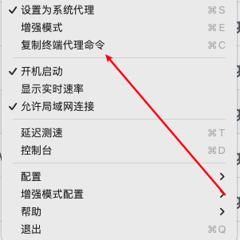

## 终端代理问题

终端软件比如 `iterm2` 之类默认是不提供代理设置的，需要自定义：

以 `ClashX`为例：

- 首先复制代理命令：`export https_proxy=http://127.0.0.1:7890 http_proxy=http://127.0.0.1:7890 all_proxy=socks5://127.0.0.1:7890`

  

- 然后在终端软件中执行，即可完成代理。

> 注意：这种设置是一次性的，如果想要长期生效，应该设置到 `vim ~/.zshrc`中，但是目前这种设置更合理，需要的时候再设置即可，而不是弄成全局代理。

## 导航

- 分屏功能：
  - 左右：`cmd + d`
  - 上下：`cmd + shift + d`
  - 切换：`cmd + []`左右切换，不够用的话，`cmd + option + 方向键`切换上下左右。
  - 调整分屏窗口的宽度：`ctrl + cmd + 方向键`
- 标签页：
  - 新建：`cmd + t`
  - 关闭：`cmd + w`，关闭标签必须先关闭里面的窗口。
  - 切换：`cmd + 数字`或者 `cmd + 方向键`
  - 移动当前标签页到指定位置：`cmd + shift + 方向键`
- 历史记录：
  - iterm自带：`ctrl + p`、`ctrl + n`或者上下键
  

## zillij

zillij是一款终端插件，进入之后可以完美实现各种终端的操作，更加便捷。

- 安装：`brew install zellij`
- 别名：`alias zj='zellij'`
- 基本操作：面板中有非常友好的提示，按下 `ctrl`即可选择。

同时这款软件还有一些高级操作：

- session：创建会话，保存上次的窗格
  - 创建：`ctrl + o d`，进入前创建自定义session名的session：`zj attach <session name>`
  - 使用：`zj attach <session name>`,短命令 `a`
  - 查看：`zj list-sessions`，短命令 `ls`
  - 清空：`kill-session`，短命令 `k`，`kill-all-sessions`，短命令`ka`
- 同步窗格输入：`ctrl + t` 进入标签页模式，该模式下使用：`s` 进入 sync 模式，输入的指令会在多个窗口同步，适用于同时执行相同的命令，比如 cd 到相同的目录

- 滚动：`ctrl + s` 进入滚动模式，该模式下通过 `j/k` 或 `u/d` 进行滚动或翻页

- 清理：`clear`

- 修改配置：移动悬浮窗口默认是 `ctrl + h` ，但是使用 vim 我们将其映射为了方向键，所以需要修改键位：
  - 首先创建 zellij 的配置文件夹：`mkdir ~/.config/zellij`
  
  - 导出 zellij 配置：`zellij setup --dump-config > ~/.config/zellij/config.yaml`
  
  - 然后进入该配置文件 `vim ~/.config/zellij/config.yaml`
  
  - 输入 `:%s/Ctrl: 'h'/Ctrl: 'f'/g` 全局替换 `ctrl + h` 为 `ctrl + f`
  
  - 之后就可以通过`ctrl + f` 进入窗口移动模式，然后通过 `h/j/k/l` 移动窗口
  
  - 具体配置可以看 [zellij 文档](https://tszv.vercel.app/07.键盘侠/4.iTerm/zellij.dev/documentation/keybindings-keys.html)

> 目前暂不使用，原生的快捷键已经足够满足使用了，以后有时间可以研究一下。

## zsh-vi-mode

zsh-vi-mode是一款让终端支持vim操作的插件。

### 安装

- `brew install zsh-vi-mode`
- 复制到 `.zshrc`文件：`source $(brew --prefix)/opt/zsh-vi-mode/share/zsh-vi-mode/zsh-vi-mode.plugin.zsh`

### 常用命令

- 历史记录：
  - zsh-vi-mode：`jk`上下、`/`搜索历史记录，`n/N`进行搜索翻页。
- 使用原生vim操作命令：`vv`
- 移动插入：同`vim`

### 高级使用技巧

查看地址：https://tszv.vercel.app/pages/44fccc/#%E5%A4%8D%E5%88%B6

> 目前暂不使用，原生的快捷键已经足够使用了，命令行只是输入命令而已，没必要这么复制。
