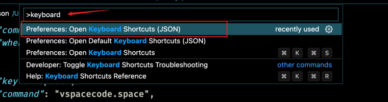

## vscodevim介绍

Vim是一种文本编辑器，最初是Unix和Linux系统中的一个命令行应用程序，现在也可以在其他操作系统上使用，常用于命令行编写代码。

特点是完全通过键盘进行操作，完全不需要使用鼠标，熟练掌握后，可以提升代码编写速度。

vscodevim是vscode中一款实现了vim的插件，绝大多数vim功能都可以完美的集成到vscode中。

## vim模式说明

- Normal：默认模式，在这个模式下，可以进行移动，选中，复制粘贴等各种命令，等待输入。按下`esc`键或者control + [，退出其它模式进入这个模式，当然默认也是这个模式。

- Insert：插入模式，进行文字编辑，可以使用多个按键进行，比如i、a。**应该习惯插入完成之后立即回到Normal模式。**

- Visual：可视模式，等同于之前鼠标操作的模式，使用鼠标进行选东西就会自动进入，或者通过快捷键v或者其它进入。

## 相关配置

### 配置文件地址

- `cmd+shift+p`：vscode功能搜索快捷键

- vim快捷键映射配置：`settings.json`中进行配置，这个文件是用户自定义Qvscode配置的文件，搜索`settings`，配置到`user`配置中，适合修改单键或者简单映射，支持修饰符。

```json
"vim.visualModeKeyBindings": [
    {
      "before": ["H"],
      "after": ["^"]
    },
    {
      "before": ["L"],
      "after": ["g","_"]
    }
  ],
  "vim.normalModeKeyBindings": [
    {
      "before": ["H"],
      "after": ["^"]
    },
    {
      "before": ["L"],
      "after": ["g","_"]
    }
  ]
```

- vscode快捷键配置文件：keybingdings.json，`cmd+shift+p` 搜索 `keyboard`，或者在设置位置点击打开快捷方式，`cmd + k cmd + k`也可以打开，**适合复杂配置，可以配置修饰符**


注意多个相同快捷键，在上面的优先级越高，配置vim的格式如下：

```json
// 映射command + 右方向键，为vim的跳转到仅代码行尾
{
    "key": "cmd+right",
    "command": "vim.remap",
    "when": "inputFocus && vim.mode == 'Normal'",
    "args": {
      "after": ["g","_"]
    }
  }
```

### 常见配置

#### 1. 当在 insert 模式下使用 ctrl + c 的时候（复制）会进入到 normal 模式怎么办？

在 keybingdings.json 内配置(快捷键 `cmd+shift+p`  打开命令搜索框):



```json
{
	"key": "cmd+c",
	"ikcommand": "execCopy"
}
```

#### 2. vim配置按住按键快速移动

默认按住一个h是不会一直左移的，而且速度不够快，需要进行配置，命令行依次输入以下命令，开启按住重复执行：

```sh
$ defaults write com.microsoft.VSCode ApplePressAndHoldEnabled -bool false              # For VS Code
$ defaults write com.microsoft.VSCodeInsiders ApplePressAndHoldEnabled -bool false      # For VS Code Insider
$ defaults write com.visualstudio.code.oss ApplePressAndHoldEnabled -bool false         # For VS Codium
$ defaults write com.microsoft.VSCodeExploration ApplePressAndHoldEnabled -bool false   # For VS Codium Exploration users
$ defaults delete -g ApplePressAndHoldEnabled           
```

然后将系统设置中键盘设置这两项配置调到最快：


#### 3. 在 iterm2 中按键 option 不生效的问题

打开你的 iterm2 键入 cmd + , 打开 Preferences


选择 Profiles


选择 Keys


把 Left Option key 和 Right Option key 设置成 Esc+

### 4.配置单击shift切换英文输入法，双击切换中文输入法(未使用)

因为使用vim，切换到normal模式时，需要是英文状态，而输入中如果输入了中文，需要进行频繁切换。

默认是tab按一次切换下一个输入法，经常不知道当前是哪个输入法，所以使用这个方法来确定。

缺陷是无法使用tab进行格式化了，推荐使用两个空格代替，**同时tab切换输入框表单时，使用option + tab替代即可**，本身编程写代码也是推荐这么做，其它键搭配tab键的不受影响。	

使用karabiner进行设置：

```json
{
  "conditions": [
    {
      "name": "change_input",
      "type": "variable_if",
      "value": 1
    }
  ],
  "from": {
    "key_code": "tab"
  },
  "to": [
    {
      "select_input_source": {
        "language": "^zh-Hans$"	// 设置输入法
      }
    }
  ],
  "type": "basic"
},
{
  "from": {
    "key_code": "tab"
  },
  "parameters": {
    "basic.to_delayed_action_delay_milliseconds": 200,
    "basic.to_if_held_down_threshold_milliseconds": 150
  },
  "to_delayed_action": {
    "to_if_canceled": [
      {
        "set_variable": {
          "name": "change_input",
          "value": 0
        }
      }
    ],
    "to_if_invoked": [
      {
        "set_variable": {
          "name": "change_input",
          "value": 0
        }
      }
    ]
  },
  "to_if_alone": [
    {
      "set_variable": {
        "name": "change_input",
        "value": 1
      }
    },
    {
      "select_input_source": {
        "language": "^en$"
      }
    },
    {
      "key_code": "tab"
    }
  ],
  "to_if_held_down": [
    {
      "halt": true,
      "key_code": "tab"
    }
  ],
  "type": "basic"
},
// 配置原生tab和反tab
{
  "from": {
    "key_code": "tab",
    "modifiers": {
      "mandatory": ["left_option"]
    }
  },
  "to": [
    {
      "key_code": "tab"
    }
  ],
  "type": "basic"
},
{
  "from": {
    "key_code": "tab",
    "modifiers": {
      "mandatory": ["left_option","left_shift"]
    }
  },
  "to": [
    {
      "key_code": "tab",
      "modifiers": ["left_shift"]
    }
  ],
  "type": "basic"
},
```

### 5.鼠须管自动切换输入法配置

使用鼠须管输入法，可以实现进入插入模式和进入正常模式时，自动切换到英文输入法，其它使用习惯和平时使用一样。

- 首先下载安装鼠须管：https://rime.im/，安装完成后会重启计算机

- 启用输入法：键盘-输入法-启用鼠须管
- 点击鼠须管-用户设定按扭，进入配置文件文件夹
- 下载https://github.com/ssnhd/rime，常用配置，下载下来，安装字体，然后把配置中的所有文件复制到鼠须管配置文件文件夹中

其次，修改其中的`squirrel.custom.yaml`软件配置文件和 `default.custom.yaml`默认配置文件：

- default.custom.yaml主要配置软件的快捷键比如切换下一页侯选词之类的
- squirrel.custom.yaml主要用于配置软件是否启动vim模式相关的配置
  - 注意配置软件的时候，配置的是软件的id，使用此命令获取：`osascript -e 'id of app "obsidian"'`，名称通过查看简介就可以看到了。
  - 配置vim只需要对应的软件开启vim_mode即可

```yaml
# 特定App默认中/英文输入 配置软件
  app_options:    
    com.apple.Spotlight:             # 聚焦搜索
        ascii_mode: true             # true默认英文,false默认中文
    com.runningwithcrayons.Alfred:   # alfred
        ascii_mode: true
    com.apple.Terminal:              # 终端
        ascii_mode: true
        vim_mode: true
    com.microsoft.VSCode:            # Visual Studio Code
        ascii_mode: true
        ascii_punct: true            # 中文状态输出英文标点(半角) 
        vim_mode: true
    com.googlecode.iterm2:           # iterm2
        ascii_mode: true
        vim_mode: true
    md.obsidian:                     # obsidian
        ascii_mode: true
        vim_mode: true
```

配置之后再配置一下导入的rime常用配置文件中的`luna_pinyin_simp.custom.yaml`，这个里面导入了搜狗相关词库，里面的很多字都没有配置，而且错误特别多，取消导入，就用官方默认的即可，慢慢通过多次输入培养即可：

```yaml
# 载入朙月拼音扩充词库(禁止载入,里面的搜狗词库很多都是错误的,而且全是bug,就用鼠须管自带的词库就行,慢慢培养即可)
# "translator/dictionary": luna_pinyin.extended
```

### 插件配置

#### easymotion移动插件

按下操作符后，根据每个位置的字母坐标，移动到指定的位置，easymotion总体来说是跳转到页面的一个位置，而sneak是跳转到页面下一个搜索字符的位置。

开启插件：打开setting.json

```json
"vim.easymotion": true,
"vim.leader": "<Space>", // 配置操作符，默认是\
```

基于单词移动(同单词匹配)：

- **\<leader\>\<leader\> w**：连续点按，匹配光标后面所有单词的开头
- +e：单词结尾
- **+b**：上一个单词开头
- **+ge**：上一个单词结尾
- +l：单词的所有位置，包含前后，**不推荐使用，坐标字母会看起来太过于密密麻麻**
- +h：同上，匹配光标前

基于行：

- **+j**：光标后
- **+k**：光标前

基于全部位置：

- \<leader\>\<leader\> \<leader\> j：所有位置：不常用

#### vim-sneak插件

全局搜索，类似与f功能，f是当前行搜索，sneak是全局搜索，而且不需要像/那样按回车确认搜索，但是如果要精确搜索，比如超过2个字符，那么还是要用/进行搜索

sneak必须输入两个字符进行跳转，而不是f的一个字符

开启插件：打开setting.json

```json
"vim.sneak": true,
```

sneak默认按键是s，但s以前已经有相关的功能，所以需要进行改建为f，也就是替换原生的f的行搜索，因为全局搜索已经包含了行搜索

```json
// 思路：开启插件后，s已经不具备原生功能了，已经是sneak的开启功能了，所以将f改为s，s改为原生s的功能
// 需要在NonRecursive非递归中进行配置，否则按下f映射到s，s又递归到cl也就是s原本功能，那么sneak功能就无法使用了
"vim.normalModeKeyBindingsNonRecursive": [  
  {
    "before": ["f"],
    "after": ["s"]
  },
  {
    "before": ["F"],
    "after": ["S"]
  },
  {
    "before": ["s"],
    "after": ["c","l"]
  },
  {
    "before": ["S"],
    "after": ["^","C"]
  }
],
```

接下来配置一下可视化模式下的：

```json
 // 可视化模式没有大写的F，因为默认sneak没有提供S网上搜索的功能
"vim.visualModeKeyBindingsNonRecursive": [
  {
    "before": ["f"],
    "after": ["s"]
  }
]
```

最后配置一下，sneak配置其他操作，比如删除操作d的映射配置：

```json
// 默认sneak进行操作中搜索移动的命令是z，统一修改为f
"vim.operatorPendingModeKeyBindingsNonRecursive": [
  {
    "before": ["f"],
    "after": ["z"]
  },
  {
    "before": ["F"],
    "after": ["Z"]
  }
],
```

**同时，配合；和，可以继续匹配下一个和上一个搜索字符。**

#### vim-surround插件

这个插件是默认开启的，主要用于处理包裹符号的增删改，常见用法如下：

- 替换包裹符号：c+s+当前包裹符号+替换的符号，举例：cs"',表示把双引号变成单引号
- 增加包裹符号：y+s+选中区域+包裹符号，举例：ysiw(，表示将当前iw选中的单词加上括号
- 删除包裹符号：d+s+包裹符号，举例：ds(，表示把当前包裹的括号删除
- 可视模式添加包裹符号：S+包裹符号，当前提前需要v进入可视模式并选取好需要添加符号的内容

## 移动

下面的移动都是指的在默认模式下进行操作，在插入模式下，只有如下几个全局的配置的移动快捷操作：

### 插入模式

- **上下左右**：vim内部没有插入模式下的移动，全局为：空格 + `hjkl`
- **包含前后空白和空格等行首行尾**：空格 + command + hl，因为是全局配置的通用所有软件的，就不支持仅代码行首行尾了
- **顶部和尾部**：空格 + command + jk，来源于全局配置

### 基于行

- **上下左右**：`hjkl`，改键后根据全局为：空格 + `hjkl`
- **仅代码行首行尾**：`^`和`g_`，改键后为：H、L，映射配置。
- 包含前后空白和空格等行首行尾：`0`和`$`，不改键，不常用，全局配置：`command + spacebar +HL`即可实现

### 基于全文

- **顶部和尾部**：空格 + command + jk，来源于全局配置
- **上下5行**：J、K，需要配置J、K为5j、5k，常用于浏览查看具体的东西，比如函数名
- **跳到文件首**：gg
- **跳到文件尾**：G
- **跳到指定行**：55gg或55G
- **把当前行置于屏幕中央**：zz
- **往下滚动一屏**：ctrl + f，常用于快速移动到文件的几个位置，比如模版、样式、JS位置
- **往上滚动一屏**：ctrl + b

### 基于字词/字串

- w：下一个单词的首位
- e：下一个单词的末位
  - 常见命令：ea，单词尾然后插入
- b：上一个单词的首位
- ge：上一个单词的末位

### 基于搜索

通过搜索移动光标。

**原生搜索**，搜索的内容是一个字符，并不是多个字符。更推荐使用sneak插件实现，更加便捷，原生操作方法如下：

- f：搜索光标后，指定字符，如fa，移动到光标后第一个a的位置
- F：光标前面

- t：光标后，搜索字符的前一个位置
- T：光标前
- ;：光标后，重复搜索上次的字符，当后面有多个a的时候很常用
- ,：光标前
- 推荐使用方法：移动光标使用f，配合c、d删除使用t

**vim-sneak插件**，同样是搜索，但是可以搜索两个字符更加准确，并且是全局搜索的，不仅限于单行：

- f：往后搜索，如fab，移动到ab的位置
- F：往前搜索
- ;：光标后，重复搜索上次的字符，当后面有多个a的时候很常用
- ,：光标前

**easymotion移动插件**，按下操作符，在页面生成多个位置并为每个位置标注座标，按下座标字母即可跳转到对应位置，用于当前屏快速移动：

仅推荐使用w、b这两个快捷键即可，其他的不实用

基于单词移动(同单词匹配)：

- \<leader\> + w：默认快捷键\<leader\>\<leader\> + w，修改了映射
- +b：上一个单词开头
- +e：单词结尾
- +ge：上一个单词结尾
- +l：单词的所有位置，包含每个单词前后
- +h：同上，匹配光标前

基于行：不常用，jk就可以快速移动到行了

- +j：光标后
- +k：光标前

基于全部位置：

- \<leader\>\<leader\> \<leader\> j：所有位置：不推荐使用，密密麻麻看不清

**全局搜索**：

- /：向后查，如：/abc，然后按回车，查找后面的abc，一般写单词的前几个字母就可以了
- ?：向前查
- n/N：上/下一个查找结果
- `#`：向上查找，查找当前光标下附近的函数名、变量，按一下#，就可以跳转到同名的位置上
- `*`：向下查找，注意搜索到注释中的同名，就会暂停住，无法继续搜索了

### 基于跳转移动

#### 定位标记

标记位置，然后跳转到该标记点。

- 单文件标记：m+小写字母，推荐常用mm，标记一个就够了
- 多文件标记：m+大写字母，推荐常用mM

跳转位置：使用 `'`进行跳转，比如 `'m`，将 `'` 映射为反逗号，因为单引号只是跳转到标记的行，而反逗号跳转到指定的行和列。

#### 跳转到函数、变量定义位置

跳转函数定义：`gd`多文件定义位置均可跳转

在函数定义位置想要找到具体调用的位置，则只需要使用上面的 `#`和 `*`即可

如果定义有多个位置，会弹出一个选择框：

- 使用`jk`即可进行上下选择和预览
- 使用`l`进行确认选择
- 使用`h`打开折叠框，`l`同时也是关闭折叠框

#### 通用跳转

上一次和下一次的操作跳转，比如标记跳转，函数定义跳转，搜索跳转等都会记录下来，需要返回上次的位置，直接使用：

- ctrl + i：向后跳
- ctrl + o：向前跳

注意是跳转一次，所以可以重复一直按，一直往前跳转。

如果目标位置是一次跳转过去的，反复按倒是可以在两个位置之间反复跳转，如果中间插入了其它跳转或者移动，就不太实用了。

##范围选中

操作指定的内容，首先一定要进行范围选中，比如操作一个变量，那么第一步是选中这个变量。

### 文本对象

操作文本对象，代码中基本操作的都是文本对象。

- 范围控制符号：比如一个文本在()中，是选中括号内部，还是包含括号，内部不包括空格，外部包括括号外面的空格
  - 内部：i
  - 外部：a
- 匹配一个单词：w，比如diw，为删除一个单词内部，不包含左右的空格
- 匹配括号：()、[]、{}、<>
- 匹配分号：''、""、``
- 匹配句子和段落：s和p，句子完成标志是.句号
- vim-textobj-arguments参数插件：用于匹配函数参数位置，对于函数参数这样的更好用，通常单词匹配是不能处理，逗号的
  - ia：不包含参数后面,逗号
  - aa：包含，
  - daa：删除一个参数
  - cia：修改一个参数
- vim-textobj-entire：整体处理插件
  - ae：全屏所有文本
  - ie：所有文本不包括前后空格
- 选择当前位置的这个单词：`gb`，多次按选择多个当前位置的单词，然后按大写的A，可以编辑多次选中的


### 可视模式

可视化模式其实就跟使用鼠标选中之后再操作是一个意思，因为要先选中再操作，比较有用的用法是选中多行相同位置，然后统一修改。

- 字符：v
- 行：V
- 块：ctrl + v，选中不同行的相同位置，**可以用于统一修改**。
- 多个位置统一修改需要按大写A和I，在前后统一插入，小写不生效，因为块元素肯定得算是行首行尾。
- 切换可视区光标位置：o，把光标在选中内容的头尾移动，方便变更选中内容
- 重新回到上一次选择的区域：gv

## 编辑命令

命令的格式为：操作指令 + 范围，如de，从当前删除到下个单词尾部

> 注意：范围从前往后选，会选中当前光标字母，从后往前选，就不包括当前光标字符

### 增删改

- 光标前插入：i，行首：I
- 光标后插入：a，行尾：A
- 行前插入：O，行后行后：o

- 复制：y
  - 复制当前行：yy
  - 配合V，可视模式多选然后再按y复制
- 粘贴：p，默认粘贴到当前行的下一行，如果没有复制一整行，那么在当前行粘贴复制的内容
- 删除：d
  - 删除当前行：dd，d3d：删除3行
  - 同时删除之后是可以粘贴的，相当于剪切的
- 删除范围字符并插入：c
- 删除光标字符：x，光标前一个字符：X
- 删除当前光标并插入：s，删除光标所在行并插入：S
- 替换光标字符：r，替换多个字符：R
- undo/redo：从插入到返回正常模式，或者移动光标操作，中间插入模式下的各种输入为一个可撤销块
  - 撤销可撤销块中的操作：u
  - 重做可撤销块：ctrl + r

### 数字操作

操作指令和范围中间或者操作指令前面可以放入数字，表示重复执行多次

### 点操作符

点操作符的作用是重复上一次的增加、删除、修改以及各种组合操作，比如上面的删除三个单词，就可以删除一次之后，再按两次点操作实现

注意，点操作符是在正常模式下执行的，移动操作是不进行记录的

常见操作如下：

- diw点点点：删除三个单词，同时bde也是删除单词，但是be都是移动操作，所以按bde点点点，不会重复删除单词
- 末尾加分号：a;点点点
- 查找手动替换(在处理一部分需要替换一部分不需要时有用)：
  - 首先/abc回车，查找abc
  - ciw，删除并修改，然后esc退出
  - 按下n，查找下一个abc
  - 移动到需要修改的，按下点修改，不需要改的就不动

> 提示：能够使用重复的尽量使用重复点点点来处理，使用数字会浪费时间，点点点是肌肉操作，数字则需要思考

### 替换字符串

替换字符串有一个专用的命令，可以使用正则匹配，用法如下：

- :[range]s/pattern/string/[flags]：range、flags可选，分别是替换的范围和是否全局

range范围有下面几种：

- %：全文，最常用
- `$`：到尾部，如10,`$`,表示10行到末尾
- 10,20：表示10到20行

flags有两种：

- g：表示全局的意思，否则一行中有两个目标只会匹配其中一个
- c：弹出确认框，然后再操作替换，不常用

常见例子：

- `:%s/hello/nihao/g`：全文匹配hello替换为nihao

除此之外，可视模式下也可以进行替换操作，主要用于选择需要的区域范围进行替换：

- 首先选中需要的范围，然后直接 `:'<,'>s/hello/nihao/g`，其中 `'<,'>`是选择可视范围区域时，vim自动生成的选择区域代码，按下 `:` 后就会出现，然后再直接按s就可以替换了，这里就不要按%号了，因为是范围选中

### 删除函数

快捷删除整个函数

先介绍一些前置的命令：

- 匹配括号：%，在括号上按%，就能匹配到配对的括号
- vim-indent-object：根据缩进匹配的插件，如果缩进不对，则匹配不上，所以通常应该在格式化之后使用
  - ii：匹配一个大括号内的内容
  - ai：匹配包括大括号外函数名的内容，但是有个问题，就是无法匹配到结束的`}`，而`aI`可以匹配到，所以需要进行配置

```json
"vim.visualModeKeyBindings": [
    {
      "before": ["a", "i"],
      "after": ["a", "I"]
    }
],
"vim.operatorPendingModeKeyBindings": [
  {
    "before": ["a", "i"],
    "after": ["a", "I"]
  }
]
```

配置完成之后，就可以按 `dii`删除函数内部的内容，`dai`删除包含函数名的内容。

但是仍然存在的一个问题是，前面两个命令只能在函数内部进行操作，如果光标在函数名这一行，则无效，需要使用下面的命令来删除：

```json
  "vim.normalModeKeyBindings": [
    {
      "before": ["<leader>", "d"],
      "after": ["V", "$", "%", "d"]  // 进入可视行模式->移动到末尾->匹配到结束行->删除
    }
  ]
```

同时需要注意，函数的参数过多时，参数需要换行来显示，这时候很明显$无法匹配到{这个位置，也就无法删除整个函数了，所以需要两次重复上面的命令。

### 调用vscode命令

vim命令，还可以操作vscode的一些快捷键。setting.json

常用命令包括：

- 格式化文档：空格 + f
- 重命名函数、变量名：空格 + r
- 折叠函数：空格 + [
- 全部折叠：空格 + 空格 + [

```json
"vim.normalModeKeyBindings": [
 {
 	// 格式化文档
   "before": ["<leader>", "f"],
   "commands": ["editor.action.formatDocument"]
 },
 {
 	// 重命名函数、变量名
   "before": ["<leader>", "r"],
   "commands": ["editor.action.rename"]
 },
 {
   // 折叠并将光标移动到 } 位置,避免j下移时又打开了折叠,不需要设置展开,jk都可以展开
   "before": ["<leader>", "["],
   "commands": [
     {
       "command": "editor.fold"
     },
     {
       "command": "vim.remap",
       "args": {
         "after": ["$", "%"]
       }
     }
   ]
 },
 {
   // 全部折叠
   "before": ["<leader>","<leader>", "["],
   "commands": [
     {
       "command": "editor.foldAll",
     }
   ]
 },
 {
   // 全部展开
   "before": ["<leader>","<leader>", "]"],
   "commands": [
     {
       "command": "editor.unfoldAll",
     }
   ]
 }
]
```

其中，commands里面是vscode快捷键的id，需要在vscode快捷键里面查找，然后复制id即可。

> 有一些命令，比如折叠，直接传入命令字符串不生效，需要变成对象传入{"command": "editor.unfoldAll"}

### 其它操作

- 悬浮显示：也就是实现鼠标放于函数、变量上时的提示窗口，使用 `gh`即可

转换大小写：

- 正常模式下：gu小写、gU大写，按完之后再选需要转换的范围，如`guiw`表示转换一个单词
- 可视化模式下：先选中，然后按u小写，U大写
- 大小写互换：~

### 注释

- 单行注释：gc，然后按l或者h注释当前行，按jk同时注释上下两行
- 多行注释：gC，按完之后注释制定的范围，如gCiw表示注释一个词，gCG表示注释到末尾
- 可视化模式是先选中再按下这两个按键即可

## 窗口管理

对vscode编辑窗口的一些操作，用于分屏多个页面进行代码编辑。

### vim原生的操作(不常用)

- 新建窗口：
  - 左右创建：ctrl + w 然后按v
  - 上下创建：ctrl + w然后按s
- 窗口切换
  - ctrl+w hjkl：切换上下左右的窗口
  - ctrl + w w：顺序切换
- 关闭窗口：ctrl + w c
- 关闭其它所有窗口：ctrl + w o

### 结合vscode的快捷键

- 新建窗口
  - command + \：原生左右新建窗口
  - command + ctrl + \：原生没有上下新建窗口，需要配置：搜索split editor up点击设置，配置前面的快捷键即可
- 关闭窗口
  - command + w：关闭当前窗口
  - command + k 然后按w：关闭所有窗口
- 窗口切换
  - shift+方向键：需要进行配置keybindings.json

```json
{
    // window move left 配置这个之后可以解决默认vim跳转到文件管理器窗口时无法跳回来的问题，因为ctrl + w本身就是vscode的快捷键，就无法继续按后面的h了，配置之后
    // 则可以按配置的shift+left一次性执行完切换窗口的快捷键，从而解决问题
    "key": "shift+left",
    "command": "vim.remap",
    "when": "vim.mode == 'Normal'",
    "args": {
      "after": ["<c-w>", "h"]
    }
  },
  {
    // window move right
    "key": "shift+right",
    "command": "vim.remap",
    "when": "vim.mode == 'Normal'",
    "args": {
      "after": ["<c-w>", "l"]
    }
  },
  {
    // window move up
    "key": "shift+up",
    "command": "vim.remap",
    "when": "vim.mode == 'Normal'",
    "args": {
      "after": ["<c-w>", "k"]
    }
  },
  {
    // window move down
    "key": "shift+down",
    "command": "vim.remap",
    "when": "vim.mode == 'Normal'",
    "args": {
      "after": ["<c-w>", "j"]
    }
  }
```

> 使用vim的快捷键进行窗口移动，可以移动到文件选择区域(最左窗口继续左移)，但是不方便，在终端区域和未打开编辑区域时无法使用，所以切换到终端区域和文件选择区域时，还是应该使用vscode配置的全局区域切换。

## 宏的使用

宏的作用是将一系列操作保存下来，重复执行。

首先需要录制一段宏：

- 按下q+宏名：如qq，第二个q就是寄存器的名称
- 然后输入各种命令，比如diwl，也就是删除当前这一行的单词，反复执行
- 再按q，结束录制

使用宏时：

- `@q`：执行一次宏，多次可以使用 `10@q`
- `@@`：执行最后一次执行的宏

如果想查看宏录制的内容，可以使用 `:reg q`来进行查看，查看之后则可以根据需要进行修改，如果这个宏很长不想重新录制的话：

- 追加宏：`qA`，然后继续按需要的操作，往q这个寄存器添加内容
- 修改宏：
  - 使用o创建一个空白的行
  - 然后使用 `"ap`或者 `:put q`将寄存器的内容放置到刚才的空白行
  - 修改这个行的内容
  - 执行 `"ayw`或者 `"ayy`把上面的内容粘贴到寄存器中

除此之外，使用宏时，还有以下的技巧：

- 安全机制：当使用`10@q`时，如果没有10个可以重复的位置，则会报错，然后停止，基于这个，如果不知道具体有多少，则可以设置尽可能大的数字
- 录制时一定要确定好光标的位置，为了准确，尽量使用相对的位置比如we这些，而不是hjkl这种绝对的位置

## 
