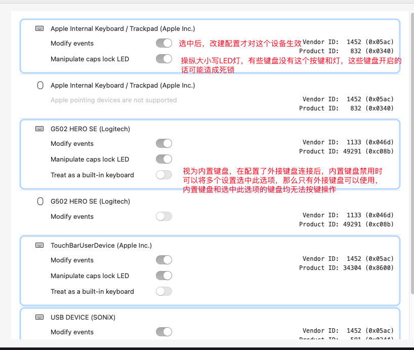
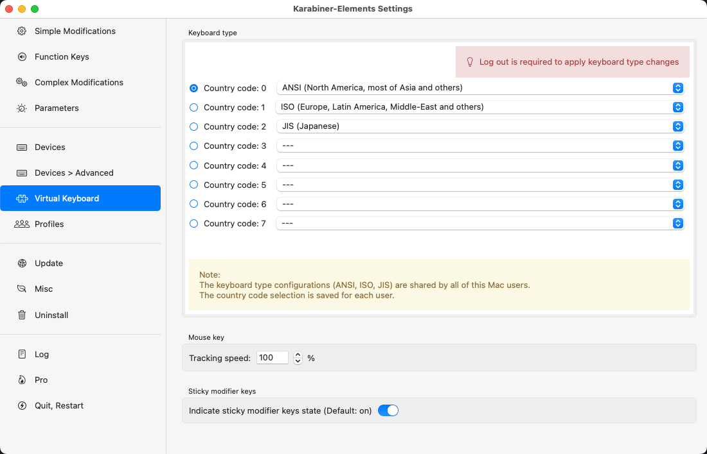

## 开始

### 简介

Karabiner-Elements(简称KE)是Mac系统下的键盘改键软件，它可以将一个按键映射到另外的按键或者通过组合映射一些复杂的组合键。

## 进阶

### 配置文件介绍

KE包含一个主配置文件`karabiner.json`和多个复合规则配置文件(在complex_modifications文件中)，同时简单配置和fn配置也是直接放在主配置文件中。

复合规则配置文件中的配置，在软件中启用之后，会自动加载到主配置文件中。

可以直接修改主配置文件，修改后实时更新配置，但是复合规则文件则需要重新关闭启动后才生效。

### 复合操纵修改(complex_modifications manipulator)

#### 主要参数介绍

```json
"manipulators": [
 {
     "type": "basic",	// 99%均为basic，有另外一个type是 "type": "mouse_motion_to_scroll"，指将鼠标移动scroll滚动条，具体用法可以研究一下
     "from": {	// 也就是原始按键
       "key_code": "a",	// 原始按键的代码，可以使用Karabiner-EventViewer查看，默认安装
       "consumer_key_code": "",	// 第三方软件的code
       "pointing_button": "",	// 鼠标按钮
       "any": "key_code or consumer_key_code or pointing_button",	// 按下上诉之一

       "modifiers": {	// 修饰键
           "mandatory": ["control"]，// 必须按下control之后再按a，才触发
         	"optional": ["left_shift", "left_control"] // 可选按下control之后再按a，才触发
       },

       "simultaneous": [	// 同时按下下面的按键才触发
           {
               "key_code, consumer_key_code, pointing_button or any"
           },
           {
               "key_code, consumer_key_code, pointing_button or any"
           },
           ...
       ],
       "simultaneous_options": {
           "detect_key_down_uninterruptedly": false,	// 是否被其它干扰按键中断
           "key_down_order": "A restriction of input events order",	// 是否按顺序按下
           "key_up_order": "A restriction of input events order",	// 是否按顺序弹起
           "key_up_when": "When key_up events are posted",	// 何时触发操纵，任何一个键弹起或者所有键弹起
           "to_after_key_up": [	// 所有from按完之后触发
               to event definition,
               to event definition,
               ...
           ]
       }
     },
     "to": [	// 触发操作，和to_if_alone等相比，to是按下时立即触发的，相当于to_after_key_down，立即触发
         "key_code": "b",	// 触发的按键，按a打出b
         "consumer_key_code": "",
         "pointing_button": "",
         "shell_command": "shell command",	// 触发shell命令，通过这个基本可以实现大多数功能，因为任何功能都可以通过命令来操作

         "set_variable": {	// 设置变量,和下面的conditions条件配合来用，比方说按一次a，触发设置了一个变量aaa:1,再次按a时，判断aaa是不是1，是1才触发
             "name": "variable name",
             "value": "variable value"
         },
						"conditions": [...],	// 触发条件

         "mouse_key": mouse_key definition,

         "sticky_modifier": sticky modifier definition,	// 粘滞键，按下一个键放开，再按另一个键，连起来，触发这个

         "software_function": software function definition,	// 一些鼠标的操作

         "modifiers": [	// 触发修饰符，比如触发control + b
             modifier,
             modifier,
             ...
         ],

         "lazy": false,	// 设置修饰键不触发，比如说设置control为lazy，那么单独按这个键不会触发，只有组合键才触发
         "repeat": true,	// 按住重复触发，要设置一般设置false，禁止按住一直触发
         "halt": false,	// 一般放入to_if_held_down、to_if_alone中，执行完这个里面就不执行其它(比如to)中的按键了
         "hold_down_milliseconds": 0
				],
     "to_if_alone": [...],	// 单独按下触发
     "to_if_held_down": [...],	// 按出按键
     "to_after_key_up": [...],	// 按完之后
     // 延迟操作，配合下面的参数basic.to_delayed_action_delay_milliseconds，这个时间之后，会触发to_if_invoked
     // 使用场景，先设置一个变量为1，1秒后触发to_if_invoked，这个变量变为0，而一个操纵的条件是这个变量为1，要触发，只能在一秒内按两次，达成双击
     "to_delayed_action": {	
         "to_if_invoked": [...],	// 调用
         "to_if_canceled": [...],	// 取消
     },
     "parameters": {
         "basic.to_delayed_action_delay_milliseconds": 1000,	// 延迟多久执行下面的动作
         "basic.to_if_alone_timeout_milliseconds": 250,	// 按住操作超过多久就不算独立按下了
     		"basic.to_if_held_down_threshold_milliseconds": 250	// 按住达到多久就算按住了，和上面一个配置其实说的是一个事情
     },
     "description": "Optional description for human"	// 配置名称
 },
 ... 	// 多个按键配置
]
```


## 其他配置

### 一些软件配置



键盘类型设置，如果是日本键盘，那么应该选择对应的键盘布局，否则容易出现按键与具体的code不匹配



