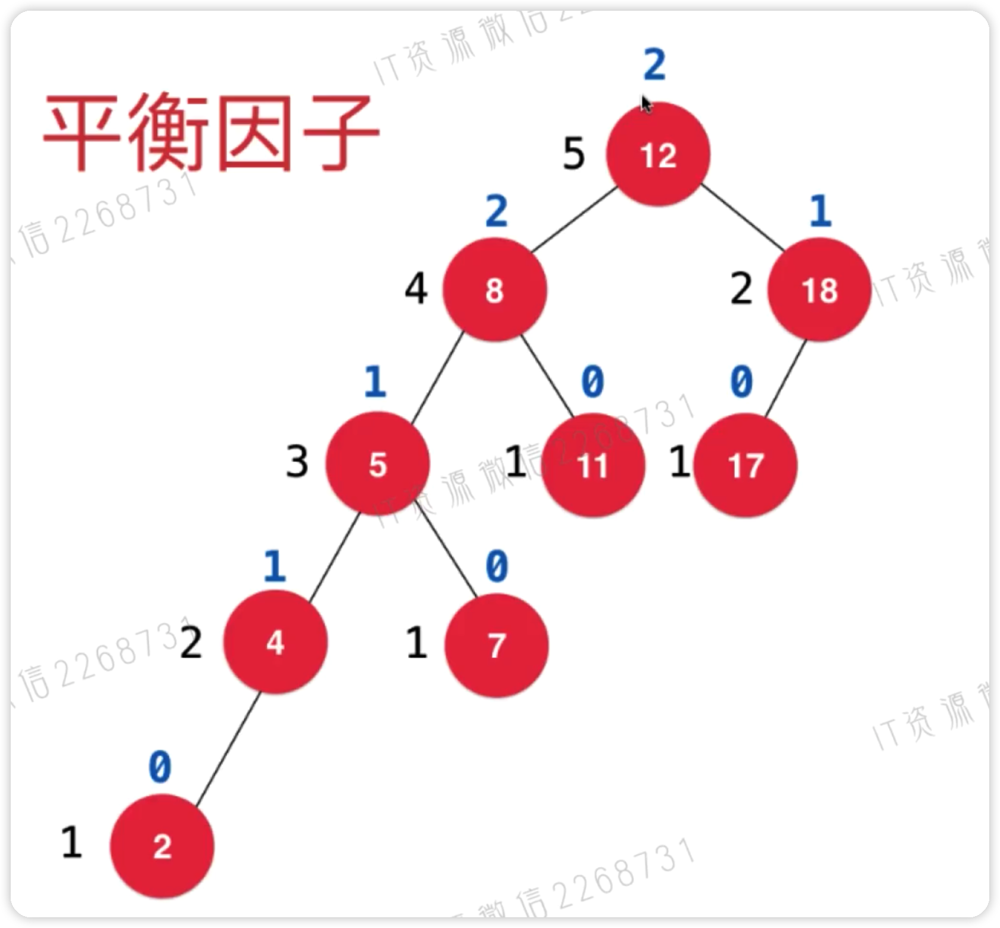

## 平衡树

如果一个树每个节点的左右子树高度差不超过1，则这棵树是平衡数

首先说明一下树节点的高度，从底部一层就是1个高度，每个节点高度为：`左右子节点中高度较大的一个+1`，要注意如下图中18所示，高度只是2而已，不是4，高度不是层数

我们通过平衡因子来确定这个树是否平衡，`平衡因子=左右子树高度相减`

当平衡因子等于2的时候，就需要去维护平衡，通过左旋转和右旋转，这个内容通过下面平衡树的一种平衡二叉树来说明

## 平衡二叉树

首先平衡二叉树是一颗二叉查找树，同时也是一颗平衡树，`左小右大，左右子树高度差不大于1，即平衡因子不大于1`

当平衡因子=2，失去平衡时，需要保持平衡，就必须进行旋转，有4中失去平衡的形式：

1. LL：左子树的左子树失去平衡，需要进行一次右旋转
2. LR：左子树的右子树失去平衡，需要先进行一次左旋转，然后进行一次右旋转
3. RR：右子树的右子树失去平衡，需要进行一次左旋转
4. RL：右子树的左子树失去平衡，需要进行一次右旋转，然后进行一次左旋转

如何旋转：举例LL，要进行右旋转，因为左子树不平衡，那么要将左子树这边提升一层，也就是将原本的左子树的父节点右旋转，首先将左子树原本的右子树取出，然后将父节点置为左子树的右子树，最后将取出的原本右子树放入父节点的左子树

如上图，先将T3取出，然后y置为x右子树，然后把t3置为y的左子树，本质上来说y和t3都比x大，所以再右边怎么摆弄都没问题

其它旋转同理

## 二三树

要理解红黑树，首先来了解一下二三树

首先二三树`是一颗绝对平衡的树`，`节点内可以放置1个或2个元素`，1个元素称为2节点，有两个子节点，2个元素称为3节点，有三个子节点，最多有3个子节点，子节点满足`左小中中右大`特点

二三树插入一个新元素时，永远不会插入到空位置，都会先进行融合，比如：3节点只有一个元素，那么新加入的元素，首先会融合进这个3节点，再加入一个元素的话，仍然加入3节点，但是成为了4节点，所以需要拆分

二三树如果没有绝对平衡，需要进行融合，将父节点进行融合，使之达到完全平衡，即便一直添加比之前小的数，也不会像二叉查找树那样转变成链表，二三树因为绝对平衡，所以路径长度都一样

## 红黑树

### 为什么要使用红黑树？

简单来说红黑树就是为了解决二叉查找树的缺陷，因为二叉查找树在某些情况下会退化成一个线性结构。同AVL平衡二叉树相比，不严格遵守高度差必须不超过1，插入和删除效率太低，而是使用红黑节点来达到没有一条路径比其他路径长两倍，且经过的黑节点数量一直，所以插入删除，所以使用红黑树

红黑树是一种二叉树，节点不是红色就是黑色，不是完全平衡树(23树是)，基本结构等价于二三树

因为红黑树是二叉树，所以二三树中的三节点必须拆分为两个二节点，但是它们是平行的，一个三节点拆分一定有一个是红节点，也就是被拆分下来的平行的那个节点一定是红节点，使用红色线连接

红黑树有以下性质：

1. 红黑树不是红色就是黑色：`新添加元素都是红色`，`红节点只能左斜`，但左斜的不一定都是红节点，只有3节点拆分平行的是红节点
2. 根节点是黑色的：对应二三树，根节点要么是2节点，要么3节点，2节点不用说是黑色的，3节点拆分还是是黑色的
3. 每个叶子结点(最后的空节点)是黑色的：也就是null节点，没有数据
4. 如果一个节点是红色的，子节点都是黑色的：`红节点子节点都是黑色`
   1. 对应二三树，节点是红色的，表示是拆分之后平行的，没拆分之前，子节点要么2节点只能是黑色，要么3节点，再次拆分还是只剩下黑色节点
   2. 一个黑色节点，右节点一定是黑色的，`红色节点只能左斜`，但是左节点不一定，三节点拆分就是红色，不是拆分的也是黑色

5. 从任意一个节点到叶子节点，经过的黑色节点是一样的：`红黑树确保没有一条路径会比其它路径长出两倍，经过的黑节点数量一致`，注意包括了null节点之后数量一致，别光数红黑节点，也就是红黑树是一个黑节点的完全平衡树，原因是23树是完全平衡树，到任意节点一样，23树每个节点都包含一个黑色节点且只包含一个，无论2节点还是3节点，所以红黑树经过的黑色节点和23树一样，都是完全平衡的

### 红黑树和AVL平衡二叉树区别

红黑树添加和删除元素，使用颜色控制，没有那么多旋转，效率高一些，但是查询效率比平衡二叉树低

### 添加元素

23树添加元素，首先融合，所以红黑树也是首先考虑融合，而红黑树不能融合，所以是平行，平行的都是红节点，`新添加的都是红节点`

添加之后，根据性质，不符合再进行旋转和变色

### 旋转和变色规则

AVL平衡二叉树高度差超过1需要进行旋转，这样导致后面每次添加元素都需要旋转，效率低，而红黑树不要求超过1必须平衡，而是不符合红黑要求才进行变色，变色达不到红黑树要求才进行旋转自平衡

变色：红节点子节点都是黑节点，所有路径黑节点数量一致(包括null节点之后一致)，不符合就变色

旋转：变色无法解决就旋转，左子树有问题就右旋，右子树有问题就左旋