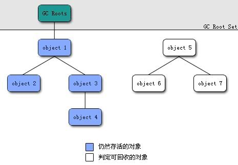

## 介绍下 Java 内存区域(运⾏时数据区)

JDK1.8之前：

- 线程共享的：堆、方法区(由永久代实现，包含类信息、字符串常量池、静态变量)
- 线程独享的：虚拟机栈、本地方法栈、程序计数器

JDK1.8及以后：

其余一样，只是方法区由元空间直接内存实现，同时运行时常量池、静态变量存入堆中

### 程序计数器

用于记录字节码解释器下一条要执行的行号指示器，当执行了分支、循环、跳转、异常处理、线程恢复之后，通过改变程序计数器的值来改变下一条要解释执行的指令，是唯一不会OOM的内存区域，因为内存空间很小，而且随线程创建和死亡

### 虚拟机栈

排除本地方法，每一个Java方法都是存入栈中，每一个方法是一个栈帧，存放了局部变量表(基本类型数据和引用变量)、操作数栈(比如循环过程中的临时变量和字面量)、动态链接(将Class常量池中的符号引用转换为直接引用，也就是类加载中的解析过程)、方法出口信息

主要会出现：栈溢出和内存溢出两种错误，栈不允许动态扩展，达到指定的最大深度则栈溢出，允许动态扩展，但是仍然无法提供更多内存空间，则内存溢出

### 方法如何调用？

调用一个方法就是把这个方法也就是一个栈帧压入Java虚拟机栈，调用结束则弹出栈，使用return或者抛出异常表示调用结束

### 本地方法栈

基本和Java虚拟机栈一致，只是处理的是本地native方法

### 堆

用于存放对象实例、数组、1.7以后运行时常量池、字符串常量池、静态变量

1.7开启逃逸分析之后，对象实例如果未逃逸出去(没有外部引用或者没有return这个对象引用)，可以直接在栈中分配内存

堆内存被分为新生代、老生代、永久代三个区：

1. 大多数新创建对象在新生代伊甸园区分配内存，当伊甸园区满了，执行GC之后
2. 仍然存活的进入新生代幸存0区，并记录年龄为1，当幸存0区满了之后，执行GC
3. 仍然存活的保存到幸存1区，同时交换From和To区的角色，也就是伊甸园区再进入0区
4. 当幸存区的对象年龄满15(因为记录这个的字段是4位，也就是15)，或者某一个年龄的对象达到幸存区能够容纳的总数量的一半时，对比这个年龄的数量和15(或者设置的数值)，将更小的变为进入老生代的条件，当然变更之后年龄比这个数值大的直接进入老生代
5. 进入老生代满了之后，执行的是Major GC老生代的垃圾回收
6. 永久代只是方法区的一个实现，元空间也是方法区的实现，因为永久代在堆中，永久代是一个概念，永久代既属于堆，也属于方法区，方法区在物理上存在于堆中的永久代中，逻辑上方法区和堆是独立的，当然1.7及以后方法区由元空间实现，属于直接内存

堆常见的错误是：OOM，一种是垃圾回收时内存很少的空间并且执行垃圾回收耗时很长，则是OOM GC的错误，另外一种创建对象时空间不足，OOM heap 堆错误，这个和物理空间无关，是配置的堆内存大小

### 方法区

⽤于存储已被虚拟机加载的类信息、常量、静态变量、JIT即时编译器编译后的代码等数据

1.7以前由永久代实现，设置一个固定大小，永久代方法区是和堆隔离的

1.8及以后由元空间直接内存实现，将字符串常量、静态变量存入堆中，也就是这两个不在方法区了

### 为什么要将永久代 (PermGen) 替换为元空间 (MetaSpace) 呢?

1. 永久代本身有JVM设置的固定大小限制，而元空间直接内存更大，限制更小，溢出概率更小，加载的类更多
2. JDK1.8合并其它虚拟机，其它虚拟机没有永久代概念，合并之后没有必要额外设置

### 常量池

常量池包含三种：一种是编译后字节码文件中的常量池、运行时常量池、字符串常量池

1. 字节码常量池：主要存放各种字面量和符号引用，字面量包括基本类型值、文本字符串和`final`修饰的常量，在编译期有效
2. 运行时常量池：将字节码常量池加载到内存中，就变成运行时常量池，同时讲符号引用转换为直接内存或者句柄，要注意1.7以后随方法区保存在元空间中
3. 字符串常量池：字符串缓存，避免重复创建相同字符串，1.7以后字符串常量池、静态变量存放在堆中，而不是方法区，要注意`new String("abc")`创建一个字符串，是创建了两个对象，一个是abc这个存放在字符串常量池的字符串常量对象，一个是new String这个存在堆中的对象，指向字符串常量池

```java
    public static void main(String[] args) {
        
        String s1 = "hello";	// 创建了一个字面量常量，存放在字符串常量池
        
        // 这里会创建两个对象，一个是hello字面量常量，但是以为已经存在所以不创建
        // 然后创建new String对象，存放在堆中，这个对象指向字面量地址，但是s2是指向new String堆中的地址的
        String s2 = new String("hello");	
        
        String s3 = "hello";	// 不新创建，直接指向堆中的字符串常量池
        
        System.out.println(s1 == s2);   // false
        System.out.println(s1 == s3);   // true
    }
```

R大说常量池中存的引用地址，实际对象在堆中，但是周志明书中写的直接存的对象

### 直接内存

元空间使用直接内存可以避免Java堆和Native堆复制数据影响性能，但是都收到本机内存的限制

## 说⼀下Java对象的创建过程

一个对象创建的整个流程如下：

1. new一个对象，首先检查常量池中是否有这个类的符号引用，是否加载、解析和初始化过，如果没有执行对应的类加载机制加载类
2. 分配内存：类通过类加载器加载之后，就要给实例对象分配内存了

分配内存主要有两种方式：一种是分配规整的内存，一种是不规整由虚拟机维护记录的散乱的内存，堆内存是否规整，取决于选用的GC回收期的算法，选用标记-清除算法，那就不是规整的，选用标记-整理或者复制算法，就是规整的

内存分配并发问题：为了给新对象分配内存时线程安全，采用两种方式：

一种是CAS+失败重试，也就是乐观锁，每次新建不加锁，失败了不断重试，直到成功

另外一种是TLAB，即每个线程先在新生代Eden区创建一块TLAB内存，每个线程有自己的内存，新对象首先在这里创建，如果新对象需要的内存大于TLAB或者TLAB满了，才使用上面的CAS+失败尝试进行内存分配，也就是不区分线程了，所有的线程都去堆中创建了，但是首先要每个线程TLAB满了之后

1. 初始化零值：内存分配好了，给分配到的内存空间初始化为零值，但是对象头除外
2. 设置对象头：也就是对象的相关信息的设置，包括元数据信息、哈希吗、GC年龄等
3. 执行初始化：调用`<init>`进行初始化，比方说字段设置初始值，都在这里进行设置，执行之后，一个对象才算创建

## 对象的内存布局

一个对象在内存中主要包括三块：对象头、实例数据和对齐填充

1. 对象头：一部分是对象自身的运行时数据，包括哈希码、GC年龄、锁状态(也就是MarkWork)、元数据指针也就是类型模板指针，指向对应的类元数据，确定是哪个类的实例
2. 实例数据：就是这个对象真正存储的有效信息
3. 对齐填充：因为虚拟机要求对象起始地址是8字节的整数倍，也就是说对象的大小必须是8字节的整数倍，其中对象头是8字节的1倍或者两倍，所以实例数据没有达到8的整数倍时，要进行对齐填充，仅仅起到占位作用

## 对象的访问定位有哪两种⽅式?

栈中引用变量要找到堆中的具体对象实例主要有两种方式：

1. 句柄：在堆中创建一个句柄池内存，然后通过这个句柄再找到堆中的实例数据和方法区中的类数据，这样做的好处是，如果对象被移动的话，引用变量不需要改变，只需要改变堆中句柄池的指向
2. 直接指针：占用引用变量直接存储堆中的实例数据的地址，同时这个实例对象中自己包含了方法区类数据的地址，这样好处是速度快，直接找到实例对象

## 简单聊聊 JVM 内存分配与回收

JVM内存分配针对对象主要是堆内存，主要分为新生代、老生代、永久代，划分堆内存主要是为了更方便的回收堆内存，其它的就是前面的堆内存章节

## 说⼀下堆内存中对象的分配的基本策略

1. 对象优先在Eden区分配：一个对象优先在Eden区进行分配，满了之后会进行一次Minor GC，如果这个对象特别大，幸存区无法承载，比方说一个占满所有Eden区的数组，那么只能把Eden区的对象提前放到老生代，如果幸存区还是不行则会调用Full GC，整体进行垃圾回收，同时新创建的对象继续放在Eden区，也就是说Eden区的对象有可能会直接放入老生代，这个是虚拟机的分配担保机制
2. 大对象比如字符串、数组可能直接分配到老生代：是为了如果放入Eden区会占满，再创建新对象又会发生分配担保机制直接存入老生代，这样的话浪费性能，不如直接存入老生代，减少复制的性能消耗
3. 长期存活的对象存入老生代：幸存区的对象年龄达到15，或者同年龄数量达到幸存区容量的一半，取更小的一个数值为进入老生代的阈值，要注意CMS垃圾收集器的阈值是6，通过`-XX:MaxTenuringThreshold`设置，常见的垃圾收集器有：serial、ParNew、CMS、G1，各自的优势不同
4. 主要发生GC的区域：新生代使用minor GC，老生代使用Major GC，混合新生代和部分老生代使用Mixed GC，整堆收集Full GC，收集整个堆和方法区

## 如何判断对象是否死亡?(两种⽅法)

垃圾回收之前需要判断哪些对象已经死亡

1. 引用计数法：给对象添加一个引用计数器，有一个引用就+1，一个引用失效-1，计数器为0表示没有再被使用，实现比较简单，但是缺点是两个引用变量互相引用对方，这两个对象的计数器永远都会存在1，即使后面根本没有地方使用到
2. 可达性分析算法：通过引用链(GC ROOTS)引用的对象，则表示存活，否则表示死亡等待回收，引用链从一个GC ROOT节点开始，可以作为开始节点的对象包括：主要是虚拟机栈中引用的对象

- 方法中创建的对象引用，String s = new String，这个String对象
- 方法区类静态变量引用，public static String s = "hello"，hello对象
- 方法区中常量的引用，public static final MAX = 123,123这个Integer对象
- 本地方法栈中引用的对象，和Java虚拟机栈引用的三种对象一样

上面的引用变量就是GC ROOT引用链的根节点，只有这几种情况的引用变量是根节点，这个节点后面可以继续有很多下面的引用链下面的一串节点，如果没有被根节点的后面节点引用，则等待被回收

比如当这些引用变量置为null，那么这些对象的GC ROOTS引用链就没有引用了，等待被回收



## 简单的介绍⼀下强引⽤,软引⽤,弱引⽤,虚引⽤

无论是那种算法判断对象引用数量，判断对象的存货都与引用有关，而引用关系有强、软、弱、虚四种

1. 强引用：大部分的引用，比如方法栈中的引用，属于必不可少的对象，就算OOM，也不会回收
2. 软引用：内存未满时执行垃圾回收不会回收，内存满时垃圾回收才会回收，可以传入引用队列，使用软引用可以在OOM之前加速垃圾回收的速度
3. 弱引用：不管内存是否满，执行垃圾回收都会回收，可以用来创建内存敏感的高速缓存，也就是内存充足时创建缓存提高速度，对内存敏感，只要执行垃圾回收就清空，不占用内存，可以传入引用队列
4. 虚引用：在任何时候都可能被垃圾回收，必须传入引用队列参数，主要用于追踪一个对象被回收的活动

注意点：

1. 软、弱、虚引用的创建方式，都是需要创建一个引用，然后把具体引用的对象传入这个引用对象，比如软引用，弱引用使用weakReference对象，虚引用PhantomReference对象，而且虚引用必须传入ReferenceQueue队列，软引用和弱引用可以选择是否传入

```java
SoftReference<String> stringSoftReference = new SoftReference<String>(new String("hello"));
System.out.println(stringSoftReference.get());
```

通过调用引用对象的`get()`方法可以获取这个引用里面的对象的内容

1. 引用队列说明：当软、弱、虚引用里面的具体对象被回收，就会把这三个引用加入引用队列，然后通过判断这个队列里面有没有这些引用，从而得知对象是否被回收，当使用的时候，判断队列为空，然后去使用对象，比如缓存，队列为空才可以使用缓存
2. 弱、虚引用很少使用，较多使用的弱引用

## 如何判断⼀个常量是废弃常量?

运行时常量池中如果一个常量没有任何引用，比如字符串常量池没有任何String对象引用这个字符串值的话，就可以被垃圾回收清理掉

## 如何判断⼀个类是⽆⽤的类?

方法区中的需要满足下面三个条件才可能会被回收，而不是一定回收：

1. 类的所有实例都被回收，堆中没有这个类的实例
2. 加载这个类的类加载器实例被回收
3. 这个类对应的Class对象被回收，无法通过反射访问该类的方法，注意这个Class对象是在类加载的生成的一个Class对象，也就是类信息的访问入口

## 垃圾收集有哪些算法，各⾃的特点？

1. 标记-清除算法：标记不需要清除的对象，然后垃圾回收时回收其余的对象，会产生大量的内存碎片，内存不连续，由虚拟机维护这些内存空间的具体位置
2. 复制算法：将内存一分为二，每次使用其中的一块，垃圾回收之后，将存活的对象复制到另外一块，然后将使用过的内存一次性清除，缺点是一半的内存没法使用，优点是有整块的连续空间
3. 标记-整理算法：主要针对老生代内存，首先标记不清楚的对象，然后把所有这些标记的整理到一段，其余的位置全部清理，这样不产生内存碎片，但是仍然需要移动(不是复制)
4. 分代收集算法：因为不同区域的对象特点不一致，所以采用不同的算法，比如新生代每次有大量的对象需要清除，所以采用复制算法，只需要复制少量的对象，而老生代存活率较高，而且没有额外的空间进行分配担保，所以采用标记-清除算法或者标记-整理算法

## HotSpot 为什么要分为新⽣代和⽼年代？

主要是为了提高GC垃圾回收的效率，分代之后可以针对不同的区域使用不同的算法，更高效

## 常⻅的垃圾回收器有那些?

垃圾收集算法是方法论，而不同垃圾回收器就是使用不同算法的实现，每个回收器各有各的有点，没有万能的回收器

1. Serial 收集器：单线程收集器，不仅垃圾回收只有一条线程，而且会暂停其余的工作线程，新生代使用复制算法，老生代使用标记-整理算法，优点是单线程不需要线程交互，简单高效，常用于客户端的虚拟机
2. ParNew 收集器：Serial 的多线程版本，新生代使用复制算法，老生代使用标记-整理算法，主要运行在Server端的虚拟机，只有Serial和ParNew可以和CMS配合使用
3. Parallel Scavenge 收集器：JDK1.8默认收集器，新⽣代采⽤复制算法，⽼年代采⽤标记-整理算法
4. CMS 收集器：以减少用户等待时间为目标的收集器
5. ZGC 收集器：标记-复制算法，进行类算法改进，中断用户线程的情况更小
6. ...

总之不同的收集器，特点不同，有的是单线程，有的多线程，有的支持并行(多条垃圾手机线程同时工作，但是用户线程停止)，有的支持并发(用户和垃圾收集线程同时运行)，算法也各不相同