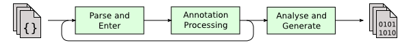
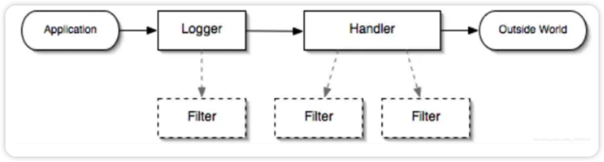

# JUNIT单元测试

写函数对需要测试的内容进行测试，直接在main中进行测试无法达到这种效果，main只能随时测试，随时查看结果，而且无法进行代码判断是否通过

junit有以下特点：

* 方法必须是public的
* 不能是静态方法
* 返回值必须是void
* 必须是没有任何参数的方法

下面来安装配置一下junit，注意新版idea默认就支持junit，当然也可以自己安装更新的版本

`````xml
<!--单元测试--> 
<dependency>
<groupId>junit</groupId>
<artifactId>junit</artifactId>
<version>4.13.2</version>
</dependency>
`````


## 简单使用

 @Test注解只有在方法上有效，只要加了这个注解的方法，就可以直接运行！

```java
@Test
public void test() {
  System.out.println("Hello");
}
```


# lombok

我们发现，在以往编写项目时，尤其是在类进行类内部成员字段封装时，需要编写大量的get/set方法，这不仅使得我们类定义中充满了get和set方法，同时如果字段名称发生改变，又要挨个进行修改，甚至当字段变得很多时，构造方法的编写会非常麻烦！

通过使用Lombok（小辣椒）就可以解决这样的问题！


## idea安装

安装插件即可，idea默认已经安装

## 导入jar依赖

```xml
<dependency>
  <groupId>org.projectlombok</groupId>
  <artifactId>lombok</artifactId>
  <scope>compile</scope>
</dependency>
```

## 原理分析

* 首先我们需要导入Lombok的jar依赖，和jdbc依赖是一样的，放在项目目录下直接导入就行了。可以在这里进行下载：https://projectlombok.org/download
* 然后我们要安装一下Lombok插件，由于IDEA默认都安装了Lombok的插件，因此直接导入依赖后就可以使用了。
* 重启IDEA

Lombok是一种插件化注解API，是通过添加注解来实现的，然后在javac进行编译的时候，进行处理。

Java的编译过程可以分成三个阶段：



1. 所有源文件会被解析成语法树。
2. 调用注解处理器。如果注解处理器产生了新的源文件，新文件也要进行编译。
3. 最后，语法树会被分析并转化成类文件。

实际上在上述的第二阶段，会执行*[lombok.core.AnnotationProcessor](https://github.com/rzwitserloot/lombok/blob/master/src/core/lombok/core/AnnotationProcessor.java)*，它所做的工作就是我们上面所说的，修改语法树。

## 使用Lombok

我们通过实战来演示一下Lombok的实用注解：

* 我们通过添加`@Getter`和`@Setter`来为当前类的所有字段生成get/set方法，他们可以添加到类或是字段上，注意静态字段不会生成，final字段无法生成set方法。
  * 我们还可以使用@Accessors来控制生成Getter和Setter的样式。 
* 我们通过添加`@ToString`来为当前类生成预设的toString方法。
* 我们可以通过添加`@EqualsAndHashCode`来快速生成比较和哈希值方法。
* 我们可以通过添加`@AllArgsConstructor`和`@NoArgsConstructor`来快速生成全参构造和无参构造。
* 我们可以添加`@RequiredArgsConstructor`来快速生成参数只包含`final`或被标记为`@NonNull`的成员字段。
* 使用`@Data`能代表`@Setter`、`@Getter`、`@RequiredArgsConstructor`、`@ToString`、`@EqualsAndHashCode`全部注解。
  * 一旦使用`@Data`就不建议此类有继承关系，因为`equal`方法可能不符合预期结果（尤其是仅比较子类属性）。
* 使用`@Value`与`@Data`类似，但是并不会生成setter并且成员属性都是final的。
* 使用`@SneakyThrows`来自动生成try-catch代码块。
* 使用`@Cleanup`作用与局部变量，在最后自动调用其`close()`方法（可以自由更换）
* 使用`@Builder`来快速生成建造者模式。
  * 通过使用`@Builder.Default`来指定默认值。
  * 通过使用`@Builder.ObtainVia`来指定默认值的获取方式。

# JUL日志系统

首先一问：我们为什么需要日志系统？

我们之前一直都在使用`System.out.println`来打印信息，但是，如果项目中存在大量的控制台输出语句，会显得很凌乱，而且日志的粒度是不够细的，假如我们现在希望，项目只在debug的情况下打印某些日志，而在实际运行时不打印日志，采用直接输出的方式就很难实现了，因此我们需要使用日志框架来规范化日志输出。

而JDK为我们提供了一个自带的日志框架，位于`java.util.logging`包下，我们可以使用此框架来实现日志的规范化打印，使用起来非常简单：

```java
public class Main {
    public static void main(String[] args) {
      	// 首先获取日志打印器
        Logger logger = Logger.getLogger(Main.class.getName());
      	// 调用info来输出一个普通的信息，直接填写字符串即可
        logger.info("我是普通的日志");
    }
}
```

我们可以在主类中使用日志打印，得到日志的打印结果：

```tex
十一月 15, 2021 12:55:37 下午 com.test.Main main
信息: 我是普通的日志
```

我们发现，通过日志输出的结果会更加规范。

## JUL日志讲解

日志分为7个级别，详细信息我们可以在Level类中查看：

*  SEVERE（最高值）- 一般用于代表严重错误
*  WARNING  - 一般用于表示某些警告，但是不足以判断为错误
*  INFO （默认级别）  -  常规消息
*  CONFIG
*  FINE
*  FINER
*  FINEST（最低值）

我们之前通过`info`方法直接输出的结果就是使用的默认级别的日志，我们可以通过`log`方法来设定该条日志的输出级别：

```java
public static void main(String[] args) {
    Logger logger = Logger.getLogger(Main.class.getName());
    logger.log(Level.SEVERE, "严重的错误", new IOException("我就是错误"));
    logger.log(Level.WARNING, "警告的内容");
    logger.log(Level.INFO, "普通的信息");
    logger.log(Level.CONFIG, "级别低于普通信息");
}
```

我们发现，级别低于默认级别的日志信息，无法输出到控制台，我们可以通过设置来修改日志的打印级别：

```java
public static void main(String[] args) {
    Logger logger = Logger.getLogger(Main.class.getName());

    //修改日志级别
    logger.setLevel(Level.CONFIG);
    //不使用父日志处理器
    logger.setUseParentHandlers(false);
    //使用自定义日志处理器
    ConsoleHandler handler = new ConsoleHandler();
    handler.setLevel(Level.CONFIG);
    logger.addHandler(handler);

    logger.log(Level.SEVERE, "严重的错误", new IOException("我就是错误"));
    logger.log(Level.WARNING, "警告的内容");
    logger.log(Level.INFO, "普通的信息");
    logger.log(Level.CONFIG, "级别低于普通信息");
}
```

每个`Logger`都有一个父日志打印器，我们可以通过`getParent()`来获取：

```java
public static void main(String[] args) throws IOException {
    Logger logger = Logger.getLogger(Main.class.getName());
    System.out.println(logger.getParent().getClass());
}
```

我们发现，得到的是`java.util.logging.LogManager$RootLogger`这个类，它默认使用的是ConsoleHandler，且日志级别为INFO，由于每一个日志打印器都会直接使用父类的处理器，因此我们之前需要关闭父类然后使用我们自己的处理器。

我们通过使用自己日志处理器来自定义级别的信息打印到控制台，当然，日志处理器不仅仅只有控制台打印，我们也可以使用文件处理器来处理日志信息，我们继续添加一个处理器：

```java
//添加输出到本地文件
FileHandler fileHandler = new FileHandler("test.log");
fileHandler.setLevel(Level.WARNING);
logger.addHandler(fileHandler);
```

注意，这个时候就有两个日志处理器了，因此控制台和文件的都会生效。如果日志的打印格式我们不喜欢，我们还可以自定义打印格式，比如我们控制台处理器就默认使用的是`SimpleFormatter`，而文件处理器则是使用的`XMLFormatter`，我们可以自定义：

```java
//使用自定义日志处理器(控制台)
ConsoleHandler handler = new ConsoleHandler();
handler.setLevel(Level.CONFIG);
handler.setFormatter(new XMLFormatter());
logger.addHandler(handler);
```

我们可以直接配置为想要的打印格式，如果这些格式还不能满足你，那么我们也可以自行实现：

```java
public static void main(String[] args) throws IOException {
    Logger logger = Logger.getLogger(Main.class.getName());
    logger.setUseParentHandlers(false);

    //为了让颜色变回普通的颜色，通过代码块在初始化时将输出流设定为System.out
    ConsoleHandler handler = new ConsoleHandler(){{
        setOutputStream(System.out);
    }};
    //创建匿名内部类实现自定义的格式
    handler.setFormatter(new Formatter() {
        @Override
        public String format(LogRecord record) {
            SimpleDateFormat format = new SimpleDateFormat("yyyy-MM-dd HH:mm:ss.SSS");
            String time = format.format(new Date(record.getMillis()));  //格式化日志时间
            String level = record.getLevel().getName();  // 获取日志级别名称
            // String level = record.getLevel().getLocalizedName();   // 获取本地化名称（语言跟随系统）
            String thread = String.format("%10s", Thread.currentThread().getName());  //线程名称（做了格式化处理，留出10格空间）
            long threadID = record.getThreadID();   //线程ID
            String className = String.format("%-20s", record.getSourceClassName());  //发送日志的类名
            String msg = record.getMessage();   //日志消息

          //\033[33m作为颜色代码，30~37都有对应的颜色，38是没有颜色，IDEA能显示，但是某些地方可能不支持
            return "\033[38m" + time + "  \033[33m" + level + " \033[35m" + threadID
                    + "\033[38m --- [" + thread + "] \033[36m" + className + "\033[38m : " + msg + "\n";
        }
    });
    logger.addHandler(handler);

    logger.info("我是测试消息1...");
    logger.log(Level.INFO, "我是测试消息2...");
    logger.log(Level.WARNING, "我是测试消息3...");
}
```

日志可以设置过滤器，如果我们不希望某些日志信息被输出，我们可以配置过滤规则：

```java
public static void main(String[] args) throws IOException {
    Logger logger = Logger.getLogger(Main.class.getName());

    //自定义过滤规则
    logger.setFilter(record -> !record.getMessage().contains("普通"));

    logger.log(Level.SEVERE, "严重的错误", new IOException("我就是错误"));
    logger.log(Level.WARNING, "警告的内容");
    logger.log(Level.INFO, "普通的信息");
}
```

实际上，整个日志的输出流程如下：



## Properties配置文件

Properties文件是Java的一种配置文件，我们之前学习了XML，但是我们发现XML配置文件读取实在是太麻烦，那么能否有一种简单一点的配置文件呢？我们可以使用Properties文件：

```properties
name=Test
desc=Description
```

该文件配置很简单，格式为`配置项=配置值`，我们可以直接通过`Properties`类来将其读取为一个类似于Map一样的对象：

```java
public static void main(String[] args) throws IOException {
    Properties properties = new Properties();
    properties.load(new FileInputStream("test.properties"));
    System.out.println(properties);
}
```

我们发现，`Properties`类是继承自`Hashtable`，而`Hashtable`是实现的Map接口，也就是说，`Properties`本质上就是一个Map一样的结构，它会把所有的配置项映射为一个Map，这样我们就可以快速地读取对应配置的值了。

我们也可以将已经存在的Properties对象**放入输出流进行保存**，我们这里就不保存文件了，而是直接打印到控制台，我们只需要提供输出流即可：

```java
public static void main(String[] args) throws IOException {
    Properties properties = new Properties();
  	// properties.setProperty("test", "lbwnb");  //和put效果一样
    properties.put("test", "lbwnb");
  	// store方法表示将properties持久化到输出流中，一般是文件，这里直接用控制台输出流，test是备注
    properties.store(System.out, "test");
  	//properties.storeToXML(System.out, "test");  保存为XML格式
}
```

我们可以通过`System.getProperties()`获取系统的参数，我们来看看：

```java
public static void main(String[] args) throws IOException {
  	// System里面已经有了这个Properties对象
    System.getProperties().store(System.out, "系统信息：");
}
```

## 编写日志配置文件

我们可以通过进行配置文件来规定日志打印器的一些默认值：

```properties
# RootLogger 的默认处理器为
handlers= java.util.logging.ConsoleHandler
# RootLogger 的默认的日志级别
.level= CONFIG
```

我们来尝试使用配置文件来进行配置：

```java
public static void main(String[] args) throws IOException {
    //获取日志管理器
    LogManager manager = LogManager.getLogManager();
    //读取我们自己的配置文件
    manager.readConfiguration(new FileInputStream("logging.properties"));
    //再获取日志打印器
    Logger logger = Logger.getLogger(Main.class.getName());
    logger.log(Level.CONFIG, "我是一条日志信息");   //通过自定义配置文件，我们发现默认级别不再是INFO了
}
```

我们也可以去修改`ConsoleHandler`的默认配置：

```properties
# 指定默认日志级别
java.util.logging.ConsoleHandler.level = ALL
# 指定默认日志消息格式
java.util.logging.ConsoleHandler.formatter = java.util.logging.SimpleFormatter
# 指定默认的字符集
java.util.logging.ConsoleHandler.encoding = UTF-8
```

其实，我们阅读`ConsoleHandler`的源码就会发现，它就是通过读取配置文件来进行某些参数设置：

```java
// Private method to configure a ConsoleHandler from LogManager
// properties and/or default values as specified in the class
// javadoc.
private void configure() {
    LogManager manager = LogManager.getLogManager();
    String cname = getClass().getName();

    setLevel(manager.getLevelProperty(cname +".level", Level.INFO));
    setFilter(manager.getFilterProperty(cname +".filter", null));
    setFormatter(manager.getFormatterProperty(cname +".formatter", new SimpleFormatter()));
    try {
        setEncoding(manager.getStringProperty(cname +".encoding", null));
    } catch (Exception ex) {
        try {
            setEncoding(null);
        } catch (Exception ex2) {
            // doing a setEncoding with null should always work.
            // assert false;
        }
    }
}
```

## 使用Lombok快速开启日志

我们发现，如果我们现在需要全面使用日志系统，而不是传统的直接打印，那么就需要在每个类都去编写获取Logger的代码，这样显然是很冗余的，能否简化一下这个流程呢？

前面我们学习了Lombok，我们也体会到Lombok给我们带来的便捷，我们可以通过一个注解快速生成构造方法、Getter和Setter，同样的，`Logger对象`也是可以使用Lombok快速生成的，然后在方法里面就可以直接使用，而无需再创建了。

```java
@Log
public class Main {
    public static void main(String[] args) {
        System.out.println("自动生成的Logger名称："+log.getName());
        log.info("我是日志信息");
    }
}
```

只需要添加一个`@Log`注解即可，添加后，我们可以直接使用一个静态变量log，而它就是自动生成的Logger。我们也可以手动指定名称：

```java
@Log(topic = "打工是不可能打工的")
public class Main {
    public static void main(String[] args) {
        System.out.println("自动生成的Logger名称："+log.getName());
        log.info("我是日志信息");
    }
}
```

## Mybatis日志系统

Mybatis也有日志系统，它详细记录了所有的数据库操作等，但是我们在前面的学习中没有开启它，现在我们学习了日志之后，我们就可以尝试开启Mybatis的日志系统，来监控所有的数据库操作，要开启日志系统，我们需要进行配置：

```xml
<setting name="logImpl" value="STDOUT_LOGGING" />
```

`logImpl`包括很多种配置项，包括 SLF4J | LOG4J | LOG4J2 | JDK_LOGGING | COMMONS_LOGGING | STDOUT_LOGGING | NO_LOGGING，而默认情况下是未配置，也就是说不打印。我们这里将其设定为STDOUT_LOGGING表示直接使用标准输出将日志信息打印到控制台，我们编写一个测试案例来看看效果：

```java
public class TestMain {

    private SqlSessionFactory sqlSessionFactory;
    @Before
    public void before(){
        try {
            sqlSessionFactory = new SqlSessionFactoryBuilder()
                    .build(new FileInputStream("mybatis-config.xml"));
        } catch (FileNotFoundException e) {
            e.printStackTrace();
        }
    }

    @Test
    public void test(){
        try(SqlSession sqlSession = sqlSessionFactory.openSession(true)){
            TestMapper mapper = sqlSession.getMapper(TestMapper.class);
            System.out.println(mapper.getStudentBySidAndSex(1, "男"));
            System.out.println(mapper.getStudentBySidAndSex(1, "男"));
        }
    }
}
```

我们发现，两次获取学生信息，只有第一次打开了数据库连接，而第二次并没有。

现在我们学习了日志系统，那么我们来尝试使用日志系统输出Mybatis的日志信息：

```xml
<setting name="logImpl" value="JDK_LOGGING" />
```

将其配置为JDK_LOGGING表示使用JUL进行日志打印，因为Mybatis的日志级别都比较低，因此我们需要设置一下`logging.properties`默认的日志级别：

```properties
handlers= java.util.logging.ConsoleHandler
.level= ALL
java.util.logging.ConsoleHandler.level = ALL
```

代码编写如下：

```java
@Log
public class TestMain {

    private SqlSessionFactory sqlSessionFactory;
    @Before
    public void before(){
        try {
            sqlSessionFactory = new SqlSessionFactoryBuilder()
                    .build(new FileInputStream("mybatis-config.xml"));
            LogManager manager = LogManager.getLogManager();
            manager.readConfiguration(new FileInputStream("logging.properties"));
        } catch (IOException e) {
            e.printStackTrace();
        }
    }

    @Test
    public void test(){
        try(SqlSession sqlSession = sqlSessionFactory.openSession(true)){
            TestMapper mapper = sqlSession.getMapper(TestMapper.class);
            log.info(mapper.getStudentBySidAndSex(1, "男").toString());
            log.info(mapper.getStudentBySidAndSex(1, "男").toString());
        }
    }
}
```

但是我们发现，这样的日志信息根本没法看，因此我们需要修改一下日志的打印格式，我们自己创建一个格式化类：

```java
public class TestFormatter extends Formatter {
    @Override
    public String format(LogRecord record) {
        SimpleDateFormat format = new SimpleDateFormat("yyyy-MM-dd HH:mm:ss.SSS");
        String time = format.format(new Date(record.getMillis()));  //格式化日志时间
        return time + " : " + record.getMessage() + "\n";
    }
}
```

现在再来修改一下默认的格式化实现：

```properties
handlers= java.util.logging.ConsoleHandler
.level= ALL
java.util.logging.ConsoleHandler.level = ALL
java.util.logging.ConsoleHandler.formatter = com.test.TestFormatter
```

现在就好看多了，当然，我们还可以继续为Mybatis添加文件日志，这里就不做演示了。

# Kaptcha验证码

Kaptcha是谷歌开发的一个验证码集成库

加载依赖

```xml
<!--Kaptcha验证码依赖-->
<dependency>
    <groupId>com.github.penggle</groupId>
    <artifactId>kaptcha</artifactId>
    <version>2.3.2</version>
</dependency>
```

在`applicationContext.xml`配置Kaptcha

```xml
<!--配置Kaptcha验证码-->
<bean id="KaptchaProducer" class="com.google.code.kaptcha.impl.DefaultKaptcha">
    <property name="config">
        <bean class="com.google.code.kaptcha.util.Config">
            <constructor-arg>
                <props>
                    <!--验证码图片不生成边框-->
                    <prop key="kaptcha.border">no</prop>
                    <!--验证码图片的宽度-->
                    <prop key="kaptcha.image.width">120</prop>
                    <!--验证码图片字体颜色-->
                    <prop key="kaptcha.textproducer.font.color">blue</prop>
                    <!--每个字符占用最大像素-->
                    <prop key="kaptcha.textproducer.font.size">40</prop>
                    <!--验证码包含几个元素-->
                    <prop key="kaptcha.textproducer.char.length">4</prop>
                </props>
            </constructor-arg>
        </bean>
    </property>
</bean>
```

然后在Controller中创建验证码图片

```java
@Controller
public class KaptchaController {
    @Resource
    private Producer kaptchaProducer;

    @GetMapping("/veryfy_code")
    public void createVerifyCode(HttpServletRequest request, HttpServletResponse response) throws IOException {
        // 响应立即过期
        response.setDateHeader("Expires", 0);
        // 不缓存任何图片数据
        response.setHeader("Cache-Control", "no-store, no-cache, must-revalidate");
        response.addHeader("Cache-Control", "post-check=0, pre-check=0");
        response.setHeader("Pragma", "no-cache");
        // 设置响应类型为图片
        response.setContentType("image/png");
        // 生成验证码字符文本
        String verifyCode = kaptchaProducer.createText();
        request.getSession().setAttribute("kaptchaVerifyCode",verifyCode);
        // 利用生成的字符文本生成图片
        BufferedImage image = kaptchaProducer.createImage(verifyCode);
        ServletOutputStream out = response.getOutputStream();
        ImageIO.write(image, "png", out);
        // 强制刷新缓冲区，先刷新再关闭流，否则还会有一点点图片数据留在缓冲区
        out.flush();
        out.close();
    }
}
```

# commons-codec加密解密组件

导入依赖

```xml
<!--加密/解密组件-->
<dependency>
    <groupId>commons-codec</groupId>
    <artifactId>commons-codec</artifactId>
    <version>1.14</version>
</dependency>
```

使用

```java
import org.apache.commons.codec.digest.DigestUtils;

public class MD5Utils {
    public static String md5Digest(String source , Integer salt){
        // 转为字符数组
        char[] ca = source.toCharArray();
        //混淆源数据
        for(int i = 0 ; i < ca.length ; i++){
            ca[i] = (char) (ca[i] + salt);
        }
        // 转为字符串
        String target = new String(ca);
        // 加密
        String md5 = DigestUtils.md5Hex(target);
        return md5;
    }
}
```

其中`DigestUtils.md5Hex(target)`就是使用的commons-codec组件加密的
