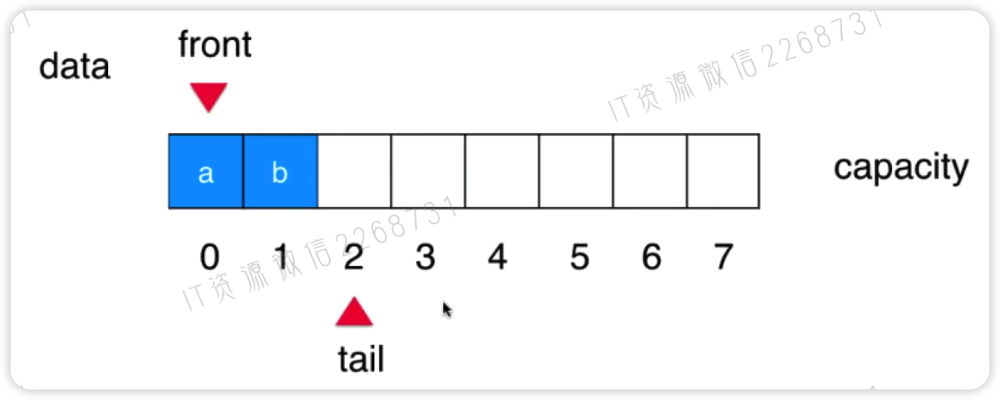

数据结构是计算机存储、组织数据的方式。

数据结构主要分为线性结构、树结构和图结构，其中线性结构主要包括数组、栈、队列、链表、哈希表，树结构主要包括二叉树、二分搜索树、AVL、红黑树、Treap、Splay、堆、Trie、线段树、K-D树、并查集、哈夫曼树，图结构主要包括领接矩阵、邻接表等。

我们在使用数据结构的时候，一定要根据应用的不同特点，灵活选择最合适的数据结构。

# 线性结构

## 数组

### 数组基础

数组是把数据码成一排进行存放，在内存中开辟一块连续的存储空间，然后通过索引进行访问。

> 注意数组一定是连续的存储空间

数组基本的使用方式：

```java
public static void main(String[] args) {
    int[] arr = new int[20];
    for (int i = 0; i < args.length; i++)
        arr[i] = i;

    int[] scores = new int[] {100, 99, 66};
    for (int i = 0; i < scores.length; i++)
        System.out.println(scores[i]);

    for(int score: scores)
        System.out.println(score);
}
```

数组的索引可以没有语义，也可以有语义，数组最好应用于**索引有语义**的情况，如果索引没有语义最好使用其它的数据结构，比如索引对应的是学生的学号，但也不是所有有语义的索引都适合数组，比如身份证号，这个要是做索引的话，开辟的空间就太大了，如`ids[453125135514241]`,至少要那么多空间，而没有那么多位数的空间都浪费了。

数组最大的有点：**快速查询** `scores[2]`

### 自定义数组类

创建一个自己的数组类，来完成包括数组本身的方法，和一些数组类本身没有的方法。

首先创建一个数组类，首先这个数组要有一个容量参数`capacity`，和实际保存了多少元素的`size`参数，同时size还和索引对应，一直控制size的索引位置，在0位置表示有0个元素，在索引1的时候(也就是在第二个位置)表示有1个元素，size一直指向所有元素空间的后一个位置。

首先构造这个函数：

```java
public class Array<E> {
    private E[] data;
    private int size;

		public Array(int capacity) {
        data = (E[]) new Object[capacity];
        size = 0;
    }

    public Array() {
        // 默认容量设置为10
        this(10);
    }
}
```

接着来增加一些查询方法：

```java
// 获取数组中元素个数
public int getSize() {
  return size;
}

// 获取数组的容量
public int getCapacity() {
  return data.length;
}

// 返回数组是否为空
public boolean isEmpty() {
  return size == 0;
}

// 获取index索引位置的元素
public E get(int index) {
  if (index < 0 || index >= size)
    throw new IllegalArgumentException("Get failed. Index is illegal.");
  return data[index];
}

// 获取最后一个元素
public E getLast() {
  return get(size - 1);
}

// 获取第一个元素
public E getFirst() {
  return get(0);
}

// 查询数组中是否有元素e
public boolean contains(E e) {
  for (int i = 0; i < size; i++) {
    if (data[i].equals(e))
      return true;
  }
  return false;
}

// 查找数组中元素e所在的位置，如果不存在e，则返回-1
public int find(E e) {
  for (int i = 0; i < size; i++) {
    if (data[i].equals(e))
      return i;
  }
  return -1;
}
```

删除方法：

```java
// 从数组中删除index位置的元素，返回删除的元素
public E remove(int index) {
  if (index < 0 || index >= size)
    throw new IllegalArgumentException("Remove failed.Index is illegal.");

  E ret = data[index];
  // 将index后面的元素前移一位
  for (int i = index + 1; i < size; i++)
    data[i - 1] = data[i];
  size--;
  data[size] = null;

  // 当元素个数达到1/4
  if (size == data.length / 4 && data.length / 2 != 0)
    resize(data.length / 2);

  return ret;
}

// 从数组中删除第一个元素，返回删除的元素
public E removeFirst(){
  return remove(0);
}

// 从数组中删除最后一个元素，返回删除的元素
public E removeLast(){
  return remove(size - 1);
}

// 从数组中删除元素e
public void removeElement(E e){
  int index = find(e);
  if (index != -1)
    remove(index);
}
```

修改方法：

```java
// 修改index索引位置的元素为e
public void set(int index, E e) {
  if (index < 0 || index >= size)
    throw new IllegalArgumentException("Get failed. Index is illegal.");
  data[index] = e;
}
```

增加方法：

```java
// 向所有元素后添加一个新元素
public void addLast(E e){
  add(size, e);
}

// 在所有元素前插入一个新元素
public void addFirst(E e){
  add(0, e);
}

// 向第index个位置插入一个新元素
public void add(int index, E e){

  // 小于0和大于size不被允许
  if (index < 0 || index > size)
    throw new IllegalArgumentException("Add failed. Require index >= 0 and <= size");

  // 当容量满了之后，扩容数组
  if (size == data.length)
    resize(2 * data.length);

  // 将index后面的位置所有元素后移一位
  for (int i = size - 1; i >= index; i--)
    data[i + 1] = data[i];

  // 将元素插入到index位置
  data[index] = e;
  size++;
}
```

动态数组扩容方法：

```java
// 数组扩容
private void resize(int newCapacity) {
    E[] newData = (E[]) new Object[newCapacity];
    // 将原来数组的元素转移到新数组
    for (int i = 0; i < size; i++) {
        newData[i] = data[i];
    }
    // 将新数组赋值到我们Array的data维护数组
    data = newData;
}
```

针对这个数组做的toString重写：

```java
@Override
public String toString() {
    // 需要反复的修改字符串，使用StringBuilder更高效
    StringBuilder res = new StringBuilder();
    res.append(String.format("Array: size = %d , capacity = %d\n", size, data.length));
    res.append("[");
    for (int i = 0; i < size; i++) {
        res.append(data[i]);
        if (i != size - 1)
            // 不是最后一个元素
            res.append(",");
    }
    res.append("]");
    return res.toString();
}
```

### 分析时间复杂度

- 添加操作：
  - addLast：O(1)
  - addFirst: 0(n) 所有元素需要后移
  - add(index,e) O(n) 最差需要所有元素后移
  - 总体来讲时间复杂度为O(n)，因为即使是addLast，也有可能需要扩容，扩容方法也是0(n)

- 删除方法：O(n)

- 改方法：已知索引O(1)、未知索引先查询位置所以是O(n)

- 查方法：已知索引O(1)、未知索引先查询位置所以是O(n)

这里有一个**均摊复杂度**的概念：

我们知道resize是一个`O(n)`的方法，比较耗时，但是这个方法，只有很少的情况下会执行，并不是每次都需要执行，那么可以均摊到其它不耗时的操作一起计算复杂度。

比如`add`方法，因为add方法需要调用resize，那么可以将add方法和resize均摊在一起，也就是add方法本身只需要一次操作，n次add执行一次resize resize执行n次，总共2n次，那么也就是add方法平均一次添加要2次操作。

接着我们来看**复杂度振荡**的问题：

当我们add方法要执行resize之后，立马又remove方法又要resize减少，不断的在这个位置增减增减，那么每次都是O(n)级别的操作，这样就会导致复杂度振荡。

为了解决这个问题，我们将remove的resize额度进行一个lazy处理，也就是将减少resize的额度的时机调整得大一点，比如缩小到1/4才缩减总容量到1/2，之前是在1/2的位置缩减。

之前的情况是，10个容量，满了10个，增加一个，扩容到20，这时候减少1个，又变成10个元素，达到了容量20的1/2，立马就resize缩减到10个，现在我们改为减少到20的1/4，5个的时候才resize缩减容量为10。

## 栈(Stack)

栈也是一种线性结构,相比数组，栈对应的操作是数组的子集,只能从一端添加元素，也只能从一端取出元素
，这一端称为栈顶。

栈是一种后进先出的数据结构，Last In First out (LIFO)，也就是从顶部插入元素，同样只能从顶部取出元素，不能从中间或者底部获取或者插入元素，在计算机的世界里，栈拥有着不可思议的作用。

比如常见undo撤销操作和计算机程序调用的逻辑都是使用的栈。

比如计算机程序调用，有方法A、B、C，A先执行，中间调用了B，B执行，中间调用了C，那么就是A先入栈，然后B入栈，最后C入栈，C执行完成之后出栈，然后B出栈，最后是A出栈，递归可以说是完美的使用了栈的原理。

### 栈的实现

首先我们创建一个栈的接口，规则一定栈一定要有的方法：

```java
public interface Stack<E> {
    int getSize();
    boolean isEmpty();
    // 插入元素
    void push(E e);
    // 获取元素并弹出
    E pop();
    // 查看顶部元素
    E peek();
}
```

接着我们使用数组的方式来创建一个栈：

```java
public class ArrayStack<E> implements Stack<E>{
    // 我们使用数组来保存栈中的元素
    Array<E> array;

    public ArrayStack(int capacity) {
        array = new Array<>(capacity);
    }

    public ArrayStack() {
        array = new Array<>();
    }
}
```

接着我们实现栈Stack中的接口方法：

```java
@Override
public int getSize() {
    return array.getSize();
}

// 这个方法并不是接口的方法，因为这个方法只有我们使用数组实现栈的时候才可以有
public int getCapacity() {
    return array.getCapacity();
}

@Override
public boolean isEmpty() {
    return array.isEmpty();
}

@Override
public void push(E e) {
    array.addLast(e);
}

@Override
public E pop() {
    return array.removeLast();
}

@Override
public E peek() {
    return array.getLast();
}

@Override
public String toString() {
    StringBuilder res = new StringBuilder();
    res.append("Stack: ");
    res.append("[");
    for (int i = 0; i < array.getSize(); i++) {
        res.append(array.get(i));
        if (i != array.getSize() - 1)
            res.append(", ");
    }
    res.append("]");
    return res.toString();
}
```

接着来编写一个测试方法：

```java
public class Test {
    public static void main(String[] args) {
        ArrayStack<Object> stack = new ArrayStack<>();

        for (int i = 0; i < 5; i++) {
            stack.push(i);
            System.out.println(stack);
        }

        stack.pop();
        System.out.println(stack);
    }
}
```

### 时间复杂度分析

- void push(E) O(1）均摊
- E pop() O(1）均摊
- E peek() O(1)
- int getSize() O(1)
- boolean isEmpty() O(1)


### 为什么不推荐使用stack栈结构

- Java中的Stack 类，最大的问题是，继承了`Vector`这个类，可以有动态数组的功能，可以在任何位置添加和删除元素，目前已经弃用，不推荐使用。
- 官方推荐使用`Deque`双端队列结构。

## 队列

队列也是一种线性结构，相比数组，队列对应的操作是数组的子集，只能从一端(队尾)添加元素，从另一端(队首)取出元素。

队列是一种先进先出的数据结构，First In First Out(FIFO)

### 代码实现

首先创建队列接口：

```java
public interface Queue<E> {
    int getSize();
    boolean isEmpty();
    // 入队
    void enqueue(E e);
    // 出队
    E dequeue();
    // 获取队首元素
    E getFront();
}
```

接着来实现数组队列对象：

```java
public class ArrayQueue<E> implements Queue<E> {
    private Array<E> array;

    public ArrayQueue(int capacity) {
        array = new Array<>(capacity);
    }

    public ArrayQueue() {
        array = new Array<>();
    }

    @Override
    public int getSize() {
        return array.getSize();
    }

    @Override
    public boolean isEmpty() {
        return array.isEmpty();
    }

    public int getCapacity() {
        return array.getCapacity();
    }

    @Override
    // 入队方法，添加元素到最后一个位置
    public void enqueue(E e) {
        array.addLast(e);
    }

    @Override
    // 出队方法，删除第一个元素
    public E dequeue() {
        return array.removeFirst();
    }

    @Override
    // 获取队首元素
    public E getFront() {
        return array.getFirst();
    }

    @Override
    public String toString() {
        StringBuilder res = new StringBuilder();
        res.append("Queue: ");
        res.append("front [");
        for (int i = 0; i < array.getSize(); i++) {
            res.append(array.get(i));
            if (i != array.getSize() - 1) {
                res.append(", ");
            }
        }
        res.append("] tail");
        return res.toString();
    }
}
```

接着来编写一个测试方法：

```java
public class Test {
    public static void main(String[] args) {
        ArrayQueue<Integer> queue = new ArrayQueue<>();
        for (int i = 0; i < 10; i++) {
            queue.enqueue(i);
            System.out.println(queue);

            if (i % 3 == 2) {
                queue.dequeue();
                System.out.println(queue);
            }
        }
    }
}
```

### 数组队列的复杂度分析

- void enqueue(E）O(1) 均摊 需要扩容的时候的均摊
- E dequeue() O(n) 出队之后需要将所有的元素前移一位
- E getFront() O(1)
- int getSize() O(1)
- boolean isEmpty O(1)

可以发现数组队列其实是有一定的问题的，每次出队都需要O(n)级别的复杂度，效率较低。

数组队列的问题

每次出队删除队首元素都需要将所有的元素往前移一位，执行O(n)级别的操作，这样效率非常低。

## 循环队列

我们可以设计一个`front`、`tail`指针来标注队列的队首元素和**队尾+1**的位置，同时当，`front==tail`的时候，就表示队列为空，也就是**循环队列**。



当tail走到容量的最后一个元素之后，由于前面的元素出队导致前面的空间空余下来，那么tail可以继续移到前面的空间，直到`(tail+1) % c == front`时，表示队列已满。

也就是说，在这种情况下，循环队列有一个空间是空闲的不能存放发元素，专门用于存放tail指针，**会浪费掉一个空间。**

### 代码实现

```java
public class LoopQueue<E> implements Queue<E> {
    private E[] data;
    private int front, tail;
    private int size;

    public LoopQueue(int capacity) {
        // 我们创建capacity+1个容量，因为有一个容量被浪费掉，用于保存tail指针
        data = (E[]) new Object[capacity + 1];
        front = 0;
        tail = 0;
        size = 0;
    }

    public LoopQueue() {
        this(10);
    }

    public int getCapacity() {
        return data.length - 1;
    }

    @Override
    public boolean isEmpty() {
        return front == tail;
    }

    @Override
    public int getSize() {
        return size;
    }

    @Override
    // 入队方法
    public void enqueue(E e) {
        // 如果队列满了，就扩容
        if ((tail + 1) % data.length == front)
            resize(getCapacity() * 2);

        // 将新入队元素放到tail的位置
        data[tail] = e;
        // 将tail后移，加上%，表示到了最末尾还可以跳回最开始的位置继续后移
        tail = (tail + 1) % data.length;
        size++;
    }

    @Override
    // 出队方法
    public E dequeue() {
        if (isEmpty())
            throw new IllegalArgumentException("Cannot dequeue from an empty queue.");

        E ret = data[front];
        // 出队之后，把这个位置置为空
        data[front] = null;
        // front后移一个位置
        front = (front + 1) % data.length;
        size--;
        // 当size长度只有1/4容量时，就缩容
        if (size == getCapacity() / 4 && getCapacity() / 2 != 0)
            resize(getCapacity() / 2);
        return ret;
    }

    @Override
    // 获取队首元素
    public E getFront() {
        if (isEmpty())
            throw new IllegalArgumentException("Queue is empty.");
        return data[front];
    }

    // 队列扩容
    private void resize(int newCapacity) {
        E[] newData = (E[]) new Object[newCapacity + 1];
        for (int i = 0; i < size; i++)
            // 给front + i个位置全部移到newData中，达到容量还要继续前面的位置
            newData[i] = data[(i + front) % data.length];

        data = newData;
        // 重置front为0
        front = 0;
        // tail到size的位置
        tail = size;
    }

    @Override
    public String toString() {
        StringBuilder res = new StringBuilder();
        res.append(String.format("Queue: size = %d, capacity = %d\n", size, getCapacity()));
        res.append("front [");
        for (int i = front; i != tail; i = (i + 1) % data.length) {
            res.append(data[i]);
            if ((i + 1) % data.length != tail)
                res.append(", ");
        }
        res.append("] tail");
        return res.toString();
    }
}
```

### 循环队列的复杂度分析

- void enqueue(E）O(1) 均摊 需要扩容的时候的均摊
- E dequeue() O(1) 均摊 出队的时候不需要全部后移，只需要移动一下front指针即可
- E getFront() O(1)
- int getSize() O(1)
- boolean isEmpty O(1)

### 不浪费一个空间的循环队列

```java
public class LoopQueue<E> implements Queue<E> {
    private E[] data;
    private int front, tail;
    private int size;

    public LoopQueue(int capacity) {
        // 由于不浪费空间，所以data静态数组的大小是capacity,而不是capacity + 1
        data = (E[]) new Object[capacity];
        front = 0;
        tail = 0;
        size = 0;
    }

    public LoopQueue() {
        this(10);
    }

    public int getCapacity() {
        return data.length - 1;
    }

    @Override
    public boolean isEmpty() {
        // 不再使用front和tail之间的关系来判断队列是否为空，而直接使用size
        return size == 0;
    }

    @Override
    public int getSize() {
        return size;
    }

    @Override
    // 入队方法
    public void enqueue(E e) {
        // 如果队列满了，就扩容
        if (size == getCapacity())
            resize(getCapacity() * 2);

        // 将新入队元素放到tail的位置
        data[tail] = e;
        // 将tail后移，加上%，表示到了最末尾还可以跳回最开始的位置继续后移
        tail = (tail + 1) % data.length;
        size++;
    }

    @Override
    // 出队方法
    public E dequeue() {
        if (isEmpty())
            throw new IllegalArgumentException("Cannot dequeue from an empty queue.");

        E ret = data[front];
        // 出队之后，把这个位置置为空
        data[front] = null;
        // front后移一个位置
        front = (front + 1) % data.length;
        size--;
        // 当size长度只有1/4容量时，就缩容
        if (size == getCapacity() / 4 && getCapacity() / 2 != 0)
            resize(getCapacity() / 2);
        return ret;
    }

    @Override
    // 获取队首元素
    public E getFront() {
        if (isEmpty())
            throw new IllegalArgumentException("Queue is empty.");
        return data[front];
    }

    // 队列扩容
    private void resize(int newCapacity) {
        E[] newData = (E[]) new Object[newCapacity + 1];
        for (int i = 0; i < size; i++)
            // 给front + i个位置全部移到newData中，达到容量还要继续前面的位置
            newData[i] = data[(i + front) % data.length];

        data = newData;
        // 重置front为0
        front = 0;
        // tail到size的位置
        tail = size;
    }

    @Override
    public String toString() {
        StringBuilder res = new StringBuilder();
        res.append(String.format("Queue: size = %d, capacity = %d\n", size, getCapacity()));
        res.append("front [");
        for(int i = 0; i < size; i ++){
            res.append(data[(front + i) % data.length]);
            if((i + front + 1) % data.length != tail)
                res.append(", ");
        }
        res.append("] tail");
        return res.toString();
    }

    public static void main(String[] args){
        LoopQueue<Integer> queue = new LoopQueue<>();
        // 循环遍历打印队列的逻辑也有相应的更改
        for(int i = 0 ; i < 10 ; i ++){
            queue.enqueue(i);
            System.out.println(queue);

            if(i % 3 == 2){
                queue.dequeue();
                System.out.println(queue);
            }
        }
    }
}
```

### 没有size成员变量的循环队列

```java
public class LoopQueue<E> implements Queue<E> {
    private E[] data;
    private int front, tail;

    public LoopQueue(int capacity) {
        // 因为不适用size成员，需要浪费1个空间
        data = (E[]) new Object[capacity + 1];
        front = 0;
        tail = 0;
    }

    public LoopQueue() {
        this(10);
    }

    public int getCapacity() {
        return data.length - 1;
    }

    @Override
    public boolean isEmpty() {
        return front == tail;
    }

    @Override
    public int getSize() {
        // 注意此时getSize的逻辑:
        // 如果tail >= front，非常简单，队列中的元素个数就是tail - front
        // 如果tail < front，说明我们的循环队列"循环"起来了，此时，队列中的元素个数为：
        // tail - front + data.length
        // 也可以理解成，此时，data中没有元素的数目为front - tail,
        // 整体元素个数就是 data.length - (front - tail) = data.length + tail - front
        return tail >= front ? tail - front : tail - front + data.length;
    }

    @Override
    // 入队方法
    public void enqueue(E e) {
        if ((tail + 1) % data.length == front)
            resize(getCapacity() * 2);

        data[tail] = e;
        tail = (tail + 1) % data.length;
    }

    @Override
    // 出队方法
    public E dequeue() {
        if (isEmpty())
            throw new IllegalArgumentException("Cannot dequeue from an empty queue.");

        E ret = data[front];
        data[front] = null;
        front = (front + 1) % data.length;
        if (getSize() == getCapacity() / 4 && getCapacity() / 2 != 0)
            resize(getCapacity() / 2);
        return ret;
    }

    @Override
    // 获取队首元素
    public E getFront() {
        if (isEmpty())
            throw new IllegalArgumentException("Queue is empty.");
        return data[front];
    }

    // 队列扩容
    private void resize(int newCapacity) {
        E[] newData = (E[]) new Object[newCapacity + 1];
        int sz = getSize();
        for (int i = 0; i < sz; i++)
            newData[i] = data[(i + front) % data.length];

        data = newData;
        front = 0;
        tail = sz;
    }

    @Override
    public String toString() {
        StringBuilder res = new StringBuilder();
        res.append(String.format("Queue: size = %d , capacity = %d\n", getSize(), getCapacity()));
        res.append("front [");
        for(int i = front ; i != tail ; i = (i + 1) % data.length){
            res.append(data[i]);
            if((i + 1) % data.length != tail)
                res.append(", ");
        }
        res.append("] tail");
        return res.toString();
    }

    public static void main(String[] args) {
        LoopQueue<Integer> queue = new LoopQueue<>();
        // 循环遍历打印队列的逻辑也有相应的更改
        for (int i = 0; i < 10; i++) {
            queue.enqueue(i);
            System.out.println(queue);

            if (i % 3 == 2) {
                queue.dequeue();
                System.out.println(queue);
            }
        }
    }
}
```

## 双端队列

双端队列的意思是两端都可以入队和出队。

### 代码实现

```java
public class Deque<E> {
    private E[] data;
    private int front, tail;
    private int size; // 方便起见，我们的 Deque 实现，将使用 size 记录 deque 中存储的元素数量

    public Deque(int capacity) {
        data = (E[]) new Object[capacity]; // 由于使用 size，我们的 Deque 实现不浪费空间
        front = 0;
        tail = 0;
        size = 0;
    }

    public Deque() {
        this(10);
    }

    public int getCapacity() {
        return data.length;
    }

    public boolean isEmpty() {
        return size == 0;
    }

    public int getSize() {
        return size;
    }

    // addLast 的逻辑和我们之前实现的队列中的 enqueue 的逻辑是一样的
    public void addLast(E e) {

        if (size == getCapacity())
            resize(getCapacity() * 2);

        data[tail] = e;
        tail = (tail + 1) % data.length;
        size++;
    }

    // addFront 是新的方法，请大家注意
    public void addFront(E e) {

        if (size == getCapacity())
            resize(getCapacity() * 2);

        // 我们首先需要确定添加新元素的索引位置
        // 这个位置是 front - 1 的地方
        // 但是要注意，如果 front == 0，新的位置是 data.length - 1 的位置
        front = front == 0 ? data.length - 1 : front - 1;
        data[front] = e;
        size++;
    }

    // removeFront 的逻辑和我们之前实现的队列中的 dequeue 的逻辑是一样的
    public E removeFront() {

        if (isEmpty())
            throw new IllegalArgumentException("Cannot dequeue from an empty queue.");

        E ret = data[front];
        data[front] = null;
        front = (front + 1) % data.length;
        size--;
        if (getSize() == getCapacity() / 4 && getCapacity() / 2 != 0)
            resize(getCapacity() / 2);
        return ret;
    }

    // removeLast 是新的方法，请大家注意
    public E removeLast() {
        if (isEmpty())
            throw new IllegalArgumentException("Cannot dequeue from an empty queue.");

        // 计算删除掉队尾元素以后，新的 tail 位置
        tail = tail == 0 ? data.length - 1 : tail - 1;
        E ret = data[tail];
        data[tail] = null;
        size--;
        if (getSize() == getCapacity() / 4 && getCapacity() / 2 != 0)
            resize(getCapacity() / 2);
        return ret;
    }

    public E getFront() {
        if (isEmpty())
            throw new IllegalArgumentException("Queue is empty.");
        return data[front];
    }

    // 因为是双端队列，我们也有一个 getLast 的方法，来获取队尾元素的值
    public E getLast() {
        if (isEmpty())
            throw new IllegalArgumentException("Queue is empty.");

        // 因为 tail 指向的是队尾元素的下一个位置，我们需要计算一下真正队尾元素的索引
        int index = tail == 0 ? data.length - 1 : tail - 1;
        return data[index];
    }

    private void resize(int newCapacity) {

        E[] newData = (E[]) new Object[newCapacity];
        for (int i = 0; i < size; i++)
            newData[i] = data[(i + front) % data.length];

        data = newData;
        front = 0;
        tail = size;
    }

    @Override
    public String toString() {

        StringBuilder res = new StringBuilder();
        res.append(String.format("Queue: size = %d , capacity = %d\n", getSize(), getCapacity()));
        res.append("front [");
        for (int i = 0; i < size; i++) {
            res.append(data[(i + front) % data.length]);
            if (i != size - 1)
                res.append(", ");
        }
        res.append("] tail");
        return res.toString();
    }

    public static void main(String[] args) {

        // 在下面的双端队列的测试中，偶数从队尾加入；奇数从队首加入
        Deque<Integer> dq = new Deque<>();
        for (int i = 0; i < 16; i++) {
            if (i % 2 == 0) dq.addLast(i);
            else dq.addFront(i);
            System.out.println(dq);
        }

        // 之后，我们依次从队首和队尾轮流删除元素
        System.out.println();
        for (int i = 0; !dq.isEmpty(); i++) {
            if (i % 2 == 0) dq.removeFront();
            else dq.removeLast();
            System.out.println(dq);
        }
    }
}
```

## 链表

优点

- 动态，不固定容量

缺点

- 无法随机访问，只能一个一个寻找

