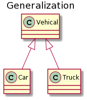
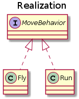
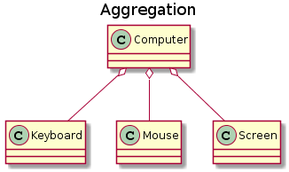
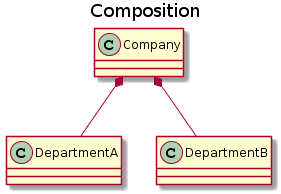
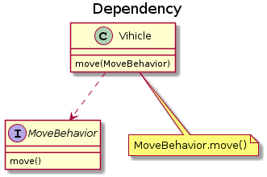

类图是描述类、接口已经他们之间关系的图，它显示了系统中各个类的静态结构，是一种静态模型。 主要由2种类元素（类和接口），4种关系（依赖关系、实现关系、泛化关系和关联关系）组成。

## 类的属性表示


可见性：public（公有）、private（私有）、Protected（保护）

## 类图关系

以下类图使用 [PlantUML](http://plantuml.com/ ) 绘制

### 泛化关系(Generalization)

用来描述继承关系，在 Java 中使用 extends 关键字。



**类在类图中使用C表示，继承关系使用空心三角形实线链接。**

下面是生成类图的UML语法：

```sh
@startuml

title Generalization

class Vehical
class Car
class Truck

Vehical <|-- Car
Vehical <|-- Truck

@enduml
```

### 实现关系 (Realization)

用来实现一个接口，在 Java 中使用 implement 关键字。



**接口使用I表示，实现使用空心三角形虚线链接。**

```sh
@startuml

title Realization

interface MoveBehavior
class Fly
class Run

MoveBehavior <|.. Fly
MoveBehavior <|.. Run

@enduml

```

### 聚合关系 (Aggregation)

表示整体由部分组成，但是整体和部分不是强依赖的，整体不存在了部分还是会存在，只是简单的聚在一起的意思，互相没有依赖性。



**使用空心菱形实线进行连接。**

```sh
@startuml

title Aggregation

class Computer
class Keyboard
class Mouse
class Screen

Computer o-- Keyboard
Computer o-- Mouse
Computer o-- Screen

@enduml
```

### 组合关系 (Composition)

和聚合不同，组合中整体和部分是强依赖的，整体不存在了部分也不存在了。比如公司和部门，公司没了部门就不存在了。但是公司和员工就属于聚合关系了，因为公司没了员工还在。

组合是强依赖，共存的。



**使用实心菱形实现进行连接。**

```sh
@startuml

title Composition

class Company
class DepartmentA
class DepartmentB

Company *-- DepartmentA
Company *-- DepartmentB

@enduml

```

### 关联关系 (Association)

表示不同类对象之间有关联，**这是一种静态关系，与运行过程的状态无关，在最开始就可以确定。**因此也可以用 1 对 1、多对 1、多对多这种关联关系来表示。比如学生和学校就是一种关联关系，一个学校可以有很多学生，但是一个学生只属于一个学校，因此这是一种多对一的关系，在运行开始之前就可以确定。

1 对 1、多对 1、多对多这些都是关联关系。


**使用箭头实线进行连接。**

```sh
@startuml

title Association

class School
class Student

School "1" - "n" Student

@enduml

```

### 依赖关系 (Dependency)

和关联关系不同的是，依赖关系是在运行过程中起作用的。A 类和 B 类是依赖关系主要有三种形式:

- A 类是 B 类中的(某中方法的)局部变量；
- A 类是 B 类方法当中的一个参数；
- A 类向 B 类发送消息，从而影响 B 类发生变化；

和关联关系的区别是：

- 当一个类和另一个类是一种固定的关系时，比如学生和学校，那么是关联关系

- 当一个类和另一个类关系不明显，只是需要用到另一个类的时候使用一下，那么就看成是依赖关系，只是一种偶然的关系，比如人和火车，只是偶尔用到了火车，生活中并没有什么具体的关联。

  


**使用箭头虚线连接**