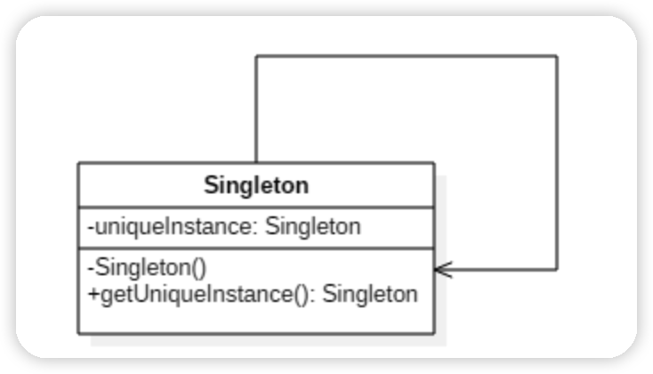
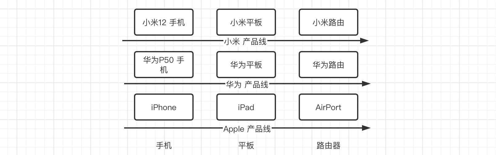
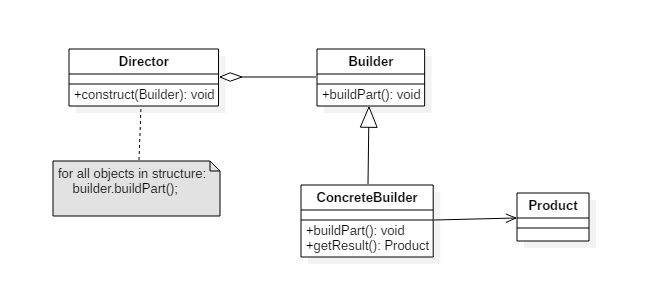

# 创建型设计模式

## 单例模式(Singleton pattern)

一个类只有且只能创建一个实例，并且提供一个访问这个实例的全局方法。

类图如下：



有一个全局的实例访问方法，同时将构造函数私有化，禁止用户创建。

> 注意私有化构造函数并不保险，通过反射并设置constructor.setAccessible(true)，同样可以创建全新的新实例，也就是反射攻击

下面介绍6种常见的单例模式实现方法。


### 饿汉式-线程安全

```java
public class Singleton {
    private static Singleton instance = new Singleton();
    private Singleton(){}
}
```

- 饿汉式在类加载的时候就会创建实例，然后直接调用，**是线程安全的**
- 但是因为会直接实例化对象，所以不节省资源。

### 懒汉式-线程不安全

```java
public class Singleton {
    private static Singleton instance;
    private Singleton(){}
    public static Singleton getInstance(){
      	// 如果多个线程同时进入这个位置，就会创建多个实例
        if (instance == null){
            instance = new Singleton();
        }
        return instance;
    }
}
```

- 懒汉式单例模式是线程不安全的
- 优点是延迟实例化，加载这个类的时候不会创建实例，只有调用 `getInstance()` 才会创建，节省资源。

### 懒汉式-线程安全

```java
public class Singleton {
    private static Singleton instance;
    private Singleton(){}
    public static synchronized Singleton getInstance(){
        if (instance == null){
            instance = new Singleton();
        }
        return instance;
    }
}
```

只需要给 `getInstance()` 加锁，那么就成为线程安全的了，但是因为其它线程因为需要等待，因此性能有一定损耗。

### 双重校验锁-线程安全

懒汉式加锁性能损耗太大，其实我们没有必要给整个方法进行加锁，只需要对实例化代码进行加锁即可，在实例化执行因为已经对 `instance == null` 进行了判断，所以很大程度上，减轻了性能损耗。

```java
public class Singleton {
    private static Singleton instance;
    private Singleton(){}
    public static Singleton getInstance(){
        if (instance == null){
            synchronized (Singleton.class) {
              	// 等待锁打开之后，同样会执行下面的代码
                instance = new Singleton();
            }
        }
        return instance;
    }
}
```

但是上面的方法同样存在问题，当多个线程进入 `if (instance == null)` 之后，尽管一个线程对当前对象进行了加锁，其它的线程等待，但是**当等待完成，同样会继续执行锁里面的实例代码，创建多个实例**。

所以我们需要进行双重检验：

```java
public class Singleton {
    private static Singleton instance;
    private Singleton(){}
    public static Singleton getInstance(){
        if (instance == null){
            synchronized (Singleton.class) {
            		// 当锁打开之后，再检验一次，因为打开锁之后已经创建，所以不会再次创建
                if (instance == null) {
                    instance = new Singleton();
                }
            }
        }
        return instance;
    }
}
```

同时我们需要注意一个问题，由于 JVM 具有指令重排的特性，也就是一个操作的几个字节码指令很可能不是按照默认的顺序执行的，下面的代码在单线程下，没有问题，但是多线程就会出现问题：

```java
instance = new Singleton();
```

这段代码执行分为三个步骤：

1. 分配内存空间
2. 初始化对象
3. 将 uniqueInstance 指向分配的内存地址

很可能执行顺序是 1>3>2，在多线程情况下，其它的线程可能获取到一个没有初始化的对象，所以需要使用 `volatile` 来禁止 JVM 指令重排，保证多线程下正确执行。

```java
private volatile static Singleton instance;
```

### 静态内部类-线程安全

```java
public class Singleton {
    private Singleton() {}

  	// 加载类时，静态内部类不会被加载进内存
    private static class SingletonHolder {
        private static final Singleton INSTANCE = new Singleton();
    }
		
  	// 调用时才会加载静态内部类的属性
    public static Singleton getInstance() {
        return SingletonHolder.INSTANCE;
    }
}
```

- 拥有懒汉式延迟加载，节省资源的优点
- 同时由虚拟机提供线程安全支持

### 枚举实现

枚举实现单例模式，是最佳实践，在面对复杂的序列化和反射攻击时，都能够防止实例化多次。

首先我们先来了解**序列化问题**：

```java
// 创建一个实现Serializable接口的单例模式类
public class SerSingleton implements Serializable {
    private volatile static SerSingleton uniqueInstance;
    private  String content;
    public String getContent() {
        return content;
    }

    public void setContent(String content) {
        this.content = content;
    }
    private SerSingleton() {
    }

    public static SerSingleton getInstance() {
        if (uniqueInstance == null) {
            synchronized (SerSingleton.class) {
                if (uniqueInstance == null) {
                    uniqueInstance = new SerSingleton();
                }
            }
        }
        return uniqueInstance;
    }


    public static void main(String[] args) throws IOException, ClassNotFoundException {
        SerSingleton s = SerSingleton.getInstance();
        s.setContent("单例序列化");
        System.out.println("序列化前读取其中的内容："+s.getContent());
        // 对实例进行序列化
        ObjectOutputStream oos = new ObjectOutputStream(new FileOutputStream("SerSingleton.obj"));
        oos.writeObject(s);
        oos.flush();
        oos.close();

        // 对实例进行反序列化
        FileInputStream fis = new FileInputStream("SerSingleton.obj");
        ObjectInputStream ois = new ObjectInputStream(fis);
        // 任何一个readObject方法，不管是显式的还是默认的，它都会返回一个新建的实例，这个新建的实例不同于该类初始化时创建的实例。
        SerSingleton s1 = (SerSingleton)ois.readObject();
        ois.close();
        System.out.println(s+"\n"+s1);
        System.out.println("序列化后读取其中的内容："+s1.getContent());
        System.out.println("序列化前后两个对象是否同一个："+(s==s1));
    }

}
```

可以发现，任何实例经过序列化、反序列化之后，任何一个readObject方法，不管是显式的还是默认的，它都会返回一个新建的实例，这个新建的实例不同于该类初始化时创建的实例。

这样就无法达到我们实现单例模式的目的了。

同时我们来看第二个问题，**反射攻击问题**：

```java
public class Singleton {
    private volatile static Singleton uniqueInstance;

    private Singleton() {
    }

    public static Singleton getInstance() {
        if (uniqueInstance == null) {
            synchronized (Singleton.class) {
                if (uniqueInstance == null) {
                    uniqueInstance = new Singleton();
                }
            }
        }
        return uniqueInstance;
    }

    public static void main(String[] args) throws NoSuchMethodException, IllegalAccessException, InvocationTargetException, InstantiationException {
        Singleton s=Singleton.getInstance();
        Singleton sUsual=Singleton.getInstance();
      	// 通过反射调用构造函数
        Constructor<Singleton> constructor=Singleton.class.getDeclaredConstructor();
      	// 将构造函数设置为public
        constructor.setAccessible(true);
      	// 通过反射攻击的方式创建实例
        Singleton sReflection=constructor.newInstance();
        System.out.println(s+"\n"+sUsual+"\n"+sReflection);
        System.out.println("正常情况下，实例化两个实例是否相同："+(s==sUsual));   // true
        System.out.println("通过反射攻击单例模式情况下，实例化两个实例是否相同："+(s==sReflection));   // false
    }

}
```

可以发现，单例模式使用 `private Singleton()` 不是绝对安全的，也可以通过反射的方式创建实例。

下面我们可以直接**使用枚举来创建单例模式**，非常简单：

```java
class Resource{
}

public enum EnumSingleton {
    INSTANCE,INSTANCE2;
    // 上面的每个成员，都拥有下面的成员属性和成员方法
    // 枚举的成员属性就是单例模式，多次调用也只会返回一个
    // 当然枚举内的多个枚举实例的成员属性不同
    private Resource instance;
    EnumSingleton() {
        instance = new Resource();
    }
    public Resource getInstance() {
        return instance;
    }

    public static void main(String[] args) {
        // 获取实例，这样获取的实例就是单例模式，Resource类不需要进行任何单例模式处理
        System.out.println(EnumSingleton.INSTANCE.getInstance()); //60e53b93
        System.out.println(EnumSingleton.INSTANCE.getInstance()); //60e53b93
        System.out.println(EnumSingleton.INSTANCE2.getInstance()); // 5e2de80c 实例不同
    }
}
```

直接使用即可，可以同时避免序列化和反射攻击的问题，其详细的原理可以参考下面的文章：

- 在没有枚举创建单例模式之前，解决方法参考 [为什么要用枚举实现单例模式（避免反射、序列化问题） - 李子沫 - 博客园 (cnblogs.com)](https://www.cnblogs.com/chiclee/p/9097772.html#top)

- transient 使用参考：[Java transient关键字使用小记 - Alexia(minmin) - 博客园 (cnblogs.com)](https://www.cnblogs.com/lanxuezaipiao/p/3369962.html)

- 枚举具体实现：[Java 利用枚举实现单例模式 - kaleidoscopic - 博客园 (cnblogs.com)](https://www.cnblogs.com/kaleidoscope/p/9636779.html)

后期学完设计模式再来具体研究上面的三个参考补充到文章中...

## 简单工厂(Simple Factory)


简单工厂不是设计模式，更像是一种编程习惯。简单工厂又称为静态工厂。

```java
interface Product {
}
class ConcreteProduct implements Product {
}
class ConcreteProduct1 implements Product {
}
class ConcreteProduct2 implements Product {
}
public class Client {
    public static void main(String[] args) {
        int type = 1;
        Product product;
        if (type == 1) {
            product = new ConcreteProduct1();
        } else if (type == 2) {
            product = new ConcreteProduct2();
        } else {
            product = new ConcreteProduct();
        }

        System.out.println(product.getClass().getName());
    }
}
```

在上面的代码中，客户端需要知道所有的实现的具体细节，如果增加了新的子类，那么所有调用了这串代码的客户端都需要进行修改，高度耦合。

这种客户端了解实现类的具体实现细节的行为，明显不符合依赖倒转原则，而且不满足接口以及它的实现类的封装性，接口以及它自己的实现类，应该是一个整体的。

所以需要一个简单工厂类，来将客户端和实现类进行解耦：

```java
public class SimpleFactory {
    public Product createProduct(int type) {
        if (type == 1) {
            return new ConcreteProduct1();
        } else if (type == 2) {
            return new ConcreteProduct2();
        }
        return new ConcreteProduct();
    }
}
public class Client {
    public static void main(String[] args) {
        SimpleFactory simpleFactory = new SimpleFactory();
        Product product = simpleFactory.createProduct(1);
    }
}
```

客户端不需要了解实现类的具体细节，只需要从简单工厂类中获取需要的某个实现类即可，如何选择哪个类具体由简单工厂类来确定。

### 总结

回答一下关于简单工厂的下面几个问题：

- 使用的场景?
  - 想要完全封装隔离具体实现，让外部只能通过接口来操作封装体。
  - 想把对外创建对象的职责集中管理和控制。
- 本质是什么?
  - 选择实现：其实简单工厂的本质就是为客户端选择接口的哪个具体实现类，从而实现客户端和实现之间的解耦。
- 它解决了什么问题?
  - 解耦：客户端和具体实现类解耦。
  - 帮助封装：将整个接口以及它的实现类封装，只向外部暴露接口。
- 它体现了设计模式中什么原则?
  - 违反了开闭原则：对外支持扩展，对内不允许修改，我们每创建一个新实现类，都需要修改简单工厂的生成具体实现。可以像Spring一样，通过在xml文件或者注解的方式，定义一个类为实现类，这样就无需修改简单工厂的源代码(里面是扫描所有实现类)，也支持扩展实现类，完美支持开闭原则。
- 存在的缺陷?
  - 违反了开闭原则
  - 可能增加客户端复杂度：如果客户端通过参数来选择具体的实现类，那么必须要客户端理解各个参数的功能和含义，这可能会增加客户端的复杂度，同时也暴露了部分内部实现细节，这种可以使用配置文件的方式来解决(直接在配置文件中选择实现类)。
  - 不方便扩张子工厂：因为简单工厂构造函数私有化，使用静态方法来创建接口，也就不能写简单工厂类的子类来改变重写创建接口的方法的行为了，但是通常情况下简单工厂是不需要子类的。(这一点是和工厂方法模式最主要的区别)
- 你认为与它相关的设计模式有哪些? 它们之间的区别有哪些?
  - 工厂方法模式
- 开源架构中哪些使用了这一模式?
  - JDBC

参考链接：

- 简单工厂完全解析：[【创建型模式一】简单工厂(Simple Factory) - 简书 (jianshu.com)](https://www.jianshu.com/p/a9f397c4ff98)
- JDBC的简单工厂模式：[设计模式之简单工厂模式(Simple Factory Pattern) - 敲代码的小小酥 - 博客园 (cnblogs.com)](https://www.cnblogs.com/v587-666/p/14461034.html)

## 工厂方法(Factory Method)


简单工厂中，独立出一个类来专门创建实现类，而在工厂方法中，将这个类抽象成抽象类，里面包含抽象工厂方法，然后使用子类实现这个方法，每个子类对应一个具体的实现类，同时由子类编写具体的实现逻辑。

定义了一个创建对象的接口，但由子类决定要实例化哪个类。工厂方法把实例化操作推迟到子类。

具体实现如下：

首先创建一个抽象工厂类

```java
public abstract class Factory {
    abstract public Product factoryMethod();
    public void doSomething() {
        Product product = factoryMethod();
        // 抽象父类可以实现一些子类通用的方法
    }
}
```

创建具体的工厂子类，用于创建不同的实现类

```java
public class ConcreteFactory extends Factory {
    public Product factoryMethod() {
        return new ConcreteProduct();
    }
}
```

```java
public class ConcreteFactory1 extends Factory {
    public Product factoryMethod() {
        return new ConcreteProduct1();
    }
}
```

```java
public class ConcreteFactory2 extends Factory {
    public Product factoryMethod() {
        return new ConcreteProduct2();
    }
}
```

同时产品类最好也进行抽象：

```java
interface Product {
}
class ConcreteProduct implements Product {
}
class ConcreteProduct1 implements Product {
}
class ConcreteProduct2 implements Product {
}
```

此时客户端需要使用的时候，直接使用具体的工厂子类来创建实现对象：

```java
public class Client {
    public static void main(String[] args) {
        new ConcreteFactory().factoryMethod();
    }
}
```

当我们需要扩展实现类的时候，同时也要增加对应的工厂子类，但是不需要像简单工厂那样修改同意的实现逻辑代码。

### 总结

- 使用的场景?
  - 如果一个类需要创建某个接口的对象，但是又不知道具体的实现。
  - 如果一个类本身就希望，由它的子类来创建所需的对象的时候，应该使用工厂方法模式。
- 本质是什么?
  - 延迟到子类来选择实现，但是核心还是在选择具体的实现类，本质还是选择实现，退化一下在父类中写入选择实现逻辑，那么就和简单工厂一样了。
- 它解决了什么问题?
- 它体现了设计模式中什么原则?
  - 符合开闭原则，对扩展开放，对修改关闭。
  - 很好的实现了依赖倒置原则？
- 存在的缺陷?
- 你认为与它相关的设计模式有哪些? 它们之间的区别有哪些?
- 开源架构中哪些使用了这一模式?

## 抽象工厂(Abstract Factory)

工厂方法模式是通过继承一个抽象父类创建一个具体的工厂子类，然后这个子类中创建具体的实现对象。

但是出现一个问题，如果需要同时创建很多实现对象，那么必然需要很多对应的工厂子类，或者直接使用简单工厂，也需要创建特别多的实现类。

这样管理起来非常麻烦，而且很多对象是相关的，比如下图：



手机、平板、路由都是具有组合关系的，都属于同一家厂商。

在这种情况下，需要抽象出一个上层的抽象工厂，这个工厂同时包含手机、平板、路由的创建功能，也就是在工厂方法模式的基础上，将一些有关系的工厂子类组合在一起。

```java
public class Router {
}
```

```java
public class Table {
}
```

```java
public class Phone {
}
```

```java
public abstract class AbstractFactory {
    public abstract Phone getPhone();
    public abstract Table getTable();
    public abstract Router getRouter();
}
```

后面来具体整理，包括总结三个工厂模式的区别和优劣。

## 建造者模式(Builder)



对一个对象进行一步一步的构造，而不是直接通过构造方法创建。

很多时候，构造函数需要的参数特别多，直接通过构造传参特别麻烦，这个时候使用建造者模式，每个参数设置一个构造函数，需要哪些参数就调用哪些参数的构造函数，最后统一返回最终的对象。

代码实现如下：

必须有一个学生类：

```java
public class Student {
    int id;
    int age;
    int grade;
    String name;
    String college;
    String profession;
    List<String> awards;

    public Student(int id, int age, int grade, String name, String college, String profession, List<String> awards) {
        this.id = id;
        this.age = age;
        this.grade = grade;
        this.name = name;
        this.college = college;
        this.profession = profession;
        this.awards = awards;
    }
}
```

可以发现这个类的属性特别多，构造方法也很长，如果让用户直接调用这个构造函数来创建将会特别麻烦且容易出错：

```java
public static void main(String[] args) {
    Student student = new Student(1, 18, 3, "小明", "计算机学院", "计算机科学与技术", Arrays.asList("ICPC-ACM 区域赛 金牌", "LPL 2022春季赛 冠军"));
}
```

所以使用建造者模式来进行对象的创建，首先将构造方法创建为私有，不允许用户直接创建：

```java
public class Student {
		...

    //一律使用建造者来创建，不对外直接开放
    private Student(int id, int age, int grade, String name, String college, String profession, List<String> awards) {
        ...
    }

    public static StudentBuilder builder(){   //通过builder方法直接获取建造者
        return new StudentBuilder();
    }

    public static class StudentBuilder{   //这里就直接创建一个内部类
        //Builder也需要将所有的参数都进行暂时保存，所以Student怎么定义的这里就怎么定义
        int id;
        int age;
        int grade;
        String name;
        String college;
        String profession;
        List<String> awards;

        public StudentBuilder id(int id){    //直接调用建造者对应的方法，为对应的属性赋值
            this.id = id;
            return this;   //为了支持链式调用，这里直接返回建造者本身，下同
        }

        public StudentBuilder age(int age){
            this.age = age;
            return this;
        }
      
      	...

        public StudentBuilder awards(String... awards){
            this.awards = Arrays.asList(awards);
            return this;
        }
        
        public Student build(){    //最后我们只需要调用建造者提供的build方法即可根据我们的配置返回一个对象
            return new Student(id, age, grade, name, college, profession, awards);
        }
    }
}
```

然后为每个参数创建对应的 `build` 方法，最后使用建造者方法来生成对象：

```java
public static void main(String[] args) {
    Student student = Student.builder()   //获取建造者
            .id(1)    //逐步配置各个参数
            .age(18)
            .grade(3)
            .name("小明")
            .awards("ICPC-ACM 区域赛 金牌", "LPL 2022春季赛 冠军")
            .build();   //最后直接建造我们想要的对象
}
```

当然如果某些参数不传也没关系，里面就是空值。